# FOCURVE 설계 문서

기준일: 2026-09-25

이번 학기 개발 범위는 Web·Chrome Extension·Server의 기본·추가 기능 전체이며, 구현·검수·테스트 완료 후 여건에 따라 PC 확장을 착수한다.

## 목차

1. [프로젝트 기획](design/05_기획안/FOCURVE_프로젝트_기획안.md)
2. [개발 계획](design/02_시스템_테크설계/FOCURVE_개발계획_v1.3.md)
3. [기능 범위 및 설계 기준](design/01_UX_기능설계/FOCURVE_기능_범위_및_설계_기준.md)
4. [추가 기능 설계](design/01_UX_기능설계/FOCURVE_추가_기능_설계.md)
5. [기능 목록](design/01_UX_기능설계/FOCURVE_기능_목록_v1.0.xlsx)
6. [IA v1.2](design/01_UX_기능설계/FOCURVE_IA_v1.2.md)
7. [User Flow v1.1](design/01_UX_기능설계/FOCURVE_User_Flow_v1.1.md)
8. [Task Flow v1.0](design/01_UX_기능설계/FOCURVE_Task_Flow_v1.0.md)
9. [화면 설계](design/01_UX_기능설계/FOCURVE_화면_설계_v1.0.xlsx)
10. [화면 명세](design/01_UX_기능설계/FOCURVE_화면_명세_v1.0.xlsx)
11. [EXT-01 확장 프로그램 팝업 명세](design/01_UX_기능설계/EXT-01_확장_프로그램_팝업_명세.xlsx)
12. [SESSION-01 웹 집중 세션 화면 명세](design/01_UX_기능설계/SESSION-01_웹_집중_세션_화면_명세.xlsx)
13. [SETTING-01 화면 모드 설정 명세](design/01_UX_기능설계/SETTING-01_화면_모드_설정_명세.md)
14. [Low-Fi 화면 설계](design/01_UX_기능설계/FOCURVE_LowFi_설계.md)
15. [역할·데이터 흐름 설계 v1.0](design/02_시스템_테크설계/FOCURVE_역할_데이터흐름_v1.0.md)
16. [핵심 정책 설계 v1.0](design/02_시스템_테크설계/FOCURVE_핵심정책_v1.0.md)
17. [Event Schema v1.0](design/02_시스템_테크설계/FOCURVE_Event_Schema_v1.0.md)
18. [ERD](design/02_시스템_테크설계/FOCURVE_ERD_원문_텍스트.md)
19. [API 명세 v1.0](design/02_시스템_테크설계/FOCURVE_API_명세_v1.0.md)
20. [설계 결정사항](design/02_시스템_테크설계/FOCURVE_설계_결정사항.md)
21. [Figma 안내](design/03_UI_디자인/FOCURVE_Figma_안내.md)
22. [기본 MVP Low-Fi 전체 프레임 목차](design/03_UI_디자인/FOCURVE_LowFi_전체_프레임_목차.md)
23. [화면 검수 기준](design/04_검수_예시데이터/FOCURVE_화면_검수_기준.md)
24. [예시 데이터 검수 기준표](design/04_검수_예시데이터/FOCURVE_예시_데이터_검수_기준표.md)
25. [UI 검증 체크리스트](design/04_검수_예시데이터/FOCURVE_UI_검증_체크리스트_v1.0.xlsx)

---

## 01. 프로젝트 기획

기준일: 2026-09-25

### 1. 서비스 목적

학습·업무 중 목적과 무관한 사이트에 반복적으로 접근하면 집중 흐름이 끊길 수 있다. FOCURVE는 필요한 사이트와 방해되는 사이트를 사용자가 구분하고, 집중 시간에 적용할 제한 수준을 직접 정하도록 한다. 이용 후에는 실제 접근 기록을 확인하여 다음 설정을 조정한다.

### 2. 서비스 이용 흐름

1. 관리할 사이트를 등록하고 집중 대상·방해 대상·일반 이용으로 분류한다.
2. 사이트 전체를 차단할지, 이용을 허용하면서 접근만 기록할지 설정한다. 필요한 내부 기능만 별도로 제한할 수 있다.
3. 집중 시간을 정해 세션을 시작한다. 확장 프로그램이 정책 적용을 확인한 뒤 집중을 진행한다.
4. 세션 중 관리 대상 접근과 반복 접근은 자동으로 기록된다. 사용자가 직접 기록을 입력할 필요는 없다.
5. 직접 종료하거나 목표 시간이 만료되면 적용 정책을 해제한다. 기록·기본 통계로 자주 접근한 대상을 확인한다.
6. 기록을 바탕으로 다음 세션의 설정을 조정한다. 진행 중 세션의 정책은 설정 변경으로 바뀌지 않는다.

핵심 흐름은 **목적별 설정 → 집중 세션 → 자동 접근·반복 접근 기록 → 결과 확인과 다음 설정 조정**이다.

### 3. 서비스 구성

| 구성요소 | 책임 |
|---|---|
| Web | 회원 인증, 사이트·정책 설정, 세션 조작, 기록·통계·분석·설정 화면 |
| Chrome Extension | 브라우저 정책 적용·해제, 접근 감지·자동 기록, 회원·비회원 실행, 로컬 자료 보관 |
| Server·DB | 인증·소유권 확인, 회원 설정·세션·기록 저장, 집계·분석, 동기화와 가져오기 |
| PC 확장 | 웹 서비스 검수·테스트 완료 후 조건부 착수하는 별도 애플리케이션 |

### 4. 학기 내 개발 범위

기본 기능은 계정·비회원 진입, 사이트 관리·목적별 분류, 차단·기록·Shorts 설정, 세션 시작·종료, 접근·반복 접근 기록, 기본 통계, 비회원 자료 가져오기, 라이트·다크 설정이다.

추가 기능은 내부 기능·지원 서비스 확대, 집중 예약, 사이트 이용 시간, 행동 지표, 시간대별 패턴·확장 분석, 키워드 제한, 성인 사이트 제한, 민감 이미지 블러, 행동 기반 AI 피드백, 일시정지·재개, 세션 메모다. 기본 기능과 추가 기능 모두 이번 학기 완료 대상이다. 기능별 화면과 세부 정책의 준비 상태는 기능 범위 및 설계 기준에서 관리한다.

AI는 기록 요약과 설정 조정 후보를 제시한다. 사이트 목적을 자동 확정하거나 사용자 확인 없이 차단 정책을 변경하지 않는다. 접근 기록 전체를 집중력의 의학적·심리학적 진단값으로 해석하지 않는다.

### 5. 개발·검증 목표

10월 5일 개발을 시작하여 기반 구축과 기술 검증을 수행하고, 10월 12일부터 기본 단위 기능을 개발한다. 11월 1일까지 기본 흐름을 통합하고, 10월 19일부터 추가 모듈 개발을 병행하여 11월 15일까지 기본·추가 기능 전체 통합을 완료한다. 11월 16일~29일 전체 검수·통합·회귀 테스트를 수행하면서 11월 16일부터 발표 연습을 병행한다. 역할별 설명·발표 시간·질의응답을 먼저 연습하고, 11월 30일부터 실사용 안정화와 함께 검증 완료 배포본으로 실제 시연을 포함한 전체 리허설을 반복한다. 12월 6일까지 발표 자료와 시연 절차를 확정한다. 12월 10일 발표에는 검증된 결과를 사용한다. 세부 일정과 통과 조건은 개발 계획을 따른다.

PC 확장은 학기 필수 기능의 구현·검수·테스트 완료 후 잔여 역량에 따라 착수한다. 모바일 확장은 이후 서비스 안정성과 PC 연동 수준을 검토한 뒤 4학년 1학기에 여건이 되는 경우 진행한다.

---

## 02. 개발 계획

비회원 보관·가져오기 정책: 보관 기간·기산점과 성공 원본 처리 방식은 설계 결정사항 DEC-01·DEC-02에서 확정한다. 본문의 30일·90일 및 원본 처리 규칙은 해당 항목의 정책 후보이며, 회원 서버 기록의 보관 정책과 구분한다.

기준일: 2026-09-25  
개발 시작: 2026-10-05  
캡스톤디자인1 발표: 2026-10-01  
추계 발표: 2026-12-10

### 1. 개발 목표

2026학년도 3학년 2학기에는 Web·Chrome Extension·Server의 **기본 기능과 추가 기능 전체를 구현하고, 검수와 테스트까지 완료한다.** 기본 MVP는 선행 통합 단계이며 학기 최종 완료 범위는 기본·추가 통합 서비스다.

PC 확장은 웹 서비스의 기능 구현, 설계 검수, 통합·회귀 테스트와 결함 조치가 모두 끝난 뒤 인력·일정에 여유가 있을 때 착수한다. 웹 서비스의 검수·테스트 기간을 줄여 PC 개발 시간을 확보하지 않는다.

### 2. 개발 범위

#### 기본 기능

- 이메일 회원가입·로그인, 지원 소셜 계정 로그인·로그아웃과 계정별 데이터 분리
- Extension에서 로그인 없이 시작, 비회원 로컬 설정·세션·기록
- 사이트 등록·조회·수정·삭제와 목적별 수동 분류
- 사이트 차단·허용 후 기록·YouTube Shorts 제한 설정
- 집중 세션 시작·직접 종료·시간 만료, 실제 정책 적용·해제 확인
- 접근 자동 기록, 재전송 중복 제거, 동일 세션·대상의 반복 접근 판정
- 집중 시간·접근·반복 접근·최근 기록·기본 통계
- 기록을 확인한 뒤 다음 세션 설정 조정
- 로그인 후 선택한 비회원 자료 가져오기
- Web 라이트·다크 모드와 로컬 저장·복원

#### 추가 기능

| 묶음 | 이번 학기 완료 항목 | 주요 연결 |
|---|---|---|
| 내부 기능·서비스 확대 | 추천 콘텐츠·댓글·자동재생 제한, Instagram Reels 등 지원 서비스 확대 | 사이트 정책, 내부 기능 설정, 실제 제한, 기록 |
| 집중 운영 | 집중 예약, 일시정지·재개, 세션 메모 | 세션 상태·정책 해제·시간 계산·복구 |
| 분석 | 사이트 이용 시간, 행동 기반 지표, 시간대별 패턴·확장 분석 | 수집 기준·집계·기간 필터·예시 데이터 |
| 콘텐츠 제한 | 키워드 제한, 성인 사이트 제한, 민감 이미지 블러 | 대상·예외·오탐·오류·정보 처리·성능 |
| AI 피드백 | 행동 기록 요약, 패턴 설명, 설정 조정 후보 | 분석 중·기록 부족·실패, 사용자 확인 후 설정 변경 |

추가 기능별 화면·정책 준비 상태와 수용 기준은 기능 범위 및 설계 기준, 추가 기능 설계를 따른다. 전용 화면이 없는 성인 사이트 제한·이미지 블러도 학기 내 범위에 포함하며 설계 작업부터 일정에 배치한다.

#### 후속 플랫폼 확장

| 시기 | 목표 | 착수 조건 |
|---|---|---|
| 3학년 2학기 | 웹 기본·추가 기능과 검수·테스트 완료 | 학기 필수 범위 |
| 학기 목표 완료 후·겨울방학 | 운영 안정화, 가능한 경우 PC 확장 설계·개발 | 웹 완료 기준 전부 통과, 담당자·지원 OS·실행 방식·가용 시간 확보 |
| 4학년 1학기 | PC 개발을 진행한 경우 서비스 연동·완성도 향상, 여건이 되면 모바일 확장, 발표·배포 | 기존 서비스 품질 유지, 플랫폼별 설계·검증 계획 확보 |

Chrome Extension은 PC 확장에 해당하지 않는다. 이번 학기 웹 서비스가 브라우저 접근을 제어하고 기록하기 위해 반드시 구현하는 구성요소다.

### 3. 설계 기준

기본 화면은 Figma 01 High-Fi·02 Low-Fi, 추가 기능을 포함한 최종 화면은 00 High-Fi를 따른다. 화면이 존재해도 정책·API·DB·이벤트 계약이 없으면 설계 완료로 판정하지 않는다.

9월 28일까지 기능 목록·화면·흐름의 대응 관계와 미정 항목을 정리한다. 10월 4일까지 추가 기능의 세부 정책·API·데이터·화면 계약을 확정한다. 10월 5일~11일에는 브라우저 제어와 콘텐츠 분석의 기술 검증을 병행한다. 기술 검증 결과가 기존 계약과 다르면 영향을 검토하고 동일 기능의 구현 방식을 조정한다.

### 4. 전체 일정

| 기간 | 단계 | 주요 작업 | 통과 조건 |
|---|---|---|---|
| 9월 26일~28일 | 설계 정합성 검토 | 기본·추가 기능, Figma, 정책, API·ERD·이벤트 대응과 결함 목록 | 기능별 담당 영역·설계 누락·결정 기한 식별 |
| 9월 29일~30일 | 기획·설계 발표 준비 | 서비스 흐름, 설계 구조, 학기 개발 범위·일정, 발표 역할 | 발표 자료·설명 순서 확정 및 리허설 |
| 10월 1일 | 캡스톤디자인1 발표 | 기획·설계·개발 계획 발표 | 질의·피드백 기록 |
| 10월 2일~4일 | 구현 계약 확정 | 성인 사이트·블러 화면, 예약·시간·지표·정지 정책, 추가 API·데이터 계약, 작업 배정 | 기본·추가 기능 모두 구현 가능한 명세와 수용 기준 확보 |
| 10월 5일~11일 | 기반 구축·기술 검증 | React·Spring Boot·MySQL·MV3 환경, 차단·Shorts·추가 제어·콘텐츠 분석 PoC | 실행 환경·지원 범위·실패 조건 확인 |
| 10월 12일~18일 | 기본 단위 기능 개발 | 인증, 사이트 관리, 설정 동기화, 세션·이벤트, 비회원, 대시보드·테마 | 핵심 단위 기능 동작과 단위 테스트 통과 |
| 10월 19일~11월 1일 | 기본 기능 통합 완료 | 정책 적용·해제, 이벤트·재전송·반복 판정, 비회원·자료 가져오기, 기본 통계·설정 조정, 회원·비회원 핵심 E2E | 설정→실행→기록→조회 흐름 연결, 기본 수용·회귀 테스트 통과 |
| 10월 19일~11월 8일 | 추가 모듈 개발·1차 통합 | 내부 기능·서비스 확대, 예약·정지·메모, 키워드·성인 사이트·블러, 이용 시간·분석·AI 모듈 병행 | 모듈별 단위 검증, 11월 8일 기본·추가 통합 중간 시연 |
| 11월 9일~15일 | 기본·추가 기능 통합 완료 | 이용 시간·지표·확장 분석·AI 연결, 추가 기능 간 충돌·기록 부족·오류·복구, 통합 결함 수정 | 기본·추가 기능 전체 구현, 기능별 수용 테스트 통과 |
| 11월 16일~29일 | 전체 검수·테스트 | 문서·UI 정합성, E2E·회귀·권한·복구·사용성·성능, 결함 수정 후 재검증 | 필수 검증 전부 통과, P0·P1 미해결 0건 |
| 11월 16일~22일 | 발표 연습 시작·검수 병행 | 발표 자료·대본 초안, 역할별 설명 연습, 서비스 흐름·설계·UI 설명, 발표 시간 측정 | 발표 역할·순서 확정, 1차 전체 연습 완료 |
| 11월 23일~29일 | 전체 발표 연습·검수 병행 | 시간 제한 리허설, 발표자 간 연결, 예상 질문·답변, 검증된 기능의 시연 동선 점검 | 제한 시간 내 발표, 설명·시연 연결 확인, 검증 결과에 맞춰 자료 보완 |
| 11월 30일~12월 6일 | 실사용 안정화·실제 시연 리허설 | 실사용 피드백, 배포 환경·복구 절차, 회귀 점검, 검증 완료 배포본으로 발표·시연 반복 | 검증된 웹 서비스 품질 유지, 최종 발표 자료와 시연 절차 확정 |
| 12월 7일~10일 | 최종 점검·추계 발표 | 배포본·시연 데이터 최종 확인, 발표 리허설·발표 | 동일 배포본 연속 시연 3회 성공, 검증 결과와 배포본 일치 |
| 웹 완료 기준 충족 후 | PC 확장 검토·조건부 착수 | 지원 OS·실행 방식·권한·데이터 연동·작업량 산정 | 11월 29일 웹 검수·테스트 통과를 목표로 하며, 실제 완료 승인과 잔여 역량 확인 후 착수 |

기본 기능 통합 목표는 11월 1일, 기본·추가 기능 전체 통합 목표는 11월 15일, 전체 검수·테스트 완료 목표는 11월 29일이다. 11월 8일 중간 시연에서 추가 기능 연결 상태와 남은 결함을 확인한다. 11월 15일 이후 웹 기능 범위를 고정하고 검증과 결함 조치에 집중한다.

기본 기능 통합과 추가 모듈 개발은 10월 19일~11월 1일 병행한다. 추가 모듈은 10월 4일까지 확정한 계약을 기준으로 독립 개발하며, 실제 통합은 관련 기본 기능의 수용 테스트 통과 후 진행한다. Web·Extension·Server 담당별 작업을 분담하고 매일 연결 결과를 확인한다. 전체 검수·테스트 기간은 2주를 확보하며 개발 중 단위·계약·통합 테스트도 지속한다.

발표 연습은 11월 16일부터 전체 검수·테스트와 병행한다. 11월 16일~22일에는 자료·대본 초안과 역할별 설명을 준비해 첫 전체 연습을 진행하고, 11월 23일~29일에는 발표 시간·발표자 간 연결·질의응답을 점검한다. 검수 중에는 검증된 기능을 기준으로 시연 동선을 연습하고, 11월 30일부터는 검증 완료 배포본으로 실제 시연을 포함한 전체 리허설을 반복한다. 검수·결함 조치 시간과 발표 연습 시간을 구분하여 배정하고, 연습에서 발견한 기능 결함은 검수 목록에 등록한다.

11월 30일부터 실사용 안정화를 진행하며 발표 자료·시연 절차를 확정한다. PC 확장은 날짜만으로 자동 착수하지 않으며, 웹의 미완료 기능·미해결 필수 결함·미통과 검증이 있으면 해당 작업을 우선한다.

### 5. Epic과 책임

| Epic | 작업 묶음 | 주요 산출물 | 목표 |
|---|---|---|---|
| EPIC-01 | 환경·공통 계약 | 저장소, 실행 방법, 인증·오류·버전 규칙, 테스트 데이터 | 10월 11일 |
| EPIC-02 | 계정·비회원 | 계정 분리, 로컬 자료, 로그인·로그아웃·선택 가져오기 | 11월 1일 |
| EPIC-03 | 사이트·정책 | CRUD·분류·차단·기록·Shorts, 버전·스냅샷 | 10월 18일 |
| EPIC-04 | 기본 세션·이벤트 | 시작·종료·해제·복구, 자동 기록·중복 제거·반복 | 11월 1일 |
| EPIC-05 | 기본 Web 품질 | 기록·통계·설정 조정, 상태 UI, 라이트·다크 | 11월 1일 |
| EPIC-06 | 내부 기능·서비스 확대 | 추천·댓글·자동재생·Reels 제한 | 11월 8일 |
| EPIC-07 | 집중 운영 | 예약·일시정지·재개·메모 | 11월 8일 |
| EPIC-08 | 콘텐츠 제한 | 키워드·성인 사이트·이미지 블러 | 11월 8일 |
| EPIC-09 | 분석·AI | 이용 시간·지표·시간대 분석·AI 피드백 | 11월 15일 |
| EPIC-10 | 통합 검수·테스트 | 기능별 수용, E2E·회귀·성능·사용성, 결함 조치 | 11월 29일 |
| EPIC-11 | 배포·발표 | 발표 자료·대본, 역할별 연습·전체 리허설, 배포본·실행·복구 안내, 검증 결과·시연 | 11월 16일 연습 시작, 12월 6일 자료·시연 확정, 12월 10일 발표 |

| 담당 영역 | 책임 |
|---|---|
| Web | 기본·추가 화면, 입력 검증, 결과 상태, 차트·분석·설정 연결, 테마 |
| Extension | 실제 제한·해제·수집, 예약 실행, 정지·재개, 로컬 자료·재전송·복구 |
| Server | 인증·권한·저장·집계, 예약·분석·메모 API, 데이터 계약·멱등·소유권 |
| 공동 | 기능 정책, 추가 ERD·이벤트 계약, 코드 리뷰, 연동·회귀, 정보 처리·성능·배포 |

팀 구성은 김다훈·윤종민·채지민이며 개인별 주 담당과 검토자는 9월 28일까지 배정한다. 담당 영역은 책임 경계이고 고립된 개발 단위가 아니다. 연결되는 변경은 관련 담당자가 함께 검토한다.

### 6. 개발 순서와 선행 조건

1. 계정·로컬 소유권과 식별자·정책 버전을 확정한다.
2. 설정 저장→정책 전달→실제 적용→접근 기록→조회 흐름을 연결한다.
3. 실제 정책 해제와 기록 전송 상태를 구분하고 실패·재시작 복구를 검증한다.
4. 기본 통계·반복 판정을 기준 데이터와 대조한다.
5. 추가 기능을 같은 정책·세션·계정 경계에 통합한다. 기능 추가가 기존 흐름을 깨뜨리지 않도록 회귀한다.
6. 기능별 수용 테스트 이후 전체 시나리오·성능·사용성·배포 환경을 검증한다.
7. 웹 전체 완료 조건을 통과한 뒤 PC 확장 착수 여부를 판단한다.

### 7. 학기 완료 기준

| 구분 | 완료 판정 |
|---|---|
| 범위 | 기능 목록의 기본·추가 필수 항목 모두 구현. 누락 화면·미확정 핵심 정책 없음 |
| 실제 동작 | Web 조작, Extension 실행, Server 저장·조회가 실제 환경에서 연결 |
| 기록 정확성 | 접근·반복·집중 시간·이용 시간·지표를 정답 데이터로 재현 |
| 세션 안전성 | 시작 전 적용 확인, 종료 후 잔류 제한 없음, 정지·재개·복구 상태 일치 |
| 계정·비회원 | 계정 간 데이터 노출 없음, 동의 없는 가져오기 없음, 미확인 원본 유실 없음 |
| 추가 기능 | 정상·실패·기록 부족·오탐·재시도·기능 간 충돌까지 수용 테스트 통과 |
| UI·사용성 | 정상·빈 상태·로딩·오류·반영 대기, 키보드·포커스, 라이트·다크 검수 통과 |
| 성능·정보 처리 | 기능별 측정 기준 충족, 수집·외부 전송·보관·삭제 계약 준수 |
| 결함 | P0·P1 미해결 0건. 필수 수용 기준을 위반한 낮은 등급 결함도 미완료로 처리 |
| 증거 | 버전·환경·입력·기대값·실제값·결과·검토자가 있는 테스트 기록 |

P0는 데이터 노출·손실, 광범위 오차단·해제 불능 등 서비스 중단 수준이다. P1은 핵심·필수 기능의 정상 이용을 막거나 결과 정확성을 훼손하는 결함이다. 화면 설계 검수 결과를 실행 테스트 통과 증거로 대체하지 않는다.

### 8. 필수 테스트

| 영역 | 검증 시나리오 |
|---|---|
| 기본 정책 | 허용 대상 오차단 방지, 전체 차단·기록·Shorts, 세션 밖 기본 접근 이벤트 미생성 |
| 중복·반복 | 동일 event_id 재전송 한 번 저장, 동일 세션·대상의 두 번째부터 반복, 순서 역전·지연 반영 |
| 시작·종료 | 적용 실패·해제 지연·시간 만료·직접 종료·응답 유실·브라우저 재시작 |
| 설정 | 진행 중 설정 변경은 다음 세션 적용, 삭제 후 과거 기록 유지 |
| 비회원·계정 | 로그인만으로 업로드 없음, 부분 가져오기·결과 미확인·재시도·계정 변경·로컬 정리 |
| 추가 제어 | 지원 서비스별 직접 진입·내부 이동·새로고침·해제, 키워드·성인 사이트 예외, 이미지 오탐·일시 확인 |
| 예약·정지 | 예약 중복·진행 세션 충돌·놓친 예약·재시작, 정지 구간 시간·수집·제어·재개 |
| 분석·AI | 표본 부족·조회·생성 실패·재시도, 이용 시간 중복 제거, 지표 산식, 사용자 확인 없는 정책 변경 금지 |
| Web | 필터 일관성, 0과 미수신 구분, 테마 저장 실패·복원, 입력·세션 상태 유지 |
| 통합 | 추가 기능 동시 활성화, 기본 흐름 회귀, 배포 환경 회원·비회원 연속 시연 |

### 9. 일정·작업 관리

각 작업은 기능 ID, 관련 화면·흐름, 담당자·검토자, 선행 작업, 시작·완료일, 완료 기준, 구현 버전, 테스트 증거로 관리한다. 작업 상태는 Todo / In Progress / Review / Blocked / Done으로 구분한다. Done은 코드 작성만이 아니라 관련 검증 통과를 포함한다.

일정 지연 시 PC·모바일 후속 작업을 먼저 조정하고, 이번 학기 기본·추가 기능과 테스트 범위를 유지한다. 병렬화 가능한 작업을 재배정하고 장식 요소·중복 작업을 줄인다. 확정 기능을 충족하지 못하면 완료로 표시하지 않으며 남은 작업·영향·회복 일정을 개발 보드에 명시한다.

9월 28일까지 개인별 가용 시간과 기능별 예상 작업량을 산정하고 병행 작업을 배정한다. 10월 11일 기술 검증 결과를 바탕으로 작업량과 선행 조건을 다시 점검하며, 11월 1일·8일·15일 통합 목표에 대한 지연과 회복 계획을 관리한다. 기술 검증 실패는 기능을 자동 제외하는 근거가 아니며, 동일 목적을 만족하는 대안과 재검증 계획을 마련한다.

---

## 03. 기능 범위 및 설계 기준

### 1. 개발 범위

| 단계 | 구현 범위 | 완료 조건 |
|---|---|---|
| 기본 기능 | 회원·비회원, 사이트 등록·분류, 차단·기록·Shorts, 세션 시작·종료, 자동 기록·반복 판정, 기본 통계·설정 조정, 자료 가져오기, 화면 모드 | 실제 Web·Extension·Server 흐름 연결 및 기본 회귀 통과 |
| 추가 기능 | 아래 기능 목록 전체 | 정책·화면·데이터 계약 확정, 실제 기능 통합, 정상·실패·복구 검증 |
| 학기 완료 | 기본 기능 + 추가 기능 | 설계 검수·통합·회귀·사용성 테스트 및 결함 조치 완료 |
| PC 확장 | 데스크톱 애플리케이션 관리·연동 | 학기 완료 조건 충족 후 잔여 역량에 따라 착수 |
| 모바일 확장 | 모바일 이용 환경 | 후속 확장 검토 대상. PC 추가 여부만으로 범위에서 삭제하지 않음 |

추가 기능은 이번 학기 필수 완료 범위다. `OPTION`은 기존 기능 식별자를 유지하기 위한 접두어이며 선택적 구현을 뜻하지 않는다. 기능 범위 확정과 세부 구현 정책 확정은 구분한다.

### 2. 추가 기능과 화면

| 기능 ID | 기능 | 화면 ID | Figma | 구현 전 결정사항 |
|---|---|---|---|---|
| OPTION-01 | 추천 콘텐츠 제한 | FEATURE-01 | [화면](https://www.figma.com/design/TmEt1UQV5jIhrArfijGwQe?node-id=356-3348) | 대상 영역·변경 감지·지원 서비스별 동작 |
| OPTION-02 | 댓글 제한 | FEATURE-01 | [화면](https://www.figma.com/design/TmEt1UQV5jIhrArfijGwQe?node-id=356-3348) | 동적 댓글 로드와 해제 복원 |
| OPTION-03 | 자동재생 제한 | FEATURE-01 | [화면](https://www.figma.com/design/TmEt1UQV5jIhrArfijGwQe?node-id=356-3348) | 자동재생의 지원 범위·실패 감지 |
| OPTION-04 | 집중 예약 | SCHEDULE-01 | [화면](https://www.figma.com/design/TmEt1UQV5jIhrArfijGwQe?node-id=356-3449) | 시간대·충돌·놓친 예약·재시작·중복 실행 |
| OPTION-05 | 지원 서비스 확대 | FEATURE-01 | [화면](https://www.figma.com/design/TmEt1UQV5jIhrArfijGwQe?node-id=356-3348) | 지원 대상·감지 방식·전체 차단 우선순위 |
| OPTION-06 | 사이트 이용 시간 | ANALYSIS-01 | [화면](https://www.figma.com/design/TmEt1UQV5jIhrArfijGwQe?node-id=356-3606) | 활성 탭·브라우저 포커스·유휴·수집 구간 |
| OPTION-07 | 행동 기반 지표 | ANALYSIS-01 | [화면](https://www.figma.com/design/TmEt1UQV5jIhrArfijGwQe?node-id=356-3606) | 복합 지표의 입력·산식·표본 조건·해석 범위 |
| OPTION-08 | 시간대별 패턴·확장 분석 | STAT-01, ANALYSIS-01 | [화면](https://www.figma.com/design/TmEt1UQV5jIhrArfijGwQe?node-id=356-3606) | 기간 경계·시간대·지연 이벤트·세션 비교 기준 |
| OPTION-09 | 키워드 제한 | KEYWORD-01 | [화면](https://www.figma.com/design/TmEt1UQV5jIhrArfijGwQe?node-id=356-3531) | 제목·URL·본문 지원 범위, 일치·대소문자·예외 |
| OPTION-10 | 성인 사이트 제한 | SAFETY-01 | 전용 화면 설계 필요 | 도메인 자료 출처·업데이트·오탐·예외·오류 화면 |
| OPTION-11 | 민감 이미지 블러 | BLUR-01 | 전용 화면 설계 필요 | 분류 방식·성능·정보 처리·화면 상태 |
| OPTION-12 | 행동 기반 AI 피드백 | ANALYSIS-01 | [화면](https://www.figma.com/design/TmEt1UQV5jIhrArfijGwQe?node-id=356-3606) | 입력 최소화·생성 방식·표본 기준·실패 처리 |
| SESSION-05 | 일시정지·재개 | SESSION-01 | [화면](https://www.figma.com/design/TmEt1UQV5jIhrArfijGwQe?node-id=356-3240) | 정지 중 제어·수집·시간·종료·복구 규칙 |
| SESSION-06 | 세션 메모 | SESSION-01 | [화면](https://www.figma.com/design/TmEt1UQV5jIhrArfijGwQe?node-id=356-2103) | 입력 길이·수정 가능 시점·저장 위치·실패 처리 |

SCHEDULE-01·KEYWORD-01·ANALYSIS-01은 기존 추가 화면의 문서 식별자다. SAFETY-01·BLUR-01은 작성할 전용 화면의 식별자다. 현재 Figma 프레임 이름과 문서 ID가 반드시 일치하는 것은 아니다.

### 3. 화면 구성 기준

- 00 High-Fi의 기본·추가 화면을 학기 최종 통합 UI의 기준으로 사용한다.
- 01 High-Fi·02 Low-Fi는 기본 기능의 선행 구현과 회귀 검증 기준이다.
- 기본 MVP 화면에 없는 추가 기능은 추가 단계에서 연결한다. 기본·추가 구분은 최종 서비스의 기능 누락 근거가 아니다.
- 시간대별 차트는 대시보드에 배치할 수 있으며, 구현 분류는 추가 기능 OPTION-08로 관리한다.
- 성인 사이트 제한과 민감 이미지 블러는 설정·예외·처리 중·실패 상태까지 설계한 뒤 구현한다.
- Figma의 수치·정책 안내는 예시 또는 시안이다. 구현 계약이 미정인 항목은 설계 결정사항에서 먼저 확정한다.

### 4. 공통 동작 기준

사이트 설정 삭제 후에도 과거 기록·통계와 당시 정책은 유지한다. 접근은 설정된 수집 범위에서 자동 기록하며, 반복 접근은 동일 세션·동일 대상의 두 번째 이후 유효 접근으로 구분한다. 반복은 전체 접근에 포함되는 속성이므로 전체와 반복을 합산하지 않는다.

정책은 세션 시작 시 고정하고 설정 변경은 다음 세션부터 적용한다. 전체 차단과 내부 기능 제한이 겹치는 경우 전체 차단이 우선하며, 한 접근을 중복 기록하지 않는다. AI는 설명과 제안을 제공하고 실제 설정 변경은 사용자가 결정한다.

비회원 자료의 보관 기간과 가져오기 후 원본 처리처럼 상충하는 정책 후보는 설계 결정사항에서 관리한다. 정책이 미정인 상태를 구현 완료로 판정하지 않는다.

---

## 04. 추가 기능 설계

### 1. 적용 범위

이 문서는 이번 학기 추가 기능의 목적, 화면, 작업 흐름, 연동 책임 및 완료 조건을 정의한다. 기본 API·ERD·Event Schema만으로 추가 기능의 구현 계약이 모두 준비된 것으로 간주하지 않는다. 기능별 미정 정책과 데이터 계약은 10월 4일까지 확정하고, 기술 검증 결과는 10월 11일까지 확인한다.

기능 구현은 설정 → 저장 → 실행·분석 → 결과 → 설정 조정의 순서로 연결한다. 공통 실패 상태는 입력 유지, 결과 미확인, 결과 조회, 재시도, 연결 실패를 포함한다. 사용자에게 설정 저장과 실제 정책 적용을 구분해 표시한다.


### 2. 추천 콘텐츠 제한 · OPTION-01

| 항목 | 설계 기준 |
|---|---|
| 기능 | YouTube 추천 콘텐츠와 Instagram 추천 피드 영역의 선택적 숨김 |
| 화면 | FEATURE-01 |
| 범위 | 이번 학기 추가 기능 필수 완료 |
| 구현 전 결정 | 대상 영역·변경 감지·지원 서비스별 동작 |
| 완료 조건 | 직접 진입·내부 이동·새로고침에서도 지정 영역만 제한 |


### 3. 댓글 제한 · OPTION-02

| 항목 | 설계 기준 |
|---|---|
| 기능 | YouTube 댓글 영역의 선택적 숨김 |
| 화면 | FEATURE-01 |
| 범위 | 이번 학기 추가 기능 필수 완료 |
| 구현 전 결정 | 동적 댓글 로드와 해제 복원 |
| 완료 조건 | 일반 영상 재생을 유지하고 댓글만 숨김·복원 |


### 4. 자동재생 제한 · OPTION-03

| 항목 | 설계 기준 |
|---|---|
| 기능 | 다음 영상 자동재생 제한 |
| 화면 | FEATURE-01 |
| 범위 | 이번 학기 추가 기능 필수 완료 |
| 구현 전 결정 | 자동재생의 지원 범위·실패 감지 |
| 완료 조건 | 일반 수동 재생을 막지 않고 자동재생만 제한 |


### 5. 집중 예약 · OPTION-04

| 항목 | 설계 기준 |
|---|---|
| 기능 | 예약 등록·수정·삭제, 요일·시각·집중 시간 설정 |
| 화면 | SCHEDULE-01 |
| 범위 | 이번 학기 추가 기능 필수 완료 |
| 구현 전 결정 | 시간대·충돌·놓친 예약·재시작·중복 실행 |
| 완료 조건 | 예약 1건이 중복 세션을 만들지 않고 실행·건너뜀 결과를 표시 |


### 6. 지원 서비스 확대 · OPTION-05

| 항목 | 설계 기준 |
|---|---|
| 기능 | Instagram Reels 등 서비스 내부 기능 제한 |
| 화면 | FEATURE-01 |
| 범위 | 이번 학기 추가 기능 필수 완료 |
| 구현 전 결정 | 지원 대상·감지 방식·전체 차단 우선순위 |
| 완료 조건 | Reels만 제한하고 허용 영역 유지, 전체 차단과 중복 집계 없음 |


### 7. 사이트 이용 시간 · OPTION-06

| 항목 | 설계 기준 |
|---|---|
| 기능 | 등록 사이트의 이용 시간을 기간·사이트별 조회 |
| 화면 | ANALYSIS-01 |
| 범위 | 이번 학기 추가 기능 필수 완료 |
| 구현 전 결정 | 활성 탭·브라우저 포커스·유휴·수집 구간 |
| 완료 조건 | 동시 탭·유휴 시간을 중복 계산하지 않고 시간 합계 일치 |


### 8. 행동 기반 지표 · OPTION-07

| 항목 | 설계 기준 |
|---|---|
| 기능 | 반복 비율 및 행동 패턴 지표 |
| 화면 | ANALYSIS-01 |
| 범위 | 이번 학기 추가 기능 필수 완료 |
| 구현 전 결정 | 복합 지표의 입력·산식·표본 조건·해석 범위 |
| 완료 조건 | 기준 데이터로 재현 가능, 데이터 부족과 0을 구분 |


### 9. 시간대별 패턴·확장 분석 · OPTION-08

| 항목 | 설계 기준 |
|---|---|
| 기능 | 시간대별 접근·반복 분포와 기간 분석 |
| 화면 | STAT-01, ANALYSIS-01 |
| 범위 | 이번 학기 추가 기능 필수 완료 |
| 구현 전 결정 | 기간 경계·시간대·지연 이벤트·세션 비교 기준 |
| 완료 조건 | 시간대 합계와 전체·반복 합계가 같은 원본 기준으로 일치 |


### 10. 키워드 제한 · OPTION-09

| 항목 | 설계 기준 |
|---|---|
| 기능 | 키워드·검사 위치·예외 사이트 관리 |
| 화면 | KEYWORD-01 |
| 범위 | 이번 학기 추가 기능 필수 완료 |
| 구현 전 결정 | 제목·URL·본문 지원 범위, 일치·대소문자·예외 |
| 완료 조건 | 허용 예외와 제한 대상이 구분되고 정책 충돌 시 중복 기록 없음 |


### 11. 성인 사이트 제한 · OPTION-10

| 항목 | 설계 기준 |
|---|---|
| 기능 | 활성화·도메인 목록·예외·제한 결과 |
| 화면 | SAFETY-01 |
| 범위 | 이번 학기 추가 기능 필수 완료 |
| 구현 전 결정 | 도메인 자료 출처·업데이트·오탐·예외·오류 화면 |
| 완료 조건 | 정상 학습 사이트 오차단·예외·실패 시 안내를 검증 |


### 12. 민감 이미지 블러 · OPTION-11

| 항목 | 설계 기준 |
|---|---|
| 기능 | 활성화·민감도·일시 확인·오탐 처리 |
| 화면 | BLUR-01 |
| 범위 | 이번 학기 추가 기능 필수 완료 |
| 구현 전 결정 | 분류 방식·성능·정보 처리·화면 상태 |
| 완료 조건 | 지원 환경에서 블러·일시 확인·복원, 오탐·성능·정보 처리 검증 |


### 13. 행동 기반 AI 피드백 · OPTION-12

| 항목 | 설계 기준 |
|---|---|
| 기능 | 기록 요약·패턴 설명·설정 조정 후보 제공 |
| 화면 | ANALYSIS-01 |
| 범위 | 이번 학기 추가 기능 필수 완료 |
| 구현 전 결정 | 입력 최소화·생성 방식·표본 기준·실패 처리 |
| 완료 조건 | 분석 중·기록 부족·실패 구분, 사용자 확인 없는 정책 변경 없음 |


### 14. 일시정지·재개 · SESSION-05

| 항목 | 설계 기준 |
|---|---|
| 기능 | 세션 일시정지와 재개 |
| 화면 | SESSION-01 |
| 범위 | 이번 학기 추가 기능 필수 완료 |
| 구현 전 결정 | 정지 중 제어·수집·시간·종료·복구 규칙 |
| 완료 조건 | 정지·재개 시 실제 정책 상태와 시간·집계가 일치 |


### 15. 세션 메모 · SESSION-06

| 항목 | 설계 기준 |
|---|---|
| 기능 | 세션별 선택 메모 저장·조회 |
| 화면 | SESSION-01 |
| 범위 | 이번 학기 추가 기능 필수 완료 |
| 구현 전 결정 | 입력 길이·수정 가능 시점·저장 위치·실패 처리 |
| 완료 조건 | 저장 실패 시 입력 유지, 세션·계정 연결 정확 |


### 16. 기능별 작업 흐름

| 흐름 ID | 기능 | 정상 흐름 | 실패·예외 |
|---|---|---|---|
| TF-A01 | 내부 기능·서비스 확대 | 사이트 선택 → 전체 정책 확인 → 기능 선택 → 저장 → 다음 세션 적용 → 제한 결과 | 미지원 대상, 탐지 실패, 전체 차단과 충돌 |
| TF-A02 | 예약 | 예약 입력 → 충돌 검사 → 저장 → 시각 도달 → 실행 결과 확인 | Extension 미실행, 진행 세션 충돌, 놓친 예약, 중복 실행 |
| TF-A03 | 이용 시간·지표·분석 | 기간 선택 → 자료 조회 → 집계 → 지표 확인 → 관련 기록·설정 | 기록 부족, 조회 실패, 반영 대기, 0건 |
| TF-A04 | 키워드 | 검사 범위·키워드·예외 입력 → 검증 → 저장 → 다음 세션 적용 | 중복, 지원하지 않는 검사 범위, 예외·정책 충돌 |
| TF-A05 | 성인 사이트 | 사용 설정 → 대상·예외 관리 → 저장 → 적용 → 결과 확인 | 목록 조회·갱신 실패, 오차단, 예외 미적용 |
| TF-A06 | 이미지 블러 | 사용·민감도 설정 → 분류·블러 → 일시 확인 또는 오탐 처리 | 분석 실패, 처리 지연, 복원 실패 |
| TF-A07 | AI 피드백 | 기간·기록 확인 → 분석 요청 → 결과·근거 확인 → 설정 화면 → 사용자 저장 | 기록 부족, 분석 실패, 결과 지연 |
| TF-A08 | 일시정지·재개 | 진행 → 일시정지 요청 → 실행 상태 확인 → 정지 → 재개 확인 → 진행 | 응답 유실, 정책 해제·재적용 실패, 정지 중 종료·재시작 |
| TF-A09 | 세션 메모 | 세션 선택 → 입력 → 저장 → 결과 확인 | 입력 오류, 저장 실패, 결과 미확인, 계정 변경 |

### 17. 시스템 연동

| 영역 | 책임 | 설계 산출물 |
|---|---|---|
| Web | 추가 설정·분석 화면, 정상·실패·기록 부족 상태, 사용자 확인 후 설정 저장 | 입력·출력·검증·이동 명세 |
| Extension | 내부 기능·키워드·사이트·이미지 처리, 예약 실행, 이용 시간 감지, 정지·재개 | 지원 환경, 정책 우선순위, 복구, 수집 범위·성능 기준 |
| Server | 회원 설정·예약·메모 저장, 이용 시간·지표 집계, 분석 작업·결과 | API 경로·인증·입출력·멱등·오류 계약 |
| DB·이벤트 | 예약·실행 결과·수집 구간·분석 결과·메모·정지 구간 등의 보관 | 필드·PK/FK·보관·삭제·이벤트 코드·버전 |

추가 기능 데이터는 기존 접근 이벤트에 의미가 다른 값을 임의로 끼워 넣지 않는다. 사이트 이용 시간과 집중 세션 시간은 다른 지표이며 각각의 수집·집계 계약을 사용한다. 정지 구간은 기본 세션 경과 시간과 구분하여 저장·집계한다. AI 입력, 이미지 처리 위치 및 외부 전송 여부는 기능 개발 전 정하고 필요한 고지·동의와 최소 수집 기준을 정의한다.

### 18. 설계 완료 조건

각 기능은 화면 ID, 기능 ID, 흐름 ID, API·데이터 계약, 정상·실패·복구 테스트가 연결되어야 한다. 미작성 화면과 미확정 산식을 예시 화면으로 대신하지 않는다. Figma 시안에 있는 일시정지 중 제한 해제·기록 중단, 예약 충돌 시 건너뛰기, 제목 포함 일치는 세부 정책 확정 전까지 구현 후보로 관리한다.

---

## 05. 기능 목록

### 시트1

| 기능 ID | 대분류 | 기능명 | 기능 설명 | 우선순위 | 구현 영역 | 관련 화면 | 확정 상태 |
|---|---|---|---|---|---|---|---|
| AUTH-01 | 회원 관리 | 회원가입 | 이메일과 비밀번호로 계정을 생성한다 | 학기 필수 · 기본 | Web·Server | SIGNUP-01 | 확정 |
| AUTH-02 | 회원 관리 | 로그인 | 등록된 계정으로 로그인한다 | 학기 필수 · 기본 | Web·Server | LOGIN-01 | 확정 |
| AUTH-03 | 회원 관리 | 로그아웃 | 현재 로그인 상태를 종료한다 | 학기 필수 · 기본 | Web·Server | SETTING-01 | 확정 |
| DASH-01 | 대시보드 | 집중 현황 조회 | 최근 세션과 접근 기록 요약을 보여준다 | 학기 필수 · 기본 | Web·Server | DASH-01 | 확정 |
| SITE-01 | 사이트 관리 | 사이트 목록 조회 | 등록된 사이트와 분류·정책을 보여준다 | 학기 필수 · 기본 | Web·Server | SITE-01 | 확정 |
| SITE-02 | 사이트 관리 | 사이트 등록 | URL과 사이트 정보를 입력하여 등록한다 | 학기 필수 · 기본 | Web·Server | SITE-02 | 확정 |
| SITE-03 | 사이트 관리 | 사이트 수정 | 등록된 사이트 정보와 정책을 수정한다 | 학기 필수 · 기본 | Web·Server | SITE-02 | 확정 |
| SITE-04 | 사이트 관리 | 사이트 삭제 | 등록된 사이트를 삭제한다 | 학기 필수 · 기본 | Web·Server | SITE-01 | 확정 |
| SITE-05 | 사이트 관리 | 사이트 분류 | 사이트를 집중·방해·일반으로 분류한다 | 학기 필수 · 기본 | Web·Server | SITE-02 | 확정 |
| POLICY-01 | 정책 관리 | 차단 정책 설정 | 집중 세션 중 사이트 접근을 차단하도록 설정한다 | 학기 필수 · 기본 | Web·Server·Extension | SITE-02 | 확정 |
| POLICY-02 | 정책 관리 | 기록 정책 설정 | 사이트 접근을 허용하되 행동을 기록하도록 설정한다 | 학기 필수 · 기본 | Web·Server·Extension | SITE-02 | 확정 |
| POLICY-03 | 정책 관리 | 유튜브 쇼츠 차단 | 유튜브 전체가 아닌 Shorts 기능만 제한한다 | 학기 필수 · 기본 | Web·Server·Extension | SITE-02 | 확정 |
| SESSION-01 | 집중 세션 | 세션 시작 | 시간과 정책을 선택하여 집중 세션을 시작한다 | 학기 필수 · 기본 | 전체 | SESSION-01 | 확정 |
| SESSION-02 | 집중 세션 | 세션 종료 | 진행 중인 집중 세션을 종료한다 | 학기 필수 · 기본 | 전체 | SESSION-01 | 확정 |
| SESSION-03 | 집중 세션 | 세션 상태 확인 | 진행 시간과 적용 중인 정책을 보여준다 | 학기 필수 · 기본 | Web·Extension | SESSION-01 | 확정 |
| SESSION-04 | 집중 세션 | 사이트 전체 차단 적용 | 시작 시 고정한 사이트별 전체 차단 정책을 적용한다. 기록 방식인 사이트까지 일괄 차단하지 않는다. | 학기 필수 · 기본 | Server·Extension | SESSION-01 | 확정 |
| EVENT-01 | 행동 기록 | 차단 사이트 접근 기록 | 사용자가 차단 사이트에 접근한 행동을 자동으로 기록·저장한다 | 학기 필수 · 기본 | Extension·Server | LOG-01 | 확정 |
| EVENT-02 | 행동 기록 | 기록 대상 접근 저장 | 기록 정책 사이트의 접근 행동을 자동으로 기록·저장한다 | 학기 필수 · 기본 | Extension·Server | LOG-01 | 확정 |
| EVENT-03 | 행동 기록 | 내부 기능 접근 기록 | YouTube Shorts 접근 행동을 자동으로 기록·저장한다 | 학기 필수 · 기본 | Extension·Server | LOG-01 | 확정 |
| EVENT-04 | 행동 기록 | 반복 접근 구분 | 같은 세션에서 동일 대상의 두 번째 이상 접근을 구분한다 | 학기 필수 · 기본 | Server | LOG-01 | 확정 |
| LOG-01 | 행동 기록 | 기록 목록 조회 | 세션별 사이트 접근 기록을 보여준다 | 학기 필수 · 기본 | Web·Server | LOG-01 | 확정 |
| LOG-02 | 행동 기록 | 기록 상세 조회 | 접근 대상·시각·횟수·정책 정보를 보여준다 | 학기 필수 · 기본 | Web·Server | LOG-02 | 확정 |
| STAT-01 | 통계 | 기본 통계 조회 | 세션 수·차단 횟수·반복 접근 횟수를 보여준다 | 학기 필수 · 기본 | Web·Server | STAT-01 | 확정 |
| STAT-02 | 통계 | 사이트별 통계 | 사이트별 접근 및 반복 접근 횟수를 보여준다 | 학기 필수 · 기본 | Web·Server | STAT-01 | 확정 |
| SETTING-01 | 설정 | 정책 조정 | 기록과 통계를 확인한 후 다음 세션 정책을 변경한다 | 학기 필수 · 기본 | Web·Server | SITE-02, STAT-01, LOG-02 | 확정 |
| EXT-01 | 확장 프로그램 | 정책 동기화 | Server에서 현재 세션 정책을 전달받는다 | 학기 필수 · 기본 | Server·Extension | EXT-01 | 확정 |
| EXT-02 | 확장 프로그램 | 접근 제한 적용 | 브라우저에서 사이트와 내부 기능 접근을 제한한다 | 학기 필수 · 기본 | Extension | EXT-01 | 확정 |
| EXT-03 | 확장 프로그램 | 이벤트 전송 | 발생한 접근 이벤트를 Server로 전송한다 | 학기 필수 · 기본 | Extension·Server | EXT-01 | 확정 |
| OPTION-01 | 추가 기능 | 추천 콘텐츠 제한 | YouTube 추천 콘텐츠와 Instagram 추천 피드 영역의 선택적 숨김 | 학기 필수 · 추가 | Web·Server·Extension | FEATURE-01 | 범위 확정 · 세부 정책 확정 필요 |
| OPTION-02 | 추가 기능 | 댓글 제한 | YouTube 댓글 영역의 선택적 숨김 | 학기 필수 · 추가 | Web·Server·Extension | FEATURE-01 | 범위 확정 · 세부 정책 확정 필요 |
| OPTION-03 | 추가 기능 | 자동재생 제한 | 다음 영상 자동재생 제한 | 학기 필수 · 추가 | Web·Server·Extension | FEATURE-01 | 범위 확정 · 세부 정책 확정 필요 |
| OPTION-04 | 추가 기능 | 집중 예약 | 예약 등록·수정·삭제, 요일·시각·집중 시간 설정 | 학기 필수 · 추가 | Web·Server·Extension | SCHEDULE-01 | 범위 확정 · 세부 정책 확정 필요 |
| EXCLUDE-01 | 제외 범위 | 우회 감지 | 시크릿 모드·확장 삭제 등의 우회를 감지한다 | 제외 | - | - | 제외 |
| EXCLUDE-02 | 후속 확장 | 모바일 지원 | 웹 검수·테스트 및 후속 PC 연동 이후 여건이 되면 모바일을 확장한다. | 후속 검토 | - | - | 학기 필수 외 · 후속 검토 |
| EXCLUDE-03 | 제외 범위 | AI 자동 분류 | AI가 사이트 목적과 정책을 자동으로 결정한다 | 제외 | - | - | 제외 |
| SETTING-02 | 설정 | 화면 모드 전환 | 라이트·다크를 선택해 웹 전체에 즉시 적용하고 현재 브라우저에 저장한다. 첫 방문 기본값은 라이트이다. | 학기 필수 · 기본 | Web | SETTING-01 | 확정 |
| OPTION-05 | 추가 기능 | 지원 서비스 확대 | Instagram Reels 등 서비스 내부 기능 제한 | 학기 필수 · 추가 | Web·Server·Extension | FEATURE-01 | 범위 확정 · 세부 정책 확정 필요 |
| OPTION-06 | 추가 기능 | 사이트 이용 시간 | 등록 사이트의 이용 시간을 기간·사이트별 조회 | 학기 필수 · 추가 | Web·Server·Extension | ANALYSIS-01 | 범위 확정 · 세부 정책 확정 필요 |
| OPTION-07 | 추가 기능 | 행동 기반 지표 | 반복 비율 및 행동 패턴 지표 | 학기 필수 · 추가 | Web·Server·Extension | ANALYSIS-01 | 범위 확정 · 세부 정책 확정 필요 |
| OPTION-08 | 추가 기능 | 시간대별 패턴·확장 분석 | 시간대별 접근·반복 분포와 기간 분석 | 학기 필수 · 추가 | Web·Server·Extension | STAT-01, ANALYSIS-01 | 범위 확정 · 세부 정책 확정 필요 |
| OPTION-09 | 추가 기능 | 키워드 제한 | 키워드·검사 위치·예외 사이트 관리 | 학기 필수 · 추가 | Web·Server·Extension | KEYWORD-01 | 범위 확정 · 세부 정책 확정 필요 |
| OPTION-10 | 추가 기능 | 성인 사이트 제한 | 활성화·도메인 목록·예외·제한 결과 | 학기 필수 · 추가 | Web·Server·Extension | SAFETY-01 | 범위 확정 · 세부 정책 확정 필요 |
| OPTION-11 | 추가 기능 | 민감 이미지 블러 | 활성화·민감도·일시 확인·오탐 처리 | 학기 필수 · 추가 | Web·Server·Extension | BLUR-01 | 범위 확정 · 세부 정책 확정 필요 |
| OPTION-12 | 추가 기능 | 행동 기반 AI 피드백 | 기록 요약·패턴 설명·설정 조정 후보 제공 | 학기 필수 · 추가 | Web·Server·Extension | ANALYSIS-01 | 범위 확정 · 세부 정책 확정 필요 |
| SESSION-05 | 추가 기능 | 일시정지·재개 | 세션 일시정지와 재개 | 학기 필수 · 추가 | Web·Server·Extension | SESSION-01 | 범위 확정 · 세부 정책 확정 필요 |
| SESSION-06 | 추가 기능 | 세션 메모 | 세션별 선택 메모 저장·조회 | 학기 필수 · 추가 | Web·Server·Extension | SESSION-01 | 범위 확정 · 세부 정책 확정 필요 |
| AUTH-04 | 회원·비회원 | 로그인 없이 시작 | 계정 없이 설정·세션·접근 기록을 Extension 로컬에 보관한다. | 학기 필수 · 기본 | Extension | EXT-01 | 범위 확정 · 보관 정책 확정 필요 |
| AUTH-05 | 회원 관리 | 소셜 로그인 | 지원 제공자 계정으로 인증하고 Web·Extension 계정을 연결한다. | 학기 필수 · 기본 | Web·Server·Extension | LOGIN-01, SIGNUP-01, EXT-01 | 범위 확정 · 제공자 확정 필요 |
| IMPORT-01 | 자료 가져오기 | 가져올 자료 선택 | 현재 계정과 로컬 설정·완료 세션을 확인하고 가져올 범위를 직접 선택한다. | 학기 필수 · 기본 | Web·Extension·Server | EXT-01, SETTING-01 | 범위 확정 · 세부 계약 검토 |
| IMPORT-02 | 자료 가져오기 | 가져오기 처리·복구 | 저장 확인·부분 실패·결과 미확인을 구분하고 중복 없이 재시도한다. | 학기 필수 · 기본 | Web·Extension·Server | EXT-01 | 범위 확정 · DEC-02 |
| DESKTOP-01 | PC 확장 | 데스크톱 연동 | 웹 기본·추가 기능의 검수·테스트 완료 후 여유가 있을 때 착수한다. | 조건부 후속 | Desktop·Server·Web | 전용 화면 설계 필요 | 착수 조건부 |

#### 용어

| 구분 | 항목 | 설명 |
|---|---|---|
| 문서 안내 | 이 표의 목적 | FOCURVE에 어떤 기능이 필요하고, 어디에서 구현하며, 어떤 화면과 연결되는지 정리한 문서입니다. |
| 열 설명 | 기능 ID | 기능을 구별하기 위한 고유 번호입니다. ‘분류 약어-번호’ 형식이며, 개발 순서나 중요도를 뜻하지 않습니다. |
| 열 설명 | 대분류 | 회원 관리, 사이트 관리처럼 기능이 속한 묶음입니다. |
| 열 설명 | 기능명·기능 설명 | 기능명은 짧은 이름이고, 기능 설명은 그 기능이 실제로 하는 일입니다. |
| 열 설명 | 우선순위 | 학기 필수 · 기본 / 학기 필수 · 추가: 모두 이번 학기 구현·검수·테스트 완료. 조건부 후속: 완료 기준 통과 후 착수. |
| 열 설명 | 구현 영역 | 해당 기능을 만들기 위해 작업해야 하는 영역입니다. 여러 영역이 적혀 있으면 서로 연동해야 합니다. |
| 열 설명 | 관련 화면 | 사용자가 해당 기능을 이용하거나 결과를 확인하는 화면의 ID입니다. 화면 목록에서 같은 ID를 찾아보면 됩니다. |
| 열 설명 | 확정 상태 | 범위 확정은 학기 내 구현 대상이라는 뜻이다. 세부 정책·개발·실행 테스트 완료와 구분한다. |
| ID 약어 | AUTH | Authentication: 회원가입·로그인·로그아웃 등 인증 기능 |
| ID 약어 | DASH | Dashboard: 집중 현황과 요약 정보를 보여주는 기능 |
| ID 약어 | SITE | Site: 사이트 조회·등록·수정·삭제·분류 기능 |
| ID 약어 | POLICY | Policy: 사이트 차단·기록·내부 기능 제한 정책 |
| ID 약어 | SESSION | Session: 집중 세션 시작·종료·상태 확인 기능 |
| ID 약어 | EVENT | Event: 접근 행동을 기록하고 반복 접근을 구분하는 기능 |
| ID 약어 | LOG | Log: 저장된 행동 기록을 목록이나 상세 화면에서 조회하는 기능 |
| ID 약어 | STAT | Statistics: 집중·접근·반복 행동을 집계해 보여주는 통계 기능 |
| ID 약어 | SETTING | Setting: 설정을 확인하거나 조정하는 기능 |
| ID 약어 | EXT | Extension: 확장 프로그램의 정책 적용·동기화·이벤트 전송 기능 |
| ID 약어 | OPTION | OPTION: 추가 기능 식별자. 이번 학기 필수 완료 범위이며 선택 구현을 뜻하지 않는다. |
| ID 약어 | EXCLUDE | Excluded: 제외 범위를 구분하기 위한 표시 |
| 구현 영역 | Web | 사용자가 브라우저에서 보는 웹 화면과 화면 동작을 구현합니다. |
| 구현 영역 | Server | 인증, 데이터 처리·저장·조회, 정책 전달 등을 담당합니다. |
| 구현 영역 | Extension | Chrome 확장 프로그램에서 집중 실행, 접근 제한, 행동 감지 등을 담당합니다. |
| 구현 영역 | 전체 | Web·Server·Extension 모두에 작업이 필요하다는 뜻입니다. |
| 해석 예시 | AUTH-01 | 회원 관리 기능 중 01번인 ‘회원가입’을 뜻합니다. |
| 해석 예시 | 기능 SITE-03 → 화면 SITE-02 | ‘사이트 수정’ 기능을 ‘사이트 등록·수정’ 화면에서 제공한다는 뜻입니다. |
| 주의 사항 | 기능 ID와 화면 ID | 기능 ID는 ‘무엇을 하는가’, 화면 ID는 ‘어느 화면인가’를 구분합니다. 서로 별개의 번호 체계입니다. |
| 주의 사항 | 한 화면에 여러 기능 | 사이트 등록·수정 화면 하나에 등록, 수정, 분류, 정책 설정 기능이 함께 들어갈 수 있습니다. |

---

## 06. IA v1.2

비회원 보관·가져오기 정책: 보관 기간·기산점과 성공 원본 처리 방식은 설계 결정사항 DEC-01·DEC-02에서 확정한다. 본문의 30일·90일 및 원본 처리 규칙은 해당 항목의 정책 후보이며, 회원 서버 기록의 보관 정책과 구분한다.

[FigJam에서 IA 열기](https://www.figma.com/board/8jb3v32UOVptu9mjbHRaBp)

### 문서 역할

메뉴와 화면의 소속을 정리한 IA입니다. User Flow와는 별도의 FigJam 파일이며, 선은 이동 순서가 아닌 포함 관계를 뜻합니다.

### 화면 구성

Web은 인증·회원 관리 화면, Extension은 로그인·비회원 진입과 실행 화면으로 구성한다. SETTING-01은 계정·로그아웃·화면 모드를 포함한다. 기본 화면과 추가 화면은 [기능 범위 및 설계 기준](design/01_UX_기능설계/FOCURVE_기능_범위_및_설계_기준.md)을 따른다.

### 화면 목록

| 영역 | 화면 ID | 화면 |
|---|---|---|
| Web | LOGIN-01 | 로그인 |
| Web | SIGNUP-01 | 회원가입 |
| Web | DASH-01 | 대시보드 |
| Web | SITE-01 | 사이트 목록 |
| Web | SITE-02 | 사이트 등록·수정 |
| Web | SESSION-01 | 집중 세션 |
| Web | LOG-01 | 행동 기록 목록 |
| Web | LOG-02 | 행동 기록 상세 |
| Web | STAT-01 | 통계 |
| Web | SETTING-01 | 설정: 계정·로그아웃·화면 모드(라이트·다크). [화면 모드 상세 명세](design/01_UX_기능설계/SETTING-01_화면_모드_설정_명세.md) |
| Extension | EXT-01 | 팝업: 첫 화면 / 비회원 메인 / 로그인 메인 / 계정 연결 후 가져오기 선택 |
| Extension | EXT-02 | 차단 안내 |

### 구조도

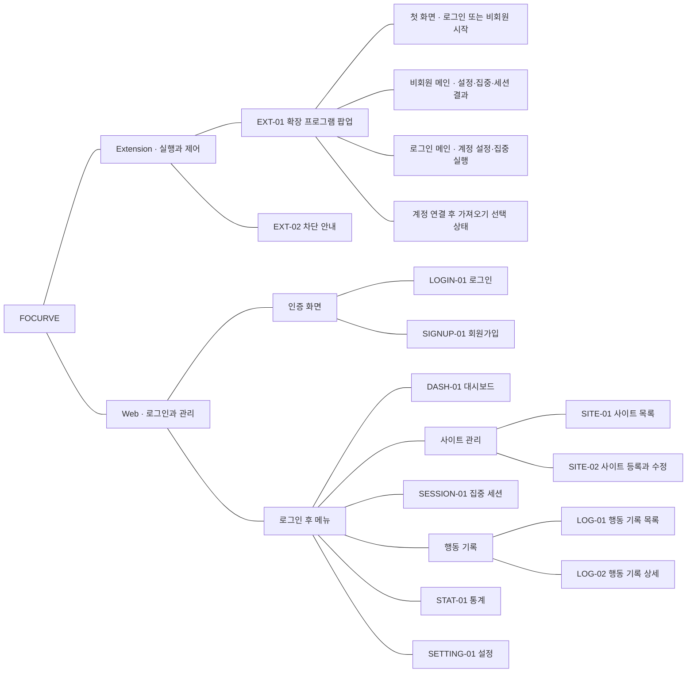

### 비회원 정책 초안과 화면 상태

비회원은 계정 없이 시작할 수 있다. 보관·조회·이전 규칙 중 미정 항목은 **정책 초안**으로 관리한다. 상세 선택·실패 흐름은 [별도 User Flow](https://www.figma.com/board/OeaNNfyOSnWFShOSFX2RZQ)의 04 영역과 FOCURVE_User_Flow_v1.1.md를 기준으로 합니다.

| 상태 | 포함 기능 |
|---|---|
| 첫 화면 | 웹에서 로그인 / 로그인 없이 시작하기 |
| 비회원 메인 | 로컬 사이트·분류·정책·집중 시간 설정, 세션 시작·종료, 로컬 세션 결과·접근 기록·기본 요약, 계정 연결, 비회원 자료 삭제 |
| 로그인 메인 | 계정 설정 확인·집중 실행, 웹 대시보드 열기, 남은 비회원 자료 가져오기 |
| 가져오기 선택 | 현재 계정 확인, 설정·기록 선택, 충돌 안내, 가져오기·건너뛰기, 진행·성공·부분 실패·재시도·나중에 상태 |

- 비회원 설정·기록은 현재 브라우저 프로필의 확장 프로그램 로컬 저장소에 보관합니다. 설정은 삭제 전까지, 기록은 발생일부터 90일간 보관하는 초안입니다.
- 로그인 시 사용자 선택으로 계정에 이전합니다. 같은 사이트의 기존 계정 정책은 유지하고, 기록은 중복 없이 추가합니다.
- 성공이 확인된 이전 항목만 로컬에서 정리합니다. 실패·미선택·충돌로 미반영된 항목은 보존합니다.
- 가져오기를 건너뛰어도 계정 이용이 가능하고, 비회원 데이터가 자동으로 서버에 전송되지 않습니다.
- 진행 중인 비회원 세션이 끝난 뒤 계정 전환을 처리합니다. 웹 대시보드·통계는 로그인한 계정의 데이터를 보여줍니다.

기획안 FOCURVE_프로젝트_기획안_v1.0_20260918.pdf의 69쪽·71쪽은 계정 기준 보관·인증 정책입니다. 위 비회원 규칙을 기존 기획안에서 이미 확정된 내용으로 간주하지 않습니다.

비회원 진입의 기능 식별자는 AUTH-04다.

| 기능 ID | 대분류 | 기능명 | 기능 설명 | 우선순위 | 구현 영역 | 관련 화면 | 확정 상태 |
|---|---|---|---|---|---|---|---|
| AUTH-04 | 회원 관리 | 로그인 없이 시작하기 | 계정 없이 집중 이용을 시작하고 설정·기록을 로컬에 보관한다 | 필수 | Extension | EXT-01 | 시작 경로 반영·보관 정책 초안 |

---

## 07. User Flow v1.1

비회원 보관·가져오기 정책: 보관 기간·기산점과 성공 원본 처리 방식은 설계 결정사항 DEC-01·DEC-02에서 확정한다. 본문의 30일·90일 및 원본 처리 규칙은 해당 항목의 정책 후보이며, 회원 서버 기록의 보관 정책과 구분한다.

[FigJam에서 User Flow 열기](https://www.figma.com/board/OeaNNfyOSnWFShOSFX2RZQ)

### 문서 역할

확장 프로그램에서 시작하는 핵심 이용 흐름입니다. IA와는 별도의 FigJam 파일입니다. 집중 전·중·후의 세 섹션과, 오른쪽에 떨어뜨려 배치한 ‘04 계정 연결·데이터 이전’ 영역으로 구성한다.

비회원 보관 기간·조회 범위·계정 이전의 미확정 규칙은 **설계 정책 초안**입니다. 기존 기획안에서 이미 확정한 내용으로 취급하지 않습니다.

### 핵심 경로

- 계정 연결 상태: 확장 프로그램 열기 → 로그인 메인 → 설정 확인 → 집중 시작.
- 신규 로그인: 확장 프로그램 열기 → 웹에서 로그인 → 웹 인증 → 04의 비회원 데이터 확인·가져오기 선택 → 로그인 메인으로 복귀 → 집중 시작.
- 비회원: 확장 프로그램 열기 → 로그인 없이 시작하기 → 비회원 메인 → 설정 확인 → 집중 시작.
- 비회원 경로는 웹 로그인이나 계정용 웹 대시보드를 필수로 거치지 않습니다.
- 비회원 종료 후: 로컬 기록·세션 결과 확인 → 설정 조정 → 다음 집중 시작. 계정 연결은 사용자가 원할 때 선택합니다.

### 구조도

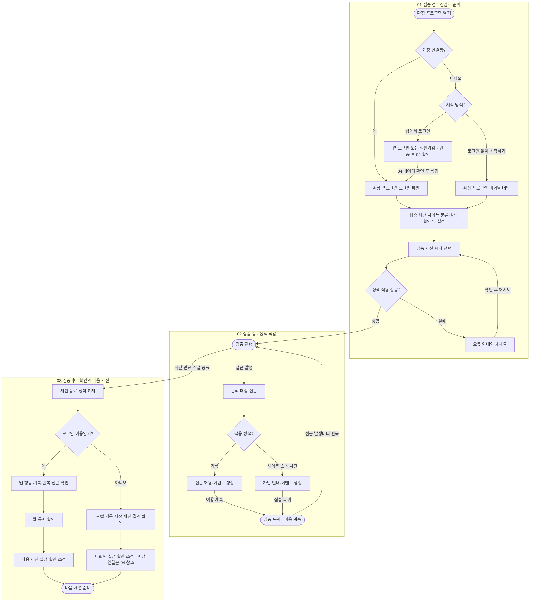

### 04 계정 연결·데이터 이전 — 별도 영역

01의 웹 인증 성공 직후와, 세션을 마친 비회원이 계정 연결을 선택한 경우에 적용합니다. 로그인 취소 시 비회원으로 계속 이용합니다. 진행 중인 세션은 비회원 상태로 마친 다음 전환합니다. 건너뛴 자료는 확장 프로그램의 로그인 메인에서 ‘비회원 데이터 가져오기’를 선택해 다시 처리할 수 있습니다.

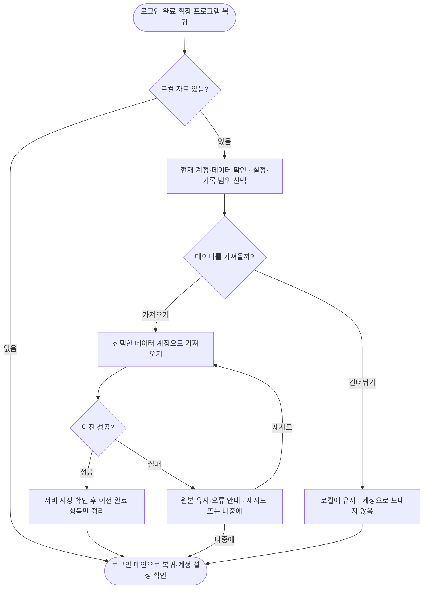

### 읽는 법

01은 시작 방식 선택과 집중 시간·사이트 분류·정책 확인, 02는 세션 중 접근 발생마다 반복되는 차단·기록 처리, 03은 종료와 다음 세션 준비입니다. ‘정책 적용 성공’ 이후에만 정상 집중 진행으로 들어갑니다. 04는 계정 연결 시 필요한 추가 분기이며 매 세션 필수 단계가 아닙니다.

### 비회원 정책

| 항목 | 설계 기준 |
|---|---|
| 로그인 없이 집중 시작 | 계정 없이 확장 프로그램에서 바로 이용 |
| 설정할 수 있는 항목 | 집중 시간, 사이트 등록·수정·삭제, 집중·방해·일반 분류, 차단·기록·쇼츠 제한 정책. 저장된 설정은 다음 세션에 다시 사용 |
| 저장 위치 | 현재 브라우저 프로필의 확장 프로그램 로컬 저장소. 비회원 설정·기록은 서버로 자동 전송하지 않음 |
| 설정 보관 | 사용자가 삭제·초기화하거나 확장 프로그램의 로컬 데이터가 삭제될 때까지 |
| 세션·접근 기록 보관 | 발생 시각 기준 최근 90일. 확장 프로그램 실행·조회·기록 시 만료 항목을 정리하고 조회에서 제외 |
| 비회원 조회 | 확장 프로그램에서 로컬 세션 결과·접근 기록과 기본 요약(세션 시간·차단 횟수·반복 접근 횟수)을 확인 |
| 웹 대시보드·통계 | 로그인한 계정의 데이터를 조회. 비회원 기록을 계정으로 가져온 뒤 해당 기록도 반영 |
| 전환 시점 | 진행 중인 비회원 집중 세션을 종료하고 정책을 해제한 뒤 계정 연결·데이터 이전 처리 |
| 이전 동의 | 현재 계정과 이전할 데이터 범위를 보여주고 ‘가져오기 / 건너뛰기’를 선택. 로그인만으로 자동 이전하지 않음 |
| 가져오기 대상 | 사용자가 선택한 로컬 설정과 유효한 최근 90일 기록. 원래 발생 시각을 유지하며 가져온 날부터 보관 기간을 새로 세지 않음 |
| 설정 충돌 | 새 사이트만 추가. 같은 사이트의 분류·정책은 기존 계정 설정을 유지. 집중 시간 등 계정 설정값이 있으면 그 값을 우선하고, 없으면 선택한 비회원 값을 사용 |
| 중복 기록 | 원본 기록 식별자로 동일 계정 내 중복 저장을 방지. 부분 성공 후 재시도해도 같은 기록은 한 번만 반영 |
| 성공 | 서버 저장이 확인된 항목만 이전 완료 처리하고 해당 로컬 원본을 정리. 충돌로 반영하지 않은 설정·선택하지 않은 항목은 보존하고 안내 |
| 실패 | 실패·응답 미확인 항목의 로컬 원본 유지. 재시도하거나 ‘나중에’를 선택해 계정 이용을 계속할 수 있음 |
| 건너뛰기 | 로컬 자료를 유지하고 계정 데이터와 분리. 확장 프로그램 로그인 메인에서 나중에 가져오기 가능 |
| 로그아웃·계정 변경 | 계정 캐시·전송 대기 자료는 계정별로 분리·정리. 비회원 자료를 새 계정으로 자동 이전하지 않으며, 가져오기 시 현재 계정을 다시 명시 |
| 로컬 자료 삭제 | ‘비회원 데이터 삭제’에서 명시적 확인 후 삭제. 확장 삭제·브라우저 데이터 삭제로 로컬 저장소가 지워지면 서버에서 복구할 수 없음 |

‘이벤트 생성’ 시 비회원 기록은 즉시 로컬에 저장하고, 세션 종료 시 결과를 집계합니다. 계정 이용자는 기존 서버 저장·동기화 규칙을 따릅니다. 세션 시간은 실제 순수 공부 시간으로 표현하지 않으며, 기록 누락을 접근 0회로 해석하지 않습니다.

보관 기간·로컬 표시 범위·충돌 규칙은 누락된 설계를 구체화하기 위한 제안입니다. 실행 검증은 구현 테스트에서 수행한다.

### 화면 명세에 넘길 항목

- EXT-01 비회원 메인: 사이트·정책·시간 설정, 집중 실행, 로컬 결과·기록, 계정 연결, 비회원 데이터 삭제.
- EXT-01 가져오기 상태: 현재 계정 표시, 설정·기록 선택, 충돌 안내, 가져오기·건너뛰기, 진행·성공·부분 실패·재시도·나중에.
- EXT-01 로그인 메인: 계정 설정 확인, 남아 있는 비회원 자료 가져오기. 새 화면 ID를 추가하지 않고 팝업의 상태로 관리.
- 비회원 진입 AUTH-04와 가져오기 IMPORT-01·02를 EXT-01 상태·보관 규칙에 연결한다.

---

## 08. Task Flow v1.0

비회원 보관·가져오기 정책: 보관 기간·기산점과 성공 원본 처리 방식은 설계 결정사항 DEC-01·DEC-02에서 확정한다. 본문의 30일·90일 및 원본 처리 규칙은 해당 항목의 정책 후보이며, 회원 서버 기록의 보관 정책과 구분한다.

작성 기준: 2026-09-19. 현재 IA에 포함된 Web·Chrome Extension 핵심 기능의 작업별 흐름입니다.

[FigJam에서 Task Flow 열기](https://www.figma.com/board/onqCrA7TUhV7iptZFI2743)

IA, User Flow, Task Flow는 각각 별도 FigJam 파일로 관리합니다. 이 문서에서는 TF-01~TF-14를 구분합니다. TF-14는 화면 모드 선택 흐름입니다. TF 번호는 작성·탐색 순서이며 사용자에게 모든 흐름을 순서대로 수행하도록 요구하지 않습니다.

화면 모드의 동작과 예외는 [SETTING-01 화면 모드 설정 명세](design/01_UX_기능설계/SETTING-01_화면_모드_설정_명세.md)를 따른다.

### 설계 기준

- 기준 문서: FOCURVE_프로젝트_기획안_v1.0_20260918.pdf 41–43쪽, 52–61쪽 및 70쪽 「삭제 처리와 통계 정합성」.
- [IA v1.2](https://www.figma.com/board/8jb3v32UOVptu9mjbHRaBp): 화면 소속과 기존 화면 ID를 유지.
- [User Flow v1.1](https://www.figma.com/board/OeaNNfyOSnWFShOSFX2RZQ): 로그인·비회원 경로와 정책 초안을 계승.
- 비회원 보관·조회·이전 및 일부 확인창·필터 등 세부 UX는 설계 초안이다. 원 기획안에서 이미 확정된 사항과 구분한다.
- 이 문서는 각 작업의 진입, 입력, 선택, 성공, 실패·재시도·취소, 완료 상태까지 정의한다. 필드 길이·시간 입력 범위·정확한 문구와 화면 상태는 다음 화면 명세에서, API·DB·이벤트 필드는 시스템 설계에서 구체화한다.
- 기본 흐름은 TF-01~TF-14, 이번 학기 추가 기능 흐름은 [추가 기능 설계](design/01_UX_기능설계/FOCURVE_추가_기능_설계.md)의 TF-A01~TF-A09를 따른다. PC 확장은 웹 검수·테스트 완료 후 조건부 착수한다.

### 흐름 목록

읽는 방법: 각 흐름은 위에서 아래로 읽는다. 이중 테두리의 “복귀·재시도” 상자는 같은 이름의 단계부터 다시 진행하는 연결점이다. 작업 완료가 아니며, 긴 되돌림 화살표를 대신한다. 정상 완료·오류·확인 상태는 상자의 문구로 구분한다.

| ID | 작업 | 관련 화면 |
|---|---|---|
| TF-01 | 사이트 등록 | SITE-01 → SITE-02 / EXT-01 비회원 사이트 관리 |
| TF-02 | 사이트 정보 수정 | SITE-01 → SITE-02 / EXT-01 |
| TF-03 | 사이트 삭제 | SITE-01 / EXT-01 |
| TF-04 | 사이트 분류·관리 정책 설정 | SITE-02 / EXT-01 사이트 관리 |
| TF-05 | 로그인 사용자 집중 시작 | SESSION-01 / EXT-01 로그인 메인 |
| TF-06 | 비회원 집중 시작 | EXT-01 첫 화면·비회원 메인 |
| TF-07 | 집중 세션 종료 | SESSION-01 / EXT-01 |
| TF-08 | 사이트·Shorts 접근 제어와 기록 | EXT-02 / 대상 웹페이지 / LOG-01에 결과 반영 |
| TF-09 | 행동 기록·반복 접근 조회 | LOG-01 → LOG-02 / DASH-01 최근 기록 / EXT-01 로컬 기록 |
| TF-10 | 통계 확인·다음 세션 설정 조정 | DASH-01 / STAT-01 → SITE-02 / EXT-01 기본 요약 |
| TF-11 | 비회원 데이터 계정으로 가져오기 | EXT-01 가져오기 상태 / LOGIN-01·SIGNUP-01 연계 |
| TF-12 | 회원가입·로그인·확장 계정 연결 | LOGIN-01 / SIGNUP-01 / EXT-01 / DASH-01 |
| TF-13 | 로그아웃·계정 연결 해제 | SETTING-01 / EXT-01 계정 메뉴 |
| TF-14 | 화면 모드 선택 | SETTING-01 / Web 공통 화면에 적용 |

### 공통 적용 원칙

1. 사이트는 정규화한 호스트와 하위 도메인 범위로 식별한다. 하위 도메인 포함이 기본이며, 동일·포함 범위 중복을 막는다.
2. 분류·관리 방식·내부 기능 제한은 구분한다. 전체 차단은 해당 사이트에 적용하고 내부 기능 제한보다 우선한다.
3. 현재 세션의 정책은 시작 시 고정한다. 수정·삭제한 설정은 다음 세션에 적용한다. 사이트 설정 수정·삭제만으로 과거 접근 기록의 정보나 관련 통계를 변경·삭제하지 않는다. 기록은 정해진 보관 기간 동안 유지하며, 행동 기록 삭제 요청은 사이트 설정 삭제와 별도로 처리한다.
4. 시작·종료는 확장 프로그램의 실제 적용·해제 결과로 표시한다. 통신 지연을 성공으로 표시하지 않는다.
5. 반복 접근은 같은 세션·같은 대상의 두 번째 이후 유효 접근이다. 3회 접근이면 반복 2회이며 반복 횟수를 총 접근에 더하지 않는다.
6. 로딩·빈 결과·조회 실패·동기화 대기·기록 누락을 구분한다. 누락을 0회로 해석하지 않는다.
7. 저장 실패 시 입력을 유지한다. 취소·재시도는 사용자가 선택하며 중복 저장·중복 세션을 만들지 않는다.
8. 회원은 본인 계정 자료를, 비회원은 해당 브라우저의 로컬 자료를 사용한다. 인증 실패를 임의의 비회원 전환으로 처리하지 않는다.
9. 비회원 자료 이전은 현재 계정을 보여주고 명시적으로 선택한다. 성공 확인 전에 로컬 원본을 지우지 않는다.

### TF-01 사이트 등록

- 관련 화면: SITE-01 → SITE-02 / EXT-01 비회원 사이트 관리
- 기능 목록 연결: SITE-02, SITE-05, POLICY-01~03
- 시작 조건: 회원은 로그인한 상태, 비회원은 확장 프로그램의 비회원 메인에 진입한 상태.
- 완료 기준: 사이트·분류·정책이 저장되고 목록에 표시된다.

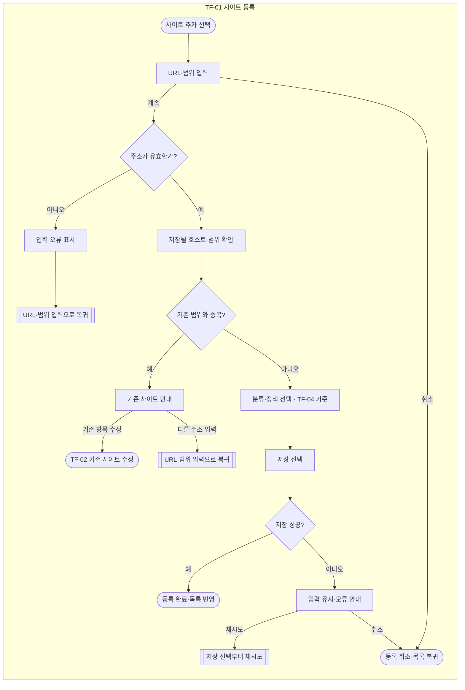

- URL에서 호스트명을 추출하고 프로토콜·포트·경로·쿼리·프래그먼트를 제외한다. 하위 도메인 포함은 기본값이다.
- 동일하거나 서로 포함되는 사이트 범위는 중복 등록하지 않고 기존 사이트 수정을 안내한다.
- TF-04의 분류·정책 선택 규칙을 재사용한다. 신규 등록 저장은 이 흐름에서 한 번 수행한다.
- 회원은 계정에, 비회원은 로컬에 저장한다. 실패 시 입력을 유지하며 성공으로 표시하지 않는다.

### TF-02 사이트 정보 수정

- 관련 화면: SITE-01 → SITE-02 / EXT-01
- 기능 목록 연결: SITE-03
- 시작 조건: 수정할 사이트가 등록되어 있다.
- 완료 기준: 변경된 정보가 목록에 반영되고 다음 세션 적용임을 알 수 있다.

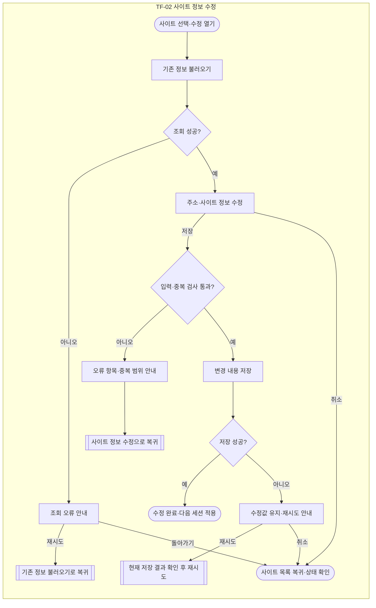

- 주소·하위 도메인 범위를 바꾸면 자신을 제외한 등록 사이트와 중복 여부를 다시 확인한다.
- 분류·정책 변경은 TF-04를 사용한다.
- 현재 세션의 정책과 과거 기록은 유지한다. 새 정보는 다음 세션부터 적용한다.
- 취소할 때 저장하지 않은 변경 사항이 있으면 폐기 여부를 확인한다.

### TF-03 사이트 삭제

- 관련 화면: SITE-01 / EXT-01
- 기능 목록 연결: SITE-04
- 시작 조건: 삭제할 사이트를 선택한 상태.
- 완료 기준: 관리 목록에서 해당 사이트가 제거되고 다음 세션부터 관리 대상에서 제외된다. 기존 접근 기록과 관련 통계는 보관 기간 동안 유지되며, 진행 중인 세션의 정책은 유지된다.

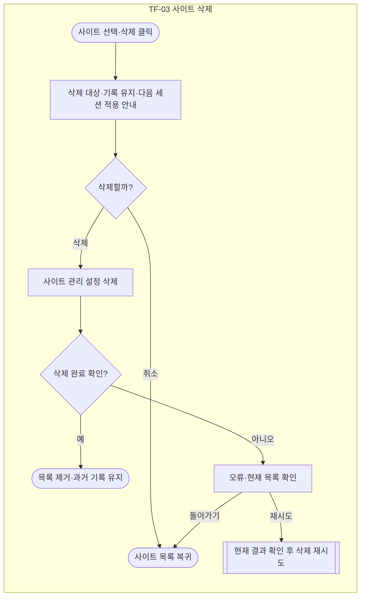

- 사이트 삭제는 관리 설정에서 대상을 제거하는 작업이다. 행동 기록 삭제와 구분하며, 기존 접근 기록과 관련 통계는 정해진 보관 기간 동안 유지한다.
- 진행 중인 세션은 시작 시점의 설정을 유지한다. 사이트 삭제 후에도 해당 세션이 종료될 때까지 기존 정책에 따라 유효 접근을 처리·기록하며, 다음 세션부터 관리 대상에서 제외한다.
- 사이트 설정만 삭제한 경우에는 해당 사이트의 로컬 전송 대기 이벤트를 제거하지 않는다. 회원 이벤트는 기존 전송·재시도·보관 규칙에 따라 처리하고, 비회원 기록은 기존 로컬 보관 규칙을 따른다.
- 확인 화면에는 삭제할 사이트명·주소, 기존 기록·통계가 유지된다는 점, 진행 중인 세션의 설정은 유지되고 다음 세션부터 제외된다는 점을 표시한다.
- 확인 문구 기준: “이 사이트를 관리 목록에서 삭제할까요? 기존 접근 기록과 통계는 보관 기간 동안 유지됩니다. 진행 중인 집중 세션에는 기존 설정이 유지되며, 다음 세션부터 관리 대상에서 제외됩니다.”
- 행동 기록을 별도로 삭제하면 요청 범위의 원본 이벤트를 운영 DB에서 24시간 이내 삭제하고 관련 통계를 다시 계산한다. 같은 삭제 범위의 전송 대기 이벤트만 제거하고 재전송으로 복구되지 않도록 한다. 이 처리는 사이트 삭제 버튼으로 실행하지 않는다.
- 삭제 성공 여부가 불명확하면 목록을 다시 확인한 뒤 재시도한다. 실패를 성공으로 표시하지 않는다.

### TF-04 사이트 분류·관리 정책 설정

- 관련 화면: SITE-02 / EXT-01 사이트 관리
- 기능 목록 연결: SITE-05, POLICY-01~03, SETTING-01
- 시작 조건: 등록 사이트를 선택했거나 신규 사이트의 분류·정책을 입력하고 있다.
- 완료 기준: 사용자가 선택한 분류·관리 방식·내부 기능 제한이 다음 세션용으로 저장된다.

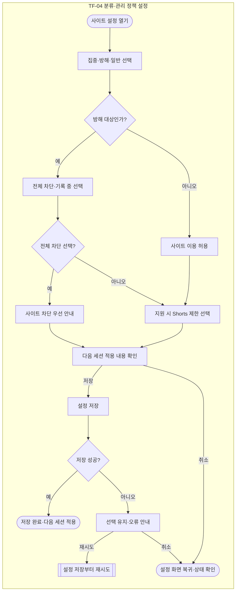

- 집중·방해·일반은 이용 목적 분류이며, 전체 차단·기록은 방해 사이트의 관리 방식이다.
- 전체 차단은 해당 사이트 전체를 뜻한다. 모든 웹사이트를 차단하는 전역 기능으로 해석하지 않는다.
- 집중·일반 사이트도 지원되는 내부 기능 제한을 설정할 수 있다. MVP의 지원 대상은 YouTube Shorts이다.
- 전체 차단이 우선이며 활성 세션 중 수정한 정책은 다음 세션부터 적용한다. 즉시 적용하려면 종료 후 재시작한다.
- 신규 사이트에서는 아래의 선택 규칙을 TF-01에서 사용하고, 등록과 함께 저장한다.

### TF-05 로그인 사용자 집중 시작

- 관련 화면: SESSION-01 / EXT-01 로그인 메인
- 기능 목록 연결: SESSION-01, SESSION-03, EXT-01, EXT-02
- 시작 조건: 회원 계정으로 로그인해 집중 화면에 진입한 상태.
- 완료 기준: 확장 프로그램이 정책 적용을 확인한 뒤 진행 중 상태와 시간을 보여준다.

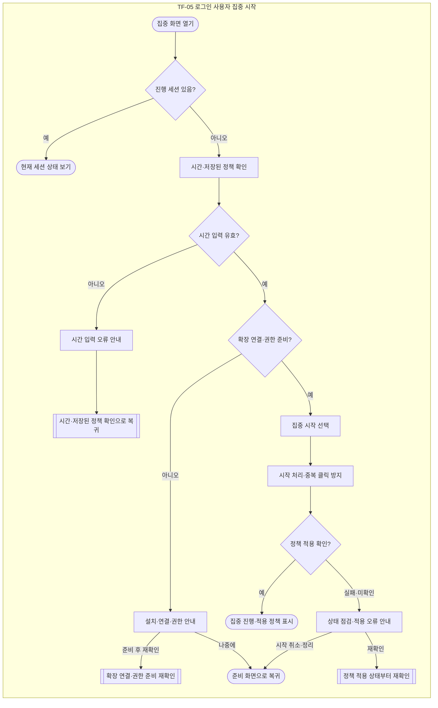

- Web 또는 확장 프로그램에서 시작한다. Web 진입 시 확장 설치·계정 연결·필수 권한 상태를 확인한다.
- 집중 화면은 시간과 저장된 정책 요약을 보여준다. 사이트별 정책 수정은 사이트 관리의 TF-04로 이동한다.
- 세션 시작 시 설정을 고정한다. 이미 열린 사이트·Shorts에도 적용하지만 적용 자체를 새 접근으로 세지 않는다.
- 이미 진행 중이면 해당 세션으로 안내한다. 중복 클릭·재시도로 세션이 여러 개 생성되지 않아야 한다.
- 응답이 늦거나 적용이 미확인된 경우 상태를 다시 조회하고 부분 적용을 정리한다. 확인 전에는 정상 진행으로 표시하지 않는다.
- 인증 만료는 TF-12 로그인으로 안내한다. 회원 요청을 임의로 비회원 세션으로 바꾸지 않는다.

### TF-06 비회원 집중 시작

- 관련 화면: EXT-01 첫 화면·비회원 메인
- 기능 목록 연결: AUTH-04 제안 행, SESSION-01, SESSION-03, EXT-02
- 시작 조건: 확장 프로그램을 열고 계정이 연결되지 않은 상태.
- 완료 기준: 로컬 설정을 적용한 비회원 세션이 시작된다.

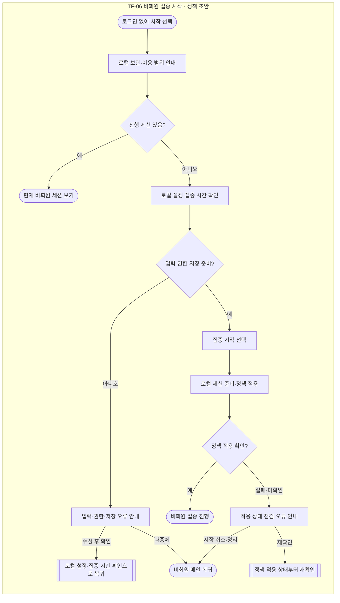

- 비회원 보관·조회 규칙은 기존 User Flow의 정책 초안을 따른다. 설정은 삭제 전까지, 기록은 발생일부터 최근 90일이다.
- 계정 로그인과 서버 저장을 시작의 필수 조건으로 두지 않는다.
- 집중 시간과 사이트·정책을 확인하고, 사이트가 없으면 TF-01로 갈 수 있도록 안내한다.
- 시작 전에 로컬 저장 가능 상태와 필수 권한을 확인한다. 실패 시 실행 오류를 표시하고 다시 점검한다.
- 정책이 일부 적용되었으면 시작 실패·취소 시 잔여 규칙을 정리한다.

### TF-07 집중 세션 종료

- 관련 화면: SESSION-01 / EXT-01
- 기능 목록 연결: SESSION-02, SESSION-03, EXT-02, EXT-03
- 시작 조건: 집중 세션이 진행 중이다.
- 완료 기준: 실제 적용 정책이 해제되고, 확인된 종료 사유·실제 세션 경과 시간·기록 저장 상태가 표시된다. 직접 종료와 시간 만료는 각 사유에 맞는 결과로 연결한다.

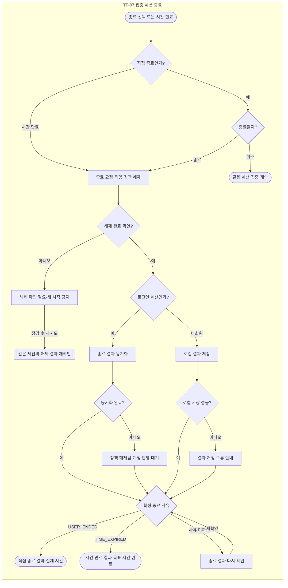

- 직접 종료는 확인창에서 ‘종료하기’를 선택한 뒤 요청한다. ‘계속 집중하기’ 또는 확인창 닫기는 요청을 보내지 않고 같은 세션의 타이머·시작 설정·기록 수집을 유지한다. 시간 만료는 확인창 없이 종료한다.
- 직접 종료는 `USER_ENDED`, 시간 만료는 `TIME_EXPIRED`로 구분한다. 확장 프로그램이 확인한 종료 사유를 결과·세션 기록·통계에 동일하게 표시한다. 직접 종료를 목표 시간 완료 결과로 연결하지 않는다.
- 직접 종료의 종료 시각은 실행 Extension이 종료를 수락한 시각이며, 시간 만료는 종료 예정 시각을 사용한다. 기본 MVP의 세션 경과 시간은 확인된 종료 시각에서 시작 시각을 뺀 값이다. 정책 해제 확인 지연이나 서버 수신 지연을 집중 시간에 더하지 않는다.
- 종료 시 브라우저의 정책 해제는 서버 응답을 기다리며 지연하지 않는다. 해제 미완료·미확인을 정상 종료로 표시하지 않으며, 새 세션 시작을 막고 ‘다시 확인’ 또는 확장 프로그램 점검을 안내한다.
- 종료 요청 접수만으로 결과 화면에 진입하지 않는다. 중복 클릭·재전송·웹과 확장의 동시 요청은 같은 `session_id`의 최종 종료 결과 한 건으로 처리한다. 확정된 종료 사유를 늦은 응답으로 덮어쓰지 않는다.
- 확인창을 연 동안 시간이 만료되면 현재 세션의 해제 상태와 확정 사유를 다시 확인한다. 확인창 취소로 끝난 세션을 진행 중으로 되돌리지 않는다. 직접 종료와 시간 만료의 구체적인 경합 우선순위는 개발 전 확정 사항이며, 웹의 클릭 순서만으로 사유를 선택하지 않는다.
- 회원의 미전송 이벤트는 기존 이벤트 식별값으로 재전송한다. 정책 해제 성공과 ‘계정 반영 대기’를 별개로 표시한다. 서버에 아직 반영되지 않은 결과·집계를 반영 완료 또는 0회로 표시하지 않는다.
- 비회원 로컬 결과 저장 실패도 사용자에게 알리되 해제된 정책을 다시 켜지 않는다.
- 회원 결과는 TF-09·10에서 같은 세션의 기록·통계로 연결한다. 세션 식별값·종료 사유·조회 범위·집계가 결과 화면과 일치해야 한다. 비회원 결과는 EXT-01의 로컬 기록·요약으로 연결한다.
- ‘다음 세션 준비’는 최신 저장 설정을 불러오는 단계다. 선택만으로 새 세션을 시작하지 않으며, 이전 세션의 종료 결과·기록은 유지한다. 진행 중 설정 변경은 기존 기준대로 다음 세션부터 적용한다.

#### 종료 결과와 공통 집계 표시

현재 추가 기능 화면의 집계 의미를 기본 MVP·추가 기능의 라이트·다크에서 같은 용어로 표시한다. 누적 시간은 종료가 확인된 세션의 실제 시간을 합산한다. 공통 카드명은 **‘종료한 세션’**, 목록명은 **‘최근 종료 세션’**이다. 종료한 세션 수에는 시간 만료와 직접 종료를 포함하고, 보조 문구에서 **‘목표 완료’와 ‘직접 종료’**를 나눈다. 미확인 종료는 확정된 집계에 포함하지 않는다. 세션 경과 시간을 실제 순공 시간으로 표현하지 않는다.

| 검수 항목 | 직접 종료 예시 | 시간 만료 예시 |
|---|---|---|
| 공통 오전 세션 | 09:00~10:00, 목표 완료 1회 | 09:00~10:00, 목표 완료 1회 |
| 오후 세션 | 목표 30분, 14:00~14:05:42 직접 종료 | 14:00~14:30 시간 만료 |
| 오후 실제 세션 시간 | 05:42 | 30:00 |
| 오늘 누적 시간 | 1시간 5분 42초 | 1시간 30분 |
| 오늘 종료한 세션 | 2회. 목표 완료 1 · 직접 종료 1 | 2회. 목표 완료 2 · 직접 종료 0 |
| 오후 전체 접근 | 1회. 차단 1 · 기록 0 · 기능 제한 0 | 8회. 차단 4 · 기록 3 · 기능 제한 1 |
| 오후 반복 접근 | 0회 | 3회 |
| 오늘 전체 접근 | 5회. 차단 3 · 기록 1 · 기능 제한 1 | 12회. 차단 6 · 기록 4 · 기능 제한 2 |
| 오늘 반복 접근 | 1회 | 4회 |

두 열은 같은 오후 세션이 서로 다르게 끝났을 때의 **대안 시나리오**이며 합산하지 않는다. 공통 오전 접근 4회는 차단 2·기록 1·기능 제한 1, 반복 1이다. 반복 접근은 전체 접근에 이미 포함되므로 다시 더하지 않는다. 세션 시작·종료 이벤트도 접근 횟수에 더하지 않는다.

#### 적용 범위와 남은 상세 조건

- 직접 종료·시간 만료·취소·처리 중·해제 확인 필요·계정 반영 대기의 의미와 연결은 기본 MVP·추가 기능의 라이트·다크에 동일하게 적용한다.
- 일시정지·재개는 현행 추가 기능 화면에만 있다. 기본 MVP로 확대하지 않는다. 추가 화면의 ‘일시정지 시간은 진행 시간에서 제외’ 안내를 유지하되, 정지 중 제한 유지·해제, 종료 예정 시각 조정, 복구 등 상세 정책은 확정된 기획 규칙으로 과장하지 않는다. 관련 개발 명세를 확정할 때 시간 계산·이벤트·화면을 함께 맞춘다.
- 종료 경합의 구체적 우선순위 및 `INTERRUPTED`·`LAST_CONFIRMED`의 지표 처리는 별도 확정 사항이다. 미확인 상태를 임의의 정상 완료로 바꾸지 않는다.
- 세부 상태와 예시의 기준은 `SESSION-01 — 웹 집중 세션 화면 명세`의 종료 영역을 따른다. Figma 프로토타입 시연 전이는 실제 Extension·Server 응답 검증을 대신하지 않는다.

### TF-08 사이트·Shorts 접근 제어와 기록

- 관련 화면: EXT-02 / 대상 웹페이지 / LOG-01에 결과 반영
- 기능 목록 연결: POLICY-01~03, EVENT-01~04, EXT-02~03
- 시작 조건: 사용자가 사이트 또는 내부 기능에 접근한다.
- 완료 기준: 정책에 맞게 허용·제한하고 유효 접근만 해당 유형으로 기록한다.

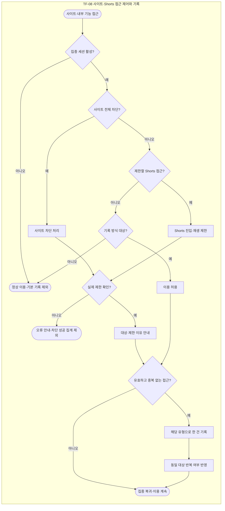

- 전체 사이트 차단을 먼저 판정한다. 동일 접근을 Shorts 제한으로 다시 기록하지 않는다.
- 직접 주소 입력, 외부 링크, 새 탭, 이탈 후 재진입, 기록 방식 사이트의 직접 새로고침은 독립적인 접근이 될 수 있다.
- 차단 안내만 새로고침, 일반 내부 이동, 자동 리디렉션, 리소스 요청은 사이트 접근 횟수에서 제외한다. SPA 이동은 Shorts 진입이면 기능 접근으로 별도 판정한다.
- 이미 열린 페이지에 세션 정책을 적용한 사실만으로 새로운 접근 이벤트를 만들지 않는다.
- 실제 제한이 확인된 경우에만 차단·기능 제한 성공으로 기록한다. 처리 실패와 통신 오류는 사용자 접근 통계와 분리한다.
- 같은 세션·같은 사이트 또는 기능에 대한 두 번째 이후의 유효 접근은 반복 접근이다. 전체 3회라면 반복 2회이며 둘을 더하지 않는다.
- 회원 이벤트는 서버 확인 전까지 로컬 전송 대기 후 동일 식별값으로 재전송한다. 비회원은 로컬 보관한다. 정책 집행은 서버 저장 응답을 기다리지 않는다.

### TF-09 행동 기록·반복 접근 조회

- 관련 화면: LOG-01 → LOG-02 / DASH-01 최근 기록 / EXT-01 로컬 기록
- 기능 목록 연결: DASH-01, LOG-01~02, EVENT-04
- 시작 조건: 회원은 자신의 계정 기록, 비회원은 현재 브라우저의 로컬 기록을 조회한다.
- 완료 기준: 접근 대상·시각·유형·횟수·반복 여부와 당시 적용 정책을 확인한다.

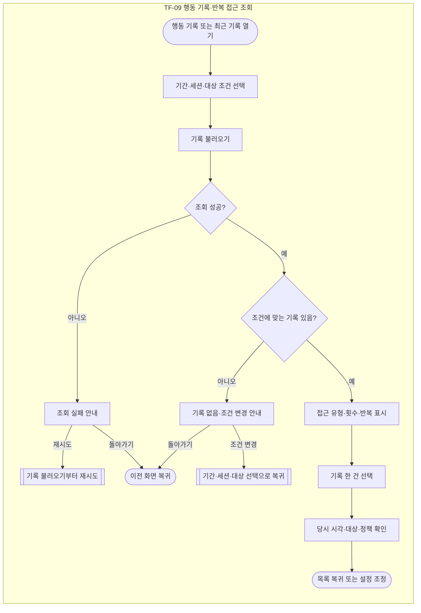

- 기간·세션·사이트·행동 유형 필터는 상세 UX 초안이다. 지원 범위는 화면 명세에 이어 적는다.
- 조회 실패와 기록 없음, 아직 동기화되지 않은 상태를 서로 다른 문구로 표시한다.
- 과거 기록은 당시 세션에 적용된 분류·정책으로 설명한다. 이후 수정한 정책으로 과거 의미를 바꾸지 않는다.
- 관리 목록에서 삭제된 사이트의 과거 기록도 보관 기간 내에는 조회하며, 접근 당시 사이트 정보·분류·정책·처리 결과를 유지한다. 사이트 설정 삭제만으로 기록이나 관련 통계를 제외하지 않는다. 별도의 행동 기록 삭제 또는 보관 기간 만료에 따른 처리는 해당 정책을 따른다.
- 비회원은 계정용 웹 기록 화면으로 강제 이동하지 않는다.

### TF-10 통계 확인·다음 세션 설정 조정

- 관련 화면: DASH-01 / STAT-01 → SITE-02 / EXT-01 기본 요약
- 기능 목록 연결: STAT-01~02, SETTING-01
- 시작 조건: 집중 결과를 확인하고 다음 세션 설정을 정하려고 한다.
- 완료 기준: 기록을 참고해 설정을 유지하거나 사용자 선택으로 변경한다.

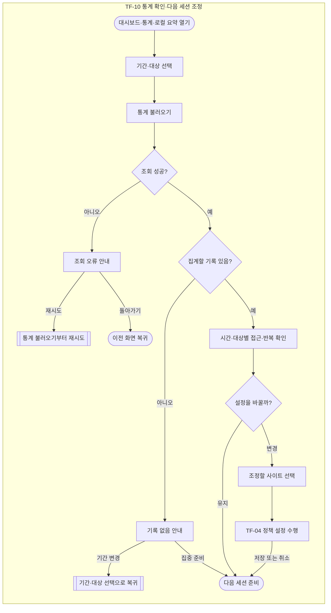

- 세션 시간은 시작·종료 사이의 경과 시간이며 실제 순공 시간으로 표시하지 않는다.
- 전체 접근·차단 접근·기록 방식 접근·내부 기능 제한·반복 접근을 구분한다. 반복 접근은 별도 합산 대상이 아니다.
- 전송 대기·기록 누락 구간은 0회 또는 완전한 성공으로 해석하지 않도록 안내한다.
- 세부 통계에서 대상 사이트의 설정으로 연결한다. 시스템이 정책을 자동으로 바꾸지 않는다.
- 비회원은 로컬 기본 요약을 사용한다. 계정용 웹 통계에는 계정으로 이전한 기록이 반영된다.

### TF-11 비회원 데이터 계정으로 가져오기

- 관련 화면: EXT-01 가져오기 상태 / LOGIN-01·SIGNUP-01 연계
- 기능 목록 연결: 비회원 정책 초안 · 별도 기능 ID는 기능 목록에 연결
- 시작 조건: 진행 중인 비회원 세션을 마친 뒤 로그인했거나 로그인 메인에서 가져오기를 선택했다.
- 완료 기준: 사용자가 고른 자료만 계정에 반영하거나 로컬에 남긴 채 계정을 이용한다.

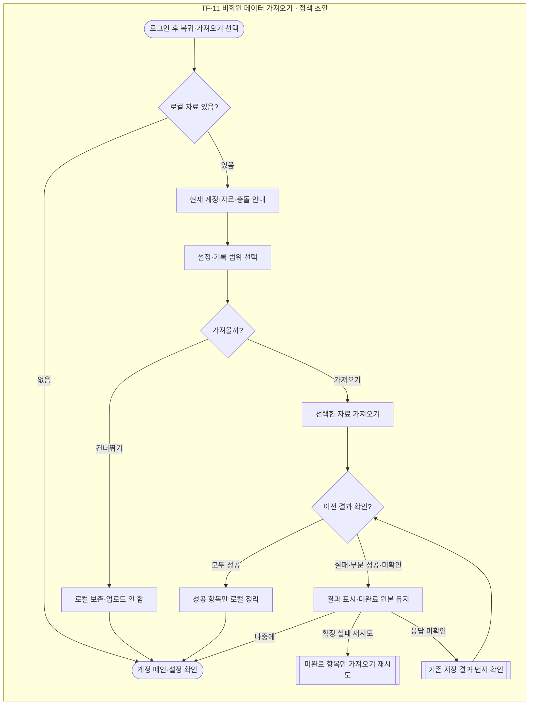

- 비회원 세션 진행 중에는 해당 세션을 종료한 뒤 로그인 전환한다. 웹 로그인 취소 시 비회원으로 계속 이용한다.
- 현재 계정·가져올 설정·기록 범위를 먼저 보여준다. 로그인만으로 자동 업로드하지 않는다.
- 새 사이트는 추가하고 같은 사이트의 분류·정책은 기존 계정 값을 유지한다. 기록은 원래 발생 시각과 식별값으로 중복 없이 추가한다.
- 서버 저장이 확인된 항목만 로컬에서 정리한다. 부분 실패·응답 미확인·미선택·충돌로 반영하지 않은 자료는 보존한다.
- 건너뛰기 또는 나중에를 선택해도 계정 이용은 가능하다. 남은 로컬 자료는 나중에 다시 가져올 수 있다.
- 비회원 로컬 기록 보관 90일 등은 User Flow에서 작성한 정책 초안이며 기존 기획안의 확정 규칙으로 취급하지 않는다. 기획안 69쪽의 서버 세션·행동 기록 90일과 구분한다.

### TF-12 회원가입·로그인·확장 계정 연결

- 관련 화면: LOGIN-01 / SIGNUP-01 / EXT-01 / DASH-01
- 기능 목록 연결: AUTH-01~02, EXT-01
- 시작 조건: 웹에 직접 방문하거나 확장 프로그램의 웹에서 로그인을 선택했다.
- 완료 기준: 인증된 계정으로 웹을 이용하거나 확장 프로그램에 계정을 연결한다.

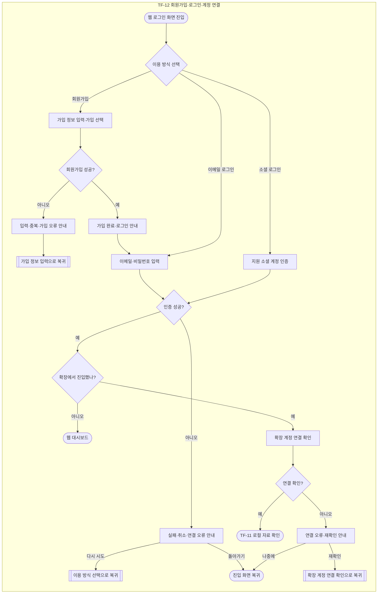

- 기획안 41쪽에 이메일·비밀번호 인증과 지원 소셜 계정 로그인이 포함되어 있어 두 경로를 표시한다. 제공 사업자의 확정 목록은 인증 화면 명세와 일치시킨다.
- 회원가입 입력 검증·중복 계정 안내, 로그인 실패·소셜 인증 취소·통신 오류를 구분한다. 비밀번호 값 등 인증 비밀을 오류에 노출하지 않는다.
- 이메일 가입 후 로그인 화면으로 안내하는 상세 UX 초안을 사용한다.
- 웹 직접 진입은 대시보드로, 확장 프로그램에서 진입하면 인증 완료 후 확장 프로그램으로 복귀한다.
- 비회원 데이터 존재 여부와 이전 동의는 TF-11에서 처리한다. 계정 연결 성공만으로 자료를 자동 가져오지 않는다.

### TF-13 로그아웃·계정 연결 해제

- 관련 화면: SETTING-01 / EXT-01 계정 메뉴
- 기능 목록 연결: AUTH-03
- 시작 조건: 계정에 로그인한 상태.
- 완료 기준: 현재 계정 연결이 해제되고 계정 자료가 다른 이용 상태에 노출되지 않는다.

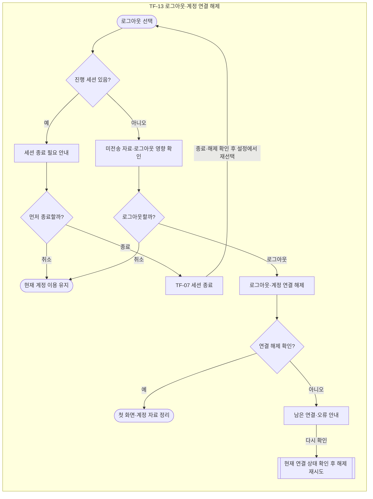

- 진행 중인 세션을 먼저 종료하는 흐름과 영향 확인창은 상세 UX 초안이다. 종료를 취소하면 현재 계정 이용을 유지한다.
- 미전송 기록이 있으면 로그아웃 시 로컬 계정 자료 정리에 따른 영향을 확인창에 알리고 취소할 수 있게 한다.
- 회원 계정 캐시·전송 대기 자료는 계정과 분리되지 않은 채 비회원이나 다른 계정에 재사용하지 않는다.
- 비회원 로컬 자료는 계정 로그아웃과 별개로 관리한다. 새로운 계정으로 자동 이전하지 않는다.
- 웹·확장 중 연결이 남았으면 완전한 계정 연결 해제로 표시하지 않고 해당 위치에서 재확인을 안내한다.

### TF-14 화면 모드 선택

- 관련 화면: SETTING-01. 적용 영역: Web 전체.
- 기능 목록 연결: SETTING-02.
- 시작 조건: 설정 화면의 `화면 모드` 항목에 진입했다.
- 완료 기준: 선택 표시와 웹 테마가 일치하고 저장 성공 여부를 정확하게 표시한다.
- 상세 기준: [SETTING-01 화면 모드 설정 명세](design/01_UX_기능설계/SETTING-01_화면_모드_설정_명세.md).

| 단계·분기 | 화면과 처리 | 다음 상태 |
|---|---|---|
| 웹 첫 진입·재접속 | 브라우저 저장값이 `light` 또는 `dark`이면 해당 모드를 복원한다. 저장값이 없거나 잘못됐거나 읽을 수 없으면 라이트로 시작한다. | 현재 모드 표시 |
| 설정에서 라이트·다크 선택 | 선택 즉시 웹 전체의 테마와 선택 표시를 바꾸고 현재 브라우저에 저장한다. 별도 저장 버튼이나 서버 응답을 기다리지 않는다. | 저장 결과 확인 |
| 현재 선택 재클릭 | 기존 선택을 유지한다. 페이지·세션 재시작이나 중복 알림을 만들지 않는다. | 현재 상태 유지 |
| 저장 성공 | 선택한 모드를 브라우저에 보관한다. 실패 안내가 있었다면 안내와 `다시 저장` 버튼을 제거한다. | 선택 상태 유지·다음 방문에 복원 |
| 저장 실패 | 현재 웹 이용 중 선택한 테마는 유지한다. `화면 모드는 적용했지만 저장하지 못했습니다. 다시 방문하면 이전 모드로 표시될 수 있습니다.`와 `다시 저장`을 표시한다. | 사용 계속 또는 재시도 |
| 다시 저장 | 현재 모드의 로컬 저장만 재시도한다. 성공하면 실패 안내를 해제하고, 실패하면 안내를 유지한다. | 저장 성공 또는 저장 실패 |
| 저장 실패 후 새로고침 | 실제 남아 있는 유효 저장값을 적용한다. 값이 없거나 읽을 수 없으면 라이트를 적용한다. | 실제 저장값에 따른 모드 표시 |

- 테마는 같은 브라우저의 로그아웃·재로그인·계정 변경에도 유지한다. 브라우저 사이트 데이터를 삭제하거나 새 브라우저를 이용하면 저장값이 없으므로 라이트로 시작한다.
- 테마 전환은 진행 세션·입력값·조회 조건·선택 행·스크롤·차단 정책·기록·통계를 유지한다. 다른 설정 입력을 저장하거나 지우지 않는다.
- 기본 MVP와 기본+추가 High-Fi는 각각 같은 범위 안에서 라이트·다크 전환 예시를 제공한다. 기본 MVP Low-Fi는 두 선택 상태 모두 회색을 유지한다.
- Figma의 연결은 시각적 전환 예시이다. 실제 앱의 브라우저 저장·복원·오류 처리는 T-055~T-060으로 구현 후 검증한다.
- OS 자동 테마, 계정·기기 간 동기화, 확장 프로그램 테마 전환은 해당 기능 범위에 포함하지 않는다. 서버 API·DB 컬럼·행동 이벤트를 추가하지 않는다.

### 공통 화면 상태

기본·추가 기능의 라이트·다크에서 같은 의미와 상태 전이를 사용한다. 세부 검수 기준은 화면 검수 기준 문서를 따른다.

#### TF-08~TF-10 기록 상세 연결

- 삭제 후·사이트 0개·이전 기록·직접 종료·시간 만료 목록은 선택한 행의 상세로 이동한다.
- 상세에서 뒤로 이동하면 진입한 목록 상태를 유지한다. 삭제 상태에서 사이트를 확인할 때 현재 7개/0개 관리 목록을 유지한다.
- 직접 종료 상세는 14:03 한 건과 14:00–14:05:42 세션을 표시한다. 14:16·14:28 접근을 표시하지 않는다.

#### TF-11 가져오기 상태

- 미선택 / 설정만 / 기록만 / 둘 다 네 상태를 제공한다. 미선택은 실행할 수 없다.
- 선택 범위에 따라 처리 중 상태를 표시하고 중복 실행을 막는다.
- 저장 확인 / 일부 실패 / 전체 실패 / 응답 미확인 / 자료 없음 / 계정 변경을 구분한다.
- 확정 실패는 이전 선택 범위의 미완료 자료만 재시도한다. 응답 미확인은 재업로드 전에 이전 저장 결과를 조회한다.
- 충돌·미선택·실패·미확인 원본은 유지한다. 계정 저장이 확인된 자료만 로컬에서 정리한다.
- 비회원 진행 화면의 로컬 기록은 현재 진행 상태를 표시한다. 계정 연결은 세션 종료 필요 안내와 기존 종료 확인을 거친다.
- 이 세부 UX 보완은 앞서 표시한 비회원 정책 초안을 확정 정책으로 승격하지 않는다.

#### TF-13 로그아웃 상태

- 로그아웃 시 해당 계정의 로컬 자료를 삭제하고 서버 기록은 유지한다. 미전송 자료는 로컬 정리에 따라 복구하지 못할 수 있음을 별도로 알린다.
- 비회원 로컬 자료는 별도 관리하며 다른 계정으로 자동 이전하지 않는다.
- 진행 세션이 있으면 종료·정책 해제 확인을 먼저 한다. 현재 Figma 경로에서는 종료 후 설정에서 로그아웃을 다시 선택한다.
- 요청 처리 중 / 일부 연결 잔존 / 해제 실패·미확인을 분리한다. 완전한 해제가 확인되기 전 첫 화면으로 이동해 완료로 표시하지 않는다.
- 처리 중 화면의 성공·실패 분기는 실제 서버·Extension 결과를 사용한다. 검수 보드의 대표 결과 화면은 실제 저장·삭제 검증을 대신하지 않는다.

#### 기능 범위

시간대별 차트는 학기 내 추가 기능 OPTION-08이다. 추가 기능 전체는 TF-A01~TF-A09를 따르며, 성인 사이트·블러 전용 화면과 미정 정책은 개발 시작 전 확정한다. PC 확장은 웹 기능·검수·테스트 완료 후 조건부 착수한다.

---

## 09. 화면 설계

### 시트1

| 화면 ID | 화면명 | 구현 영역 | 이용 대상 | 화면 목적 | 관련 Task Flow |
|---|---|---|---|---|---|
| LOGIN-01 | 로그인 | Web | 비로그인 사용자 | 이메일 또는 지원 소셜 계정으로 로그인한다 | TF-12 |
| SIGNUP-01 | 회원가입 | Web | 비로그인 사용자 | 계정을 생성하고 로그인으로 연결한다 | TF-12 |
| DASH-01 | 대시보드 | Web | 로그인 회원 | 집중 현황·최근 행동 기록·통계 요약을 확인한다 | TF-09, TF-10, TF-12 |
| SITE-01 | 사이트 목록 | Web | 로그인 회원 | 등록 사이트와 분류·정책을 조회하고 추가·수정·삭제로 이동한다 | TF-01, TF-02, TF-03 |
| SITE-02 | 사이트 등록·수정 | Web | 로그인 회원 | URL·사이트 분류·관리 정책을 입력하거나 수정한다 | TF-01, TF-02, TF-04, TF-10 |
| SESSION-01 | 집중 세션 | Web | 로그인 회원 | 집중 시간과 적용 정책을 확인하고 세션을 시작·종료한다 | TF-05, TF-07, TF-A08, TF-A09 |
| LOG-01 | 행동 기록 목록 | Web | 로그인 회원 | 접근 기록과 반복 접근을 조회한다 | TF-08, TF-09 |
| LOG-02 | 행동 기록 상세 | Web | 로그인 회원 | 접근 대상·시각·유형과 당시 적용 정책을 확인한다 | TF-09 |
| STAT-01 | 통계 | Web | 로그인 회원 | 집중 시간과 접근·반복 통계를 확인하고 다음 세션 설정을 조정한다 | TF-10 |
| SETTING-01 | 설정 | Web | 로그인 회원 | 계정 설정을 확인하고 로그아웃하며, 화면 모드(라이트·다크)를 선택한다 | TF-13, TF-14 |
| EXT-01 | 확장 프로그램 팝업 | Extension | 회원·비회원 | 로그인 또는 비회원 진입·집중 실행·사이트 설정·로컬 결과·자료 가져오기를 제공한다 | TF-01~07, TF-09~13 |
| EXT-02 | 차단 안내 | Extension | 회원·비회원 | 접근 제한 이유를 안내하고 집중 복귀를 돕는다 | TF-08 |
| FEATURE-01 | 사이트 내부 기능 제한 | Web | 회원 | 서비스별 내부 기능 제한과 전체 정책을 설정한다. | TF-A01 |
| SCHEDULE-01 | 집중 예약 | Web | 회원 | 예약 등록·수정·삭제와 실행 결과를 확인한다. | TF-A02 |
| KEYWORD-01 | 키워드 제한 | Web | 회원 | 키워드·검사 범위·예외를 관리한다. | TF-A04 |
| ANALYSIS-01 | 집중 분석·AI 피드백 | Web | 회원 | 이용 시간·지표·패턴·AI 제안을 확인한다. | TF-A03, TF-A07 |
| SAFETY-01 | 성인 사이트 제한 | Web | 회원; 비회원 지원은 정책 확정 | 사용·대상·예외·오탐·실패 상태를 설계한다. | TF-A05 |
| BLUR-01 | 민감 이미지 블러 | Web | 회원; 비회원 지원은 정책 확정 | 사용·민감도·일시 확인·오탐·실패 상태를 설계한다. | TF-A06 |

---

## 10. 화면 명세

### 시트1

| 화면 ID | 구분 | 항목 | 화면 표시·동작 | 조건·예외 처리 | 작성 기준 |
|---|---|---|---|---|---|
| SITE-02 | 기본 | 화면명 | 사이트 등록·수정 | 등록과 수정을 같은 화면 구조로 제공한다 | 기존 기준 |
| SITE-02 | 기본 | 화면 목적 | 사이트 주소·분류·관리 정책을 등록하거나 수정한다 | 저장한 설정은 다음 집중 세션부터 적용한다 | 기존 기준 |
| SITE-02 | 기본 | 이용 대상 | 로그인한 회원이 Web에서 이용한다. | 비회원 설정은 EXT-01에서 제공한다. 회원의 수정 진입·저장·취소·오류 복귀를 비회원 화면으로 연결하지 않는다. | 2026-09-24 회원 수정 반영 |
| SITE-02 | 기본 | 진입 경로 | SITE-01의 사이트 추가·수정, 회원 EXT-01의 웹에서 수정으로 진입한다. 수정은 선택한 회원 사이트를 대상으로 한다. | 통계에서 선택한 사이트의 설정으로도 연결한다. 진입한 회원과 대상 사이트의 맥락을 유지한다. | 2026-09-24 회원 수정 반영 |
| SITE-02 | 기본 | 관련 Task Flow | TF-01 사이트 등록 / TF-02 수정 / TF-04 정책 설정 / TF-10 설정 조정 | 각 작업의 정상·예외 흐름을 따른다 | 기존 기준 |
| SITE-02 | 입력 | 사이트 주소 | 사이트 주소를 입력하는 필수 입력창을 제공한다 | 주소에서 유효한 호스트명을 추출할 수 없으면 저장을 막는다 | 기존 기준 |
| SITE-02 | 표시 | 저장될 사이트 범위 | 입력 주소에서 추출한 호스트와 적용 범위를 보여준다 | 프로토콜·포트·경로·쿼리·프래그먼트를 제외한다 | 기존 기준 |
| SITE-02 | 입력 | 하위 도메인 포함 | 하위 도메인 포함 여부를 선택한다 | 신규 등록 기본값은 포함이며 수정 시 기존 값을 불러온다 | 기존 기준 |
| SITE-02 | 입력 | 사이트 분류 | 집중·방해·일반 중 하나를 사용자가 선택한다 | 선택하지 않으면 분류 선택 안내를 표시하고 저장을 막는다 | 기존 기준 |
| SITE-02 | 입력 | 방해 사이트 관리 방식 | 방해로 분류한 사이트는 전체 차단·기록 중 하나를 선택한다 | 방해 사이트의 관리 방식이 없으면 저장을 막는다 | 기존 기준 |
| SITE-02 | 표시 | 집중·일반 사이트 안내 | 집중·일반은 사이트 이용을 허용한다고 안내한다 | 지원되는 내부 기능 제한은 별도로 적용할 수 있다 | 기존 기준 |
| SITE-02 | 입력 | YouTube Shorts 제한 | 지원되는 YouTube 사이트에서 Shorts 제한을 켜거나 끈다 | 집중·일반·기록 방식에서도 설정할 수 있다 | 기존 기준 |
| SITE-02 | 표시 | 전체 차단 우선 안내 | 전체 차단을 선택하면 해당 사이트 전체가 제한됨을 안내한다 | 같은 접근을 Shorts 제한으로 중복 처리하지 않는다 | 기존 기준 |
| SITE-02 | 검증 | 사이트 중복 | 등록된 사이트와 동일하거나 포함 범위가 겹치면 저장을 막는다 | 겹치는 기존 사이트를 안내하며 수정 시 자기 자신은 검사에서 제외한다 | 기존 기준 |
| SITE-02 | 버튼 | 저장 | 입력값을 검증한 뒤 사이트 정보와 정책을 함께 저장한다. | 오류는 해당 항목 아래에 이유를 표시하고 첫 오류 항목으로 이동한다. 저장 성공 확인 전 목록의 저장값을 확정 변경하지 않는다. | 2026-09-24 회원 수정 반영 |
| SITE-02 | 버튼 | 취소 | 저장하지 않고 회원 SITE-01의 기존 목록·선택 상태로 돌아간다. | 미저장 변경이 있으면 취소·목록·다른 메뉴·계정·내부 기능 화면 이동 시 버리기 확인을 표시한다. 버리기는 변경을 저장하지 않고 이동하며, 계속 수정은 입력값을 유지한다. | 2026-09-24 회원 수정 반영 |
| SITE-02 | 상태 | 신규 등록 | 주소는 비워두고 분류·관리 방식은 사용자가 선택하게 한다 | 하위 도메인 포함은 켜짐이며 Shorts 제한의 신규 기본값은 꺼짐으로 제안한다 | UX 초안 |
| SITE-02 | 상태 | 수정 정보 불러오기 | 선택한 사이트의 기존 이름·주소·하위 도메인 범위·분류·정책·지원 기능 제한 값을 불러온다. | 불러오는 동안 로딩을 표시한다. 조회 실패 시 재시도·회원 목록으로 돌아가기를 제공하고 빈 등록 화면으로 전환하지 않는다. | 2026-09-24 회원 수정 반영 |
| SITE-02 | 상태 | 비활성 | 기존 정보를 불러오는 중에는 입력과 저장을 비활성화한다. | 수정 화면에서 변경 사항이 없으면 저장 버튼을 비활성화한다. 기존 설정을 기본값으로 덮어쓰지 않는다. | 2026-09-24 회원 수정 반영 |
| SITE-02 | 상태 | 저장 중 | 저장 중 표시를 제공하고 중복 제출을 막는다. | 처리 중에는 입력·저장·취소를 잠시 비활성화한다. 응답이 끊긴 상태는 저장 결과 미확인으로 구분한다. | 2026-09-24 회원 수정 반영 |
| SITE-02 | 상태 | 저장 성공 | 서버의 저장 성공 확인 후 완료 안내와 함께 회원 SITE-01로 이동하여 저장한 내용을 보여준다. | 동일한 사이트의 목록 행과 상세 정보에 같은 값을 표시한다. 변경은 다음 세션부터 적용되며 현재 세션의 정책이 바뀌었다고 안내하지 않는다. | 2026-09-24 회원 수정 반영 |
| SITE-02 | 상태 | 저장 실패 | 입력값을 유지하면서 저장 실패 이유와 재시도 방법을 안내한다. | 입력 오류·중복·통신 오류를 구분한다. 실패가 확정되면 목록은 기존 저장값을 유지하고 재시도·취소를 제공한다. 결과 미확인을 실패로 단정하지 않는다. | 2026-09-24 회원 수정 반영 |
| SITE-02 | 상태 | 저장 결과 미확인 | 저장 결과를 확인하지 못했습니다 안내와 결과 확인·회원 목록으로 돌아가기를 제공한다. | 결과 확인 전 목록으로 복귀하면 기존 저장값임을 안내하고 결과 확인 버튼을 표시한다. 추가 수정·삭제를 막고 저장 결과 확인 후 진행한다. 확인 전 성공 안내·저장 재전송을 하지 않는다. | 2026-09-24 회원 수정 반영 |
| SITE-02 | 상태 | 수정 대상 없음 | 사이트를 찾을 수 없다는 안내와 회원 목록으로 돌아가기 버튼을 보여준다. | 현재 저장 상태에서 대상이 없는 것이 확인된 경우에만 표시한다. 빈 등록 화면이나 비회원 화면으로 자동 전환하지 않는다. | 2026-09-24 회원 수정 반영 |
| SITE-02 | 상태 | 인증 만료 | 다시 로그인해야 한다는 안내와 로그인 이동 버튼을 제공한다. | 인증 만료를 저장 성공으로 표시하거나 비회원 설정에 저장하지 않는다. 로그인 후 회원의 대상 사이트·저장 결과를 다시 확인하고 요청을 자동 재전송하지 않는다. | 2026-09-24 회원 수정 반영 |
| SITE-02 | 정책 | 적용 시점 | 설정은 다음 집중 세션부터 적용됩니다 문구를 보여준다. | 진행 중인 세션은 시작 시점의 설정을 유지한다. 변경한 분류·정책을 현재 세션이나 과거 기록에 소급하지 않는다. | 2026-09-24 회원 수정 반영 |
| SITE-02 | 확인 사항 | 입력 제한 | URL 최대 입력 길이와 지원하는 주소 형태를 확정한다 | 구현 전 Web 입력 검증과 Server 검증 기준을 일치시킨다 | 개발 전 확정 |
| SITE-01 | 기본 | 화면명 | 사이트 삭제 확인 | SITE-01 목록에서 사용하는 확인창이다. 사이트 설정 삭제와 행동 기록 삭제를 구분한다. | 2026-09-24 반영 |
| SITE-01 | 기본 | 이용 대상·진입 | 회원은 SITE-01에서 삭제할 사이트를 선택하고 사이트 삭제를 누른다. | 비회원은 EXT-01에서 동일한 정책을 적용하되 로컬 설정을 삭제한다. | 2026-09-24 반영 |
| SITE-01 | 기본 | 관련 기준 | TF-03 사이트 삭제 / TF-09 기록 조회 / SITE-04 | 2026-09-24 확정한 기획안 70쪽 및 수정 Task Flow 기준 | 2026-09-24 반영 |
| SITE-01 | 표시 | 삭제 대상 | 선택한 사이트명과 정규화된 주소를 표시한다. | 클릭한 대상과 삭제 요청 대상이 일치해야 한다. | 2026-09-24 반영 |
| SITE-01 | 표시 | 삭제 영향 안내 | 관리 목록에서 삭제됩니다. 기존 접근 기록과 통계는 보관 기간 동안 유지됩니다. | 사이트 삭제로 과거 기록·통계를 삭제하거나 집계 대상에서 제외하지 않는다. | 2026-09-24 반영 |
| SITE-01 | 표시 | 진행 세션 안내 | 진행 중인 세션에는 기존 설정이 유지되며, 다음 세션부터 관리 대상에서 제외됩니다. | 활성 세션이 있을 때 표시한다. 세션이 없으면 현재 세션 유지 안내는 생략한다. | 2026-09-24 반영 |
| SITE-01 | 버튼 | 삭제 | 선택한 사이트의 관리 설정 삭제를 요청한다. | 회원은 서버의 삭제 결과, 비회원은 로컬 저장 결과를 확인한다. 행동 기록 삭제 요청을 함께 실행하지 않는다. | 2026-09-24 반영 |
| SITE-01 | 버튼 | 취소 | 삭제하지 않고 확인창을 닫아 기존 목록·선택 상태로 복귀한다. | 삭제 요청 전에는 설정·기록·통계를 변경하지 않는다. | 2026-09-24 반영 |
| SITE-01 | 상태 | 삭제 중 | 삭제 중 표시를 제공하고 삭제·취소 버튼의 중복 조작을 막는다. | 처리 중인 요청과 결과 미확인 상태를 구분한다. | 2026-09-24 반영 |
| SITE-01 | 상태 | 삭제 성공 | 성공 확인 후 관리 목록에서 대상을 제거하고 삭제 완료 안내를 표시한다. | 등록 사이트 수·분류별 등록 수를 갱신한다. 과거 접근 횟수·반복 횟수·집중 시간은 사이트 삭제만으로 변경하지 않는다. | 2026-09-24 반영 |
| SITE-01 | 상태 | 선택 상태 갱신 | 삭제된 대상의 선택을 해제하고 상세 영역에 사이트 선택 안내를 표시한다. | 삭제된 대상의 수정·삭제 버튼을 남겨두지 않는다. 남은 목록의 검색·필터 조건은 유지한다. | 2026-09-24 반영 |
| SITE-01 | 상태 | 삭제 후 빈 목록 | 마지막 등록 사이트를 삭제하면 등록 사이트 없음과 사이트 추가 버튼을 표시한다. | 등록 사이트는 있지만 필터 결과가 없으면 검색 결과 없음으로 구분한다. | 2026-09-24 반영 |
| SITE-01 | 상태 | 삭제 실패 | 실패 이유와 재시도·취소를 표시한다. | 삭제 실패가 확인되면 대상을 유지한다. 실패를 성공으로 표시하거나 기록을 지우지 않는다. | 2026-09-24 반영 |
| SITE-01 | 상태 | 결과 미확인 | 삭제 결과를 확인하지 못했습니다 안내와 결과 확인·목록으로 돌아가기를 제공한다. | 서버 또는 로컬 저장 상태를 확인한 뒤 목록을 갱신한다. 확인 전 성공으로 단정하거나 삭제 요청을 반복하지 않는다. | 2026-09-24 반영 |
| SITE-01 | 상태 | 이미 삭제된 대상 | 현재 저장 상태에서 대상이 없는 것을 확인하면 목록을 갱신하고 이미 삭제된 사이트임을 안내한다. | 확인 실패를 대상 없음으로 해석하지 않는다. 요청 재시도로 기록 삭제를 수행하지 않는다. | 2026-09-24 반영 |
| SITE-01 | 상태 | 인증 만료 | 회원 인증이 만료되면 다시 로그인 안내를 표시한다. | 비회원으로 자동 전환하여 삭제하지 않는다. 로그인 후 대상과 삭제 결과를 다시 확인한다. | 2026-09-24 반영 |
| SITE-01 | 정책 | 현재 세션 유지 | 진행 중인 세션은 시작 시점의 사이트·분류·정책을 그대로 사용한다. | 사이트 삭제 이후에도 세션 종료 전까지 기존 정책에 따라 유효 접근을 처리·기록한다. 타이머와 반복 접근 순서를 초기화하지 않는다. | 2026-09-24 반영 |
| SITE-01 | 정책 | 과거 기록 조회 | 관리 목록에서 삭제한 사이트도 보관 기간 내의 기존 기록은 조회할 수 있다. | 접근 당시 사이트 정보·분류·정책·처리 결과를 유지한다. 삭제된 사이트의 설정 화면으로 잘못 연결하지 않는다. | 2026-09-24 반영 |
| SITE-01 | 정책 | 미전송 기록 | 사이트 설정 삭제만으로 해당 사이트의 전송 대기 이벤트를 제거하지 않는다. | 기존 전송·재시도·보관 규칙을 따른다. 비회원 기록은 기존 로컬 보관 규칙을 따른다. | 2026-09-24 반영 |
| SITE-01 | 정책 | 행동 기록 삭제 구분 | 행동 기록 삭제는 별도 요청으로 처리하며 사이트 삭제 확인창에서 실행하지 않는다. | 별도 요청 범위의 원본 이벤트는 운영 DB에서 24시간 이내 삭제·통계 재계산한다. 동일 범위의 대기 이벤트만 제거하고 재전송 복구를 방지한다. | 2026-09-24 반영 |
| SITE-01 | 검증 | 삭제·취소 구분 | 삭제 성공은 대상이 제거된 목록으로, 취소는 대상이 남아 있는 목록으로 돌아간다. | 프로토타입에서도 두 결과를 구분하고 삭제 성공 후 해당 대상의 상세 정보가 남지 않는지 확인한다. | 2026-09-24 반영 |
| SITE-01 | 검증 | 수치·기록 유지 | 사이트 8개 중 1개 삭제 성공 시 등록 수는 7개로 갱신한다. | 다른 접근·삭제·보관 기간 만료가 없다면 과거 접근 통계는 동일하다. 현재 세션의 적용 대상은 세션 종료까지 유지한다. | 2026-09-24 반영 |
| SITE-02 | 표시 | 선택 대상 확인 | 목록에서 선택한 사이트의 이름과 주소를 수정 화면과 미리보기에 동일하게 표시한다. | 이름은 기존 표시값을 불러온다. 수정 대상 식별을 유지하며 별도의 필수 이름 입력 정책을 추가하지 않는다. | 2026-09-24 회원 수정 반영 |
| SITE-02 | 상태 | 목록 복귀와 선택 | 저장 성공·취소 후에도 회원의 검색·필터 조건과 수정 대상 식별을 유지한다. | 저장 결과가 기존 필터에 맞지 않으면 조건을 바꾸지 않고 해당 결과를 안내한다. 필터 밖 행을 잘못 표시하거나 다른 사이트를 자동 선택하지 않는다. | 2026-09-24 회원 수정 반영 |
| SITE-02 | 정책 | 현재 세션과 기록 | 설정 수정만으로 현재 세션을 종료·재시작하거나 타이머·반복 접근 순서를 초기화하지 않는다. | 세션이 끝날 때까지 시작 시점 설정으로 유효 접근을 처리·기록한다. 과거 기록과 전송 대기 이벤트는 접근 당시 정보를 유지한다. | 2026-09-24 회원 수정 반영 |
| SITE-02 | 검증 | 기능 제한 수정 | YouTube의 Shorts 제한 켜짐을 꺼짐으로 저장하면 회원 목록·상세에 제한 해제 설정을 표시한다. | 예시: 등록 8개, 집중 3개, 방해 4개, 일반 1개는 그대로다. 취소·확정 실패는 Shorts 켜짐을 유지하며 현재 세션과 과거 접근 수치는 바뀌지 않는다. | 2026-09-24 회원 수정 반영 |
| SITE-02 | 검증 | 분류 변경 수치 | 예시에서 YouTube를 집중에서 방해·기록으로 수정하면 저장 성공 후 집중 2개·방해 5개·일반 1개를 표시한다. | 등록 총수 8개는 유지한다. 사이트 분류 현황은 현재 관리 설정 기준으로 갱신하며 과거 접근 횟수·반복 횟수·집중 시간은 변경하지 않는다. | 2026-09-24 회원 수정 반영 |
| SITE-02 | 검증 | 네 가지 버전 | 기본 MVP와 기본+추가 기능의 라이트·다크에 회원 수정 안내·상태·연결을 동일하게 적용한다. | 추가 기능 전용 항목을 기본 MVP에 넣지 않는다. 각 버전에 있는 필드와 기능 범위는 유지한다. | 2026-09-24 회원 수정 반영 |
| SITE-02 | 검증 | 프로토타입 흐름 | 회원 목록에서 선택한 수정 대상, 기존값, 변경 입력, 저장 중, 저장 성공 후 목록을 구분하여 확인한다. | 변경 없음·취소 확인·계속 수정·조회 실패·검증 오류·저장 실패·결과 미확인·대상 없음·인증 만료도 회원 맥락에서 검수한다. | 2026-09-24 회원 수정 반영 |
| SITE-02 | 연결 | 회원 팝업의 수정 | 회원 EXT-01의 YouTube·Instagram·Reddit 행은 웹에서 수정으로 표시하고 해당 사이트의 회원 SITE-02를 연다. | 회원 계정의 기존 값을 불러와 계정 설정에 저장한다. 비회원 YouTube 수정이나 로컬 저장 목록으로 이동하지 않으며 비회원의 기존 로컬 흐름은 유지한다. | 2026-09-24 회원 수정 반영 |
| SITE-02 | 검증 | 대상별 정책 수정 | Instagram은 전체 차단에서 기록으로, Reddit은 기록에서 전체 차단으로 수정한 저장 결과를 각 사이트 목록·상세에 표시한다. | 두 예시는 방해 분류를 유지하므로 등록 수·분류별 수는 바뀌지 않는다. 목록 행과 수정 대상이 일치해야 하며 다음 세션부터 적용한다. | 2026-09-24 회원 수정 반영 |

---

## 11. EXT-01 확장 프로그램 팝업 명세

### 시트1

| 화면 ID | 구분 | 항목 | 화면 표시·동작 | 조건·예외 처리 | 작성 기준 |
|---|---|---|---|---|---|
| EXT-01 | 기본 정보 | 화면명 | 확장 프로그램 팝업 | 첫 화면·회원·비회원·집중 진행·자료 가져오기를 같은 화면 ID의 상태로 관리한다. | 기존 기준 |
| EXT-01 | 기본 정보 | 화면 목적 | 로그인 또는 비회원 진입, 사이트 설정, 집중 실행, 결과 확인을 제공한다. | 회원은 연결된 계정 자료를, 비회원은 현재 브라우저의 자료를 사용한다. | 기존 기준 |
| EXT-01 | 기본 정보 | 이용 대상·구현 영역 | 회원·비회원 모두 이용하는 Chrome Extension 화면이다. | 계정 인증은 웹 로그인 화면에서 진행한다. | 기존 기준 |
| EXT-01 | 기본 정보 | 관련 Task Flow | TF-01~07, TF-09~13과 연결된다. | 차단 안내 화면 자체는 EXT-02에서 별도로 명세한다. | 기존 기준 |
| EXT-01 | 공통 | 최초 상태 확인 | 팝업을 열면 계정 연결과 진행 중인 세션을 확인한다. | 확인 중에는 로딩을 표시하고 집중 시작 버튼을 비활성화한다. 조회 실패를 비회원 상태로 처리하지 않는다. | UX 초안 |
| EXT-01 | 공통 | 팝업 다시 열기 | 진행 중인 세션이 있으면 해당 세션의 시간과 정책을 표시한다. | 팝업을 닫아도 집중 세션은 계속된다. 다시 열 때 시간을 초기화하거나 새 세션을 만들지 않는다. | UX 초안 |
| EXT-01 | 공통 | 내부 메뉴 | 집중 관리와 사이트 관리로 이동할 수 있게 한다. 결과·기록·계정 메뉴는 해당 버튼으로 연다. | 내부 메뉴와 상태 전환은 모두 EXT-01 안에서 관리한다. | UX 초안 |
| EXT-01 | 첫 화면 | 안내 문구 | FOCURVE 소개와 ‘웹에서 로그인’, ‘로그인 없이 시작하기’ 버튼을 표시한다. | 계정 이용과 비회원 이용의 저장 범위를 짧게 안내한다. | UX 초안 |
| EXT-01 | 첫 화면 | 웹에서 로그인 | 버튼을 누르면 웹 LOGIN-01을 연다. 회원가입과 지원 소셜 로그인은 웹에서 진행한다. | 팝업 안에 별도 회원가입 폼을 만들지 않는다. | 기존 기준 |
| EXT-01 | 첫 화면 | 로그인 없이 시작하기 | 버튼을 누르면 비회원 이용 안내를 보여주고 비회원 메인으로 이동한다. | 계정 로그인이나 서버 저장을 비회원 이용의 필수 조건으로 두지 않는다. | 기존 기준 |
| EXT-01 | 인증 | 로그인 완료 후 연결 | 웹 인증 후 팝업에서 계정 연결을 확인하고 로그인 회원 상태로 전환한다. | 웹 로그인 성공과 확장 프로그램 연결 성공을 구분한다. 연결이 확인되지 않으면 재확인 버튼을 제공한다. | 기존 기준 |
| EXT-01 | 인증 | 로그인 취소·실패 | 로그인 실패, 사용자 취소, 연결 오류를 구분해 안내한다. | 기존 비회원 자료를 유지한다. 인증 취소만으로 자료를 삭제하거나 계정에 업로드하지 않는다. | UX 초안 |
| EXT-01 | 비회원 메인 | 이용 상태 표시 | ‘비회원으로 이용 중’과 ‘설정과 기록은 이 브라우저에 저장됩니다’를 표시한다. | 계정 동기화가 완료된 것처럼 표시하지 않는다. | 비회원 정책 초안 |
| EXT-01 | 비회원 메인 | 설정·기록 보관 안내 | 설정은 삭제 전까지, 기록은 발생일부터 최근 90일간 보관하는 안을 안내한다. | 보관 기간은 정책 초안이며 개발 전에 확정한다. 다른 브라우저나 기기와 자동 동기화하지 않는다. | 비회원 정책 초안 |
| EXT-01 | 비회원 메인 | 로그인 전환 | ‘웹에서 로그인’ 버튼으로 계정 연결을 시작한다. | 비회원 세션 진행 중이면 먼저 종료할지 확인한다. 종료를 취소하면 현재 세션을 유지한다. | 비회원 정책 초안 |
| EXT-01 | 회원 메인 | 계정 정보 | 현재 연결된 계정의 이름 또는 이메일을 표시한다. | 웹과 확장 프로그램의 계정이 일치하는지 확인할 수 있게 한다. 연결 미확인을 로그인 완료로 표시하지 않는다. | UX 초안 |
| EXT-01 | 회원 메인 | 설정 요약 | 사이트 차단 대상, 기록 대상, 내부 기능 제한 설정을 구분해 보여준다. | 진행 전에는 다음 세션용 설정을, 진행 중에는 현재 적용 중인 설정을 표시한다. | UX 초안 |
| EXT-01 | 회원 메인 | 대시보드 열기 | 버튼을 누르면 웹 DASH-01을 연다. | 웹 인증이 필요하면 LOGIN-01로 안내한다. 비회원 자료를 자동으로 업로드하지 않는다. | 기존 기준 |
| EXT-01 | 사이트 관리 | 목록 표시 | 등록 사이트의 주소, 집중·방해·일반 분류, 관리 방식, 내부 기능 제한을 표시한다. | 회원 계정 목록과 비회원 목록을 구분해 불러온다. | 기존 기준 |
| EXT-01 | 사이트 관리 | 사이트 등록·수정 | 주소, 하위 도메인 포함 여부, 분류, 관리 방식, Shorts 제한을 입력하거나 수정한다. | SITE-02 명세의 입력·정규화·중복·정책 선택 규칙을 공통 적용한다. 비회원도 팝업 안에서 설정할 수 있게 한다. | 기존 기준 |
| EXT-01 | 사이트 관리 | 저장·취소 | 저장을 누르면 검증 후 반영하고, 취소하면 목록으로 돌아간다. | 저장 중 중복 요청을 막는다. 실패 시 입력을 유지한다. 저장하지 않은 변경을 취소하면 폐기 여부를 확인한다. | UX 초안 |
| EXT-01 | 사이트 관리 | 사이트 삭제 | 선택한 사이트와 삭제 영향을 확인한 뒤 삭제한다. | 삭제 성공을 확인한 후 목록에서 제거한다. 현재 세션의 정책과 과거 기록은 유지한다. | 기존 기준 |
| EXT-01 | 사이트 관리 | 설정 적용 시점 | 수정·삭제한 설정에 ‘다음 집중 세션부터 적용됩니다’를 표시한다. | 현재 세션에 바로 적용하려면 사용자가 세션을 종료한 뒤 다시 시작해야 한다. | 기존 기준 |
| EXT-01 | 사이트 관리 | 등록된 사이트 없음 | ‘등록된 사이트가 없습니다’와 사이트 추가 버튼을 표시한다. | 목록 조회 실패와 사이트가 실제로 없는 상태를 구분한다. | UX 초안 |
| EXT-01 | 집중 시작 전 | 집중 시간 입력 | 집중 시간을 분 단위로 입력하고 시작 전에 확인한다. | 양의 정수 입력을 기본안으로 한다. 빈값·문자·0·음수·소수는 오류를 표시한다. 기본값과 최대 시간은 별도 확정한다. | UX 초안 |
| EXT-01 | 집중 시작 전 | 실행 준비 확인 | 집중 시간, 적용할 정책, 필수 권한, 저장 가능 상태를 확인한다. | 회원은 계정 연결과 정책 준비 상태도 확인한다. 준비되지 않은 항목을 안내하고 시작을 막는다. | 기존 기준 |
| EXT-01 | 집중 시작 전 | 집중 시작 버튼 | 준비된 설정으로 세션 시작과 정책 적용을 요청한다. | 이미 진행 중인 세션이 있으면 해당 세션을 보여준다. 중복 클릭으로 새 세션을 추가하지 않는다. | 기존 기준 |
| EXT-01 | 집중 시작 중 | 처리 상태 | ‘집중을 준비하고 있습니다’를 표시하고 시작 버튼을 비활성화한다. | 정책 적용 확인 전에는 정상 진행 중으로 표시하지 않는다. | UX 초안 |
| EXT-01 | 집중 시작 중 | 시작 성공 | 실제 정책 적용을 확인하면 집중 진행 상태로 전환한다. | 이미 열려 있는 대상 페이지에도 정책을 적용한다. 적용 자체를 새로운 접근 횟수로 집계하지 않는다. | 기존 기준 |
| EXT-01 | 집중 시작 중 | 실패·응답 미확인 | 적용 오류 또는 상태 확인 중임을 알리고 재확인·시작 취소를 제공한다. | 재시도 전에 기존 세션 상태를 확인한다. 취소 시 부분 적용된 정책을 정리하고, 정리 미완료 상태를 정상 준비 상태로 표시하지 않는다. | 기존 기준 |
| EXT-01 | 집중 진행 중 | 시간·정책 표시 | 남은 시간과 현재 적용 중인 사이트·내부 기능 정책을 표시한다. | 시간은 현재 세션의 시작·종료 기준으로 표시한다. 팝업을 다시 열어도 같은 세션을 유지한다. | UX 초안 |
| EXT-01 | 집중 진행 중 | 통신 끊김 | 적용된 정책은 계속 유지하고 회원 기록의 전송 대기 상태를 안내한다. | 통신 장애만으로 세션을 종료하거나 비회원 세션으로 전환하지 않는다. | 기존 기준 |
| EXT-01 | 집중 진행 중 | 권한·적용 오류 | 접근 제한을 정상 수행할 수 없는 상태를 발견하면 점검이 필요함을 표시한다. | 실제로 적용되지 않은 정책을 정상 적용 중으로 표시하지 않는다. 복구·종료 처리 기준은 개발 전에 확정한다. | UX 초안 |
| EXT-01 | 집중 종료 | 직접 종료 버튼 | ‘집중을 종료할까요?’ 확인 후 종료한다. 취소하면 집중을 계속한다. | 종료 처리 중에는 중복 종료 요청을 막는다. | UX 초안 |
| EXT-01 | 집중 종료 | 시간 만료 | 설정 시간이 끝나면 확인창 없이 정책을 해제하고 세션을 종료한다. | 서버 응답을 기다리느라 브라우저의 정책 해제를 늦추지 않는다. | 기존 기준 |
| EXT-01 | 집중 종료 | 정책 해제 실패 | 해제 미완료 상태와 점검·재시도 방법을 안내한다. | 실제 해제를 확인하기 전에는 종료 완료로 표시하지 않는다. | 기존 기준 |
| EXT-01 | 집중 종료 | 결과 저장 상태 | 정책 해제 결과와 기록 저장·동기화 결과를 각각 표시한다. | 동기화 대기나 로컬 저장 실패를 알린다. 결과 저장 실패 때문에 해제된 정책을 다시 켜지 않는다. | 기존 기준 |
| EXT-01 | 결과·기록 | 종료 결과 | 세션 경과 시간, 차단 접근, 기록 방식 접근, 내부 기능 제한, 반복 접근을 구분해 보여준다. | 세션 경과 시간을 실제 순공 시간으로 표현하지 않는다. | UX 초안 |
| EXT-01 | 결과·기록 | 비회원 기록 조회 | 팝업 안에서 로컬 세션과 접근 기록을 조회하고 대상·시각·유형·당시 정책을 확인한다. | 기록 확인을 위해 웹 로그인을 강제하지 않는다. 조회·필터 구성은 기간과 세션 선택을 기본안으로 한다. | 비회원 정책 초안 |
| EXT-01 | 결과·기록 | 회원 상세 조회 | ‘행동 기록 보기’는 LOG-01, ‘통계 보기’는 STAT-01로 연결한다. | 전송 대기 자료가 있으면 웹 결과에 아직 반영되지 않았을 수 있음을 안내한다. | UX 초안 |
| EXT-01 | 결과·기록 | 반복 접근 표시 | 같은 세션·같은 대상의 두 번째 이후 유효 접근을 반복 접근으로 표시한다. | 총 3회 접근이면 반복 2회다. 반복 횟수를 총 접근 횟수에 다시 더하지 않는다. | 기존 기준 |
| EXT-01 | 결과·기록 | 로딩·빈 결과·오류 | 조회 중, 기록 없음, 조회 실패, 동기화 대기를 서로 구분한다. | 조회 실패나 기록 누락을 0회로 표시하지 않는다. 실패 시 재시도를 제공한다. | 기존 기준 |
| EXT-01 | 자료 가져오기 | 진입 조건 | 로그인 연결 후 비회원 자료가 있으면 가져오기 선택을 제공한다. 회원 메인에서도 다시 열 수 있게 한다. | 진행 중인 비회원 세션을 마친 뒤 계정으로 전환한다. 자료가 없으면 회원 메인으로 이동한다. | 비회원 정책 초안 |
| EXT-01 | 자료 가져오기 | 계정·자료 확인 | 현재 계정과 가져올 설정·기록의 범위 및 충돌 정보를 보여준다. | 사용자가 설정과 기록의 가져오기 범위를 선택한다. 로그인만으로 자동 업로드하지 않는다. | 비회원 정책 초안 |
| EXT-01 | 자료 가져오기 | 가져오기·건너뛰기 | 가져오기는 선택한 자료만 처리한다. 건너뛰기는 업로드 없이 회원 메인으로 이동한다. | 건너뛴 자료는 보관 정책에 따라 로컬에 남기며, 계정 이용을 막지 않는다. 선택 항목이 없으면 가져오기를 비활성화한다. | 비회원 정책 초안 |
| EXT-01 | 자료 가져오기 | 처리 중 상태 | ‘자료를 가져오는 중입니다’를 표시하고 중복 실행을 막는다. | 팝업을 다시 열면 기존 처리 결과부터 확인한다. 같은 자료를 새로운 요청으로 반복 전송하지 않는다. | UX 초안 |
| EXT-01 | 자료 가져오기 | 설정 충돌·중복 기록 | 새 사이트는 추가하고 충돌하는 사이트 설정은 기존 계정 값을 유지한다. 기록은 원래 발생 시각과 식별값을 유지해 가져온다. | 사이트 범위 중복 규칙을 적용한다. 계정 설정을 덮어쓰거나 같은 기록을 중복 추가하지 않는다. | 비회원 정책 초안 |
| EXT-01 | 자료 가져오기 | 성공 결과 | 계정에 반영된 자료를 표시하고 서버 저장이 확인된 항목만 로컬에서 정리한다. | 미선택 자료와 충돌로 반영하지 않은 자료는 로컬에 남긴다. | 비회원 정책 초안 |
| EXT-01 | 자료 가져오기 | 부분 성공·실패·미확인 | 완료와 미완료 항목을 구분하고 재시도·나중에를 제공한다. | 미완료 원본을 유지한다. 결과가 불명확하면 반영 여부부터 확인하고 중복 없이 재시도한다. | 비회원 정책 초안 |
| EXT-01 | 계정 메뉴 | 로그아웃 | 로그아웃 영향 확인 후 연결을 해제하고 첫 화면으로 이동한다. | 진행 중인 세션은 먼저 종료할지 확인한다. 미전송 기록의 영향을 알리고 취소할 수 있게 한다. | UX 초안 |
| EXT-01 | 계정 메뉴 | 자료 분리 | 로그아웃 후 이전 회원의 자료를 비회원이나 다른 계정에 노출하지 않는다. | 기존 비회원 자료는 회원 계정 자료와 별도로 관리한다. 새 계정에 자동 이전하지 않는다. | 기존 기준 |
| EXT-01 | 공통 예외 | 인증 만료 | 계정 이용에 다시 로그인이 필요함을 안내한다. | 인증 만료를 임의의 비회원 전환으로 처리하지 않는다. 진행 세션의 정책 상태와 인증 상태를 구분한다. | 기존 기준 |
| EXT-01 | 확정 필요 | 시간 입력 범위 | 집중 시간의 기본값·최대값·선택 방식과 허용 단위를 확정한다. | SESSION-01과 EXT-01에서 같은 기준을 사용한다. | 개발 전 확정 |
| EXT-01 | 확정 필요 | 관리 대상이 없는 시작 | 등록 사이트가 없거나 적용할 차단·기록·내부 기능 정책이 없는 경우의 시작 허용 여부를 확정한다. | 허용한다면 시간만 진행됨을 안내하고, 제한한다면 사이트 설정으로 연결한다. | 개발 전 확정 |
| EXT-01 | 확정 필요 | 비회원 보관·이전 정책 | 90일 보관, 가져오기 선택 범위, 충돌 처리, 성공 항목의 로컬 정리 기준을 최종 확정한다. | 현재는 User Flow·Task Flow의 정책 초안이다. 확정 후 관련 문서에 함께 반영한다. | 개발 전 확정 |
| EXT-01 | 확정 필요 | 진행 중 오류·로그아웃 자료 | 권한 상실 시 복구·종료 방식과 로그아웃 시 미전송 자료 보존·정리 규칙을 확정한다. | 사용자 안내와 실제 처리 결과가 일치하도록 정의한다. | 개발 전 확정 |

---

## 12. SESSION-01 웹 집중 세션 화면 명세

### 시트1

| 화면 ID | 구분 | 항목 | 화면 표시·동작 | 조건·예외 처리 | 작성 기준 |
|---|---|---|---|---|---|
| SESSION-01 | 기본 정보 | 화면명 | 집중 세션 | 웹에서 집중을 준비하고 시작·진행·종료 상태를 확인하는 화면이다. | 기존 기준 |
| SESSION-01 | 기본 정보 | 화면 목적 | 집중 시간과 정책을 확인하고 확장 프로그램을 통해 집중 세션을 실행한다. | 실제 접근 제한과 정책 해제는 확장 프로그램이 수행하며, 웹은 확인된 결과를 표시한다. | 기존 기준 |
| SESSION-01 | 기본 정보 | 이용 대상·구현 영역 | 로그인 회원이 이용하는 Web 화면이다. | 비회원의 집중 실행은 EXT-01에서 제공한다. | 기존 기준 |
| SESSION-01 | 기본 정보 | 관련 Task Flow | TF-05 로그인 사용자 집중 시작, TF-07 집중 세션 종료와 연결된다. | 정책 수정은 TF-04, 종료 후 기록·통계 확인은 TF-09·10으로 이어진다. | 기존 기준 |
| SESSION-01 | 기본 정보 | 화면 진입 | 웹의 ‘집중 세션’ 메뉴를 선택하면 진입한다. | 인증이 필요하면 LOGIN-01로 안내하고, 인증 완료 후 돌아올 수 있게 한다. | UX 초안 |
| SESSION-01 | 화면 진입 | 초기 조회 | 현재 세션, 저장된 정책, 확장 프로그램 연결 상태를 확인한다. | 조회 중에는 로딩을 표시하고 집중 시작 버튼을 비활성화한다. | UX 초안 |
| SESSION-01 | 화면 진입 | 조회 실패 | 불러오지 못한 항목과 재시도 버튼을 표시한다. | 조회 실패를 ‘진행 중인 세션 없음’이나 ‘등록된 사이트 없음’으로 처리하지 않는다. | 기존 기준 |
| SESSION-01 | 화면 진입 | 기존 세션 확인 | 진행 중인 세션이 있으면 해당 세션의 진행 화면을 표시한다. | 새 세션을 만들거나 시간을 초기화하지 않는다. 실제 적용 상태가 미확인이면 확인 중 상태로 표시한다. | 기존 기준 |
| SESSION-01 | 시작 전 | 집중 시간 입력 | 집중 시간을 분 단위로 입력하고 시작 전에 확인한다. | EXT-01과 동일하게 양의 정수 입력을 기본안으로 한다. 빈값·문자·0·음수·소수는 오류를 표시한다. | UX 초안 |
| SESSION-01 | 시작 전 | 정책 요약 | 다음 세션에 적용할 사이트 차단, 기록 대상, Shorts 제한 설정을 구분해 보여준다. | 집중·일반으로 분류된 사이트에 설정한 내부 기능 제한도 요약에 포함한다. | 기존 기준 |
| SESSION-01 | 시작 전 | 정책 상세 확인 | 대상 사이트, 분류, 관리 방식, 내부 기능 제한을 확인할 수 있게 한다. | ‘전체 차단’은 해당 사이트 전체에 적용되는 정책임을 명확히 표시한다. | UX 초안 |
| SESSION-01 | 시작 전 | 설정 수정 | 사이트별 수정 버튼으로 해당 사이트의 SITE-02를 연다. 전체 목록 관리는 SITE-01로 연결한다. | 돌아오면 저장된 설정을 다시 불러온다. 저장하지 않은 변경을 적용된 정책으로 표시하지 않는다. | UX 초안 |
| SESSION-01 | 시작 전 | 등록된 사이트 없음 | ‘등록된 사이트가 없습니다’와 사이트 추가 버튼을 표시한다. | 사이트 추가는 SITE-02로 연결한다. 관리 대상 없이 시작할 수 있는지는 별도 확정한다. | UX 초안 |
| SESSION-01 | 실행 준비 | 확장 프로그램 연결 | 연결 확인 중, 연결됨, 확인 필요 상태를 구분해 표시한다. | 확인되지 않으면 설치·연결 안내와 ‘다시 확인’ 버튼을 제공한다. 응답이 없다는 이유만으로 미설치라고 단정하지 않는다. | UX 초안 |
| SESSION-01 | 실행 준비 | 계정 일치 확인 | 웹과 확장 프로그램이 같은 계정으로 연결되어 있는지 확인한다. | 계정이 다르거나 연결이 미확인이면 시작을 막고 연결 방법을 안내한다. 다른 계정의 세션을 변경하지 않는다. | 기존 기준 |
| SESSION-01 | 실행 준비 | 필수 권한 확인 | 정책 적용에 필요한 확장 프로그램 권한 상태를 확인한다. | 권한이 부족하면 필요한 조치와 재확인을 안내한다. 준비 완료 전에는 시작을 허용하지 않는다. | 기존 기준 |
| SESSION-01 | 실행 준비 | 시작 버튼 활성 조건 | 시간 입력, 정책 조회, 계정 연결, 필수 권한 확인을 통과하면 시작 버튼을 활성화한다. | 진행 중인 세션이 있거나 시작 처리 중이면 새로운 시작 요청을 막는다. | UX 초안 |
| SESSION-01 | 시작 처리 | 집중 시작 | ‘집중 시작’을 누르면 해당 시점의 설정으로 세션 시작과 정책 적용을 요청한다. | 현재 세션에 사용할 설정을 고정하며, 이후 설정 변경은 다음 세션에 적용한다. | 기존 기준 |
| SESSION-01 | 시작 처리 | 처리 중 표시 | ‘집중을 준비하고 있습니다’를 표시하고 시간 입력과 시작 버튼을 비활성화한다. | 중복 클릭과 재시도로 세션이 여러 개 생성되지 않도록 한다. | UX 초안 |
| SESSION-01 | 시작 처리 | 시작 성공 | 확장 프로그램의 실제 정책 적용이 확인되면 집중 진행 화면으로 전환한다. | 서버가 요청을 접수했다는 이유만으로 정상 진행 중으로 표시하지 않는다. | 기존 기준 |
| SESSION-01 | 시작 처리 | 이미 열린 페이지 | 세션 시작 시 이미 열려 있는 대상 사이트와 Shorts에도 정책을 적용한다. | 정책 적용 자체를 새로운 접근 이벤트로 집계하지 않는다. | 기존 기준 |
| SESSION-01 | 시작 처리 | 응답 지연·미확인 | 시작 결과를 확인 중임을 표시하고 상태 재확인을 제공한다. | 시간 지연만으로 성공 또는 실패를 단정하지 않는다. 재요청 전에 기존 세션과 적용 결과를 확인한다. | 기존 기준 |
| SESSION-01 | 시작 처리 | 실패·시작 취소 | 실패 원인과 재확인·시작 취소를 제공한다. | 일부 적용된 정책이 있으면 정리한다. 정리 완료가 확인되지 않으면 정상 준비 상태로 돌아간 것처럼 표시하지 않는다. | 기존 기준 |
| SESSION-01 | 집중 진행 중 | 시간 표시 | 현재 세션의 남은 시간을 표시한다. | 페이지 새로고침이나 재진입 시 기존 세션의 시간 기준으로 복원한다. 웹 화면을 연 시점부터 다시 계산하지 않는다. | UX 초안 |
| SESSION-01 | 집중 진행 중 | 적용 정책 표시 | 현재 세션에 실제로 적용 중인 사이트·관리 방식·내부 기능 제한을 보여준다. | 다음 세션용으로 수정한 설정과 현재 적용 중인 설정을 구분한다. | 기존 기준 |
| SESSION-01 | 집중 진행 중 | 설정 변경 | 사이트 관리로 이동해 다음 세션용 설정을 수정할 수 있게 한다. | ‘변경한 설정은 다음 집중 세션부터 적용됩니다’를 안내한다. 현재 세션 시간 입력은 비활성화한다. | UX 초안 |
| SESSION-01 | 집중 진행 중 | 웹 화면 이탈 | 다른 웹 메뉴로 이동하거나 웹 탭을 닫아도 확장 프로그램의 집중 실행은 계속된다. | 다시 진입하면 기존 세션 상태를 조회한다. 웹 화면 이탈을 세션 종료로 처리하지 않는다. | UX 초안 |
| SESSION-01 | 직접 종료 | 종료 확인 | ‘집중 종료’를 누르면 ‘집중을 종료할까요?’ 확인창에 현재 남은 시간과 ‘계속 집중하기’, ‘종료하기’를 표시한다. | ‘계속 집중하기’ 또는 확인창 닫기는 종료 요청을 보내지 않는다. 같은 세션의 타이머·시작 설정·기록 수집을 유지한다. ‘종료하기’를 선택한 뒤 정책 해제를 요청한다. | 기존 기준·UX 보완 |
| SESSION-01 | 직접 종료 | 종료 처리 중 | ‘종료를 확인하고 있습니다’를 표시한다. 종료 버튼을 비활성화하고 같은 세션에 중복 종료를 요청하지 않는다. | 요청 접수만으로 종료 결과로 이동하지 않는다. 실제 정책 해제와 확정된 종료 사유를 확인한다. 이 단계의 대기 시간을 임의로 집중 시간에 더하지 않는다. | 기존 기준·UX 보완 |
| SESSION-01 | 자동 종료 | 시간 만료 | 설정 시간이 끝나면 확장 프로그램이 정책을 해제하고, 확인된 시간 만료 결과로 이동한다. | 별도 확인창 없이 처리하며 웹이 열려 있지 않아도 실행한다. 남은 시간이 0이 됐다는 화면 표시만으로 정책 해제 성공을 단정하지 않는다. | 기존 기준 |
| SESSION-01 | 종료 처리 | 정책 해제 확인 | 실제 적용 정책의 해제가 확인되면 확정된 종료 사유에 따라 ‘직접 종료’ 또는 ‘시간 만료’ 결과를 표시한다. | 직접 종료를 시간 만료 결과로 연결하지 않는다. 서버 저장 응답을 기다리느라 브라우저의 정책 해제를 늦추지 않는다. | 기존 기준·연결 정합성 |
| SESSION-01 | 종료 처리 | 해제 실패·미확인 | ‘정책 해제 확인 필요’를 표시하고 ‘다시 확인’과 확장 프로그램 점검 안내를 제공한다. | 해제가 확인되기 전에는 정상 종료나 새 세션 시작을 허용하지 않는다. 재확인 시 같은 세션의 확정 결과를 조회한다. 해제 미완료와 서버 반영 대기를 구분한다. | 기존 기준·UX 보완 |
| SESSION-01 | 종료 처리 | 저장·동기화 상태 | 정책 해제 결과와 계정의 종료 결과·기록 반영 상태를 각각 표시한다. 해제됐으나 서버 반영이 대기 중이면 ‘계정 반영 대기’를 표시한다. | 저장 실패 때문에 해제된 정책을 다시 켜지 않는다. 같은 이벤트 식별값으로 재전송하며, 서버 확인 전에는 계정 반영 완료로 표시하지 않는다. 미확인 집계를 0으로 대체하지 않는다. | 기존 기준·UX 보완 |
| SESSION-01 | 종료 후 | 세션 결과 요약 | 종료 사유, 목표 시간, 실제 세션 경과 시간과 이번 세션의 사이트 차단·허용 후 기록·내부 기능 제한·반복 접근을 구분해 보여준다. | 직접 종료 결과에 목표 시간을 달성한 것처럼 표시하지 않는다. 경과 시간을 순공 시간으로 표현하지 않고, 반복 접근은 전체 접근에 다시 더하지 않는다. | 기존 기준·결과 표시 정합성 |
| SESSION-01 | 종료 후 | 행동 기록·통계 이동 | ‘행동 기록 보기’는 LOG-01, ‘통계 보기’는 STAT-01로 연결하고 선택한 세션의 종료 사유·기간·집계를 유지한다. | 세션 식별값으로 범위를 지정한다. 결과와 기록·통계가 같은 데이터를 사용하며, 미전송 기록은 계정에 아직 반영되지 않았을 수 있음을 안내한다. | 기존 기준·연결 정합성 |
| SESSION-01 | 종료 후 | 다음 세션 준비 | ‘다음 세션 준비’를 누르면 최신 저장 설정을 불러와 시작 전 상태를 표시한다. | 버튼 선택만으로 새 세션을 자동 시작하지 않는다. 이전 세션의 실제 정책 해제를 확인한다. 이전 세션의 사유·시간·기록은 유지하고, 새 세션 시작 때 새 식별값을 사용한다. | 기존 기준·UX 보완 |
| SESSION-01 | 공통 상태 | 빈 결과·조회 오류 | 기록 없음, 결과 조회 중, 조회 실패, 동기화 대기를 구분한다. | 조회 실패나 기록 누락을 0회로 표시하지 않는다. 실패한 조회에는 재시도를 제공한다. | 기존 기준 |
| SESSION-01 | 공통 예외 | 서버 통신 끊김 | 서버 연결 오류와 동기화 대기 상태를 안내한다. | 이미 적용된 확장 프로그램 정책은 서버 통신 장애만으로 해제하지 않는다. 웹이 확인하지 못한 상태를 확정해서 표시하지 않는다. | 기존 기준 |
| SESSION-01 | 공통 예외 | 확장 프로그램 응답 없음 | 마지막 확인 상태와 현재 연결 미확인을 구분하고 재확인·팝업 확인을 안내한다. | 응답이 없다는 이유로 세션이 종료됐거나 정책이 정상 적용 중이라고 단정하지 않는다. | UX 초안 |
| SESSION-01 | 공통 예외 | 인증 만료 | 다시 로그인해야 함을 안내하고 LOGIN-01로 연결한다. | 회원 세션을 비회원 세션으로 바꾸지 않는다. 진행 중이면 확장 프로그램에서 상태 확인과 종료를 할 수 있도록 안내한다. | 기존 기준 |
| SESSION-01 | 확정 필요 | 집중 시간 입력 기준 | 기본 시간, 최대 시간, 입력 단위와 선택 방식을 확정한다. | EXT-01과 같은 기준을 사용하고 Web·Server·Extension의 검증을 일치시킨다. | 개발 전 확정 |
| SESSION-01 | 확정 필요 | 관리 대상 없는 시작 | 사이트가 없거나 적용할 차단·기록·내부 기능 정책이 없는 경우의 시작 허용 여부를 확정한다. | EXT-01의 같은 항목과 함께 결정하고 안내 문구와 버튼 활성 조건에 반영한다. | 개발 전 확정 |
| SESSION-01 | 확정 필요 | 진행 중 권한 상실 | 확장 프로그램의 권한 상실이나 정책 적용 오류가 발생했을 때 복구·종료 처리 기준을 확정한다. | EXT-01과 동일한 기준을 사용하고 웹에 표시할 상태와 사용자 조치를 정한다. | 개발 전 확정 |
| SESSION-01 | 종료 후 | 종료 사유 표시 | USER_ENDED는 ‘직접 종료’, TIME_EXPIRED는 ‘시간 만료’로 표시한다. 결과·세션 기록·통계에서 같은 사유를 사용한다. | 직접 종료 시각은 실행 확장 프로그램의 종료 수락 시각, 시간 만료 시각은 종료 예정 시각을 사용한다. 확정되지 않은 사유를 임의 선택하지 않는다. INTERRUPTED의 지표 처리는 별도 확정 사항이다. | 기존 이벤트 설계·UI 정합성 |
| SESSION-01 | 종료 후 | 세션 시간 계산 | 기본 MVP의 실제 세션 경과 시간은 확인된 종료 시각에서 시작 시각을 뺀 값이다. 직접 종료도 실제 경과 시간을 결과에 남긴다. | 해제 확인 또는 서버 반영이 늦어져도 그 대기 시간을 추가하지 않는다. 화면의 마지막 남은 시간이나 서버 수신 시각으로 종료 시각을 덮어쓰지 않는다. 추가 기능의 일시정지 표시는 아래 범위 기준을 따른다. | 기획안 p61·기존 이벤트 설계 |
| SESSION-01 | 종료 후 | 누적 시간·종료한 세션 | 누적 시간은 종료가 확인된 세션의 실제 시간을 합산한다. 공통 카드명은 ‘종료한 세션’, 목록명은 ‘최근 종료 세션’으로 표시한다. | ‘종료한 세션’은 시간 만료와 직접 종료를 포함한다. 보조 문구에서 ‘목표 완료’와 ‘직접 종료’를 나누어 보여준다. 미확인 종료를 확정된 집계에 합산하지 않는다. | 현행 추가 화면 집계 의미 명확화 |
| SESSION-01 | 검수 예시 | 직접 종료 예시 | 오전 09:00~10:00 목표 완료 1회. 오후 목표 30분 세션은 14:00~14:05:42 직접 종료, 실제 05:42이다. 오늘 누적 1시간 5분 42초, 종료 2회(목표 완료 1·직접 종료 1)로 표시한다. | 오후 접근 1회=차단 1·기록 0·기능 제한 0, 반복 0. 오전 접근 4회=차단 2·기록 1·기능 제한 1, 반복 1. 일 합계 5회=차단 3·기록 1·기능 제한 1, 반복 1로 맞춘다. | 네 버전 공통 검수 데이터 |
| SESSION-01 | 검수 예시 | 시간 만료 예시 | 오전 09:00~10:00과 오후 14:00~14:30은 시간 만료 결과다. 오후 실제 30:00, 오늘 누적 1시간 30분, 종료 2회(목표 완료 2·직접 종료 0)로 표시한다. | 오후 접근 8회=차단 4·기록 3·기능 제한 1, 반복 3. 오전 4회와 합산한 일 전체 12회=차단 6·기록 4·기능 제한 2, 반복 4로 맞춘다. 직접 종료 예시와 시간 만료 예시는 별도 대안 시나리오로 검수한다. | 네 버전 공통 검수 데이터 |
| SESSION-01 | 종료 처리 | 중복 요청·종료 경합 | 중복 클릭·재전송·웹과 확장의 동시 종료 요청은 같은 세션의 확정된 종료 결과를 조회해 표시한다. | 같은 session_id에 최종 종료 결과를 중복 생성하거나 집계하지 않는다. 확정된 종료 사유를 늦은 응답으로 덮어쓰지 않는다. 직접 종료와 만료가 경합할 때의 구체적 우선순위는 개발 전 확정한다. | 정합성 기준·경합 우선순위 미확정 |
| SESSION-01 | 직접 종료 | 확인창 중 시간 만료 | 종료 확인창을 연 상태에서 만료되면 확장 프로그램의 현재 상태를 다시 확인한다. 해제와 사유가 확인되면 해당 종료 결과를 표시한다. | 확인창 취소로 끝난 세션을 다시 진행 중으로 되돌리지 않는다. 결과 확인 중에는 중복 종료와 새 시작을 막는다. 경합 사유를 웹의 클릭 순서만으로 확정하지 않는다. | 기존 기준·경계 상태 보완 |
| SESSION-01 | 공통 적용 | 기본·추가 및 테마 | 기본 MVP·기본+추가 기능의 라이트·다크 모두 직접 종료·시간 만료·취소·처리 중·해제 확인 필요·계정 반영 대기에 같은 의미와 연결을 적용한다. | 테마에 따라 정책·종료 사유·예시 집계를 바꾸지 않는다. 추가 기능에만 있는 제어는 기본 MVP에 넣지 않는다. 프로토타입 시연 전이는 실제 서버·확장 응답 검증을 대신하지 않는다. | 네 버전 공통 검수 기준 |
| SESSION-01 | 추가 기능 | 일시정지·재개 범위 | 일시정지·재개는 이번 학기 추가 기능 SESSION-05다. 기본 흐름 통합 후 TF-A08로 연결하며 정지 구간은 집중 시간과 구분한다. | 제한 해제·기록 중단·시간 제외는 Figma 시안이다. 종료 예정 시각·재개·재시작 계약을 DEC-12에서 확정한 뒤 구현·회귀 검증한다. | 현행 추가 UI 기준·상세 정책 미확정 |

---

## 13. SETTING-01 화면 모드 설정 명세

기준일: 2026-09-25. 기능 ID: **SETTING-02**. 화면 ID: **SETTING-01**. 구현 영역: **Web**.

관련 흐름: [Task Flow의 TF-14 화면 모드 선택](design/01_UX_기능설계/FOCURVE_Task_Flow_v1.0.md).

설정 화면에서 라이트·다크 모드를 선택한다. 기본 MVP와 기본+추가 버전에 공통으로 적용한다. 기존 설정·로그아웃·집중 정책의 계약은 유지한다. 이 문서는 화면 및 구현 기준이며, 실제 앱 코드의 구현·동작 검증 완료를 뜻하지 않는다.

### 1. 화면 구성

| 요소 | 표시와 동작 |
|---|---|
| 섹션 제목 | 화면 모드 |
| 선택 | `라이트` / `다크` 중 하나. 두 선택이 있는 라디오 그룹 형태 |
| 선택 표시 | 현재 값에 체크와 선택 테두리를 함께 표시. 색상만으로 구분하지 않음 |
| 기본 안내 | 선택한 모드는 이 브라우저에 저장됩니다. |
| 적용 | 선택 즉시 웹 전체의 배경·글자·버튼·입력·카드·메뉴·모달·차트에 적용 |
| 저장 버튼 | 정상 동작에서는 별도 저장 버튼 없이 즉시 저장 |
| 현재 선택 재클릭 | 기존 선택 유지. 세션·페이지 재시작이나 중복 알림 없음 |

화면 모드 선택은 설정의 다른 입력과 독립적으로 동작한다. 테마를 바꾸려고 다른 설정을 저장할 필요가 없으며, 테마 선택이 미저장 입력을 제출하거나 지우지 않는다.

### 2. 기본값과 저장

| 조건 | 처리 |
|---|---|
| 저장값 없는 첫 방문 | 라이트 적용 |
| 저장값 `light` 또는 `dark` | 저장된 모드 적용 |
| 모드 선택 | 웹에서 즉시 적용하고 현재 브라우저 로컬 저장소에 저장 |
| 같은 브라우저 새로고침·재접속 | 마지막으로 저장에 성공한 모드 적용 |
| 로그아웃·재로그인·다른 계정 로그인 | 브라우저에 저장된 모드 유지. 계정 정보와 분리 |
| 저장값 손상·지원하지 않는 값·읽기 불가 | 라이트로 시작. 앱 이용을 막지 않음 |
| 브라우저 사이트 데이터 삭제·새 브라우저 | 저장값이 없으므로 라이트 적용 |

구현 저장값은 `light` 또는 `dark` 두 값만 허용한다. 저장 키는 웹의 기존 명명 규칙에 맞춰 정한다. 서버 API·DB 컬럼·행동 이벤트는 추가하지 않는다. OS 테마 자동 추종, 계정·기기 간 동기화, 확장 프로그램의 테마 전환은 화면 모드 기능 범위에 포함하지 않는다.

### 3. 상태와 예외

| 상태 | 화면과 처리 |
|---|---|
| 라이트 선택 | 라이트 화면과 라이트 선택 표시 일치 |
| 다크 선택 | 다크 화면과 다크 선택 표시 일치 |
| 키보드 포커스 | 선택 여부와 별개로 포커스 테두리 표시 |
| 저장 실패 | 선택한 테마는 현재 웹 이용 중 유지. 저장 성공으로 표시하지 않음 |
| 저장 실패 안내 | `화면 모드는 적용했지만 저장하지 못했습니다. 다시 방문하면 이전 모드로 표시될 수 있습니다.` |
| 다시 저장 | 실패 안내 옆 `다시 저장`으로 현재 모드의 로컬 저장만 재시도 |
| 재시도 성공 | 실패 안내와 다시 저장 버튼 제거. 현재 선택 유지 |
| 재시도 실패 | 안내 유지. 무한 자동 재시도나 로딩 차단 없음 |

저장에 실패한 상태로 새로고침하면 실제로 남아 있는 유효 저장값을 적용하고, 그 값도 없거나 읽을 수 없으면 라이트를 적용한다. 테마 선택 자체는 네트워크 응답을 기다리지 않는다.

### 4. 유지해야 할 동작

- 진행 중 세션의 시작·종료 시각, 남은 시간, 직접 종료·시간 만료 판정은 바꾸지 않는다.
- 차단·기록·Shorts 정책과 확장 프로그램 동작에 영향을 주지 않는다.
- 입력 중인 값, 조회 조건, 선택한 행, 스크롤 위치, 기록·통계 데이터를 유지한다.
- 웹 페이지 전체를 새로 불러오거나 세션을 다시 시작하지 않고 테마만 변경한다.
- 로그인 화면을 포함한 웹의 공통 화면에서도 같은 브라우저의 선택을 사용한다.

### 5. Figma 표현 기준

- 기본 MVP High-Fi는 같은 기본 MVP의 반대 테마 설정 미리보기로 전환한다.
- 기본+추가 High-Fi는 같은 기본+추가의 반대 테마 설정 미리보기로 전환한다.
- 전환 예시 프레임은 각 원본과 같은 페이지에 두고 라이트·다크를 왕복한다. 일반 설정과 세션 진행 중 설정에서 확인한다.
- 회색 Low-Fi에는 같은 선택 컨트롤과 선택 상태를 **회색으로** 표현한다. 다크 선택 예시에도 High-Fi 색상이나 이미지를 입히지 않는다.
- Figma의 테마별 화면 이동은 시각적 전환 예시이다. 브라우저 저장·새로고침 복원·저장 실패 처리는 실제 앱 구현 후 검증한다.
- 현재 파일과 페이지 위치는 [FOCURVE Figma 안내](design/03_UI_디자인/FOCURVE_Figma_안내.md)를 따른다.

| 설정 화면 시작점 | 링크 |
|---|---|
| 기본 MVP 라이트 | [열기](https://www.figma.com/design/TmEt1UQV5jIhrArfijGwQe?node-id=333-3575) |
| 기본 MVP 다크 | [열기](https://www.figma.com/design/TmEt1UQV5jIhrArfijGwQe?node-id=78-1804) |
| 기본+추가 라이트 | [열기](https://www.figma.com/design/TmEt1UQV5jIhrArfijGwQe?node-id=356-2822) |
| 기본+추가 다크 | [열기](https://www.figma.com/design/TmEt1UQV5jIhrArfijGwQe?node-id=145-2289) |
| 기본 MVP Low-Fi | [열기](https://www.figma.com/design/TmEt1UQV5jIhrArfijGwQe?node-id=3-1099) |

### 6. 구현 완료 기준

| 검수 ID | 확인할 결과 |
|---|---|
| T-055 | 라이트·다크 양방향 전환 시 선택 표시와 웹 전체 테마가 즉시 일치 |
| T-056 | 첫 방문 라이트, 저장 성공 후 같은 브라우저의 새로고침·재접속·로그인 변경에도 선택 유지 |
| T-057 | 저장 실패 안내·다시 저장·성공 후 안내 해제 및 읽기 실패의 라이트 대체 처리 |
| T-058 | 세션 진행·폼 입력 중 전환해도 기존 데이터와 상태 유지 |
| T-059 | Tab 진입·방향키 선택 가능, 그룹명·라벨·선택 상태 전달, 두 모드에서 포커스와 내용 식별 가능 |
| T-060 | 같은 범위의 High-Fi 간 전환, Low-Fi 회색 유지, 추가 동기화 기능 미포함 |

검수 결과는 `FOCURVE_UI_검증_체크리스트_v1.0.xlsx`의 `전체 점검표` T-055~T-060에 실제 버전·조건·결과와 함께 기록한다. 최초 상태는 미점검이다.

---

## 14. Low-Fi 화면 설계

작성일: 2026-09-20  
기준: 프로젝트 기획, 기능 범위 및 설계 기준, IA·Task Flow.

[전체 Figma 파일 열기](https://www.figma.com/design/TmEt1UQV5jIhrArfijGwQe) · [읽는 순서부터 보기](https://www.figma.com/design/TmEt1UQV5jIhrArfijGwQe?node-id=2-331)

### 설계 범위

기본 기능의 화면·상태·이동을 회색 와이어프레임으로 정의한다. 기본 화면 ID와 공통 상태를 유지하며, 학기 최종 추가 기능은 기능 범위 및 설계 기준을 따른다.

### 설계 원칙

기본 기능의 입력 순서·버튼 위치·상태 분기를 표현한다. 최종 색상·그림자·타이포그래피는 High-Fi를 따른다. 사이트의 목적 분류와 차단·기록 정책은 별도 개념으로 표시한다. 전체 접근은 반복 접근을 포함하며, 접근 횟수로 이용 시간을 추정하지 않는다.

로그인 없이 시작하는 경로와 계정 연결·선택 가져오기는 기본 기능이다. 일시정지·메모·내부 기능 확대·분석·AI 등은 추가 기능 단계에서 연결한다. 화면 모드는 기본 기능에 포함한다. 학기 최종 범위는 기본·추가 기능 전체다.

### 화면 바로가기

| 화면 ID | 화면 구성 | 링크 |
|---|---|---|
| LOGIN-01 | 로그인·인증 완료·확장 복귀 | [열기](https://www.figma.com/design/TmEt1UQV5jIhrArfijGwQe?node-id=2-646) |
| SIGNUP-01 | 회원가입 | [열기](https://www.figma.com/design/TmEt1UQV5jIhrArfijGwQe?node-id=2-687) |
| DASH-01 | 대시보드 | [열기](https://www.figma.com/design/TmEt1UQV5jIhrArfijGwQe?node-id=2-752) |
| SITE-01 | 사이트 목록·선택 상세·삭제 확인 | [열기](https://www.figma.com/design/TmEt1UQV5jIhrArfijGwQe?node-id=2-909) |
| SITE-02 | 등록·수정·방해 사이트 정책 | [열기](https://www.figma.com/design/TmEt1UQV5jIhrArfijGwQe?node-id=3-280) |
| SESSION-01 | 준비·진행·종료·적용 실패 | [열기](https://www.figma.com/design/TmEt1UQV5jIhrArfijGwQe?node-id=3-400) |
| LOG-01 | 행동 기록 목록 | [열기](https://www.figma.com/design/TmEt1UQV5jIhrArfijGwQe?node-id=3-734) |
| LOG-02 | 행동 기록 상세 | [열기](https://www.figma.com/design/TmEt1UQV5jIhrArfijGwQe?node-id=3-875) |
| STAT-01 | 통계 | [열기](https://www.figma.com/design/TmEt1UQV5jIhrArfijGwQe?node-id=3-964) |
| SETTING-01 | 계정·확장 연결·로그아웃 | [열기](https://www.figma.com/design/TmEt1UQV5jIhrArfijGwQe?node-id=3-1099) |
| EXT-01 | 회원·비회원·사이트 관리·세션·로컬 자료 | [열기](https://www.figma.com/design/TmEt1UQV5jIhrArfijGwQe?node-id=2-355) |
| EXT-02 | 사이트 차단·Shorts 제한 안내 | [열기](https://www.figma.com/design/TmEt1UQV5jIhrArfijGwQe?node-id=3-1190) |

추가 확인: [회원 확장 사이트 탭](https://www.figma.com/design/TmEt1UQV5jIhrArfijGwQe?node-id=4-631), [방해 사이트 전체 차단 상태](https://www.figma.com/design/TmEt1UQV5jIhrArfijGwQe?node-id=5-668), [가져올 자료 선택 후](https://www.figma.com/design/TmEt1UQV5jIhrArfijGwQe?node-id=4-670).

### 먼저 볼 흐름

1. Figma에서 ‘확장 프로그램에서 시작’ 흐름을 실행한다.
2. ‘웹에서 로그인’ → 로그인 화면 → 인증 완료 → 확장 프로그램 메인 → ‘대시보드 열기’를 확인한다.
3. 첫 화면의 ‘로그인 없이 시작하기’ → 비회원 메인 → 로컬 사이트 관리·집중·결과도 확인한다.
4. 대시보드 → 사이트 관리 → 설정 수정 → 집중 세션 준비 → 정책 적용 확인 → 진행 → 종료 흐름을 확인한다.
5. 행동 기록 → 기록 상세 → 다음 세션 설정 수정이 자연스럽게 이어지는지 확인한다.

**174개의 대표 화면 이동 연결**을 넣었다. 실제 회원가입·인증·검색·입력 검증·저장·필터·시간 측정·차단을 실행하는 프로그램은 아니다. 연결하지 않은 행과 컨트롤은 배치 검토용이다. 각 상태는 독립된 예시이므로 클릭할 때 숫자가 실시간 갱신되지는 않는다.

등록 전 저장과 가져올 자료 미선택 상태는 비활성화했다. 비회원 가져오기는 선택 전/선택 후를 나누었다. 긴 확장 프로그램 화면은 400×600 프레임 내부에서 세로로 스크롤하도록 구성했다. 차단 안내의 ‘돌아가기’와 실제 YouTube 이동은 브라우저 동작 명세에 따라 구현하며, 프로토타입에서 임의 웹사이트로 보내지 않는다.

### 예시 데이터의 의미

실제 사용자 기록이 아닌 구조 검토용 데이터다. 날짜는 2026-09-20, 화면·일별 집계 시간대는 Asia/Seoul이다.

| 지표 | 예시 | 계산·해석 |
|---|---:|---|
| 완료 집중 세션 | 2회 | 09:00–10:00, 14:00–14:30 |
| 오늘 집중 시간 | 90분 | 세션 경과 시간. 실제 순공 시간·사이트 이용시간 아님 |
| 사이트 차단 접근 | 6회 | Instagram 5회 + X 1회 |
| 기록 방식 접근 | 4회 | Reddit 3회 + News 1회 |
| 내부 기능 제한 접근 | 2회 | YouTube Shorts 2회 |
| 전체 접근 | 12회 | 6 + 4 + 2 |
| 반복 접근 | 4회 | Instagram 3회 + Reddit 1회. 위 12회에 포함 |
| 시간대별 전체 접근 | 09시 4회 / 14시 8회 | 해당 시간대의 이벤트 발생 시각 기준 |
| 시간대별 반복 접근 | 09시 1회 / 14시 3회 | 전체 접근의 부분집합 |
| 사이트 분류 | 집중 3 / 방해 4 / 일반 1 | 현재 등록된 8개 사이트의 설정 |

세션 준비·진행 화면은 두 번째 세션 종료 전 상태이므로 완료 1회·60분으로 표현했다. 종료·대시보드 화면은 두 번째 세션 종료 후 2회·90분이다. 반복 순번은 세션이 바뀌면 다시 시작한다.

로딩·조회 실패·동기화 대기·기록 누락은 0회와 다르다. 지연 수신 이벤트는 원래 발생 시각·세션으로 집계한다. 현재 정책 수정은 다음 세션부터 적용하며 과거 이벤트의 의미를 바꾸지 않는다.


### 화면별 배치 의도와 동작 설명

Figma 화면 아래에 같은 내용의 설계 메모가 있다. 메모는 서비스 사용자에게 보여줄 UI에 포함되지 않는다.

#### EXT-01 · 시작과 계정 연결

[설계 메모 바로가기](https://www.figma.com/design/TmEt1UQV5jIhrArfijGwQe?node-id=16-768)

- **화면의 목적**: 회원과 비회원 모두 확장 프로그램에서 집중을 시작할 수 있게 합니다.
- **배치 이유**: 처음에는 두 가지 시작 방식만 제시합니다. 로그인은 웹에서, 집중 실행은 확장에서 이어지도록 역할을 구분한다.
- **주요 동작**: 웹에서 로그인 → 웹 인증 → 연결 확인 로그인 없이 시작 → 비회원 메인 취소하면 첫 화면으로 돌아갑니다.
- **설계 확인**: 웹 로그인 성공과 확장 연결 성공을 각각 확인해야 합니다. 연결 전에는 회원 메인으로 전환하지 않습니다.

#### EXT-01 · 회원·비회원 메인과 사이트 관리

[설계 메모 바로가기](https://www.figma.com/design/TmEt1UQV5jIhrArfijGwQe?node-id=16-775)

- **화면의 목적**: 집중 시간과 적용할 설정을 빠르게 확인하고 집중 시작 또는 사이트 관리로 이동합니다.
- **배치 이유**: 집중 관리 / 사이트 관리 탭을 고정합니다. 주요 실행 버튼 아래에 설정 요약과 웹 또는 로컬 기록으로의 이동을 둡니다.
- **주요 동작**: 회원 → 대시보드 열기 비회원 → 로컬 기록 보기 / 계정 연결 팝업 내용이 길면 세로로 스크롤합니다.
- **정책 확인 필요**: 비회원 자료는 계정에 자동으로 합치지 않습니다. 보관 기간·가져오기 충돌·부분 실패의 상세 규칙은 아래 가져오기 화면과 함께 검토해야 합니다.

#### LOGIN-01 · 웹 로그인

[설계 메모 바로가기](https://www.figma.com/design/TmEt1UQV5jIhrArfijGwQe?node-id=16-782)

- **화면의 목적**: 계정으로 인증하고, 사용자가 시작한 웹 또는 확장 프로그램 흐름으로 연결합니다.
- **배치 이유**: 왼쪽에는 입력·로그인 행동을 모으고, 오른쪽에는 서비스 이용 가치를 설명합니다. 폼과 홍보 문구가 분리한다.
- **주요 동작**: 이메일과 비밀번호 → 로그인 지원 소셜 계정 → 외부 인증 계정이 없으면 회원가입으로 이동합니다.
- **상태와 정책**: 처리 중 중복 제출을 막고 오류는 폼에 표시합니다. 취소·인증 실패 시 재시도할 수 있어야 합니다. 지원 소셜 제공자 목록은 별도 확정 대상입니다.

#### SIGNUP-01 · 회원가입

[설계 메모 바로가기](https://www.figma.com/design/TmEt1UQV5jIhrArfijGwQe?node-id=16-789)

- **화면의 목적**: 계정을 생성하고 로그인 흐름으로 연결합니다.
- **배치 이유**: 이메일 → 비밀번호 → 비밀번호 확인 순서로 입력하며, 제출과 로그인 이동을 구분합니다.
- **주요 동작**: 입력 완료 → 회원가입 이미 계정이 있으면 로그인으로 이동합니다. 성공 후 인증·확장 연결 상태를 확인합니다.
- **상태와 정책**: 이메일 형식·중복, 비밀번호 불일치를 안내합니다. 길이·복잡도·인증 요구는 인증 정책과 일치시킵니다. 실패하면 입력 내용을 가능한 범위에서 유지합니다.

#### LOGIN-01 · 인증 완료와 확장 연결

[설계 메모 바로가기](https://www.figma.com/design/TmEt1UQV5jIhrArfijGwQe?node-id=16-796)

- **화면의 목적**: 웹 인증 결과를 보여주고 다음 행동을 안내합니다.
- **배치 이유**: 로그인 완료 사실과 계정 연결 상태를 먼저 보여주고, 확장 프로그램 복귀와 웹 이용을 구분합니다.
- **주요 동작**: 확장 프로그램으로 돌아가기 → 회원 메인 대시보드 열기 → 오늘의 집중 현황
- **상태와 정책**: 인증 성공만으로 정책 적용 성공을 뜻하지 않습니다. 연결되지 않았을 때는 연결 확인 안내를 제공합니다. 실제 확장 재열기 방식은 구현 시 검증합니다.

#### DASH-01 · 오늘의 현황에서 다음 행동까지

[설계 메모 바로가기](https://www.figma.com/design/TmEt1UQV5jIhrArfijGwQe?node-id=16-803)

- **화면의 목적**: 오늘 집중이 어땠는지 빠르게 파악하고, 기록 확인이나 다음 집중으로 이어갑니다.
- **배치 이유**: 요약 지표 → 시간대·분류 현황 → 반복·최근 활동 순서로 읽도록 배치한다. 상세 분석은 통계·기록 화면으로 연결합니다.
- **주요 동작**: 집중 시작 → 세션 준비 사이트 관리 → 등록 대상과 정책 확인 기록·통계 더 보기 → 해당 상세 화면
- **지표와 범위**: 반복은 전체 접근에 포함되는 속성입니다. 시간대 차트와 AI 피드백은 이번 학기 추가 기능입니다. 기본 기능 선행 구현과 구분하여 통합합니다.

#### SITE-01 · 목록과 선택 상세를 함께 확인

[설계 메모 바로가기](https://www.figma.com/design/TmEt1UQV5jIhrArfijGwQe?node-id=16-810)

- **화면의 목적**: 등록 사이트를 찾고, 목적과 정책을 확인한 뒤 추가·수정·삭제로 이동합니다.
- **배치 이유**: 요약 → 검색·필터 → 목록과 상세의 두 열 구조입니다. 선택한 행을 표시해 오른쪽 상세 정보가 어느 사이트의 것인지 명확히 표시한다.
- **주요 동작**: 사이트 추가 → SITE-02 등록 목록 선택 → 오른쪽 설정 요약 설정 수정 / 사이트 삭제 → 편집 / 삭제 확인
- **상태와 정책**: 최초 빈 목록과 검색 결과 없음을 구분합니다. 변경은 다음 세션부터 적용되며 지난 기록은 유지합니다. 프로토타입 필터는 배치 검토용입니다.

#### SITE-02 · 사이트 추가

[설계 메모 바로가기](https://www.figma.com/design/TmEt1UQV5jIhrArfijGwQe?node-id=16-817)

- **화면의 목적**: 사이트와 적용 범위를 지정하고, 집중 중 동작을 이해한 뒤 저장합니다.
- **배치 이유**: 주소 → 목적 분류 → 정책 → 기능 제한 순서입니다. 오른쪽에는 선택 결과를 요약하여 저장 후 동작을 미리 확인하도록 한다.
- **주요 동작**: 주소 입력·분류 선택 → 정책 확인 → 저장 저장 성공 → 사이트 목록 취소 → 변경 없이 목록으로 이동
- **입력과 예외**: 잘못된 주소는 해당 입력칸에 안내합니다. 중복·포함 범위는 기존 설정과 비교합니다. 저장 실패 시 입력을 유지하고 재시도합니다.

#### SITE-02 · 사이트 수정과 정책 우선순위

[설계 메모 바로가기](https://www.figma.com/design/TmEt1UQV5jIhrArfijGwQe?node-id=16-824)

- **화면의 목적**: 기존 설정을 이해하고 다음 세션의 동작을 바꿉니다.
- **배치 이유**: 등록 화면과 같은 순서로 현재 값을 보여줍니다. 수정 결과를 오른쪽에서 확인할 수 있도록 한다.
- **주요 동작**: 분류·정책 변경 → 미리보기 확인 → 저장 집중·일반: 기본 허용 방해: 전체 차단 또는 기록 방식 선택
- **상태와 정책**: 지원 사이트에서만 기능 제한을 제공합니다. 전체 차단 시 기능별 제한은 비활성화합니다. 현재 진행 세션의 정책은 바꾸지 않습니다.

#### SESSION-01 · 준비

[설계 메모 바로가기](https://www.figma.com/design/TmEt1UQV5jIhrArfijGwQe?node-id=16-831)

- **화면의 목적**: 시간과 저장된 정책, 확장 연결을 확인하고 시작합니다.
- **배치 이유**: 시간 입력과 시작 버튼을 왼쪽에, 적용될 정책 요약을 오른쪽에 배치한다. 최근 완료 세션은 아래에서 확인합니다.
- **주요 동작**: 시간 확인 → 집중 시작 → 정책 적용 확인 정책을 바꾸려면 사이트 관리로 이동합니다. 적용 확인 후 타이머를 시작합니다.
- **상태와 정책**: 세션 화면에서 개별 정책을 다시 설정하지 않습니다. 연결 안 됨·적용 중·시작 실패를 구분합니다. 30분은 구조 검토용 예시입니다.

#### SESSION-01 · 진행

[설계 메모 바로가기](https://www.figma.com/design/TmEt1UQV5jIhrArfijGwQe?node-id=16-838)

- **화면의 목적**: 남은 시간과 실제 적용 중인 정책을 확인합니다.
- **배치 이유**: 타이머와 종료 행동을 가장 크게 보여주고, 오른쪽 정책 요약은 읽기 중심으로 유지합니다.
- **주요 동작**: 종료 선택 → 확인 → 정책 해제 → 종료 결과 설정 수정은 다음 세션 준비에만 반영합니다.
- **상태와 정책**: 이번 세션은 시작 시 확정된 정책을 사용합니다. 완료 지표에는 진행 중 세션을 합산하지 않습니다. 연결 상태와 실제 정책 적용 여부는 구분합니다.

#### SESSION-01 · 종료

[설계 메모 바로가기](https://www.figma.com/design/TmEt1UQV5jIhrArfijGwQe?node-id=16-845)

- **화면의 목적**: 종료와 정책 해제를 확인하고 이번 결과를 돌아봅니다.
- **배치 이유**: 이번 세션 결과와 오늘의 누적 지표를 분리합니다. 다음 세션 정책과 기록으로 이동할 수 있습니다.
- **주요 동작**: 행동 기록 확인 → 세션별 접근 검토 다음 집중 준비 → 준비 화면 필요하면 사이트 관리에서 설정 수정
- **지표와 정책**: 이 화면 예시는 30분·전체 접근 8회·반복 3회입니다. 오늘 누적은 90분·12회·반복 4회입니다. 정책 해제를 확인한 뒤 종료 완료를 표시합니다.

#### SITE-02 · 방해 사이트 설정 예시

[설계 메모 바로가기](https://www.figma.com/design/TmEt1UQV5jIhrArfijGwQe?node-id=16-852)

- **화면의 목적**: 방해 대상에 적용하는 전체 차단과 기록을 비교합니다.
- **배치 이유**: 관리 방식을 고른 직후 오른쪽 미리보기에 접근 허용 여부와 기록 여부를 설명합니다.
- **주요 동작**: 전체 차단 → 접근 제한·시도 기록 기록 방식 → 접근 허용·행동 기록 저장 → 다음 세션부터 적용
- **상태와 정책**: 예시는 Instagram 전체 차단입니다. 지원하지 않는 내부 기능은 표시하거나 활성화하지 않도록 설계합니다.

#### LOG-01 · 조건으로 찾고 기록으로 확인

[설계 메모 바로가기](https://www.figma.com/design/TmEt1UQV5jIhrArfijGwQe?node-id=16-859)

- **화면의 목적**: 원하는 기간·세션·대상의 실제 접근을 찾습니다.
- **배치 이유**: 조회 조건 → 집계 요약 → 기록 표 순서입니다. 반복 여부를 행동 유형과 별도 열에 표시합니다.
- **주요 동작**: 기간·세션·유형·반복 여부로 좁히기 행 선택 → LOG-02 상세 이전 기록 더 보기 → 앞선 기록
- **지표와 예외**: 차단 6 + 기록 4 + 기능 제한 2 = 전체 12회입니다. 반복 4회는 전체에 포함되며 추가 합산하지 않습니다. 조회 실패·전송 대기·0건을 구분합니다.

#### LOG-02 · 한 번의 접근을 설명

[설계 메모 바로가기](https://www.figma.com/design/TmEt1UQV5jIhrArfijGwQe?node-id=16-866)

- **화면의 목적**: 무엇이 언제 발생했고 왜 제한되었는지 확인합니다.
- **배치 이유**: 항목명과 값을 두 열로 정렬한다. 당시 정책은 오른쪽, 같은 대상의 접근 순서는 아래에 배치해 반복 판정을 이해하게 합니다.
- **주요 동작**: 목록으로 돌아가기 사이트 관리에서 다음 세션 설정 확인
- **지표와 정책**: 현재 설정이 아닌 발생 당시 정책을 보여줍니다. 같은 세션·대상의 두 번째 이후 접근이 반복입니다. 정책 수정으로 지난 기록이 바뀌지 않습니다.

#### STAT-01 · 비교하고 설정을 조정

[설계 메모 바로가기](https://www.figma.com/design/TmEt1UQV5jIhrArfijGwQe?node-id=16-873)

- **화면의 목적**: 기간별 접근 패턴을 비교하고 다음 설정을 판단합니다.
- **배치 이유**: 기간 → 요약 → 시간대·행동 유형 → 대상별 표입니다. 대상별 전체 접근과 반복 접근을 나란히 보여줍니다.
- **주요 동작**: 기간 선택 → 같은 기준으로 지표 갱신 사이트 관리로 이동 → 다음 세션 정책 조정
- **지표와 범위**: 지표의 시간 기준은 한국 시간입니다. 시간대 차트는 추가 기능 OPTION-08의 화면 배치입니다. 정책 자동 변경이나 AI 자동 분류는 하지 않습니다.

#### SETTING-01 · 계정과 연결 관리

[설계 메모 바로가기](https://www.figma.com/design/TmEt1UQV5jIhrArfijGwQe?node-id=16-880)

- **화면의 목적**: 계정, 확장 연결, 비회원 자료의 상태를 확인합니다.
- **배치 이유**: 계정 → 확장 연결 → 정책 설정 이동 → 자료 가져오기 순서로 관리 대상을 구분한다.
- **주요 동작**: 사이트 관리로 이동 → 정책 수정 비회원 자료 가져오기 → 항목 선택 로그아웃 → 진행 상태 확인 후 종료
- **정책 확인 필요**: 로그아웃 시 진행 세션·미전송 기록을 확인합니다. 비회원 자료를 자동 합산하거나 계정을 바꾸지 않습니다. 전환·보관의 상세 규칙은 추가 확정이 필요합니다.

#### EXT-02 · 사이트 전체 차단

[설계 메모 바로가기](https://www.figma.com/design/TmEt1UQV5jIhrArfijGwQe?node-id=16-887)

- **화면의 목적**: 접근이 제한된 이유를 이해하고 집중으로 복귀합니다.
- **배치 이유**: 차단 대상 → 이유 → 남은 시간 → 복귀 행동을 한 곳에 배치해 다른 경로 탐색을 줄입니다.
- **주요 동작**: 집중으로 돌아가기 → 이전 이용 화면 세션 상태 확인 → 집중 진행 화면 이전 페이지가 없으면 탭 닫기를 안내합니다.
- **상태와 집계**: 차단 시도는 접근 이벤트로 기록합니다. 안내 페이지 자체를 또 다른 접근으로 집계하지 않습니다. 복귀 버튼은 대표 흐름만 연결된 프로토타입입니다.

#### EXT-02 · Shorts 기능 제한

[설계 메모 바로가기](https://www.figma.com/design/TmEt1UQV5jIhrArfijGwQe?node-id=16-894)

- **화면의 목적**: YouTube 전체 이용과 Shorts 제한을 구분해 안내합니다.
- **배치 이유**: 제한된 기능만 명확히 설명하고, 일반 영상 이용으로 돌아갈 행동을 제공합니다.
- **주요 동작**: 실제 제품: YouTube 일반 화면으로 복귀 현재 프로토타입: 세션 팝업으로 연결해 제한 이후의 집중 흐름을 검토합니다.
- **상태와 정책**: 일반 영상 이용은 유지하고 Shorts만 제한합니다. 지원하지 않는 기능 제한으로 범위를 넓히지 않습니다. 기능 제한 이벤트는 사이트 차단과 구분합니다.

#### EXT-01 · 집중 중과 비회원 결과

[설계 메모 바로가기](https://www.figma.com/design/TmEt1UQV5jIhrArfijGwQe?node-id=16-901)

- **화면의 목적**: 확장 프로그램에서 집중을 제어하고 결과를 확인합니다.
- **배치 이유**: 남은 시간과 적용 정책을 우선 배치합니다. 회원은 웹 기록으로, 비회원은 로컬 결과로 이어집니다.
- **주요 동작**: 집중 종료 → 확인 → 정책 해제 → 결과 비회원은 결과 확인 후 다시 시작하거나 계정을 연결합니다.
- **정책과 범위**: 팝업을 닫아도 세션 상태는 별도로 유지해야 합니다. 현재 화면은 타이머가 실제 작동하지 않는 상태 예시입니다. 기록 전송 실패와 집중 종료 실패를 구분합니다.

#### EXT-01 · 비회원 자료 가져오기 — 정책 검토안

[설계 메모 바로가기](https://www.figma.com/design/TmEt1UQV5jIhrArfijGwQe?node-id=16-908)

- **화면의 목적**: 계정과 가져올 항목을 확인하고 사용자가 이전을 선택합니다.
- **배치 이유**: 대상 계정 → 자료 종류 → 선택 → 가져오기 순서입니다. 선택 전에는 가져오기 버튼을 비활성화합니다.
- **주요 동작**: 항목 선택 → 가져오기 → 결과 확인 지금은 건너뛰기 → 기존 자료 유지 실패·건너뜀 자료를 확인할 수 있어야 합니다.
- **확정이 필요한 규칙**: 보관 기간·동일 사이트 충돌·재시도·부분 성공 처리입니다. 계정 설정 우선과 성공 항목 정리는 설계 제안입니다. 기획 확정 없이 구현 규칙으로 고정하지 않습니다.

#### 공통 상태 · 성공·대기·실패를 구분하는 기준

[설계 메모 바로가기](https://www.figma.com/design/TmEt1UQV5jIhrArfijGwQe?node-id=16-915)

- **시작과 종료**: 정책 적용 확인 전에는 시작 완료로 보이지 않습니다. 종료는 확장 프로그램의 정책 해제를 먼저 확인합니다. 기록 업로드 지연은 별도 상태로 표시합니다.
- **입력·확인·오류**: 삭제·종료·로그아웃은 결과를 설명하고 확인받습니다. 실패 시 사용자가 선택한 내용과 복귀 경로를 유지합니다. 처리 중 중복 요청을 막습니다.
- **빈 화면과 데이터**: 최초 빈 목록, 검색 결과 없음, 조회 실패를 구분합니다. 데이터가 없음을 확인한 경우에만 0건으로 보여줍니다. 최근 자료가 있으면 마지막 반영 시각을 함께 표시합니다.
- **프로토타입 검토 방법**: ‘적용 성공 상태 보기’ 등의 버튼은 상태 비교용입니다. 실제 서비스 버튼으로 구현하라는 뜻이 아닙니다. 검색·필터·입력·타이머는 구조와 배치만 표현한다.


### 다음 설계에서 확정할 사항

- 비회원 설정·기록 보관 기간, 로그아웃·계정 전환, 로컬 자료 이전·충돌·부분 실패 처리의 최종 정책.
- 소셜 로그인 제공자, 집중 시간 입력 허용 범위와 기본값.
- 시간대별 차트의 실제 포함 여부와 집계 구간, AI 피드백 도입 여부·데이터 사용·사용자 선택 방식.
- 화면 명세와 기능 목록에 비회원·선택 시각화·상태 구분을 동기화.
- API·ERD·Event Schema에 세션 상태, 정책 스냅샷, 이벤트 중복 제거·반복 계산·동기화 상태 연결.

v2.1은 12개 화면 ID, 화면·상태 41개, 시작 안내 1개, 설계 메모 22개로 구성된다. 주요 화면의 스크린샷, 상위 프레임 겹침, 스크롤 화면을 제외한 자식 경계, 174개 대표 이동의 목적지를 확인했다. 상위 프레임 간 겹침이 없고, 연결된 화면 이동의 목적지가 모두 유효하다. 이는 구현·사용성 검증 완료를 뜻하지 않는다.

---

## 15. 역할·데이터 흐름 설계 v1.0

적용 범위: 기본 기능의 상세 설계. 이번 학기 추가 기능의 API·데이터·상태 계약은 [추가 기능 설계](design/01_UX_기능설계/FOCURVE_추가_기능_설계.md)와 [설계 결정사항](design/02_시스템_테크설계/FOCURVE_설계_결정사항.md)을 따른다. 미정 항목은 구현 전 확정한다.

작성일: 2026-09-20  
단계: 시스템·테크 설계 / 역할과 데이터 흐름  
상태: 검토 초안 — 기존 화면에서 정한 동작을 정리하고, 새 기술 선택은 제안으로 표시

기준 문서: [Low-Fi 화면 설계](design/01_UX_기능설계/FOCURVE_LowFi_설계.md)  
기준 화면: [FOCURVE Figma](https://www.figma.com/design/TmEt1UQV5jIhrArfijGwQe)

### 1. 본 문서에서 정하는 것

어디에서 입력하고, 누가 판단하고, 어디에서 실행하고, 어디에 저장하는지 정한다. 학기 개발 범위는 기본·추가 기능 전체이며, 본 문서는 기본 흐름의 책임과 저장 경계를 정의한다.

- 기존 반영: 회원·비회원 시작, 웹 로그인 후 확장 연결, 사이트 분류와 정책, 세션 시작 시 정책 고정, 변경은 다음 세션부터 적용, 행동 기록과 통계.
- 설계안: 회원 데이터의 기준을 Server·DB에 두고 Extension은 실행 사본과 미전송 자료를 관리한다. 비회원은 Extension의 로컬 저장소를 기준으로 한다.
- 후속 결정: 실제 인증 연결 방식, 동기화 방식과 주기, 비회원 보관·이전 규칙, 다중 브라우저 세션 정책.

‘로컬 저장소’는 **해당 브라우저 프로필에 설치된 FOCURVE Extension의 저장 영역**이다. 웹 페이지 저장소와 같은 공간이라는 뜻이 아니며, 다른 기기와 자동 공유되지 않는다. 구체적인 저장 기술은 데이터 양과 복구 요구를 보고 정한다.

### 2. 전체 역할

| 구성 | 담당하는 일 | 다른 구성에 맡기는 일 |
|---|---|---|
| Web / React | 로그인·회원가입 화면, 사이트 설정, 세션 요청과 상태 표시, 행동 기록·통계 조회 | 실제 브라우저 차단은 Extension, 회원 데이터 검증·저장은 Server |
| Chrome Extension | 회원·비회원 진입, 사이트 설정 UI, 집중 실행, 사이트·Shorts 제한, 접근 이벤트 생성, 로컬 상태·미전송 자료 관리 | 회원 인증 검증과 계정 데이터 관리·집계는 Server |
| Server / Spring Boot | 인증·권한 확인, 회원 설정 검증, 세션 요청 관리, 적용 정책 확정, 실행 결과 수신, 이벤트 중복 제거·반복 계산, 조회 데이터 제공 | 실제 브라우저 제어는 Extension, 영속 보관은 DB |
| DB / MySQL | 회원·사이트·정책·세션·접근 이벤트의 영속 저장 | 비즈니스 판단·권한 확인·브라우저 차단은 수행하지 않음 |

Web과 Extension은 회원 데이터를 Server에 요청한다. MySQL에는 Server만 접근한다. Server에서 시작 요청을 받았다는 사실만으로 차단이 실행되었다고 표시하지 않는다.

### 3. 기능별 담당표

| 작업 | 사용자 조작 위치 | 판단·처리 주체 | 실행·표시 위치 | 저장 위치 |
|---|---|---|---|---|
| 회원가입·로그인 | Web | Server가 인증·권한 확인 | Web 인증 결과, Extension 계정 연결 상태 | 계정 정보는 DB |
| 로그인 없이 시작 | Extension 첫 화면 | Extension이 비회원 상태 구성 | Extension 비회원 메인 | Extension 로컬 |
| 회원 사이트 등록·수정·삭제 | Web 또는 Extension | Server가 주소·중복·분류·정책 검증 | 각 입력 화면에 저장 결과 | DB가 기준, Extension은 필요한 설정 사본 |
| 비회원 사이트 등록·수정·삭제 | Extension | Extension이 같은 입력·정책 규칙으로 검증 | Extension 사이트 관리 | Extension 로컬 |
| 회원 집중 시작 | Web 또는 Extension | Server가 적용 정책을 확정, Extension이 적용 결과 확인 | Extension 실행, Web·Extension 상태 표시 | DB 세션 기록 + Extension 실행 상태 |
| 비회원 집중 시작 | Extension | Extension이 로컬 설정으로 정책 확정·적용 | Extension 실행·표시 | Extension 로컬 |
| 사이트·Shorts 접근 제한 | 브라우저에서 관리 대상 접근 | Extension이 이번 세션 정책 확인 | Extension이 접근 제한·안내 | 결과 이벤트를 먼저 로컬 보관 |
| 회원 접근 기록 반영 | 사용자 추가 조작 없음 | Extension 생성 → Server 검증·중복 제거·반복 계산 | Web 기록·통계, Extension 상태 | DB / 미전송분은 Extension 로컬 |
| 비회원 접근 기록 반영 | 사용자 추가 조작 없음 | Extension 생성·중복 방지·반복 계산 | Extension 로컬 결과 | Extension 로컬 |
| 집중 종료 | 시간 만료 또는 종료 선택 | Extension이 실행 정책 해제, Server는 회원 결과 반영 | Extension·Web에 종료 상태 | 회원 DB + 필요 시 미전송분 / 비회원 로컬 |
| 회원 통계 조회 | Web | Server가 저장된 유효 기록 집계 | Web 대시보드·통계 | 원본 기록은 DB, 집계 저장 방식은 ERD 단계 결정 |
| 비회원 자료 가져오기 | Extension, Web 설정에서 진입 가능 | 사용자 항목 선택 후 Server가 이전 요청 처리 | 가져오기 결과 화면 | 성공한 자료를 계정 DB에 반영 |

입력 화면에서도 즉시 오류를 안내하지만, 회원 데이터의 최종 유효성·소유권 검증은 Server에서 다시 수행한다.

### 4. 데이터별 기준 저장소

| 데이터 | 회원 | 비회원 | 주의할 점 |
|---|---|---|---|
| 사이트·분류·다음 세션 정책 | DB가 기준, Extension에 필요한 사본 | Extension 로컬이 기준 | 저장 성공과 실행 적용 성공을 구분 |
| 이번 세션 적용 정책 | Server가 확정한 버전·내용과 Extension 실행 사본 | 시작 시 로컬에서 확정한 정책 사본 | 시작 이후 설정 수정으로 바꾸지 않음 |
| 실제 적용·해제 상태 | Extension의 실행 결과를 Server에 보고 | Extension에서 확인 | 실행 사실의 확인 주체는 Extension |
| 진행 시간·종료 예정 시각 | Extension 실행 상태, Server 세션 기록 | Extension 로컬 | 팝업이 열려 있는 동안만 작동하는 타이머로 만들지 않음 |
| 접근 이벤트 | 로컬 보관 → Server 수신 → DB 저장 | 로컬 보관 | 회원도 전송 전에는 DB에 반영되지 않았을 수 있음 |
| 미전송·미확인 자료 | 계정과 세션을 구분해 Extension에 보관 | 계정 전송 대상 아님 | 계정이 바뀌었다고 새 계정으로 전송하면 안 됨 |
| 반복 접근 판정 | Server의 확정 결과가 계정 조회 기준 | Extension 로컬 판정 | 같은 세션·같은 대상 기준을 공통으로 적용 |
| 대시보드·통계 | Server가 DB 기록을 집계하여 반환 | Extension에서 로컬 결과 제공 | 조회 실패·전송 지연을 0회로 표시하지 않음 |
| 인증 상태 | Server가 검증, Web·Extension이 각 연결 상태 표시 | 계정 인증 없음 | 인증 수단의 보관·갱신 방식은 인증 설계에서 결정 |

‘정책 사본’은 특정 세션에 실제 사용할 설정을 따로 확정해 두는 것이다. 나중에 사이트 설정을 바꾸어도 지난 기록이 어떤 정책에서 발생했는지 설명할 수 있어야 한다.

### 5. 주요 데이터 흐름

#### DF-01. 확장 프로그램에서 회원 로그인

1. Extension 첫 화면에서 ‘웹에서 로그인’을 선택한다.
2. Extension이 Web 로그인 화면을 연다.
3. Web이 Server에 인증을 요청하고 결과를 표시한다.
4. 인증된 계정을 해당 Extension과 연결한다.
5. Extension이 Server를 통해 연결된 계정을 확인한다.
6. 회원 메인을 표시하고 회원 설정을 조회한다.

완료 기준: 웹 로그인 성공과 Extension 계정 연결 확인이 모두 충족된다. 로그인 취소·인증 실패·연결 실패는 각각 재시도할 수 있어야 한다.

기술 미정: 인증 결과를 Extension에 전달·확인하는 구체적인 방식. Web에 로그인했다고 Extension도 자동으로 같은 인증 상태를 공유한다고 가정하지 않는다.

#### DF-02. 회원 사이트 설정 저장

1. 사용자가 Web 또는 Extension에서 주소·분류·정책을 입력한다.
2. 입력 화면이 형식 오류를 안내한다.
3. Server가 사용자 소유권과 입력·정책 규칙을 검증한다.
4. DB에 변경 내용을 저장하고 저장 결과를 반환한다.
5. 해당 계정의 Extension이 변경된 설정을 조회해 사본을 갱신한다.
6. 다음 세션을 시작할 때 갱신된 설정으로 적용 정책을 확정한다.

완료 기준: DB 저장 확인 후 ‘저장 완료’를 표시한다. Extension이 아직 새 설정을 받지 않았다면 동기화 상태를 구분한다.

진행 중 세션의 실행 정책은 유지한다. 다른 화면의 설정과 오래된 화면의 설정이 충돌할 때 덮어쓰기 여부는 후속 정책에서 정한다.

#### DF-03. 비회원 설정과 집중 시작

1. 첫 화면에서 ‘로그인 없이 시작하기’를 선택한다.
2. Extension이 비회원 로컬 설정·기록을 불러온다.
3. 사이트 설정을 Extension에서 입력하고 로컬에 저장한다.
4. 집중 시간과 적용 정책을 확인한 뒤 시작을 선택한다.
5. Extension이 이번 세션용 정책을 확정하고 적용한다.
6. 적용 성공을 확인한 후 집중 시간을 시작한다.
7. 접근 이벤트와 결과를 로컬에 보관하고 비회원 결과 화면에 표시한다.

회원 계정이나 Server 저장을 선행 조건으로 두지 않는다. 실패 시 실행되지 않은 세션을 진행 중으로 표시하지 않는다.

#### DF-04. 회원 집중 시작

1. 사용자가 Web 또는 Extension에서 집중 시작을 요청한다.
2. Server가 계정·대상 Extension·현재 세션 상태를 확인한다.
3. Server가 세션과 이번에 적용할 정책 버전·내용을 준비한다.
4. 대상 Extension이 세션 요청과 정책을 전달받아 적용한다.
5. Extension이 실제 적용 성공 또는 실패 결과를 보고한다.
6. 성공 확인 후 진행 상태와 시작·종료 예정 시각을 기록하고 표시한다.

완료 기준: 실제 정책 적용 성공. Server 요청 접수 단계는 ‘적용 확인 중’이다.

설계안: 시작 요청은 계정의 실행 대상 Extension에 연결한다. Web의 시작 요청도 해당 Extension이 실행해야 하므로 Web만 열려 있다고 시작 완료로 표시할 수 없다. 요청 전달 방식과 확인 제한 시간은 API 설계 전에 선택한다.

#### DF-05. 접근 발생과 회원 기록 반영

1. 집중 중 관리 대상 사이트 또는 지원 내부 기능에 접근한다.
2. Extension이 이번 세션 정책을 확인한다.
3. 전체 차단, 접근 허용 후 기록, 내부 기능 제한 중 해당 동작을 수행한다.
4. Extension이 이벤트 식별자·세션·대상·발생 시각·행동 유형·정책 기준을 포함한 기록을 생성한다.
5. 로컬 전송 대기 영역에 보관하고 Server에 전송한다.
6. Server가 계정·세션을 검증하고 중복 이벤트를 제거한다.
7. 같은 세션·같은 대상을 기준으로 반복 여부를 계산하고 DB에 반영한다.
8. 저장 확인을 받은 이벤트는 전송 대기에서 해제한다.
9. Web은 Server에서 목록과 집계를 조회한다.

관리 정책의 기록 대상만 수집한다. 모든 웹 방문 기록을 수집하는 흐름으로 확대하지 않는다. 차단 안내 페이지를 연 행위 자체도 새 접근으로 중복 집계하지 않는다.

이벤트의 상세 필드·타입·이름은 다음 Event Schema에서 확정한다. 늦게 도착한 이벤트로 접근 순서가 바뀌면 반복 판정·집계를 어떻게 갱신할지 함께 정의한다.

#### DF-06. 집중 종료

1. 종료 예정 시각이 되거나 사용자가 직접 종료를 선택한다.
2. Extension이 이번 세션에 적용한 차단·기능 제한을 해제한다.
3. 해제 결과와 종료 시각·이유를 로컬에 기록한다.
4. 회원이면 Server에 결과를 전송하고 DB에 반영한다.
5. 비회원이면 로컬 결과 화면에 반영한다.
6. 종료 결과와 기록 반영 상태를 각각 표시한다.

Web에서 종료를 선택했지만 Extension 응답이 없으면 ‘종료 요청 중 / 해제 확인 필요’로 표현한다. 요청 접수만으로 해제 완료를 표시하지 않는다.

Extension의 로컬 정책 해제를 Server 저장 완료까지 기다리게 하지 않는다. 해제는 완료되었으나 결과 업로드가 지연되면 ‘종료됨 / 기록 반영 대기’가 가능하다.

#### DF-07. 네트워크 단절과 재연결

| 상황 | 처리 방향 |
|---|---|
| 회원 세션 진행 중 네트워크 단절 | Extension에 확정된 이번 세션 정책으로 계속 실행하고 기록을 로컬에 보관 |
| 종료 시 Server 연결 실패 | Extension에서 정책을 해제하고 종료 결과를 보관, 재연결 후 전송 |
| 전송 결과 응답을 못 받음 | 같은 이벤트 식별자로 재전송하여 Server에서 중복 제거 |
| 재연결 | 계정·세션을 확인하고 미반영 자료를 전송, Server 확인 후 전송 대기 해제 |
| 계정이 바뀜 | 이전 계정의 대기 자료와 현재 계정 자료를 구분하고 자동 오전송 방지 |
| 회원이 오프라인에서 새 세션 시작 요청 | 허용 여부 미정. 이번 흐름은 기존 진행 세션의 연속 실행을 다루며 신규 시작 허용을 확정하지 않음 |

브라우저 종료·Extension 재시작·권한 변경·비활성화는 네트워크 단절과 다른 상황이다. 정책 복구와 세션 처리 규칙을 별도 검증한다. ‘네트워크가 없어도 계속 실행’이 모든 종료·제거 상황에서 차단을 보장한다는 뜻은 아니다.

#### DF-08. 기록·통계 조회

1. Web에서 기간·세션·대상 등 조회 조건을 선택한다.
2. Server가 로그인 계정과 조회 조건을 확인한다.
3. DB에서 해당 계정의 기록을 조회·집계한다.
4. 전체 접근, 행동 유형, 반복 접근 등 결과와 반영 상태를 반환한다.
5. Web이 결과를 표시한다.

전체 접근 = 사이트 차단 + 허용 후 기록 + 내부 기능 제한. 반복 접근은 이 전체에 포함되는 속성이므로 별도로 더하지 않는다. 일별 표시·집계 기준은 Asia/Seoul이다. 비회원 결과는 Extension에서 로컬 자료를 대상으로 같은 의미의 계산을 적용한다.

시간대별 차트와 AI 피드백은 학기 내 추가 기능이다. 추가 데이터 수집과 AI 처리 경로는 추가 기능 설계 및 DEC-07·DEC-11·DEC-14에서 확정한다.

#### DF-09. 비회원 자료를 회원 계정으로 가져오기

1. 사용자가 계정에 로그인하고 연결 계정을 확인한다.
2. Extension이 로컬에 남은 비회원 자료의 종류를 표시한다.
3. 사용자가 가져올 항목을 선택한다.
4. 선택한 자료만 Server로 전송한다.
5. Server가 중복·설정 충돌을 확인하고 항목별 결과를 반환한다.
6. 성공·실패·건너뜀을 구분해 안내한다.

로그인 자체가 비회원 자료의 자동 업로드 동의는 아니다. 회원 세션과 비회원 세션의 식별자를 어떻게 대응시킬지, 동일 사이트 충돌·부분 성공·재시도를 어떻게 처리할지는 후속 설계가 필요하다.

성공한 로컬 원본의 처리 시점은 DEC-02에서 확정한다. 과거 기록은 당시 정책을 보존하며, 화면의 처리 예시는 세부 계약 검토 기준이다.

### 6. 구현 전 선택할 기술 항목

| 항목 | 설계 단계의 기준 | 후속 결정 |
|---|---|---|
| Web–Server / Extension–Server | 계정 데이터를 Server를 통해 처리 | API 경로·요청·응답·오류 |
| 요청 전달·상태 동기화 | Extension이 실행 요청을 받아 결과를 보고 | 주기 조회 또는 지속 연결 방식, 주기·시간 제한 |
| 정책 동기화 | 다음 세션 설정과 현재 실행 정책을 구분 | 버전 표현, 갱신 확인, 동시 수정 충돌 |
| 인증과 Extension 연결 | 인증 결과와 연결 계정을 검증 | 인증 수단·연결 절차·갱신·로그아웃 |
| 로컬 저장 | 비회원 원본과 회원 미전송 자료를 구분 | 저장 기술·용량·보관·정리 기준 |
| 세션 상태 | 요청 접수·적용 성공·해제 완료를 구분 | 상태명·상태 전이·중복 요청 처리 |
| 반복 계산 | 같은 세션·같은 대상, 중복 이벤트 제외 | 대상 식별·동일 시각 순서·지연 이벤트 재계산 |
| 여러 기기·브라우저 | 실행 대상 Extension을 식별할 필요 | 동시 세션 허용 수, 다른 기기 시작·종료 처리 |

### 7. 이 단계의 검토 완료 기준

팀원이 다음 질문에 같은 답을 할 수 있으면 역할·데이터 흐름의 1차 정리가 끝난다.

- 회원 설정의 기준은 어디인가? → Server를 거쳐 저장된 DB.
- 비회원 설정과 기록은 어디에 있는가? → 해당 Extension의 로컬 저장 영역.
- 누가 실제 차단하는가? → 실행 대상 Chrome Extension.
- Web에서 시작을 누르면 바로 실행 완료인가? → Extension의 적용 확인 후 완료.
- 집중 중 설정을 바꾸면 어떻게 되는가? → 다음 세션 설정은 바뀌고 현재 세션 정책은 유지.
- 전송 실패 시 기록은 어떻게 되는가? → 로컬 대기 후 동일 식별자로 재전송·중복 제거.
- Server 저장이 늦으면 차단 해제도 기다리는가? → 해제를 먼저 수행하고 기록 반영 상태를 구분.
- 로그인하면 비회원 자료가 자동 이전되는가? → 사용자가 별도로 선택해야 함.

### 8. 설계 연계

이 문서를 기준으로 **핵심 정책표**를 작성한다. 먼저 비회원 보관·이전, 로그인·로그아웃과 계정 전환, 세션 시작·종료·오프라인·복구, 다중 브라우저 규칙을 구체화한다. 이어 Event Schema → ERD → API 명세로 연결한다.

이 단계에서는 세부 DB 컬럼이나 API 주소까지 확정할 필요가 없다. 다만 데이터 소유자, 실행 주체, 저장 기준, 성공 확인 조건을 모호하게 남기지 않는다.

---

## 16. 핵심 정책 설계 v1.0

비회원 보관·가져오기 정책: 보관 기간·기산점과 성공 원본 처리 방식은 설계 결정사항 DEC-01·DEC-02에서 확정한다. 본문의 30일·90일 및 원본 처리 규칙은 해당 항목의 정책 후보이며, 회원 서버 기록의 보관 정책과 구분한다.

적용 범위: 기본 기능의 상세 설계. 이번 학기 추가 기능의 API·데이터·상태 계약은 [추가 기능 설계](design/01_UX_기능설계/FOCURVE_추가_기능_설계.md)와 [설계 결정사항](design/02_시스템_테크설계/FOCURVE_설계_결정사항.md)을 따른다. 미정 항목은 구현 전 확정한다.

작성일: 2026-09-20  
상태: 상세 정책 검토안  
범위: 비회원 기록 보관·계정 이전 / 집중 세션 시작·종료 / 정책 적용 시점

기준: [역할·데이터 흐름 v1.0](design/02_시스템_테크설계/FOCURVE_역할_데이터흐름_v1.0.md), [Low-Fi 화면 설계](design/01_UX_기능설계/FOCURVE_LowFi_설계.md)

### 1. 정책 기준

‘기존’은 앞선 기획·화면·역할 문서에 반영한 원칙이다. ‘제안’은 세부 처리 기준으로, 기존 기획의 확정 사항으로 소급하지 않는다. ‘기존+제안’은 원칙을 유지하면서 예외 처리나 구현 기준을 보완한 항목이다.

정책 ID는 기능 ID와 별개다. 예를 들어 KPOL-G01은 구현할 기능 한 개가 아니라 여러 화면·API에 공통 적용할 규칙이다. G는 비회원 보관, M은 이전, S는 시작, E는 종료, P는 설정 적용, A는 계정 전환을 뜻한다.

| 분야 | 기준 |
|---|---|
| 비회원 기록 | 해당 Extension 로컬에 저장. **종료 후 30일 보관 제안** |
| 비회원 사이트 설정 | 기록 보관 기간과 별개로 유지 제안 |
| 계정 이전 | 로그인 후 사용자가 선택한 항목만 복사. 자동 이전 없음 |
| 충돌 | 회원의 기존 사이트 설정 유지, 충돌한 비회원 설정은 건너뛰기 제안 |
| 세션 시작 | Extension의 실제 적용 성공을 확인한 시점부터 시작 |
| 세션 종료 | Extension의 제한 해제와 기록 전송 상태를 별도로 관리 |
| 설정 수정 | 저장은 즉시, 실행 적용은 다음 세션부터 |
| 지난 기록 | 당시 정책과 대상 정보를 보존하여 현재 설정 수정·삭제로 의미가 바뀌지 않게 함 |

30일은 비용·사용성의 균형을 위한 초기 제품 제안이며 법적 보관 기간이나 기술적 보장 기간을 뜻하지 않는다. 회원 DB의 보관·탈퇴 정책과 회원 미전송 자료의 보관 기간은 이 비회원 30일 규칙의 적용 대상이 아니다.

### 2. 비회원 설정·기록 보관

| 정책 ID | 상황 | 처리 규칙 | 표시·예외 | 상태 |
|---|---|---|---|---|
| KPOL-G01 | 비회원으로 이용 | 현재 브라우저 프로필의 FOCURVE Extension 저장 영역에 설정·세션·접근 기록 보관 | 다른 기기·프로필과 자동 공유하지 않음 | 기존 |
| KPOL-G02 | 세션 종료 또는 중단 | 종료 시각부터 30×24시간 보관. 세션과 그 접근 이벤트를 같은 보관 단위로 관리 | ‘이 기록은 ○월 ○일까지 보관됩니다’ 표시. 0건 세션도 같은 기간 적용 | 제안 |
| KPOL-G03 | 보관 기간 만료 | 조회·시작·저장 전과 실행 가능한 정리 작업 시 만료된 세션·이벤트를 함께 정리 | 만료 이후 조회·이전 대상에서 제외. 브라우저가 실행되지 않을 때 정확한 시각에 물리 삭제된다고 약속하지 않음 | 제안 |
| KPOL-G04 | 사이트 설정 보관 | 사용자가 변경·삭제하거나 저장 영역이 초기화될 때까지 유지 | 기록이 만료되어도 사이트 목록은 남음 | 제안 |
| KPOL-G05 | 진행 중 또는 이전 처리 중 자료 | 일반 만료 정리에서 제외. 처리가 끝나면 원래 만료 기준 재적용 | 이전 대기 중인 미종결 요청은 결과 조회로 해소하며 무기한 정상 보관으로 취급하지 않음 | 제안 |
| KPOL-G06 | 저장 공간 부족·쓰기 실패 | 유효한 기록을 몰래 지우거나 저장 성공으로 표시하지 않음. 신규 시작은 중단하고 저장 오류 안내 | 진행 중이면 현재 정책을 유지하며 오류 표시, 추가 기록 유실 가능성을 알리고 종료 선택 제공. 종료·해제를 저장 성공의 조건으로 묶지 않음 | 제안 |
| KPOL-G07 | Extension 삭제·저장 영역 초기화 | 로컬 자료의 영구 복구를 보장하지 않음 | ‘이 브라우저에만 보관됩니다. 계정으로 가져오지 않은 자료는 복구되지 않을 수 있습니다’ 안내 | 기존+제안 |

계정 이전이 실패해도 그 순간 원본을 삭제하지 않는다. 다만 실패한 원본이 무기한 보관되는 것은 아니며, 남은 보관 기간을 함께 안내한다. 진행 중 세션은 계정 이전 대상에서 제외한다.

### 3. 비회원 자료의 계정 이전

계정 이전은 서버 저장 확인을 전제로 한다. 성공 원본의 즉시 정리와 보관 기간 유지 중 최종 처리 방식은 DEC-02에서 확정한다.

| 정책 ID | 상황 | 처리 규칙 | 표시·예외 | 상태 |
|---|---|---|---|---|
| KPOL-M01 | 로그인 성공 | 로그인과 가져오기를 별도 행동으로 구분 | 로그인만으로 비회원 자료를 업로드하지 않음 | 기존 |
| KPOL-M02 | 가져오기 진입 | 대상 계정과 자료 종류를 먼저 표시. 기본값은 모두 미선택 | 사이트 설정 / 종료된 세션과 행동 기록 선택. 아무것도 선택하지 않으면 실행 버튼 비활성화 | 기존+제안 |
| KPOL-M03 | 기록 이전 선택 | 종료된 세션·그 이벤트·당시 정책 정보를 하나의 단위로 이전 | 현재 사이트 설정을 선택하지 않아도 과거 기록은 의미를 유지해야 함 | 제안 |
| KPOL-M04 | 동일 사이트·범위 충돌 | 계정에 저장된 설정을 유지하고 충돌한 로컬 설정을 건너뜀 | 사이트 이름만으로 판단하지 않음. 도메인·포함 범위 충돌 규칙에 따라 대상과 이유 표시 | 제안 |
| KPOL-M05 | 일부 자료 실패 | 사이트 설정은 사이트별, 기록은 세션 단위로 성공·실패 구분. 한 세션은 관련 자료가 전부 저장된 뒤 성공 처리 | 세션 내부 반쪽 저장은 조회에 노출하지 않음. 성공·실패·건너뜀 개수와 이유 제공 | 제안 |
| KPOL-M06 | 재시도·응답 유실 | 원본 식별자를 유지. 동일 계정·동일 원본은 한 번만 반영 | 요청 결과를 모르면 결과 조회 또는 같은 식별자로 재요청. 세션·이벤트를 이중 집계하지 않음 | 기존+제안 |
| KPOL-M07 | 이전 성공 | 계정에서 조회 가능함을 확인한 뒤 ‘가져옴’ 표시. 로컬 원본은 원래 보관 기간 유지 | 가져온 기록은 기본 재선택에서 제외. 회원 조회와 로컬 조회를 합쳐 중복 표시하지 않음 | 제안 |
| KPOL-M08 | 계정 변경 | 처리 중인 요청의 대상 계정은 고정. 다른 계정으로 이어 보내지 않음 | 성공한 비회원 기록의 대상 계정 연결을 남겨 타 계정으로 재이전하지 않음. 결과 미확정 요청부터 확인 | 제안 |
| KPOL-M09 | 건너뛰기·실행 전 취소 | 업로드 없이 회원 메인으로 이동, 로컬 자료 유지 | 실행 후에는 화면을 닫아도 서버 처리가 취소되었다고 간주하지 않음. 다시 열면 결과 조회 | 제안 |

사이트 설정을 가져와도 진행 중인 회원 세션의 실행 정책은 바뀌지 않는다. 가져온 과거 기록은 실제 발생한 날짜·시각·원래 세션 단위로 반영하며 가져온 날짜의 활동으로 집계하지 않는다.

### 4. 집중 세션 시작

| 정책 ID | 상황 | 처리 규칙 | 표시·예외 | 상태 |
|---|---|---|---|---|
| KPOL-S01 | 시작 전 확인 | 시간, 실행 대상 Extension, 이번에 적용할 저장 설정, 진행 중 세션 유무 확인 | Web만 열려 있고 Extension 실행을 확인할 수 없으면 정상 시작 불가 | 기존+제안 |
| KPOL-S02 | 시간 입력 | 기본 30분, 1~180분 정수. 빠른 선택은 기존 화면의 25·30·50분 유지 | 빈 값·0·음수·소수·상한 초과는 입력 오류. 구체 수치는 설계안 | 제안 |
| KPOL-S03 | 중복 시작 | 같은 Extension에서 동시 실행 세션 1개. 회원은 계정당 활성 세션 1개 제안 | 중복 클릭은 같은 시작 요청으로 처리. 다른 브라우저 요청은 현재 세션 상태 확인으로 안내 | 제안 |
| KPOL-S04 | 적용 성공 | Extension이 정책 적용과 시작 상태의 로컬 보관을 확인한 시점을 실제 시작 시각으로 기록 | 종료 예정 시각 = 실제 시작 시각 + 설정 시간. Server는 확인 결과로 상태 반영 | 기존+제안 |
| KPOL-S05 | 일부 정책 적용 실패 | 적용된 일부 규칙도 해제하여 원상 복구한 뒤 시작 실패 처리 | 복구 여부가 불명확하면 ‘해제 확인 필요’. 완전히 복구하기 전 새 세션 시작 차단 | 제안 |
| KPOL-S06 | 적용 요청·응답 지연 | 응답 지연을 적용 실패로 단정하지 않음. 같은 세션·요청 식별자로 결과 확인 | Extension에서 이미 적용·시작했다면 계속 실행. Web은 ‘적용 상태 확인 중’. 새 요청으로 중복 시작하지 않음 | 제안 |
| KPOL-S07 | 오프라인 | 회원 신규 시작은 온라인 인증·정책 확인 후 허용, 비회원은 로컬 조건 충족 시 허용 | 이미 시작한 회원 세션은 확정된 로컬 정책으로 계속 실행 | 기존+제안 |
| KPOL-S08 | 관리 대상 없음 | ‘적용할 차단·기록 대상이 없습니다’를 알리고 시간 세션 시작은 허용 | 사이트 등록은 다음 설정 행동으로 안내. 전체 차단이 적용된 것처럼 표시하지 않음 | 제안 |

계정당 활성 세션 1개는 설계안이다. 기존 기획에서 다중 기기 동시 실행이 이미 확정되었다는 뜻은 아니다. 실행 결과를 모르는 세션을 타임아웃만으로 종료 처리한 뒤 새 기기에 실행시키면 이중 실행될 수 있으므로, 상태 불명확 시 실행 대상의 해제·복구를 먼저 확인한다.

서버가 시작 확인을 늦게 수신해도 실제 시작 시각을 수신 시각으로 바꾸지 않는다. 클라이언트 보고 시각의 타당성 검사와 시간 동기화 허용 오차는 Event Schema·API 단계에서 정한다.

### 5. 집중 세션 종료·중단

| 정책 ID | 상황 | 처리 규칙 | 표시·예외 | 상태 |
|---|---|---|---|---|
| KPOL-E01 | 정상 시간 만료 | 논리적 종료 시각은 종료 예정 시각. Extension이 이번 세션의 제한 해제 수행 | 정책 해제 확인 후 종료 완료 표시 | 기존+제안 |
| KPOL-E02 | 직접 종료 | 확인창에서 종료 선택 후 Extension이 종료 처리를 수락한 시각을 종료 시각으로 기록 | Web에서 버튼을 누른 시각만으로 실행이 끝났다고 간주하지 않음 | 기존+제안 |
| KPOL-E03 | 해제와 업로드 | 제한 해제를 먼저 수행. Server 저장 지연이 해제를 막지 않음 | ‘종료됨 · 기록 반영 대기’ 표시 가능 | 기존 |
| KPOL-E04 | Web 종료 요청 후 Extension 응답 없음 | 종료 요청 중 또는 해제 확인 필요로 표시 | 서버에 요청을 저장한 사실만으로 브라우저 제한 해제를 보장하지 않음 | 기존 |
| KPOL-E05 | 해제 실패·부분 해제 | 종료 완료로 표시하지 않고 미해제 항목을 재확인·재시도 | 해결 전 새 세션 시작을 막아 정책 혼합 방지 | 제안 |
| KPOL-E06 | 팝업 닫기 | 팝업 닫기를 세션 종료로 처리하지 않음 | 다시 열면 현재 세션 상태 복원 | 기존 |
| KPOL-E07 | 브라우저 종료·재시작 후 상태 확인 | 저장된 상태와 실제 규칙을 대조. 연속 실행이 확인되면 복원, 확인할 수 없으면 중단 처리·잔여 제한 해제 | 확인할 수 없는 공백 시간을 정상 집중 시간에 합산하지 않음. 단순 실행 프로세스 재기동만으로 사용자 세션 중단을 단정하지 않음 | 제안 |
| KPOL-E08 | 중단 세션의 시간 | 마지막으로 실행을 확인한 시점까지를 확인 가능한 시간으로 보관, 종료 시각 추정 여부 표시 | 정확한 종료 순간을 아는 것처럼 표시하지 않음. 자동으로 새 세션을 시작하지 않음 | 제안 |
| KPOL-E09 | 완료 지표 | 정상 시간 만료·직접 종료는 완료 세션, 복구 불가 중단은 중단 세션으로 구분 | 현재 화면의 완료 횟수·완료 집중 시간에는 중단 세션 제외. 남아 있는 접근 이벤트는 별도 오류가 없으면 기록에 유지 | 제안 |

집중 시간은 세션 경과 시간이며 실제 공부·체류 시간의 측정값이 아니다. 정상 만료보다 정책 해제가 늦었다면 종료 예정 시각과 실제 해제 시각을 구분한다. 종료 예정 이후 해제 지연 중 발생한 기록은 별도 상태로 보관하고 정상 세션의 접근 집계에 섞지 않는 방향을 제안한다.

일시정지·재개는 이번 학기 추가 기능이며 세부 상태·시간·제어 계약은 DEC-12에서 확정한다. 브라우저가 실행되지 않는 동안이나 Extension이 제거된 상태에서 접근 제한이 계속 동작한다고 보장하지 않는다.

### 6. 설정 저장과 실제 적용 시점

| 정책 ID | 상황 | 처리 규칙 | 사용자 안내 | 상태 |
|---|---|---|---|---|
| KPOL-P01 | 회원 설정 저장 | Server 검증·DB 저장 확인 후 저장 완료 | ‘저장했습니다. 다음 세션부터 적용됩니다’ | 기존 |
| KPOL-P02 | 비회원 설정 저장 | 로컬 저장 확인 후 저장 완료 | 저장 실패 시 입력 유지, 저장 성공으로 표시하지 않음 | 기존 |
| KPOL-P03 | 세션 시작 | 시작 요청에 연결된 정책 버전·내용을 고정 | 적용할 정책 요약 제공 | 기존 |
| KPOL-P04 | 집중 중 사이트 추가·수정·삭제 | 다음 세션 설정만 변경. 실행 중 정책은 유지 | 삭제해도 이번 세션의 제한은 종료까지 유지될 수 있음을 안내 | 기존 |
| KPOL-P05 | 정책 적용 확인 중 설정 수정 | 이미 준비된 시작 요청의 정책을 뒤에서 바꾸지 않음. 수정은 다음 세션용으로 저장 | 화면은 ‘이번 요청에 적용할 설정’과 ‘다음 세션 설정’을 구분 | 제안 |
| KPOL-P06 | 시작 실패 후 재시도 | 이전 요청의 실패·해제를 확인한 후 최신 저장 설정으로 새 세션 준비 | 결과 미확정 상태에서는 기존 요청을 먼저 확인 | 제안 |
| KPOL-P07 | 여러 화면에서 동시에 수정 | 이전 설정 버전을 기준으로 저장한 요청은 충돌 안내, 최신 값을 확인 후 다시 저장 | 마지막 요청이 몰래 덮어쓰는 방식은 피함 | 제안 |
| KPOL-P08 | 전체 차단과 기능 제한 | 사이트 전체 차단이 우선. 해당 상태에서는 기능별 제한 입력을 비활성화 | 같은 접근을 전체 차단과 Shorts 제한으로 이중 기록하지 않음 | 기존 |
| KPOL-P09 | 과거 기록 조회 | 발생 당시의 대상·정책 정보를 보존 | 현재 설정을 수정·삭제해도 당시 제한 이유와 반복 판정의 의미 유지 | 기존 |

중요한 예: 14:00에 Instagram 차단으로 시작한 뒤 14:10에 ‘허용 후 기록’으로 저장해도 이번 세션은 차단을 유지한다. 다음 세션을 시작할 때 새 정책을 적용한다.

### 7. 계정 연결·전환과의 경계

| 정책 ID | 상황 | 처리 규칙 | 상태 |
|---|---|---|---|
| KPOL-A01 | 비회원 세션 중 계정 연결 | 웹 로그인은 가능하되 실행 중 세션의 소유자는 비회원으로 유지. 종료·해제 후 Extension 회원 모드로 전환 | 제안 |
| KPOL-A02 | 회원 세션 중 로그아웃·계정 전환 | 세션 종료·해제 확인 후 전환. 미전송 자료가 있으면 이전 계정에 속한 상태로 별도 보관·안내 | 제안 |
| KPOL-A03 | 로그아웃 후 비회원 이용 | 자동 전환하지 않고 첫 화면에서 ‘로그인 없이 시작하기’를 선택하도록 함 | 기존 |
| KPOL-A04 | 인증 만료·다른 기기에서 인증 해제 | 진행 세션의 로컬 정책은 종료까지 유지. 업로드는 인증 복구 후 원래 소유 계정으로만 수행 | 제안 |

회원 미전송 자료에는 비회원 30일 만료 규칙을 적용하지 않는다. 해당 자료의 장기 보관 상한·사용자 정리·계정 탈퇴 처리는 별도 데이터 수명 정책에서 정해야 한다. 본 문서에서 조용히 삭제하는 규칙을 추가하지 않는다.

### 8. 세션 상태와 기록 전송 상태를 나누기

다음은 개념 상태명이다. DB·API의 최종 코드 이름은 후속 설계에서 맞춘다.

| 세션 실행 상태 | 의미 | 다음 처리 |
|---|---|---|
| 준비 | 시간·설정 확인 중, 실행 전 | 시작 요청 |
| 적용 확인 중 | 적용 요청 전달 또는 결과 확인 중 | 성공 시 진행, 실패 시 원상 복구 확인 |
| 진행 중 | Extension에서 적용 성공·시작 확인 | 시간 만료 또는 직접 종료 |
| 종료 처리 중 | 실행 종료·제한 해제 확인 중 | 해제 성공 시 종료, 실패 시 재확인 |
| 종료 | 실행 종료와 제한 해제 확인 | 결과 조회·다음 세션 |
| 시작 실패 | 실행 시작 실패와 잔여 정책 정리 확인 | 재시도 가능 |
| 중단 | 정상 연속 실행을 확인하지 못한 세션 | 잔여 정책 해제 확인·중단 결과 표시 |
| 상태 확인 필요 | 적용·해제 결과가 불명확함 | 같은 요청의 실제 결과 확인. 자동으로 성공·실패를 추정하지 않음 |

기록 전송 상태는 별도로 ‘전송 대기 / 전송 중 / 반영 완료 / 재시도 필요’를 사용한다. 비회원 자료에는 ‘로컬 보관 / 가져오기 미선택 / 가져오기 처리 중 / 가져오기 완료’ 등 계정 전송과 구분되는 상태를 둔다.

예: 세션은 ‘종료’지만 기록은 ‘전송 대기’일 수 있다. 계정 이전 전송 대기와 일반 회원 이벤트 전송 대기는 서로 다른 목적의 작업이다.

### 9. 화면·후속 설계에 반영할 사항

아래 항목은 정책 확정 시 화면·API·이벤트에 함께 적용할 요구사항이다.

| 대상 | 반영할 내용 |
|---|---|
| EXT-01 비회원 결과 | 30일 보관 안내·만료일·로컬 저장 오류 안내 |
| EXT-01 가져오기 | 복사 방식 안내, 충돌 건너뜀, 항목별 결과, 가져옴 표시, 재시도 |
| SITE-02 | 저장 성공·동기화 상태·동시 수정 충돌, 다음 세션 적용 안내 |
| SESSION-01 / EXT-01 | 적용 확인 중·해제 확인 필요·중단 상태, 오류 후 새 시작 제한 |
| LOGIN-01 / SETTING-01 | 진행 세션의 소유 계정 유지, 종료 후 모드 전환, 미전송 자료 안내 |
| Event Schema | 세션·원본 이벤트 식별, 발생 시각·실행 순서·당시 정책, 종료 이유·복구·해제 결과 |
| ERD | 적용 정책 보존, 이전 원본과 계정 매핑, 세션 단위 이전 완료 여부, 전송 상태와 실행 상태 분리 |
| API | 중복 요청 방지, 기존 결과 조회, 정책 버전 충돌, 이전 항목별 결과 |

보관 기간·입력 상한·확인 주기 등의 숫자는 한 곳에서 관리하여 Web·Extension·Server가 다른 값을 쓰지 않게 한다. 보관 30일과 집중 시간 상한 180분은 이번 초안의 제안값이다. 동기화 주기·재시도 간격·상태 확인 제한 시간은 아직 수치를 고정하지 않았다.

### 10. 검토 예시

| 사례 | 기대 결과 |
|---|---|
| 9월 20일 14:30에 종료한 비회원 세션 | 10월 20일 14:30을 만료 시각으로 계산. 그 이후 조회·이전 대상에서 제외 |
| 비회원 기록 만료 | 해당 세션·이벤트는 함께 정리, 사이트 설정은 유지 |
| 로그인만 완료 | 비회원 자료는 업로드하지 않음 |
| 회원 Instagram은 차단, 비회원 Instagram은 기록 방식 | 이전 시 회원 설정 유지·충돌 건너뜀 안내 |
| 기록 이전 성공 응답을 못 받고 재시도 | 같은 원본 식별자로 결과 확인, 한 번만 반영 |
| 설정은 실패했지만 별도 기록 세션 이전은 성공 | 항목별 결과 안내. 성공 세션은 완전한 단위로 조회 가능 |
| 적용 요청 후 Web 연결 끊김, Extension은 적용 성공 | Extension은 같은 세션으로 진행, Web 재연결 시 실제 상태 복원 |
| 일부 차단 정책 적용 실패 | 적용한 부분 해제 확인 후 시작 실패. 타이머 정상 시작으로 표시하지 않음 |
| 집중 중 사이트를 삭제 | 다음 설정 목록에서 삭제, 이번 세션 정책과 과거 기록 유지 |
| 종료했지만 이벤트 업로드 실패 | 제한 해제 후 ‘종료됨 · 기록 반영 대기’ |
| 복구 시 브라우저 미실행 구간을 확인할 수 없음 | 정상 완료로 추정하지 않음. 중단 상태와 확인 가능한 시간 표시 |
| 회원 A의 미전송 자료가 남은 상태에서 B 로그인 | A 자료를 B로 보내지 않음 |

### 11. 설계 연계

정책과 Event Schema의 상태·식별자·수집 범위를 일치시킨다. 기존 원칙과 설계안의 상태를 유지해서 연결하고, 제안 채택 시 역할 문서·화면 명세·Low-Fi에 같은 규칙을 반영한다.

우선 검토할 제안은 ① 비회원 30일 보관 ② 성공 시 로컬 원본 유지 ③ 계정 설정 우선·충돌 건너뜀 ④ 계정당 활성 세션 1개 ⑤ 회원 오프라인 신규 시작 제한 ⑥ 중단 세션의 완료 지표 제외이다. 이 여섯 항목을 기존 확정 사항으로 오해하지 않도록 별도 표시한다.

---

## 17. Event Schema v1.0

비회원 보관·가져오기 정책: 보관 기간·기산점과 성공 원본 처리 방식은 설계 결정사항 DEC-01·DEC-02에서 확정한다. 본문의 30일·90일 및 원본 처리 규칙은 해당 항목의 정책 후보이며, 회원 서버 기록의 보관 정책과 구분한다.

적용 범위: 기본 기능의 상세 설계. 이번 학기 추가 기능의 API·데이터·상태 계약은 [추가 기능 설계](design/01_UX_기능설계/FOCURVE_추가_기능_설계.md)와 [설계 결정사항](design/02_시스템_테크설계/FOCURVE_설계_결정사항.md)을 따른다. 미정 항목은 구현 전 확정한다.

작성일: 2026-09-20  
상태: 설계 검토안 / 기존 기록 범위를 유지하고 데이터 계약·중복 처리·순서 규칙을 구체화  
관련: [역할·데이터 흐름](design/02_시스템_테크설계/FOCURVE_역할_데이터흐름_v1.0.md), [핵심 정책](design/02_시스템_테크설계/FOCURVE_핵심정책_v1.0.md), [Low-Fi v2.1](design/01_UX_기능설계/FOCURVE_LowFi_설계.md)

### 1. 설계 개요

**하나의 유효한 접근은 접근 이벤트 하나로 저장한다. 반복 여부는 그 이벤트에 붙는 계산 결과다.**

- 기록 대상: 집중 중 정책에 따라 발생한 사이트 전체 차단, 접근 허용 후 기록, 지원 내부 기능 제한.
- 기록하지 않는 대상: 기본 허용 사이트의 일반 이용, 세션 밖 일반 이용, 차단 안내 자체, 단순 설정 변경.
- 반복 기준: 같은 세션·같은 대상에서 첫 접근을 제외한 나머지 유효 접근.
- 재전송 기준: 같은 이벤트를 다시 보내는 것은 새 접근이 아니다.
- 집계 기준: 실제 발생 순서를 사용한다. Server에 도착한 순서로 반복을 확정하지 않는다.

기존 문서의 비회원 기록 보관 90일 초안과 최신 정책표의 30일 제안은 아직 통일되지 않았다. 이 문서는 어느 기간도 최종 확정하지 않는다. 만료·원본 삭제 시점은 보관 정책에 따르며 이벤트 구조와 반복 계산에 보관 일수를 넣지 않는다.

이벤트 이름·필드·식별자·순서 규칙은 기술 설계안이다. 기획안에 나온 후보 이름과 의미를 유지하되 REPEATED_ACCESS는 독립 이벤트로 채택하지 않는다.

### 2. 무엇을 기록하는가

| 상황 | 접근 이벤트 | target_kind | 전체 접근에 포함 | 설명 |
|---|---|---|---|---|
| 방해 사이트 전체 차단 | BLOCKED_SITE_ACCESS | SITE | 예 | 실제 접근 시도를 차단 |
| 방해 사이트 기록 방식 | RECORDED_ACCESS | SITE | 예 | 접근은 허용하고 시도 기록 |
| YouTube Shorts 제한 | BLOCKED_FEATURE_ACCESS | FEATURE | 예 | YouTube 일반 이용과 별도 대상으로 구분 |
| 집중·일반 사이트 기본 허용 | 없음 | — | 아니오 | 모든 웹 방문을 수집하지 않음 |
| 집중 대상 YouTube에서 일반 영상 이용 | 없음 | — | 아니오 | Shorts 제한이 일반 영상 기록까지 뜻하지 않음 |
| 정책 전체 차단과 Shorts 제한이 겹침 | BLOCKED_SITE_ACCESS 한 개 | SITE | 예, 한 번 | 사이트 전체 차단 우선 |
| 집중 세션 시작 성공 | SESSION_STARTED | — | 아니오 | 세션 생명주기 기록 |
| 집중 종료·해제 확인 | SESSION_ENDED | — | 아니오 | 세션 생명주기 기록 |
| 적용 실패·해제 확인 실패 | 접근 이벤트 없음 | — | 아니오 | 세션 요청·실행 상태로 관리. 오류를 사용자 접근으로 집계하지 않음 |
| 차단 안내 페이지 표시·재표시 | 없음 | — | 아니오 | 원래 차단 시도만 기록 |
| 시작 시 이미 열린 대상에 정책을 적용 | 없음 | — | 아니오 | 정책 적용 자체를 새 접근으로 집계하지 않음 |
| 집중 세션 밖 일반 탐색 | 없음 | — | 아니오 | 기본 접근 기록 범위 밖 |

서버의 설정 저장 요청, 로그인 요청, 정책 동기화, 주기적인 상태 확인은 접근 이벤트에 포함하지 않는다. 실패 원인·해제 지연 등 운영 진단은 별도 상태·진단 데이터로 보관한다.

### 3. ‘한 번의 접근’을 세는 경계

설계안은 모든 클릭 수나 모든 페이지 렌더링 수를 세는 방식이 아니다. **정책을 평가해야 하는 새로운 탐색 또는 차단 대상 행동**을 한 번의 접근으로 정의한다.

| 상황 | 처리 |
|---|---|
| 관리 대상 주소로 새 탐색, 새 탭에서 해당 주소 열기 | 새로운 접근 시도 |
| 사용자가 관리 대상 페이지를 새로고침 | 새로운 접근 시도 |
| 사이트 내부 이동으로 제한 대상 기능에 새로 진입 | 새로운 접근 시도 |
| 차단된 기능을 사용자가 다시 실행하려는 명시적 행동을 감지 | 새로운 접근 시도 |
| 하나의 탐색에서 여러 관찰 지점이 같은 접근을 감지 | 동일 접근 시도로 묶음 |
| 리디렉션으로 같은 등록 대상에 도달 | 같은 탐색·같은 대상이라면 중복 기록하지 않음 |
| 새로 다른 관리 대상에 도달 | 다른 대상에 대한 평가로 별도 접근 가능 |
| 동일 접근의 내부 재시도·반복 렌더링·중복 콜백 | 새 접근 아님 |
| Shorts 영역 안에서 연속 스크롤·영상 자동 전환 | Shorts에 계속 머무는 동안 새 접근으로 세지 않음 |
| Shorts를 벗어났다가 다시 진입 | 새로운 기능 접근 시도 |
| 자동 복원·시작 시 기존 탭 확인 | 사용자 신규 접근과 구분하고 접근 집계에서 제외 |
| 타이머 갱신·탭 포커스 변경·팝업 열기 | 새 접근 아님 |

같은 주소가 짧은 시간 안에 반복되었다는 이유만으로 합치지 않는다. 빠르게 두 번 시도한 실제 행동을 누락할 수 있기 때문이다. 반대로 콜백이 두 번 실행되었다고 두 번의 행동으로 세지 않는다.

관찰 지점의 연결 방식은 Extension 구현에서 검증한다. 명시적 사용자 행동인지 구분할 근거가 없으면 사용자 클릭을 추정해 추가 이벤트를 만들지 않는다. 이미 차단되어 실제 대상에 도달하지 못한 새 시도도 관찰할 수 있어야 한다.

#### 식별자 세 가지의 역할

| 필드 | 역할 | 언제 새로 생성하는가 |
|---|---|---|
| event_id | 저장·전송할 이벤트의 고유 식별자 | 새 논리 이벤트를 만들 때 한 번 |
| attempt_id | 같은 접근을 여러 관찰 지점이 본 것인지 구분 | 새로운 탐색·명시적 대상 행동을 인식할 때 |
| access_seq | 세션 안에서 접근 이벤트가 발생한 순서 | 유효 접근 이벤트 생성 시 1씩 증가 |

한 attempt_id 안에서 대상별 이벤트는 최대 한 개다. 한 탐색이 서로 다른 관리 대상에 도달하면 같은 attempt_id와 다른 대상 키를 사용할 수 있다. 이벤트 전송을 재시도할 때는 세 필드 모두 유지한다.

attempt_id는 Server가 사후 생성하는 값이 아니다. Extension에서 탐색·기능 진입의 공통 맥락을 식별해 관찰 지점들이 공유해야 한다. 같은 접근에 임의의 새 attempt_id를 계속 붙이면 Server만으로 원래 한 번의 행동이었다는 사실을 복구할 수 없다.

### 4. 이벤트 공통 구조

필드 표기는 JSON의 snake_case로 통일한다. 시간은 UTC의 RFC 3339 문자열, 화면과 일별 집계는 Asia/Seoul을 사용한다. 아래 길이·형식은 v1.0 제안이며 Web·Extension·Server에서 동일하게 적용한다.

| 필드 | 형식 | 필수 | 생성·검증 주체 | 의미 |
|---|---|---|---|---|
| schema_version | 문자열, 정확히 "1.0" | 예 | Extension / Server | 데이터 계약 버전 |
| event_id | UUID 문자열 | 예 | Extension / Server | 재전송해도 유지하는 식별자 |
| event_type | 아래 5개 중 하나 | 예 | Extension / Server | 이벤트 종류 |
| session_id | UUID 문자열 | 예 | 회원은 등록된 세션, 비회원은 로컬 세션 | 이벤트가 속한 원본 세션 식별자 |
| executor_id | UUID 문자열 | 예 | Extension 등록·설치 맥락 / Server 검증 | 실행 주체 식별. 하드웨어 지문이 아님 |
| policy_snapshot_id | UUID 문자열 | 예 | 세션 시작 시 확정 | 이번 세션에 고정한 정책 자료 |
| occurred_at | UTC 시각 문자열 | 예 | Extension 발생 시각 / Server 검증 | 네트워크 수신 시각과 구분 |
| data | event_type별 객체 | 예 | Extension / Server | 접근 또는 세션 상세 |

허용 event_type: SESSION_STARTED, SESSION_ENDED, BLOCKED_SITE_ACCESS, RECORDED_ACCESS, BLOCKED_FEATURE_ACCESS.

회원 이벤트의 소유 계정은 인증된 요청과 등록 세션으로 Server가 판단한다. 클라이언트가 보낸 user_id를 신뢰해 소유권을 정하지 않으며, 이 공통 구조에는 user_id를 넣지 않는다. 비회원은 같은 구조를 로컬에서 사용한다.

UUID 표현은 예시와 같이 하이픈이 있는 형식을 사용한다. 식별자 생성·보관은 재시작·재전송 후에도 기존 자료와 연결되도록 구현해야 한다.

#### Server가 붙이는 값 — 클라이언트 입력 아님

| 필드 | 의미 |
|---|---|
| owner_user_id | 인증·세션 연결로 확인한 계정 |
| server_session_id | 비회원 이전 등 원본 세션과 계정 내부 세션의 대응값. 구체 DB 키는 ERD에서 결정 |
| received_at | Server가 수신한 시각 |
| stored_at | 유효 자료의 저장을 확인한 시각 |
| target_key | 정책 스냅샷과 대상 정보를 검증한 뒤 확정한 대상 키 |
| target_access_index | 같은 세션·같은 대상의 몇 번째 유효 접근인지 |
| is_repeat | target_access_index가 2 이상인지 |
| validation_status | 집계 가능 / 확인 필요 / 거절 등 수신 처리 결과 |
| origin | 직접 실행 기록 또는 비회원 자료 가져오기 |
| aggregation_status | 현재 수신 자료 기준 집계 / 누락·반영 확인 필요 등 조회 상태 |

received_at, stored_at, is_repeat 등을 클라이언트가 임의로 확정하지 못하게 한다. DB에 어떤 값을 저장하고 어떤 값을 조회 시 계산할지는 ERD·성능 설계에서 정한다.

### 5. 접근 이벤트의 data

세 접근 이벤트는 같은 필드를 사용한다.

| 필드 | 형식·허용값 | 필수 | 규칙 |
|---|---|---|---|
| attempt_id | UUID | 예 | 같은 탐색·행동의 관찰 중복을 구분 |
| access_seq | 1 이상의 정수 | 예 | 세션 전체 접근의 발생 순서. 대상별 순번과 다름 |
| target_kind | SITE / FEATURE | 예 | SITE는 등록 사이트, FEATURE는 지원 내부 기능 |
| target_host | 소문자 정규화 호스트, 최대 253자 | 예 | 실제 접속 주소 전체가 아닌 정책에서 매칭된 등록 대상 |
| feature_code | null / YOUTUBE_SHORTS | 예 | SITE는 null, FEATURE는 현재 YOUTUBE_SHORTS |
| trigger | NAVIGATION / RELOAD / IN_PAGE_NAVIGATION / BLOCKED_ACTION | 예 | 새 접근이 인식된 경로 |

#### 필드 조합 규칙

| event_type | target_kind | feature_code | 발생 당시 정책 |
|---|---|---|---|
| BLOCKED_SITE_ACCESS | SITE | null | 매칭 사이트 전체 차단 |
| RECORDED_ACCESS | SITE | null | 매칭 사이트 접근 허용 후 기록 |
| BLOCKED_FEATURE_ACCESS | FEATURE | YOUTUBE_SHORTS | youtube.com에서 Shorts 제한, 사이트 전체 차단 미적용 |

일반 이용을 허용했다는 이유만으로 RECORDED_ACCESS를 생성하지 않는다. 기록 방식으로 설정된 대상이어야 한다.

target_host의 정규화는 사이트 등록 정책과 같은 규칙을 쓴다. 하위 도메인을 포함하는 instagram.com 정책에 www.instagram.com이 매칭되었다면 기준 대상은 instagram.com이다. 모든 사이트에 대해 접두어 www를 무조건 제거하는 규칙으로 구현하지 않는다.

원본 URL 전체·쿼리 문자열·검색어·페이지 제목·영상 제목·본문은 이 이벤트 계약에 포함하지 않는다. Shorts 판별에 필요한 경로는 Extension에서 판단하되 이벤트에는 기능 코드로 표현한다.

### 6. 대상 키와 반복 판정

| 대상 | target_key 예시 | 반복을 합치는 범위 |
|---|---|---|
| Instagram 사이트 | SITE:instagram.com | 같은 등록 범위에 매칭된 사이트 접근 |
| Reddit 사이트 | SITE:reddit.com | 같은 등록 범위에 매칭된 사이트 접근 |
| YouTube Shorts | FEATURE:youtube.com:YOUTUBE_SHORTS | Shorts 기능에 대한 새 접근 시도 |
| YouTube 사이트 전체 | SITE:youtube.com | Shorts 기능 키와 별개 |

다른 사이트를 잠깐 이용했다가 돌아와도 같은 세션·같은 대상이면 순번은 계속 증가한다. 세션이 바뀌면 1부터 다시 계산한다.

Server는 **집계 가능한 이벤트만** 대상으로 다음 순서로 계산한다.

1. 인증·세션·실행 주체·정책 스냅샷·필드 조합을 검증한다.
2. event_id 중복과 같은 attempt_id·target_key 관찰 중복을 제거한다.
3. 같은 세션의 access_seq 충돌이 없는지 확인한다.
4. session_id와 target_key로 묶고 access_seq 오름차순으로 순서를 정한다.
5. 첫 유효 접근의 target_access_index를 1로 두고 이후 순차 증가시킨다.
6. target_access_index ≥ 2이면 is_repeat = true로 계산한다.

예: Instagram → Reddit → Instagram은 전체 접근 3회, Instagram 반복 1회다. 중간에 다른 대상에 접근한 것이 Instagram의 첫 접근 기록을 초기화하지 않는다.

#### 시간과 순서가 다른 경우

- access_seq는 한 세션을 실행하는 Extension이 지속적으로 증가시킨다. 시계 변경이나 네트워크 도착 순서 때문에 순서를 바꾸지 않는다.
- occurred_at은 기록의 표시 시각과 시간대 집계에 사용한다.
- 클라이언트의 잘못된 시각·세션 범위 밖 시각은 무조건 집계하지 않고 검증한다. 허용 시계 오차 수치는 API 설계에서 정한다.
- 원본 이벤트는 뒤늦게 도착할 수 있다. 누락 이벤트가 반영되면 같은 대상의 순번·반복 여부를 재계산한다.
- 반복을 먼저 세션 전체 기준으로 계산한 뒤 날짜·검색 필터를 적용한다. 자정을 넘긴 세션에서 오늘 첫 번째로 보이는 기록도 어제 같은 대상에 접근했다면 반복일 수 있다.

### 7. 중복·재전송 처리

| 상황 | Server 처리 | 횟수 |
|---|---|---|
| 같은 event_id, 같은 내용 재전송 | 기존 저장 결과 반환 | 증가 없음 |
| 같은 event_id, 다른 내용 | 식별자 충돌로 거절, 기존 이벤트 유지 | 증가 없음 |
| 다른 event_id지만 같은 세션·attempt_id·대상, 같은 행동 의미 | 관찰 중복으로 기존 이벤트와 연결 | 증가 없음 |
| 같은 세션·attempt_id·대상인데 행동 유형 등이 충돌 | 정책 기준 확인 필요로 처리, 둘 다 집계하지 않음 | 기존 유효 자료 유지, 충돌 자료 제외 |
| 같은 세션·access_seq에 서로 다른 접근 | 순서 식별 충돌로 거절·확인 요청 | 새 자료 집계 안 함 |
| 같은 대상에 새 attempt_id로 실제 다시 접근 | 새 이벤트 저장, 대상별 순번 증가 | 전체 +1, 두 번째 이후 반복 +1 |
| Server 저장 성공 후 응답만 유실 | 같은 event_id로 재전송해 저장 결과 확인 | 증가 없음 |
| 비회원 기록 다시 가져오기 | 원본 executor_id·session_id·event_id와 계정 매핑으로 기존 반영 확인 | 증가 없음 |

권장 고유성 기준은 event_id, (session_id, access_seq), 그리고 (session_id, attempt_id, target_key)다. 전송·이전 경로가 달라도 같은 원본을 두 번 집계하지 않아야 한다. 실제 DB 제약 조건과 중복 관찰의 대표 이벤트 연결은 ERD에서 구체화한다.

event_id는 이벤트 생성과 함께 로컬에 보관한다. 재시도 때 새 UUID나 새 발생 시각을 만들지 않는다.

### 8. 세션 생명주기 이벤트

#### SESSION_STARTED

정책 적용과 시작 상태 보관을 확인한 뒤 한 번 생성한다. 시작 버튼 클릭이나 Server의 요청 접수 시 생성하는 이벤트가 아니다.

| data 필드 | 형식 | 규칙 |
|---|---|---|
| started_at | UTC 시각 | 실제 적용 성공·시작 확인 시각. occurred_at과 같음 |
| planned_end_at | UTC 시각 | started_at + 사용자가 정한 집중 시간 |

세션 생성 요청, 적용 실패, 응답 대기는 별도의 세션 요청 상태다. 실제로 시작하지 못한 세션에 SESSION_STARTED를 만들지 않는다. 시작 이벤트 업로드가 실패해도 같은 이벤트를 보관·재전송한다.

#### SESSION_ENDED

Extension이 세션 종료와 실제 정책 해제를 확인한 뒤 한 번 생성한다.

| data 필드 | 형식·허용값 | 규칙 |
|---|---|---|
| ended_at | UTC 시각 | 정책상 집중 종료 시각 |
| end_reason | TIME_EXPIRED / USER_ENDED / INTERRUPTED | 시간 만료 / 직접 종료 / 연속 실행 확인 불가 중단 |
| policy_released_at | UTC 시각 | 제한 해제를 확인한 시각. occurred_at과 같음 |
| end_time_basis | EXACT / LAST_CONFIRMED | 확인된 종료 시각 / 중단 시 마지막 실행 확인 시각 |
| last_access_seq | 0 이상의 정수 | 이번 세션에서 마지막으로 발급한 접근 순서. 접근이 없으면 0 |

TIME_EXPIRED는 ended_at이 planned_end_at, USER_ENDED는 실행 Extension이 종료를 수락한 시각이다. INTERRUPTED와 LAST_CONFIRMED의 지표 처리는 핵심 정책표의 신규 제안에 따른다. 추정값을 정상 완료 시각으로 표시하지 않는다.

해제가 확인되지 않은 상태에서는 SESSION_ENDED를 만들지 않고 ‘종료 처리 중 / 해제 확인 필요’로 유지한다. 네트워크 단절로 업로드를 못 해도 로컬 해제를 Server 응답까지 미루지 않는다.

종료 예정 이후 해제 지연 중 관찰한 접근은 정상 세션 접근 집계에서 제외하고 별도 진단 경로로 구분하는 안이다. 기본 세 접근 이벤트 계약에 자동으로 섞지 않는다. 유효 접근 시간 범위는 시작 시각 이상, 논리적 종료 시각 미만으로 제안한다.

### 9. 누락·지연 이벤트와 집계 완료 여부

access_seq는 세션 전체의 접근 순서이며, target_access_index는 같은 대상 안의 순서다. 이를 혼동하지 않는다.

- Extension은 접근 이벤트와 access_seq를 로컬에 함께 보관한 후 전송한다.
- 수신 결과가 확인되지 않은 이벤트를 로컬 전송 대기에서 제거하지 않는다.
- 종료 이벤트의 last_access_seq를 통해 마지막 접근 순서까지 반영되었는지 확인한다.
- 중간 순번이 빠졌다면 그 자료가 늦게 도착하는 중인지, 중복으로 기존 이벤트에 연결되었는지, 거절되어 확인이 필요한지 구분한다.
- 순번이 빠졌다는 사실만으로 어떤 대상에 몇 회 접근했는지 추정해 채우지 않는다.
- 거절·누락은 0회로 바꾸지 않는다. 유효하게 수신한 기록은 보여주되 ‘일부 기록 반영 대기 / 확인 필요’를 표시한다.
- 모든 순번이 해소되고 세션 생명주기 결과가 확인된 경우 해당 수신 범위의 반영 완료를 표시한다. 이는 클라이언트에서 아예 생성되지 못한 행동까지 수집되었다는 보장은 아니다.

종료 이벤트가 접근 이벤트보다 먼저 도착해도 저장·상태 확인은 가능하다. 종료 사실을 이유로 늦게 도착한 정상 세션 접근을 거절하지 않는다. 반대로 시작 이벤트보다 접근이 먼저 도착한 경우 세션 준비 정보와 정책을 확인하고, 시작 확인이 부족하면 집계 보류 후 결과를 맞춘다.

지연 예시: 오후 세션의 access_seq=8인 Instagram이 먼저 도착했을 때 그것을 최종 ‘첫 접근’으로 확정하지 않는다. 현재 수신 기준 순번은 계산할 수 있지만 반영 상태를 함께 표시한다. seq=1과 seq=4가 도착하면 순번 3·반복 true로 갱신한다.

### 10. JSON 예시

아래는 구조 확인용 식별자와 시각이다. 2026-09-20 14:28 한국 시간은 05:28 UTC다.

#### Extension이 보내는 Instagram 차단 접근

```json
{
  "schema_version": "1.0",
  "event_id": "70000000-0000-4000-8000-000000000008",
  "event_type": "BLOCKED_SITE_ACCESS",
  "session_id": "10000000-0000-4000-8000-000000000002",
  "executor_id": "20000000-0000-4000-8000-000000000001",
  "policy_snapshot_id": "30000000-0000-4000-8000-000000000002",
  "occurred_at": "2026-09-20T05:28:00.000Z",
  "data": {
    "attempt_id": "40000000-0000-4000-8000-000000000008",
    "access_seq": 8,
    "target_kind": "SITE",
    "target_host": "instagram.com",
    "feature_code": null,
    "trigger": "NAVIGATION"
  }
}
```

여기에 is_repeat나 ‘3번째’를 넣어 보내지 않는다. Server가 같은 세션의 유효 이벤트와 당시 정책으로 계산한다.

#### 조회 응답에서 제공할 파생값 예시

```json
{
  "event_id": "70000000-0000-4000-8000-000000000008",
  "target_key": "SITE:instagram.com",
  "target_access_index": 3,
  "is_repeat": true,
  "aggregation_status": "COMPLETE_FOR_RECEIVED_RANGE"
}
```

이 응답 상태명은 제안이다. 실제 API에서는 반영 범위와 상태를 함께 정의한다. 단순히 요청 한 건의 저장 성공을 세션 전체 기록 완료와 같은 의미로 사용하지 않는다.

#### 오후 세션 종료

```json
{
  "schema_version": "1.0",
  "event_id": "80000000-0000-4000-8000-000000000002",
  "event_type": "SESSION_ENDED",
  "session_id": "10000000-0000-4000-8000-000000000002",
  "executor_id": "20000000-0000-4000-8000-000000000001",
  "policy_snapshot_id": "30000000-0000-4000-8000-000000000002",
  "occurred_at": "2026-09-20T05:30:00.250Z",
  "data": {
    "ended_at": "2026-09-20T05:30:00.000Z",
    "end_reason": "TIME_EXPIRED",
    "policy_released_at": "2026-09-20T05:30:00.250Z",
    "end_time_basis": "EXACT",
    "last_access_seq": 8
  }
}
```

논리적 종료와 실제 해제 확인 사이의 250ms를 추가 집중 시간으로 합산하지 않는다.

### 11. 기존 대시보드와 맞춘 예시 데이터

모든 시각은 한국 시간이다. 오전 세션은 09:00~10:00, 오후 세션은 14:00~14:30이며 반복은 세션마다 새로 계산한다.

| 세션 | access_seq | 시각 | 대상 | 행동 유형 | 대상별 순번 | 반복 |
|---|---:|---|---|---|---:|---|
| 오전 | 1 | 09:05 | Instagram | 사이트 차단 | 1 | 아니오 |
| 오전 | 2 | 09:20 | YouTube Shorts | 기능 제한 | 1 | 아니오 |
| 오전 | 3 | 09:25 | Reddit | 허용 후 기록 | 1 | 아니오 |
| 오전 | 4 | 09:35 | Instagram | 사이트 차단 | 2 | 예 |
| 오후 | 1 | 14:03 | Instagram | 사이트 차단 | 1 | 아니오 |
| 오후 | 2 | 14:08 | X | 사이트 차단 | 1 | 아니오 |
| 오후 | 3 | 14:10 | Reddit | 허용 후 기록 | 1 | 아니오 |
| 오후 | 4 | 14:16 | Instagram | 사이트 차단 | 2 | 예 |
| 오후 | 5 | 14:20 | News | 허용 후 기록 | 1 | 아니오 |
| 오후 | 6 | 14:23 | YouTube Shorts | 기능 제한 | 1 | 아니오 |
| 오후 | 7 | 14:25 | Reddit | 허용 후 기록 | 2 | 예 |
| 오후 | 8 | 14:28 | Instagram | 사이트 차단 | 3 | 예 |

| 지표 | 결과 | 계산 |
|---|---:|---|
| 전체 접근 | 12회 | 오전 4 + 오후 8 |
| 사이트 차단 | 6회 | Instagram 5 + X 1 |
| 허용 후 기록 | 4회 | Reddit 3 + News 1 |
| 내부 기능 제한 | 2회 | Shorts 2 |
| 반복 접근 | 4회 | Instagram 3 + Reddit 1 |
| 오전 반복 | 1회 | Instagram의 두 번째 접근 |
| 오후 반복 | 3회 | Instagram 두 번 + Reddit 한 번 |
| 완료 집중 시간 | 90분 | 60분 + 30분, 정상 완료 기준 |

반복 4회를 전체 12회에 더하여 16회로 표시하지 않는다. SESSION_STARTED·SESSION_ENDED 역시 전체 접근 횟수에 포함하지 않는다.

### 12. 수신·검증 체크리스트

| 확인 항목 | 기대 처리 |
|---|---|
| 알 수 없는 schema_version 또는 event_type | 지원하지 않는 데이터로 명확히 거절 |
| 필수 필드 누락·잘못된 타입·범위 | 필드별 오류, 집계 제외 |
| 같은 키가 중복된 JSON·정의하지 않은 필드 | v1.0에서는 거절하여 구현체별 해석 차이 방지 |
| 다른 계정의 session_id 또는 다른 실행 주체 | 인증·소유권 오류, 기록 연결 금지 |
| 세션과 policy_snapshot_id 불일치 | 잘못된 정책 기준으로 보류·거절, 현재 설정으로 임의 보정하지 않음 |
| SITE인데 feature_code 존재 | 필드 조합 오류 |
| FEATURE인데 사이트 전체 차단이 우선하는 정책 | 정책 불일치, 이중 집계 금지 |
| 기본 허용 사이트인데 RECORDED_ACCESS | 기록 대상 아님, 집계 제외 |
| 동일 원본 재전송 | 기존 결과 확인, 새 카운트 없음 |
| 실제 새 접근 | 새로운 event_id·시도 맥락·access_seq로 추가 |
| 부정확한 시각 또는 시작·종료 범위와 모순 | 확인 필요 표시, 수신 시각으로 몰래 바꾸지 않음 |
| 늦게 도착한 유효 이벤트 | 원래 발생 시각·세션에 반영하고 순번·반복 재계산 |
| 비회원 자료 가져오기 | 원본 식별·발생 시각·정책 보존, 계정 매핑 검증 후 반영 |

수신 성공은 저장 확인 뒤 반환한다. 전송 묶음은 이벤트별 ACCEPTED / DUPLICATE / PENDING_VERIFICATION / REJECTED 결과와 식별자를 반환하는 방향을 제안한다. 응답 유실 시 안전하게 재요청할 수 있어야 한다.

PENDING_VERIFICATION은 최종 반영 완료가 아니므로 원본을 정리할 근거로 사용하지 않는다. REJECTED도 정상 전송 완료로 숨기지 않고 로컬에서 확인할 수 있게 한다. 정확한 HTTP 상태·오류 코드·응답 형태는 API 명세에서 정한다.

### 13. 비회원과 회원의 공통 계약

- 비회원 Extension도 같은 접근 경계·이벤트 필드·대상 키·반복 공식을 사용한다.
- 회원 조회의 반복 결과는 Server가 계산하고 비회원 조회는 Extension이 로컬에서 계산한다.
- 계정 이전 후 Server는 클라이언트가 계산한 is_repeat를 그대로 믿지 않고 원본 이벤트로 다시 계산한다.
- 비회원 session_id·event_id와 계정 내부 키의 매핑을 보존하여 이전 재시도 시 중복 생성을 방지한다.
- 기록을 가져오는 날이 아니라 원래 발생한 날의 기록·통계에 반영한다.
- 현재 사이트 설정을 함께 가져오지 않아도, 원본 세션의 정책과 대상 설명 자료를 함께 가져와 지난 기록을 해석할 수 있어야 한다.
- 한 세션과 관련 이벤트가 완전히 반영되기 전에 그 세션 이전을 성공으로 표시하지 않는다.
- 타 계정으로 원본을 재이전할 수 있는지와 로컬 원본 정리 방식은 핵심 정책표의 제안 상태를 유지한다.

### 14. 후속 산출물 연결

| 산출물 | 이 문서에서 넘겨줄 기준 |
|---|---|
| ERD | 세션·고정 정책·원본 이벤트·실행 주체·원본 이전 매핑의 관계, 고유성 제약 |
| API | 이벤트별 수신 결과, 중복 요청 확인, 지연 이벤트 반영, 계정 소유권 검증 |
| Extension 설계 | 실제 관찰 지점, 탐색·기능 진입 식별, attempt_id 공유, 순서의 영속 보관 |
| 화면 명세 | 대상별 순번·반복 표시, 수신 자료 기준 집계 상태, 실패와 0건 구분 |
| 검증 시나리오 | 새로고침·Shorts 재진입·중복 콜백·재전송·순서 역전·자정 경계·이전 재시도 |

다음 작업은 ERD다. 먼저 세션, 정책 스냅샷, 접근 이벤트 사이의 관계와 중복 방지 키를 설계한다. Event Schema를 만들었다고 Extension의 관찰 정확성이나 사이트별 차단이 검증된 것은 아니며, 관찰 지점의 매핑은 실제 브라우저 통합 검증에서 확인해야 한다.

---

## 18. ERD

적용 범위: 기본 기능의 상세 설계. 이번 학기 추가 기능의 API·데이터·상태 계약은 [추가 기능 설계](design/01_UX_기능설계/FOCURVE_추가_기능_설계.md)와 [설계 결정사항](design/02_시스템_테크설계/FOCURVE_설계_결정사항.md)을 따른다. 미정 항목은 구현 전 확정한다.

편집 가능한 관계도는 [FOCURVE_ERD_IE_v1.0.drawio](design/02_시스템_테크설계/FOCURVE_ERD_IE_v1.0.drawio)입니다. 아래 내용은 원본 다이어그램의 라벨을 페이지별로 옮긴 읽기용 자료입니다. 관계의 방향·카디널리티·선 종류는 원본을 확인하세요.

### 00 읽는 방법

```text
FOCURVE ERD · IE 표기법 · v1.0 검토안
```

```text
사용 방법
하단 탭에서 전체 관계도 또는 영역별 상세도를 선택하세요. 테이블·속성·관계선은 각각 편집할 수 있습니다.
기존 Server/MySQL 설계를 옮긴 검토안입니다. 비회원이 로그인 전에 저장하는 자료는 Extension 로컬 저장소에 있습니다.
```

```text
표기 기준
PK: 기본키   FK: 외래키   UQ: 유일 제약   ?: NULL 허용   표시 없는 컬럼: NOT NULL
실선: 부모 키를 자식 PK에 포함하는 식별 관계 / 점선: 자식 PK에 포함하지 않는 비식별 관계
필수·선택 여부는 선의 실선/점선이 아니라 양 끝의 원·막대·까마귀발로 읽습니다.
관계선은 부모 → 자식 방향으로 작성했고, 선 위 문자는 자식의 FK 이름입니다.
```

```text
정확히 1
```

```text
0 또는 1
```

```text
1 이상
```

```text
0 이상
```

```text
설계상 주의점
① 확정 접근 이벤트와 세션 시작·종료 이벤트는 수신 이벤트의 하위 테이블입니다. 각 하위 event_id가 수신 테이블을 참조합니다.
② 수신 이벤트 하나는 유형에 따라 접근 또는 세션 이벤트 중 하나로 확정됩니다. 거절·대기 상태라면 둘 다 없을 수 있습니다. 이 배타 조건은 Server에서 검증합니다.
③ 반복 접근은 동일 세션 + target_key에서 access_seq 순으로 계산합니다. 별도 반복 이벤트를 추가하지 않습니다.
④ 과거 기록은 현재 사이트 설정이 아니라 불변 policy_snapshots를 참조합니다.
⑤ 세션의 스냅샷 FK는 (policy_snapshot_id, user_id, executor_id) 복합 FK입니다. 계정·실행 주체를 함께 맞춥니다.
⑥ 비회원 자료 가져오기는 사용자 동의 후 복사합니다. 항목별 성공·실패를 기록하며 결과 사이트/세션은 유형에 맞게 하나만 연결합니다.
⑦ 회원당 활성 세션 1개, 이벤트 유형별 컬럼 조건, 가져오기 자료 소유권은 별도 Server 검증·트랜잭션이 필요합니다.
⑧ 보관 기간·가져오기 후 로컬 자료 처리 등 기존 문서의 미확정 정책은 이 파일에서 임의로 확정하지 않습니다.
⑨ 관계도는 삭제 전파를 지정하지 않습니다. 계정 탈퇴·데이터 정리 정책 확정 후 DDL에서 결정하세요.
```

```text
파일 구성
01 전체 관계도: 12개 테이블과 22개 FK 관계의 개요
02 계정·사이트: 회원, 인증, 확장 설치, 사이트와 내부 기능 제한
03 정책·세션: 불변 정책 스냅샷과 세션 상태
04 이벤트: 수신·검증과 확정 이벤트 분리
05 비회원 자료 가져오기: 요청 단위와 항목 단위 처리

상세 탭에서 같은 이름의 테이블은 동일한 DB 테이블을 반복 표시한 것입니다.
내부 bigint PK는 자동 증가를 전제로 합니다. char(36) 식별자는 UUID입니다. 시간은 UTC 저장을 전제로 합니다.
```

### 01 전체 관계도

```text
FOCURVE · 01 전체 관계도
```

```text
IE / Crow’s Foot · 실선: 식별 관계 · 점선: 비식별 관계 · 원: 0 허용 · 막대: 1 · 까마귀발: 다수
각 테이블의 ?는 NULL 허용. 관계선의 자식 쪽 최소 0은 FK만으로 자식 생성을 강제하지 않기 때문입니다.
```

```text
users  |  회원
```

```text
PK id : bigint
… 상세 속성은 영역별 탭 참고
```

```text
auth_identities  |  인증 수단
```

```text
PK id : bigint
FK user_id : bigint
… 상세 속성은 영역별 탭 참고
```

```text
extension_installations  |  확장 프로그램 설치
```

```text
PK id : char(36)
FK current_user_id : bigint ?
… 상세 속성은 영역별 탭 참고
```

```text
sites  |  사이트 설정
```

```text
PK id : bigint
FK user_id : bigint
… 상세 속성은 영역별 탭 참고
```

```text
site_feature_policies  |  내부 기능 제한
```

```text
PK,FK site_id : bigint
PK feature_code : varchar(50)
… 상세 속성은 영역별 탭 참고
```

```text
policy_snapshots  |  세션 정책 스냅샷
```

```text
PK id : char(36)
FK user_id : bigint
FK executor_id : char(36)
… 상세 속성은 영역별 탭 참고
```

```text
focus_sessions  |  집중 세션
```

```text
PK id : bigint
FK user_id : bigint
FK executor_id : char(36)
FK policy_snapshot_id : char(36)
… 상세 속성은 영역별 탭 참고
```

```text
event_receipts  |  이벤트 수신·처리
```

```text
PK event_id : char(36)
FK owner_user_id : bigint
FK executor_id : char(36)
FK resolved_session_id : bigint ?
… 상세 속성은 영역별 탭 참고
```

```text
access_events  |  확정 접근 이벤트
```

```text
PK,FK event_id : char(36)
FK session_id : bigint
… 상세 속성은 영역별 탭 참고
```

```text
session_lifecycle_events  |  세션 시작·종료 이벤트
```

```text
PK,FK event_id : char(36)
FK session_id : bigint
… 상세 속성은 영역별 탭 참고
```

```text
guest_import_batches  |  비회원 자료 가져오기
```

```text
PK id : char(36)
FK user_id : bigint
FK executor_id : char(36)
… 상세 속성은 영역별 탭 참고
```

```text
guest_import_items  |  가져오기 항목
```

```text
PK id : bigint
FK batch_id : char(36)
FK result_site_id : bigint ?
FK result_session_id : bigint ?
… 상세 속성은 영역별 탭 참고
```

### 02 계정·사이트

```text
FOCURVE · 02 계정·사이트
```

```text
IE / Crow’s Foot · 실선: 식별 관계 · 점선: 비식별 관계 · 원: 0 허용 · 막대: 1 · 까마귀발: 다수
각 테이블의 ?는 NULL 허용. 관계선의 자식 쪽 최소 0은 FK만으로 자식 생성을 강제하지 않기 때문입니다.
```

```text
users  |  회원
```

```text
PK id : bigint
display_name : varchar(50) ?
status : varchar(20) = ACTIVE
created_at : datetime(3)
updated_at : datetime(3)
withdrawn_at : datetime(3) ?
```

```text
auth_identities  |  인증 수단
```

```text
PK id : bigint
FK user_id : bigint
provider : varchar(30)
provider_subject : varchar(255)
password_hash : varchar(255) ?
created_at : datetime(3)
updated_at : datetime(3)
UQ (provider, provider_subject)
```

```text
extension_installations  |  확장 프로그램 설치
```

```text
PK id : char(36)
FK current_user_id : bigint ?
extension_version : varchar(30) ?
last_seen_at : datetime(3) ?
created_at : datetime(3)
updated_at : datetime(3)
```

```text
sites  |  사이트 설정
```

```text
PK id : bigint
FK user_id : bigint
display_name : varchar(100)
canonical_host : varchar(253)
include_subdomains : boolean = true
purpose : varchar(20)
access_policy : varchar(20)
row_version : bigint = 1
created_at : datetime(3)
updated_at : datetime(3)
deleted_at : datetime(3) ?
UQ (user_id, canonical_host)
```

```text
site_feature_policies  |  내부 기능 제한
```

```text
PK,FK site_id : bigint
PK feature_code : varchar(50)
enabled : boolean = false
updated_at : datetime(3)
```

```text
user_id
```

```text
current_user_id
```

```text
user_id
```

```text
site_id
```

### 03 정책·세션

```text
FOCURVE · 03 정책·세션
```

```text
IE / Crow’s Foot · 실선: 식별 관계 · 점선: 비식별 관계 · 원: 0 허용 · 막대: 1 · 까마귀발: 다수
각 테이블의 ?는 NULL 허용. 관계선의 자식 쪽 최소 0은 FK만으로 자식 생성을 강제하지 않기 때문입니다.
```

```text
users  |  회원
```

```text
PK id : bigint
display_name : varchar(50) ?
status : varchar(20) = ACTIVE
created_at : datetime(3)
updated_at : datetime(3)
withdrawn_at : datetime(3) ?
```

```text
extension_installations  |  확장 프로그램 설치
```

```text
PK id : char(36)
FK current_user_id : bigint ?
extension_version : varchar(30) ?
last_seen_at : datetime(3) ?
created_at : datetime(3)
updated_at : datetime(3)
```

```text
policy_snapshots  |  세션 정책 스냅샷
```

```text
PK id : char(36)
FK user_id : bigint
FK executor_id : char(36)
format_version : varchar(10)
policy_json : json
created_at : datetime(3)
UQ (id, user_id, executor_id)
```

```text
focus_sessions  |  집중 세션
```

```text
PK id : bigint
source_session_id : char(36)
FK user_id : bigint
FK executor_id : char(36)
FK policy_snapshot_id : char(36)
origin : varchar(20)
UQ start_request_id : char(36) ?
execution_status : varchar(30)
record_status : varchar(30)
planned_duration_seconds : int
started_at : datetime(3) ?
planned_end_at : datetime(3) ?
ended_at : datetime(3) ?
policy_released_at : datetime(3) ?
end_reason : varchar(30) ?
end_time_basis : varchar(30) ?
last_access_seq : bigint ?
import_status : varchar(20) ?
last_error_code : varchar(60) ?
row_version : bigint = 1
created_at : datetime(3)
updated_at : datetime(3)
UQ (executor_id, source_session_id)
```

```text
user_id
```

```text
executor_id
```

```text
user_id
```

```text
executor_id
```

```text
(id,user_id,executor_id) → (policy_snapshot_id,user_id,executor_id)
```

### 04 이벤트

```text
FOCURVE · 04 이벤트
```

```text
IE / Crow’s Foot · 실선: 식별 관계 · 점선: 비식별 관계 · 원: 0 허용 · 막대: 1 · 까마귀발: 다수
각 테이블의 ?는 NULL 허용. 관계선의 자식 쪽 최소 0은 FK만으로 자식 생성을 강제하지 않기 때문입니다.
```

```text
users  |  회원
```

```text
PK id : bigint
display_name : varchar(50) ?
status : varchar(20) = ACTIVE
created_at : datetime(3)
updated_at : datetime(3)
withdrawn_at : datetime(3) ?
```

```text
extension_installations  |  확장 프로그램 설치
```

```text
PK id : char(36)
FK current_user_id : bigint ?
extension_version : varchar(30) ?
last_seen_at : datetime(3) ?
created_at : datetime(3)
updated_at : datetime(3)
```

```text
focus_sessions  |  집중 세션
```

```text
PK id : bigint
source_session_id : char(36)
FK user_id : bigint
FK executor_id : char(36)
FK policy_snapshot_id : char(36)
origin : varchar(20)
UQ start_request_id : char(36) ?
execution_status : varchar(30)
record_status : varchar(30)
planned_duration_seconds : int
started_at : datetime(3) ?
planned_end_at : datetime(3) ?
ended_at : datetime(3) ?
policy_released_at : datetime(3) ?
end_reason : varchar(30) ?
end_time_basis : varchar(30) ?
last_access_seq : bigint ?
import_status : varchar(20) ?
last_error_code : varchar(60) ?
row_version : bigint = 1
created_at : datetime(3)
updated_at : datetime(3)
UQ (executor_id, source_session_id)
```

```text
event_receipts  |  이벤트 수신·처리
```

```text
PK event_id : char(36)
FK owner_user_id : bigint
FK executor_id : char(36)
source_session_id : char(36)
FK resolved_session_id : bigint ?
schema_version : varchar(10)
event_type : varchar(40)
occurred_at : datetime(3)
origin : varchar(20)
payload_json : json
payload_hash : char(64)
processing_status : varchar(30)
FK canonical_event_id : char(36) ?
error_code : varchar(60) ?
received_at : datetime(3)
processed_at : datetime(3) ?
```

```text
access_events  |  확정 접근 이벤트
```

```text
PK,FK event_id : char(36)
FK session_id : bigint
attempt_id : char(36)
access_seq : bigint
event_type : varchar(40)
target_kind : varchar(20)
target_host : varchar(253)
feature_code : varchar(50) ?
target_key : varchar(320)
trigger_type : varchar(30)
occurred_at : datetime(3)
stored_at : datetime(3)
UQ (session_id, access_seq)
UQ (session_id, attempt_id, target_key)
```

```text
session_lifecycle_events  |  세션 시작·종료 이벤트
```

```text
PK,FK event_id : char(36)
FK session_id : bigint
event_type : varchar(30)
stored_at : datetime(3)
UQ (session_id, event_type)
```

```text
owner_user_id
```

```text
executor_id
```

```text
resolved_session_id
```

```text
canonical_event_id
```

```text
event_id
```

```text
session_id
```

```text
event_id
```

```text
session_id
```

### 05 비회원 자료 가져오기

```text
FOCURVE · 05 비회원 자료 가져오기
```

```text
IE / Crow’s Foot · 실선: 식별 관계 · 점선: 비식별 관계 · 원: 0 허용 · 막대: 1 · 까마귀발: 다수
각 테이블의 ?는 NULL 허용. 관계선의 자식 쪽 최소 0은 FK만으로 자식 생성을 강제하지 않기 때문입니다.
```

```text
users  |  회원
```

```text
PK id : bigint
display_name : varchar(50) ?
status : varchar(20) = ACTIVE
created_at : datetime(3)
updated_at : datetime(3)
withdrawn_at : datetime(3) ?
```

```text
extension_installations  |  확장 프로그램 설치
```

```text
PK id : char(36)
FK current_user_id : bigint ?
extension_version : varchar(30) ?
last_seen_at : datetime(3) ?
created_at : datetime(3)
updated_at : datetime(3)
```

```text
guest_import_batches  |  비회원 자료 가져오기
```

```text
PK id : char(36)
UQ request_id : char(36)
FK user_id : bigint
FK executor_id : char(36)
status : varchar(30)
requested_at : datetime(3)
completed_at : datetime(3) ?
```

```text
guest_import_items  |  가져오기 항목
```

```text
PK id : bigint
FK batch_id : char(36)
item_type : varchar(20)
source_item_id : char(36)
status : varchar(30)
FK result_site_id : bigint ?
FK result_session_id : bigint ?
error_code : varchar(60) ?
result_message : varchar(255) ?
created_at : datetime(3)
updated_at : datetime(3)
UQ (batch_id, item_type, source_item_id)
```

```text
sites  |  사이트 설정
```

```text
PK id : bigint
FK user_id : bigint
display_name : varchar(100)
canonical_host : varchar(253)
include_subdomains : boolean = true
purpose : varchar(20)
access_policy : varchar(20)
row_version : bigint = 1
created_at : datetime(3)
updated_at : datetime(3)
deleted_at : datetime(3) ?
UQ (user_id, canonical_host)
```

```text
focus_sessions  |  집중 세션
```

```text
PK id : bigint
source_session_id : char(36)
FK user_id : bigint
FK executor_id : char(36)
FK policy_snapshot_id : char(36)
origin : varchar(20)
UQ start_request_id : char(36) ?
execution_status : varchar(30)
record_status : varchar(30)
planned_duration_seconds : int
started_at : datetime(3) ?
planned_end_at : datetime(3) ?
ended_at : datetime(3) ?
policy_released_at : datetime(3) ?
end_reason : varchar(30) ?
end_time_basis : varchar(30) ?
last_access_seq : bigint ?
import_status : varchar(20) ?
last_error_code : varchar(60) ?
row_version : bigint = 1
created_at : datetime(3)
updated_at : datetime(3)
UQ (executor_id, source_session_id)
```

```text
user_id
```

```text
executor_id
```

```text
batch_id
```

```text
result_site_id
```

```text
result_session_id
```

---

## 19. API 명세 v1.0

비회원 보관·가져오기 정책: 보관 기간·기산점과 성공 원본 처리 방식은 설계 결정사항 DEC-01·DEC-02에서 확정한다. 본문의 30일·90일 및 원본 처리 규칙은 해당 항목의 정책 후보이며, 회원 서버 기록의 보관 정책과 구분한다.

적용 범위: 기본 기능의 상세 설계. 이번 학기 추가 기능의 API·데이터·상태 계약은 [추가 기능 설계](design/01_UX_기능설계/FOCURVE_추가_기능_설계.md)와 [설계 결정사항](design/02_시스템_테크설계/FOCURVE_설계_결정사항.md)을 따른다. 미정 항목은 구현 전 확정한다.

작성일: 2026-09-20  
상태: 구현 전 검토안 — 기존 정책을 연결하고 API 계약·전송 방식은 새 제안으로 구분  
범위: Web ↔ Server / Extension ↔ Server. 실제 구현·서버 호출 테스트 완료를 뜻하지 않는다.

### 1. 팀원이 읽는 순서

1. 공통 규칙과 데이터 사전을 읽는다.
2. 담당 화면에 연결된 API의 요청·응답·오류를 확인한다.
3. 세션·이벤트·가져오기 흐름을 연결해서 검토한다.
4. 마지막의 미확정 사항과 ERD 보완점을 합의한 뒤 구현한다.

API ID는 문서 식별자다. 기능 ID·화면 ID·DB 키와 다르다. API 한 개를 여러 화면에서 사용할 수 있다. DB 컬럼을 그대로 노출하는 것이 아니라 화면과 실행에 필요한 데이터만 반환한다.

기준 문서: FOCURVE_역할_데이터흐름_v1.0.md, FOCURVE_핵심정책_v1.0.md, FOCURVE_Event_Schema_v1.0.md, FOCURVE_ERD_IE_v1.0.drawio.

#### 기존 원칙과 설계안

| 구분 | 내용 |
|---|---|
| 유지 | 비회원 로컬 실행, 회원 설정 Server 기준, 실제 차단 Extension 실행 |
| 유지 | 설정 변경은 다음 세션부터, 당시 정책 스냅샷 보존 |
| 유지 | 로그인과 비회원 자료 가져오기는 별도 행동 |
| 유지 | 5개 이벤트 유형, 접근 재전송 중복 제거, 반복은 계산 값 |
| 설계안 | /api/v1 경로, JSON 필드, HTTP 상태·오류 코드, 페이지 처리 |
| 설계안 | Web 세션 쿠키, Extension 별도 인증, 일회용 연결 코드와 PKCE |
| 설계안 | Extension 명령 주기 조회, 실행 결과 보고, 명령 저장·재전달 |
| 정책 검토안 계승 | 계정당 활성 세션 1개, 1~180분, 설정 충돌 시 회원 설정 유지 |
| 미확정 유지 | 비회원 보관 90일 구안과 30일 제안, 가져오기 후 원본 정리, 회원 보관·탈퇴 정책 |

### 2. 공통 계약

- 기본 경로: `/api/v1`. 실제 호스트는 배포 후 결정한다.
- JSON 필드: snake_case. 요청·응답: `application/json`. 파일 업로드를 제외한 모든 본문은 UTF-8 JSON이다.
- 성공 응답: 데이터 객체를 바로 반환한다. 목록은 `{items, next_cursor, has_more}`. 204는 본문 없음.
- 시간: UTC RFC 3339 문자열, 예 `2026-09-20T05:28:00.000Z`. 일별·시간대별 집계는 `Asia/Seoul`.
- bigint ID는 JSON에서 십진 문자열로 반환한다. UUID는 하이픈 포함 문자열이다.
- 외부 `session_id`는 ERD의 `source_session_id` UUID다. DB 내부 bigint는 `server_session_id`이며 일반 요청에는 사용하지 않는다. 세션 단건 조회는 `(인증 계정, executor_id, session_id)`로 식별한다.
- client가 보낸 user_id로 소유자를 정하지 않는다. 인증 계정과 자원 소유 계정, 실행 인증의 executor_id를 확인한다.
- 삭제됐거나 타 계정의 자원은 동일한 404 RESOURCE_NOT_FOUND를 반환한다. 역할이 맞지 않는 API 호출은 403 FORBIDDEN.
- 목록 limit 기본 20, 최대 100. 커서는 불투명 문자열이며 필터가 바뀌면 폐기한다. 각 목록은 정렬 키와 ID로 안정 정렬하되 동시 추가에 대한 스냅샷 일관성은 보장하지 않는다.
- 날짜 필터: from_date/to_date는 YYYY-MM-DD, 양 끝 날짜 포함, 최대 366일 제안. 내부에서는 시작일 00:00 이상 ~ 종료일 다음 날 00:00 미만 KST로 변환한다.
- 수정 요청은 `If-Match: "<version>"`. 미제공 428 PRECONDITION_REQUIRED, 불일치 412 VERSION_CONFLICT. 조회·수정 응답에는 ETag도 반환한다.
- 멱등 요청은 `Idempotency-Key` UUID가 필수다. 범위는 인증 계정+API+키, 본문 해시를 함께 보관한다. 같은 키·같은 본문은 같은 자원과 처리 결과를 반환한다. 다른 본문은 409 IDEMPOTENCY_CONFLICT. 기본 7일 보관 제안이며, 세션 원본·event_id·가져오기 원본의 영속 중복 방지는 별도로 유지한다.
- 네트워크 오류·429·503은 같은 식별자로 재시도한다. 429/503의 Retry-After를 따른다. 기본 지수 백오프 1/2/4/8/16/30초 상한+지터 제안. 검증 오류는 내용을 고치기 전 자동 재전송하지 않는다.
- 인증 만료는 한 번 갱신 후 재요청한다. 갱신 실패 시 재로그인 안내. 이전 계정의 전송 대기를 새 계정에 전송하지 않는다.
- 알 수 없는 입력 필드는 422 UNKNOWN_FIELD로 거절한다. 이벤트 원본에 임의의 URL·제목·검색어를 덧붙이지 않는다.

#### 공통 오류

```json
{"error":{"code":"VALIDATION_FAILED","message":"입력값을 확인해 주세요.","field_errors":[{"field":"duration_minutes","reason":"1~180 사이의 정수를 입력해 주세요."}],"request_id":"req-example-001","retryable":false}}
```

| HTTP | 대표 코드 | 클라이언트 처리 |
|---|---|---|
| 400 | MALFORMED_JSON / INVALID_CURSOR | 형식·커서 수정 |
| 401 | AUTH_REQUIRED / TOKEN_EXPIRED | 갱신 또는 로그인 |
| 403 | FORBIDDEN / CSRF_FAILED / EXECUTOR_MISMATCH | 요청 주체 확인 |
| 404 | RESOURCE_NOT_FOUND | 목록 새로고침 |
| 409 | ACTIVE_SESSION_EXISTS / SITE_SCOPE_CONFLICT / IDEMPOTENCY_CONFLICT | 상태 확인 후 재조작 |
| 412 | VERSION_CONFLICT | 최신 설정을 다시 읽고 사용자에게 재확인 |
| 413 | PAYLOAD_TOO_LARGE | 이벤트 묶음 크기 축소 |
| 422 | VALIDATION_FAILED / POLICY_MISMATCH | 필드 오류 표시 |
| 428 | PRECONDITION_REQUIRED | 최신 버전을 포함 |
| 429 | RATE_LIMITED | Retry-After 이후 재시도 |
| 503 | TEMPORARILY_UNAVAILABLE | 오류 표시·같은 요청 재시도 |

field_errors는 없으면 빈 배열. message는 표시용이며 분기는 code로 처리한다. 내부 예외·SQL·인증 비밀은 응답에 포함하지 않는다.

### 3. 인증·Extension 연결 제안

Web은 HttpOnly·Secure·SameSite=Lax 세션 쿠키를 사용한다. 배포는 Web과 API의 동일 사이트 구성을 우선하며 cross-site 구성은 별도 검토한다. 로그인 포함 모든 쿠키 기반 변경 요청에 CSRF 토큰과 허용 Origin 검증을 적용한다. Extension은 쿠키를 복사하지 않고 Bearer access_token을 사용한다. 인증 방식은 기존 기획의 확정 내용이 아닌 구현 설계안이다.

Extension은 code_verifier와 state를 로컬에서 생성한다. 일회용 연결 요청을 만들고 Web 로그인·계정 확인·연결 승인 화면을 연다. Server는 승인 계정과 executor_id, S256 challenge, 등록된 callback URI에 결박한 코드만 발급한다. Extension은 callback의 state 확인 후 verifier로 코드를 교환한다. 취소 시 연결하지 않는다. 접속 URL의 executor_id만 믿고 연결하지 않는다.

- 연결 요청 만료 5분, 코드 만료 60초, access_token 15분, refresh_token 30일 제안.
- refresh_token은 회전·재사용 탐지·폐기를 적용하며 서버에는 해시를 저장한다. 클라이언트 비밀키를 Extension 코드에 넣지 않는다.
- callback_uri는 사전 등록된 Extension callback만 정확히 일치시킨다. 임의 외부 URL로 리다이렉트하지 않는다.
- executor_id는 설치 식별자일 뿐 비밀이 아니다. 기존 설치를 탈취해 재등록할 수 없도록 신규 등록에서 설치 증명 자격을 발급하고 보관한다. 재연결 시 해당 증명을 검증한다.
- PKCE는 [RFC 7636](https://www.rfc-editor.org/info/rfc7636/)의 S256 verifier/challenge 검증 원리를 사용한다. 여기의 연결 API 자체를 완전한 OAuth 표준 구현이라고 주장하지 않는다.
- Web 로그아웃은 Web 세션만 종료한다. Extension 연결 해제는 별도다. 활성 세션 중 연결 해제는 해제 확인 후 수행하며 미전송 자료는 원래 계정별로 유지한다.

### 4. 공통 데이터 사전

`?`는 응답 null 허용 또는 요청 선택 필드다. 별도 언급 없는 요청 필드는 필수. 예시에 없는 필드라도 아래 계약에 있으면 사용할 수 있다.

| 객체 | 필드·형식·의미 |
|---|---|
| User | user_id:십진문자열, display_name:문자열 또는 null |
| SiteInput | url:문자열(최대 2048), display_name:1~100자, include_subdomains:boolean, purpose:FOCUS/DISTRACTION/GENERAL, access_policy:ALLOW/BLOCK/RECORD, feature_policies:FeaturePolicy[] |
| FeaturePolicy | feature_code:YOUTUBE_SHORTS, enabled:boolean. 같은 코드 중복 금지 |
| Site | site_id:십진문자열, canonical_host:1~253자, SiteInput 중 url 제외 전체 필드, version:정수≥1, created_at/updated_at:UTC |
| Snapshot | policy_snapshot_id:UUID, format_version:"1.0", created_at:UTC, sites:SnapshotSite[] |
| SnapshotSite | canonical_host, display_name, include_subdomains, purpose, access_policy, feature_policies. 당시 설정 값이며 site_id가 없어도 해석 가능 |
| Session | session_id:UUID, executor_id:UUID, policy_snapshot_id:UUID, origin:MEMBER/GUEST_IMPORT, execution_status, record_status, duration_minutes:정수, started_at/planned_end_at/ended_at/policy_released_at:UTC 또는 null, end_reason/end_time_basis:null 또는 아래 열거값, last_access_seq:정수≥0 또는 null, version:정수, last_error_code:null 또는 오류코드 |
| Command | command_id:UUID, executor_id:UUID, session_id:UUID, type:APPLY_POLICY/RELEASE_POLICY, created_at:UTC, payload:ApplyPayload 또는 ReleasePayload |
| ApplyPayload | duration_minutes, snapshot:Snapshot. 같은 command_id는 내용 불변 |
| ReleasePayload | reason:USER_ENDED. 시간 만료는 로컬 처리이며 Server 명령을 기다리지 않음 |
| ExecutionReport | report_id:UUID, command_id:UUID 또는 null, session_id:UUID, executor_id:UUID, observed_at:UTC, status:APPLY_FAILED/RELEASE_FAILED/STATE_UNKNOWN/RECONCILED_RELEASED, error_code:null 또는 APPLICATION_FAILED/RELEASE_FAILED/LOCAL_STORAGE_FAILED/EXECUTION_UNCERTAIN, rollback_confirmed:boolean 또는 null |
| AccessView | event_id, session_id, executor_id, occurred_at, event_type, target_kind, target_host, feature_code, target_key, access_seq, target_access_index, is_repeat, origin, policy_snapshot_id |
| ImportBatch | batch_id:UUID, status:PENDING/PROCESSING/SUCCEEDED/PARTIAL/FAILED, items:ImportResult[], requested_at:UTC, completed_at:UTC 또는 null |
| ImportResult | source_item_id:UUID, item_type:SITE/SESSION, status:PENDING/PROCESSING/SUCCEEDED/SKIPPED/FAILED, result_site_id:십진문자열 또는 null, result_session_id:UUID 또는 null, error_code:null 또는 코드 |

#### 사이트 검증 제안

url은 http/https 주소 또는 호스트를 받는다. 호스트만 소문자·IDNA 정규화하여 저장하고 경로·쿼리·fragment는 관리 범위가 아님을 입력 화면에 알린다. 자격정보 포함 URL, 포트 지정, localhost·IP 주소는 v1에서 거절한다. www는 무조건 제거하지 않는다. 상위 도메인이 하위 도메인을 포함하는 범위와 다른 등록 범위가 겹치면 409 SITE_SCOPE_CONFLICT. 삭제 행의 동일 호스트를 등록할 때에는 기존 행을 복구하고 version을 증가한다.

목적과 정책 조합은 설계안으로 FOCUS/GENERAL → ALLOW, DISTRACTION → BLOCK 또는 RECORD. YOUTUBE_SHORTS는 youtube.com에만 허용한다. 사이트 전체 BLOCK과 Shorts enabled가 함께 저장될 수 있지만 실행 시 전체 BLOCK 우선으로 접근 하나만 기록한다. 저장·삭제·가져오기는 현재 세션 Snapshot을 수정하지 않는다.

#### 상태·집계

execution_status: STARTING / RUNNING / ENDING / ENDED / START_FAILED / INTERRUPTED / UNKNOWN.  
record_status: PENDING / PARTIAL / COMPLETE / REVIEW_REQUIRED.

정상 흐름: STARTING → SESSION_STARTED 검증 → RUNNING → 종료 요청 시 ENDING → SESSION_ENDED 검증 → ENDED. 중단 종료는 INTERRUPTED. 적용 실패이면서 복구 확인됨은 START_FAILED, 복구 불명확은 UNKNOWN. 해제 실패는 ENDING과 last_error_code=RELEASE_FAILED. 명령 수신·HTTP 성공만으로 RUNNING/ENDED를 만들지 않는다.

활성 차단 상태: STARTING/RUNNING/ENDING/UNKNOWN. 계정별 신규 시작과 원래 executor의 다른 계정 시작도 실제 해제 확인 전 차단한다. 종료 이벤트가 먼저 오면 유효한 해제 사실을 보존하고 record_status를 PARTIAL로 두며, 뒤늦은 시작 이벤트가 상태를 RUNNING으로 되돌리지 않게 한다.

조회 aggregation_status: CURRENT_RECEIVED / COMPLETE / REVIEW_REQUIRED. COMPLETE는 해당 수신 범위가 해소됐다는 의미이며 관찰 자체의 완전성을 보장하지 않는다. 기본 통계의 집중 시간은 ENDED + EXACT 세션의 ended_at-started_at, 날짜 경계는 구간을 나눠 합산한다. 중단 추정 시간은 interrupted_duration_seconds로 별도 반환한다. 반복은 세션 전체 대상별로 먼저 계산한 뒤 날짜 필터를 적용한다.

### 5. API 목록과 상세

인증 표기: W=Web 쿠키+변경 요청 CSRF, E=연결된 Extension Bearer, P=로그인 전 제한된 요청. E는 token의 executor_id와 요청 executor_id가 같아야 한다. 읽기 전용 계정 데이터는 W/E 둘 다 가능하다.

| API ID | 작업 | 방식·경로 | 호출 주체 |
|---|---|---|---|
| AUTH-01 | CSRF 준비 | `GET /api/v1/auth/csrf` | P/W |
| AUTH-02 | 회원가입 | `POST /api/v1/auth/signup` | P+CSRF |
| AUTH-03 | 로그인 | `POST /api/v1/auth/login` | P+CSRF |
| AUTH-04 | 내 계정 | `GET /api/v1/auth/me` | W/E |
| AUTH-05 | Web 로그아웃 | `POST /api/v1/auth/logout` | W |
| EXT-01 | 설치 등록 | `POST /api/v1/extension-installations` | P |
| EXT-02 | Web 연결 요청 준비 | `POST /api/v1/extension-link-requests` | 설치 증명 |
| EXT-03 | 계정 연결 승인 | `POST /api/v1/extension-link-requests/{link_request_id}/approval` | W |
| EXT-04 | 연결 코드 교환 | `POST /api/v1/extension-tokens` | 설치 증명 |
| EXT-05 | Extension 토큰 갱신 | `POST /api/v1/extension-tokens/refresh` | refresh 자격 |
| EXT-06 | Extension 연결 해제 | `DELETE /api/v1/extension-installations/{executor_id}/connection` | W/E |
| EXT-07 | 연결 설치 목록 | `GET /api/v1/extension-installations` | W/E |
| SITE-01 | 사이트 목록 | `GET /api/v1/sites` | W/E |
| SITE-02 | 사이트 단건 | `GET /api/v1/sites/{site_id}` | W/E |
| SITE-03 | 사이트 등록 | `POST /api/v1/sites` | W/E |
| SITE-04 | 사이트 수정 | `PATCH /api/v1/sites/{site_id}` | W/E |
| SITE-05 | 사이트 삭제 | `DELETE /api/v1/sites/{site_id}` | W/E |
| SESSION-01 | 집중 시작 요청 | `POST /api/v1/sessions` | W/E |
| SESSION-02 | 현재 세션 | `GET /api/v1/sessions/current` | W/E |
| SESSION-03 | 세션 목록 | `GET /api/v1/sessions` | W/E |
| SESSION-04 | 세션 단건 | `GET /api/v1/sessions/{session_id}` | W/E |
| SESSION-05 | 세션 정책 조회 | `GET /api/v1/sessions/{session_id}/policy` | W/E |
| SESSION-06 | 직접 종료 요청 | `POST /api/v1/sessions/{session_id}/end` | W/E |
| EXEC-01 | 실행 명령 조회 | `GET /api/v1/executors/{executor_id}/commands` | E |
| EXEC-02 | 실패·복구 상태 보고 | `POST /api/v1/executors/{executor_id}/reports` | E |
| EVENT-01 | 이벤트 묶음 전송 | `POST /api/v1/events/batch` | E |
| EVENT-02 | 이벤트 처리 결과 조회 | `POST /api/v1/events/status` | E |
| LOG-01 | 행동 기록 목록 | `GET /api/v1/access-events` | W/E |
| LOG-02 | 행동 기록 상세 | `GET /api/v1/access-events/{event_id}` | W/E |
| STAT-01 | 기본 통계 | `GET /api/v1/statistics/summary` | W/E |
| STAT-02 | 대상별 통계 | `GET /api/v1/statistics/targets` | W/E |
| DASH-01 | 대시보드 | `GET /api/v1/dashboard` | W/E |
| STAT-03 | 시간대 접근 패턴 [선택] | `GET /api/v1/statistics/hourly` | W/E |
| IMPORT-01 | 가져오기 요청 생성 | `POST /api/v1/guest-imports` | E |
| IMPORT-02 | 가져오기 항목 내용 전송 | `PUT /api/v1/guest-imports/{batch_id}/items/{source_item_id}` | E |
| IMPORT-03 | 가져오기 결과 | `GET /api/v1/guest-imports/{batch_id}` | W/E |
| IMPORT-04 | 내 가져오기 요청 조회 | `GET /api/v1/guest-imports` | E |

#### AUTH-01 · CSRF 준비

`GET /api/v1/auth/csrf`

| 항목 | 명세 |
|---|---|
| 호출·인증 | P/W |
| 요청 | 본문 없음 |
| 성공 응답 | 200 {csrf_token:string}; 익명 세션 쿠키 발급 가능 |
| 주요 오류 | 503 |
| 처리·화면 규칙 | Web 로그인 전 호출. 이후 변경 요청의 X-CSRF-Token 헤더에 넣는다. |

공통 인증·소유권·서버 오류는 2절을 함께 적용한다.

#### AUTH-02 · 회원가입

`POST /api/v1/auth/signup`

| 항목 | 명세 |
|---|---|
| 호출·인증 | P+CSRF |
| 요청 | {email:string, password:string, display_name?:string} |
| 성공 응답 | 201 User |
| 주요 오류 | 422 VALIDATION_FAILED; 409 EMAIL_ALREADY_REGISTERED; 429 |
| 처리·화면 규칙 | email 최대254자·형식 검증·정규화, password 12~128자 제안(공백 임의 제거 금지), display_name 1~50자. 가입 후 로그인 화면으로 이동. 자동 로그인 없음. |

공통 인증·소유권·서버 오류는 2절을 함께 적용한다.

#### AUTH-03 · 로그인

`POST /api/v1/auth/login`

| 항목 | 명세 |
|---|---|
| 호출·인증 | P+CSRF |
| 요청 | {email:string, password:string} |
| 성공 응답 | 200 User + 세션 쿠키 |
| 주요 오류 | 401 INVALID_CREDENTIALS; 429 |
| 처리·화면 규칙 | 실패 메시지는 이메일 존재 여부를 구분하지 않는다. 성공 시 세션 ID 회전. Extension 연결은 별도 승인·교환한다. |

공통 인증·소유권·서버 오류는 2절을 함께 적용한다.

#### AUTH-04 · 내 계정

`GET /api/v1/auth/me`

| 항목 | 명세 |
|---|---|
| 호출·인증 | W/E |
| 요청 | 본문 없음 |
| 성공 응답 | 200 User |
| 주요 오류 | 401 |
| 처리·화면 규칙 | 화면의 현재 연결 계정 표시 기준. |

공통 인증·소유권·서버 오류는 2절을 함께 적용한다.

#### AUTH-05 · Web 로그아웃

`POST /api/v1/auth/logout`

| 항목 | 명세 |
|---|---|
| 호출·인증 | W |
| 요청 | 본문 없음 |
| 성공 응답 | 204 |
| 주요 오류 | 403 CSRF_FAILED |
| 처리·화면 규칙 | Web 세션 폐기와 쿠키 제거. 이미 종료된 세션의 재요청은 204. 활성 Extension 세션의 제한은 유지된다. |

공통 인증·소유권·서버 오류는 2절을 함께 적용한다.

#### EXT-01 · 설치 등록

`POST /api/v1/extension-installations`

| 항목 | 명세 |
|---|---|
| 호출·인증 | P |
| 요청 | {executor_id:UUID, extension_version:string} |
| 성공 응답 | 201 {executor_id, installation_token:string} |
| 주요 오류 | 409 INSTALLATION_EXISTS; 429 |
| 처리·화면 규칙 | 처음 설치 시 한 번. installation_token은 연결 요청에만 사용하고 계정 데이터 접근은 불가. 기존 executor_id 재등록 시 증명을 새로 발급하지 않는다. 재설치·증명 유실은 새 UUID. |

공통 인증·소유권·서버 오류는 2절을 함께 적용한다.

#### EXT-02 · Web 연결 요청 준비

`POST /api/v1/extension-link-requests`

| 항목 | 명세 |
|---|---|
| 호출·인증 | 설치 증명 |
| 요청 | Authorization: Installation <installation_token>; {executor_id, code_challenge:string, code_challenge_method:"S256", state:string, callback_uri:string} |
| 성공 응답 | 201 {link_request_id:UUID, authorization_url:string, expires_at:UTC} |
| 주요 오류 | 403 INSTALLATION_MISMATCH; 422 INVALID_CALLBACK |
| 처리·화면 규칙 | state는 128비트 이상 무작위 값 제안. 요청 제한 적용. authorization_url의 호스트는 사전 설정한 FOCURVE Web. verifier는 보내지 않는다. |

공통 인증·소유권·서버 오류는 2절을 함께 적용한다.

#### EXT-03 · 계정 연결 승인

`POST /api/v1/extension-link-requests/{link_request_id}/approval`

| 항목 | 명세 |
|---|---|
| 호출·인증 | W |
| 요청 | {approve:boolean} |
| 성공 응답 | 200 {approved:boolean, redirect_url:string 또는 null} |
| 주요 오류 | 409 ACTIVE_SESSION_EXISTS; 410 LINK_EXPIRED |
| 처리·화면 규칙 | 로그인 화면 이후 연결할 계정·확장 설치를 확인하고 명시 승인. 승인 시 코드와 state를 callback으로 전달, 거절 시 요청 종료. 기존 연결 계정의 활성 세션·결과 미확정 가져오기는 먼저 해소한다. |

공통 인증·소유권·서버 오류는 2절을 함께 적용한다.

#### EXT-04 · 연결 코드 교환

`POST /api/v1/extension-tokens`

| 항목 | 명세 |
|---|---|
| 호출·인증 | 설치 증명 |
| 요청 | {link_request_id:UUID, code:string, code_verifier:string, callback_uri:string} |
| 성공 응답 | 200 {access_token, refresh_token, token_type:"Bearer", expires_in:900, executor_id, user:User} |
| 주요 오류 | 400 INVALID_GRANT; 410 LINK_EXPIRED |
| 처리·화면 규칙 | 설치 증명 헤더도 필수. challenge·코드·callback·설치·계정을 검증하고 코드 1회 소비. 인증 응답 Cache-Control:no-store. 응답 유실 후 코드 재사용은 실패하므로 연결 절차 재시작. |

공통 인증·소유권·서버 오류는 2절을 함께 적용한다.

#### EXT-05 · Extension 토큰 갱신

`POST /api/v1/extension-tokens/refresh`

| 항목 | 명세 |
|---|---|
| 호출·인증 | refresh 자격 |
| 요청 | {refresh_token:string} |
| 성공 응답 | 200 {access_token, refresh_token, token_type:"Bearer", expires_in:900} |
| 주요 오류 | 401 INVALID_REFRESH_TOKEN |
| 처리·화면 규칙 | 토큰 회전. 동시에 여러 갱신을 보내지 않는다. 이미 사용한 refresh 토큰 재사용 탐지 시 토큰 계열 폐기·재연결. |

공통 인증·소유권·서버 오류는 2절을 함께 적용한다.

#### EXT-06 · Extension 연결 해제

`DELETE /api/v1/extension-installations/{executor_id}/connection`

| 항목 | 명세 |
|---|---|
| 호출·인증 | W/E |
| 요청 | 본문 없음 |
| 성공 응답 | 204 |
| 주요 오류 | 409 ACTIVE_SESSION_EXISTS; 409 IMPORT_IN_PROGRESS |
| 처리·화면 규칙 | 활성 제한 해제 확인 후 토큰 폐기, current_user_id 해제. 로컬 비회원 원본과 이전 계정 미전송 자료를 임의 삭제하거나 새 계정으로 보내지 않는다. |

공통 인증·소유권·서버 오류는 2절을 함께 적용한다.

#### EXT-07 · 연결 설치 목록

`GET /api/v1/extension-installations`

| 항목 | 명세 |
|---|---|
| 호출·인증 | W/E |
| 요청 | 본문 없음 |
| 성공 응답 | 200 {items:[{executor_id,extension_version,last_seen_at,connection_status:ONLINE/STALE}]} |
| 주요 오류 | 401 |
| 처리·화면 규칙 | 현재 계정 연결 설치만. last_seen_at이 30초 이내면 ONLINE 제안. ONLINE은 실제 차단 성공을 뜻하지 않는다. |

공통 인증·소유권·서버 오류는 2절을 함께 적용한다.

#### SITE-01 · 사이트 목록

`GET /api/v1/sites`

| 항목 | 명세 |
|---|---|
| 호출·인증 | W/E |
| 요청 | query: purpose?, access_policy?, q?:1~100자, cursor?, limit? |
| 성공 응답 | 200 {items:Site[],next_cursor:string 또는 null,has_more:boolean} |
| 주요 오류 | 400; 422 |
| 처리·화면 규칙 | deleted_at이 없는 본인 사이트. created_at DESC,site_id DESC. 검색은 이름·호스트. |

공통 인증·소유권·서버 오류는 2절을 함께 적용한다.

#### SITE-02 · 사이트 단건

`GET /api/v1/sites/{site_id}`

| 항목 | 명세 |
|---|---|
| 호출·인증 | W/E |
| 요청 | path site_id:십진문자열 |
| 성공 응답 | 200 Site + ETag |
| 주요 오류 | 404 |
| 처리·화면 규칙 | 편집창이 최신 version을 받는 경로. |

공통 인증·소유권·서버 오류는 2절을 함께 적용한다.

#### SITE-03 · 사이트 등록

`POST /api/v1/sites`

| 항목 | 명세 |
|---|---|
| 호출·인증 | W/E |
| 요청 | SiteInput; Idempotency-Key 필수 |
| 성공 응답 | 201 Site + ETag |
| 주요 오류 | 409 SITE_SCOPE_CONFLICT; 422 |
| 처리·화면 규칙 | 사이트 검증을 원자적으로 수행. 저장 후 다음 세션부터 적용. |

공통 인증·소유권·서버 오류는 2절을 함께 적용한다.

#### SITE-04 · 사이트 수정

`PATCH /api/v1/sites/{site_id}`

| 항목 | 명세 |
|---|---|
| 호출·인증 | W/E |
| 요청 | SiteInput 필드 중 변경분, 1개 이상; If-Match 필수 |
| 성공 응답 | 200 Site + ETag |
| 주요 오류 | 404; 412; 428; 409 SITE_SCOPE_CONFLICT; 422 |
| 처리·화면 규칙 | feature_policies를 보내면 배열 전체 교체. null로 지우기 불가. 누락 필드는 유지. 정책 변경과 version 증가는 한 트랜잭션. |

공통 인증·소유권·서버 오류는 2절을 함께 적용한다.

#### SITE-05 · 사이트 삭제

`DELETE /api/v1/sites/{site_id}`

| 항목 | 명세 |
|---|---|
| 호출·인증 | W/E |
| 요청 | If-Match 필수 |
| 성공 응답 | 204 |
| 주요 오류 | 404; 412; 428 |
| 처리·화면 규칙 | 논리 삭제. 과거 기록·스냅샷은 유지. 응답 유실 뒤 재요청의 404는 목록 확인 후 이미 삭제됨으로 처리 가능. |

공통 인증·소유권·서버 오류는 2절을 함께 적용한다.

#### SESSION-01 · 집중 시작 요청

`POST /api/v1/sessions`

| 항목 | 명세 |
|---|---|
| 호출·인증 | W/E |
| 요청 | {executor_id:UUID,duration_minutes:integer}; Idempotency-Key 필수 |
| 성공 응답 | 202 {session:Session,snapshot:Snapshot} |
| 주요 오류 | 409 ACTIVE_SESSION_EXISTS; 409 EXECUTOR_UNAVAILABLE; 422 |
| 처리·화면 규칙 | 시간 1~180분. 연결·최근 실행 주체 확인 후 세션 UUID와 스냅샷, APPLY_POLICY 명령을 한 트랜잭션 생성. 응답 execution_status=STARTING. 관리 대상 0개 허용. 현재 설정 읽기와 스냅샷 생성은 일관된 트랜잭션으로 수행. |

공통 인증·소유권·서버 오류는 2절을 함께 적용한다.

#### SESSION-02 · 현재 세션

`GET /api/v1/sessions/current`

| 항목 | 명세 |
|---|---|
| 호출·인증 | W/E |
| 요청 | 본문 없음 |
| 성공 응답 | 200 {session:Session 또는 null} |
| 주요 오류 | 401 |
| 처리·화면 규칙 | 현재 계정의 활성 세션 1개. 없음은 정상 null. 서버 연결 실패를 null로 바꾸지 않는다. |

공통 인증·소유권·서버 오류는 2절을 함께 적용한다.

#### SESSION-03 · 세션 목록

`GET /api/v1/sessions`

| 항목 | 명세 |
|---|---|
| 호출·인증 | W/E |
| 요청 | query: from_date?,to_date?,cursor?,limit? |
| 성공 응답 | 200 {items:Session[],next_cursor,has_more} |
| 주요 오류 | 422 |
| 처리·화면 규칙 | 기본 최근30일, started_at DESC(미시작은 created_at),session_id DESC. 가져오기 STAGING은 제외. |

공통 인증·소유권·서버 오류는 2절을 함께 적용한다.

#### SESSION-04 · 세션 단건

`GET /api/v1/sessions/{session_id}`

| 항목 | 명세 |
|---|---|
| 호출·인증 | W/E |
| 요청 | query executor_id:UUID 필수 |
| 성공 응답 | 200 Session |
| 주요 오류 | 404 |
| 처리·화면 규칙 | 원본 UUID와 executor_id, 인증 계정으로 소유권 확인. 시작·종료 요청 이후 상태 확인에 사용. |

공통 인증·소유권·서버 오류는 2절을 함께 적용한다.

#### SESSION-05 · 세션 정책 조회

`GET /api/v1/sessions/{session_id}/policy`

| 항목 | 명세 |
|---|---|
| 호출·인증 | W/E |
| 요청 | query executor_id:UUID 필수 |
| 성공 응답 | 200 Snapshot |
| 주요 오류 | 404 |
| 처리·화면 규칙 | 현재 사이트 목록과 별개인 불변 스냅샷. E 호출은 실행 설치 일치 필수. |

공통 인증·소유권·서버 오류는 2절을 함께 적용한다.

#### SESSION-06 · 직접 종료 요청

`POST /api/v1/sessions/{session_id}/end`

| 항목 | 명세 |
|---|---|
| 호출·인증 | W/E |
| 요청 | {executor_id:UUID}; Idempotency-Key 필수 |
| 성공 응답 | 202 {session:Session}; 이미 해제 확인된 종결 세션이면 200 {session:Session} |
| 주요 오류 | 409 SESSION_NOT_STARTED; 404 |
| 처리·화면 규칙 | RUNNING/ENDING에서 RELEASE_POLICY 명령 생성 또는 재사용. UNKNOWN은 해제 명령을 보내고 확인 대기. STARTING 취소는 v1 미지원으로 화면 시작 확인 중 종료 버튼 비활성. 서버가 성공 응답해도 실제 해제는 Extension 확인 필요. |

공통 인증·소유권·서버 오류는 2절을 함께 적용한다.

#### EXEC-01 · 실행 명령 조회

`GET /api/v1/executors/{executor_id}/commands`

| 항목 | 명세 |
|---|---|
| 호출·인증 | E |
| 요청 | query limit?:1~20 기본10 |
| 성공 응답 | 200 {items:Command[],server_time:UTC,next_poll_after_seconds:integer} |
| 주요 오류 | 403 EXECUTOR_MISMATCH |
| 처리·화면 규칙 | 활성/화면 열림 5초, 유휴30초 제안. 실행 가능한 미완료 명령을 created_at 순으로 재전달. 조회가 곧 실행 완료는 아님. 접속 시 last_seen_at 갱신. 장시간 미접속도 시작 명령을 자동 성공·실패 처리하지 않는다. |

공통 인증·소유권·서버 오류는 2절을 함께 적용한다.

#### EXEC-02 · 실패·복구 상태 보고

`POST /api/v1/executors/{executor_id}/reports`

| 항목 | 명세 |
|---|---|
| 호출·인증 | E |
| 요청 | ExecutionReport; Idempotency-Key=report_id |
| 성공 응답 | 200 {report_id,session:Session} |
| 주요 오류 | 409 REPORT_CONFLICT; 422; 404 |
| 처리·화면 규칙 | APPLY_FAILED는 rollback_confirmed=true일 때만 START_FAILED. RELEASE_FAILED는 ENDING. STATE_UNKNOWN은 UNKNOWN. RECONCILED_RELEASED는 미시작 상태의 잔여 제한 해제 확인용이며 START_FAILED로 종결; 실제 시작된 세션의 종료는 SESSION_ENDED로 보고한다. report_id 중복 저장 방지. |

공통 인증·소유권·서버 오류는 2절을 함께 적용한다.

#### EVENT-01 · 이벤트 묶음 전송

`POST /api/v1/events/batch`

| 항목 | 명세 |
|---|---|
| 호출·인증 | E |
| 요청 | {events:Event[]}; 1~100개, 본문 최대256KiB 제안 |
| 성공 응답 | 200 {results:EventResult[],server_time:UTC} |
| 주요 오류 | 401/403 전체 거절; 400 전체 JSON 오류; 413 크기초과 |
| 처리·화면 규칙 | 각 이벤트 결과가 영속 저장된 뒤 응답. 같은 묶음의 일부가 거절돼도 나머지 처리. 이벤트마다 동결한 event_id·원본 본문 사용. event_id 충돌은 기존 소유자의 내용을 노출하지 않고 해당 항목 REJECTED. |

공통 인증·소유권·서버 오류는 2절을 함께 적용한다.

#### EVENT-02 · 이벤트 처리 결과 조회

`POST /api/v1/events/status`

| 항목 | 명세 |
|---|---|
| 호출·인증 | E |
| 요청 | {event_ids:UUID[]}; 1~100개 |
| 성공 응답 | 200 {results:EventResult[]} |
| 주요 오류 | 422 |
| 처리·화면 규칙 | 본인 설치·계정의 수신 결과만. 미수신 또는 조회 권한 없는 ID는 NOT_FOUND. 응답 유실·PENDING_VERIFICATION 해소 확인에 사용. |

공통 인증·소유권·서버 오류는 2절을 함께 적용한다.

#### LOG-01 · 행동 기록 목록

`GET /api/v1/access-events`

| 항목 | 명세 |
|---|---|
| 호출·인증 | W/E |
| 요청 | query: from_date?,to_date?,executor_id?,session_id?,target_key?,event_type?,repeat_only?:boolean,cursor?,limit? |
| 성공 응답 | 200 {items:AccessView[],next_cursor,has_more,aggregation_status} |
| 주요 오류 | 422 |
| 처리·화면 규칙 | 기본 최근30일. session_id 지정 시 executor_id도 필수. occurred_at DESC,event_id DESC. 유효 접근만 조회, 각 이벤트 유형은 접근3종만. 미수신·보류를 0회로 단정하지 않는다. |

공통 인증·소유권·서버 오류는 2절을 함께 적용한다.

#### LOG-02 · 행동 기록 상세

`GET /api/v1/access-events/{event_id}`

| 항목 | 명세 |
|---|---|
| 호출·인증 | W/E |
| 요청 | path event_id:UUID |
| 성공 응답 | 200 {event:AccessView,policy:SnapshotSite,session:Session,aggregation_status} |
| 주요 오류 | 404 |
| 처리·화면 규칙 | 당시 정책을 반환. 원본 URL·제목은 저장·응답하지 않는다. 반복 대상 순번은 늦은 이벤트 반영 후 달라질 수 있다. |

공통 인증·소유권·서버 오류는 2절을 함께 적용한다.

#### STAT-01 · 기본 통계

`GET /api/v1/statistics/summary`

| 항목 | 명세 |
|---|---|
| 호출·인증 | W/E |
| 요청 | query from_date?,to_date?; 기본 오늘 |
| 성공 응답 | 200 Summary |
| 주요 오류 | 422 |
| 처리·화면 규칙 | 수신 자료 기준. 전체접근=사이트차단+기록+기능차단. 반복은 부분집합으로 더하지 않는다. |

공통 인증·소유권·서버 오류는 2절을 함께 적용한다.

#### STAT-02 · 대상별 통계

`GET /api/v1/statistics/targets`

| 항목 | 명세 |
|---|---|
| 호출·인증 | W/E |
| 요청 | query from_date?,to_date?,cursor?,limit?; 기본 오늘 |
| 성공 응답 | 200 {items:[{target_key,target_host,feature_code,total_access,repeat_access}],next_cursor,has_more,aggregation_status} |
| 주요 오류 | 422 |
| 처리·화면 규칙 | repeat_access DESC,total_access DESC,target_key ASC. 과거 스냅샷 대상으로 묶고 현재 사이트 삭제로 통계가 사라지지 않게 한다. |

공통 인증·소유권·서버 오류는 2절을 함께 적용한다.

#### DASH-01 · 대시보드

`GET /api/v1/dashboard`

| 항목 | 명세 |
|---|---|
| 호출·인증 | W/E |
| 요청 | query date?:YYYY-MM-DD; 기본 KST 오늘 |
| 성공 응답 | 200 {date,timezone,summary:Summary,site_classification:{focus,distraction,general},top_repeated_targets:TargetSummary[],recent_activity:AccessView[],current_session:Session 또는 null,extensions:{hourly_pattern:UNAVAILABLE/AVAILABLE,ai_feedback:UNAVAILABLE}} |
| 주요 오류 | 422 |
| 처리·화면 규칙 | 반복대상 상위5개·최근접근5개, 분류현황은 현재 삭제되지 않은 설정 수. AI 문구를 임의 생성하지 않는다. 시간대 패턴은 선택 API가 활성화됐을 때 따로 호출. |

공통 인증·소유권·서버 오류는 2절을 함께 적용한다.

#### STAT-03 · 시간대 접근 패턴 [선택]

`GET /api/v1/statistics/hourly`

| 항목 | 명세 |
|---|---|
| 호출·인증 | W/E |
| 요청 | query date?:YYYY-MM-DD; 기본 오늘 |
| 성공 응답 | 200 {date,timezone:"Asia/Seoul",hours:[{hour:0~23,total_access,blocked_site_access,recorded_access,blocked_feature_access,repeat_access}],aggregation_status} |
| 주요 오류 | 404 FEATURE_NOT_ENABLED; 422 |
| 처리·화면 규칙 | 24개 시간 버킷. 자료 조회 성공 후 비어 있는 버킷만0. 학기 내 추가 기능 OPTION-08이며 기본 통계와 분리한다. |

공통 인증·소유권·서버 오류는 2절을 함께 적용한다.

#### IMPORT-01 · 가져오기 요청 생성

`POST /api/v1/guest-imports`

| 항목 | 명세 |
|---|---|
| 호출·인증 | E |
| 요청 | {request_id:UUID,executor_id:UUID,items:[{item_type:SITE/SESSION,source_item_id:UUID}]}; 1~100개; Idempotency-Key=request_id |
| 성공 응답 | 202 ImportBatch |
| 주요 오류 | 409 ORIGINAL_ALREADY_CLAIMED; 422 |
| 처리·화면 규칙 | 항목 선택 및 계정 확인 후 호출. Server가 요청 대상 계정을 고정하며 원본 소유권 claim을 원자적으로 등록. 여기서는 원본 내용 없이 목록만 등록하고 PENDING 상태. 같은 계정·동일 원본은 기존 결과 재사용. |

공통 인증·소유권·서버 오류는 2절을 함께 적용한다.

#### IMPORT-02 · 가져오기 항목 내용 전송

`PUT /api/v1/guest-imports/{batch_id}/items/{source_item_id}`

| 항목 | 명세 |
|---|---|
| 호출·인증 | E |
| 요청 | SiteImport 또는 SessionImport; 최대5MiB/항목 제안 |
| 성공 응답 | 202 ImportResult |
| 주요 오류 | 409 IMPORT_PAYLOAD_CONFLICT; 413; 422 |
| 처리·화면 규칙 | batch에 선언한 항목·설치·계정 일치. 같은 항목 같은 내용은 재처리하지 않음. 다른 내용으로 덮어쓰기 금지. 세션은 스냅샷·생명주기·모든 이벤트 검증 완료 후 한번에 공개. 큰 항목은 로컬 원본을 유지하고 용량 안내; 자동 분할 프로토콜은 후속 확장. |

공통 인증·소유권·서버 오류는 2절을 함께 적용한다.

#### IMPORT-03 · 가져오기 결과

`GET /api/v1/guest-imports/{batch_id}`

| 항목 | 명세 |
|---|---|
| 호출·인증 | W/E |
| 요청 | 본문 없음 |
| 성공 응답 | 200 ImportBatch |
| 주요 오류 | 404 |
| 처리·화면 규칙 | 항목별 상태·이유와 대상 계정을 반환하는 user_id:십진문자열 필드를 함께 포함. 성공 확인 이후만 로컬 가져옴 표시. 화면 닫기는 취소 아님. 미전송 항목이 24시간 경과하면 FAILED/UPLOAD_TIMEOUT 제안. |

공통 인증·소유권·서버 오류는 2절을 함께 적용한다.

#### IMPORT-04 · 내 가져오기 요청 조회

`GET /api/v1/guest-imports`

| 항목 | 명세 |
|---|---|
| 호출·인증 | E |
| 요청 | query cursor?,limit? |
| 성공 응답 | 200 {items:ImportBatch[],next_cursor,has_more} |
| 주요 오류 | 401 |
| 처리·화면 규칙 | 동일 계정·설치의 요청만 requested_at DESC,batch_id DESC. 생성 응답 유실은 같은 request_id 재요청으로 복구할 수 있다. |

공통 인증·소유권·서버 오류는 2절을 함께 적용한다.

### 6. 이벤트 계약과 수신 처리

Event는 Event Schema v1.0을 그대로 사용한다. DB 컬럼 trigger_type과 달리 요청 JSON 필드는 `data.trigger`다.

| 범위 | 필수 필드 |
|---|---|
| Event 공통 | schema_version:"1.0", event_id:UUID, event_type, session_id:UUID, executor_id:UUID, policy_snapshot_id:UUID, occurred_at:UTC, data:object |
| 접근 3종 data | attempt_id:UUID, access_seq:정수≥1, target_kind:SITE/FEATURE, target_host:정규화호스트≤253자, feature_code:null/YOUTUBE_SHORTS, trigger:NAVIGATION/RELOAD/IN_PAGE_NAVIGATION/BLOCKED_ACTION |
| SESSION_STARTED data | started_at:UTC(occurred_at과 동일), planned_end_at:UTC(started_at+집중시간) |
| SESSION_ENDED data | ended_at:UTC, end_reason:TIME_EXPIRED/USER_ENDED/INTERRUPTED, policy_released_at:UTC(occurred_at과 동일), end_time_basis:EXACT/LAST_CONFIRMED, last_access_seq:정수≥0 |

접근 유형은 BLOCKED_SITE_ACCESS / RECORDED_ACCESS / BLOCKED_FEATURE_ACCESS. FEATURE는 youtube.com+YOUTUBE_SHORTS 조합이다. target_host는 실제 URL 호스트가 아니라 매칭된 정책 대상 호스트다. user_id·is_repeat·target_access_index·target_key는 클라이언트 입력 불가.

EventResult = {event_id:UUID, status:ACCEPTED/DUPLICATE/PENDING_VERIFICATION/REJECTED/NOT_FOUND, canonical_event_id:UUID 또는 null, error_code:string 또는 null, received_at:UTC 또는 null, aggregation_status:CURRENT_RECEIVED/COMPLETE/REVIEW_REQUIRED, retryable:boolean}.

- ACCEPTED: 검증·확정 저장. DUPLICATE: 동일 내용 재전송 또는 의미가 같은 관찰 중복. 대표 이벤트가 확정된 경우만 전송 대기 해제 가능.
- PENDING_VERIFICATION: 수신 저장만 됨. 시작·정책 확인 후 자동 재검증. 클라이언트는 원본 유지하고 status 조회한다.
- REJECTED: 기존 데이터를 변경하지 않고 원본·오류를 보존한다. 자동 성공 처리하지 않는다.
- NOT_FOUND: status 조회에서만 사용. 동일 원본으로 다시 전송한다.
- 같은 event_id라도 본문이 다르면 EVENT_ID_CONFLICT. 다른 계정의 같은 ID 여부나 내용을 응답하지 않는다.
- 같은 세션·access_seq가 서로 다른 접근이면 ACCESS_SEQUENCE_CONFLICT. 같은 세션·attempt_id·target_key가 같고 의미가 같으면 대표로 연결한다. 의미가 다르면 ATTEMPT_CONFLICT.
- 중복 관찰이 다른 access_seq를 발급한 경우, 해당 순번도 대표 이벤트 연결로 해소한 수신 이력을 유지한다. 마지막 순번까지 ACCEPTED/확정 DUPLICATE로 해소됐는지 검사하며 단순 확정 행 개수로 완료를 판단하지 않는다.
- 순번 빈칸이나 거절이 있으면 PARTIAL 또는 REVIEW_REQUIRED. last_access_seq=0이면 접근 없음, null이면 미확인이다.
- 시간 검증: 미래 시각이 server_time보다 120초 초과하면 PENDING_VERIFICATION/CLOCK_SKEW 제안. 시작 이전·논리 종료 이후 접근은 TIME_OUTSIDE_SESSION으로 보류·검토한다. 정상 범위는 [started_at,ended_at). 수신 지연만으로 거절하지 않는다.
- TIME_EXPIRED의 ended_at은 예정 시각과 같아야 한다. 시작·종료 이벤트와 접근의 시각을 함께 검증하고 원본 시각을 수신 시각으로 덮어쓰지 않는다.
- 검증 오류 EVENT_SCHEMA_UNSUPPORTED / INVALID_EVENT_COMBINATION / POLICY_MISMATCH는 해당 이벤트 REJECTED로 반환한다.
- Server 처리 순서와 무관하게 종료 상태가 시작 이벤트 때문에 회귀하지 않는다. 시작 자료 없이 접근만 도착하면 보류하며 종료·시작이 모이면 재검증한다.

### 7. 실행 명령 전달·중복·복구

1. Web/Extension이 SESSION-01을 호출한다. Server는 세션·스냅샷·명령을 저장한 뒤 202를 반환한다.
2. Extension의 백그라운드 실행부가 EXEC-01을 호출한다. 팝업이 닫혀도 실행 상태는 로컬에서 관리한다.
3. command_id와 실행 상태를 로컬에 영속 저장한다. 재전달된 명령이 이미 실행됐으면 정책을 다시 적용하거나 타이머를 초기화하지 않는다.
4. 실제 적용·시작 보관 성공 후 SESSION_STARTED를 EVENT-01로 보낸다. 같은 이벤트를 재사용한다.
5. Server는 검증된 SESSION_STARTED로 해당 APPLY_POLICY 명령을 완료 처리한다. 실패는 EXEC-02로 보고한다.
6. 직접 종료 요청은 RELEASE_POLICY를 전달한다. 시간 만료는 명령·네트워크 응답을 기다리지 않고 로컬에서 해제한다.
7. 해제 확인 후 SESSION_ENDED를 전송한다. Server는 RELEASE_POLICY 명령이 있으면 완료 처리한다. 명령보다 먼저 로컬 종료가 됐으면 해당 명령은 실행 불필요로 종결한다.

명령 조회 후 HTTP 응답 유실, 결과 보고 유실은 같은 명령·세션·이벤트 ID로 회복한다. 명령의 시간이 오래됐다는 이유만으로 다른 실행자에게 새 세션을 시작시키지 않는다. 30초 이상 실행 확인이 없으면 Web에 '적용 상태 확인 중'을 표시하고 조회는 백오프한다. 타임아웃은 차단 실패의 증거가 아니다.

5초/30초 조회는 설계 제안이며 MV3에서 백그라운드 타이머가 항상 이 주기를 보장한다고 가정하지 않는다. 실행부 재기동·알람·브라우저 수명주기 PoC에서 실제 지연을 검증한 뒤 주기 조회나 다른 전달 방식을 확정한다. Server 전송방식과 무관하게 시간 만료 해제는 Extension 책임이다.

### 8. 비회원 자료 가져오기 데이터

비회원 사이트·세션 실행 자체는 Server API가 아니다. 서버에 보내는 것은 로그인·명시 선택 후 가져오기뿐이다.

SiteImport = {item_type:"SITE", source_item_id:UUID, site:SiteInput}.

SessionImport = {item_type:"SESSION", source_item_id:UUID, session:{session_id:UUID,executor_id:UUID,duration_minutes:integer}, snapshot:Snapshot, events:Event[]}.

SESSION 항목의 source_item_id는 원본 session_id와 동일하다. 요청의 executor_id, 세션, 이벤트, 스냅샷 관계가 모두 맞아야 한다. SESSION_STARTED와 SESSION_ENDED를 각 1개 포함하고 access_seq 1~last_access_seq가 유효 이벤트 또는 대표 중복 연결로 모두 해소되어야 한다. 진행 중 세션은 IMPORT_SESSION_ACTIVE로 거절한다. JSON에 원본 보관 만료일을 넣어 Server 정책을 우회하지 않는다. 보관 대상 선정은 Extension이 확정 보관 정책에 따라 수행한다.

- 원본 사이트 충돌: SKIPPED/SITE_SCOPE_CONFLICT. 회원 설정 유지.
- 자료 누락: FAILED/IMPORT_INCOMPLETE_SESSION. 해당 세션은 회원 조회·통계에서 보이지 않는다.
- 가져오기 전용 이벤트는 EVENT-01 DIRECT로 먼저 보내지 않는다. IMPORT-02의 staging 경로에서 처리한다.
- 원본 세션을 현재 설정이나 가져온 날짜로 다시 작성하지 않는다.
- 같은 원본·같은 계정·같은 내용은 기존 성공 결과를 반환한다. 같은 원본을 다른 계정에 가져오면 ORIGINAL_ALREADY_CLAIMED. 실패한 원본의 계정 claim을 해제하는 정책은 별도 검토 대상으로 유지한다.
- FAILED 항목의 일시 처리 오류 재시도는 같은 내용의 PUT으로 가능하다. 검증 실패를 수정하려면 별도 수정본 수용 정책이 필요하므로 기존 원본을 임의 변경해 자동 재시도하지 않는다.
- SUCCEEDED: 모두 성공(이미 반영된 동일 자료 포함). PARTIAL: 성공·실패·건너뜀 혼재 또는 건너뜀만 존재. FAILED: 모든 항목 실패. PENDING/PROCESSING이 하나라도 남으면 아직 종결 상태가 아니다.
- 성공 원본 즉시 삭제 여부·보관 일수는 미확정. 이번 API 성공 응답은 로컬 삭제 명령이 아니다.

### 9. 조회 응답과 예시

Summary = {from_date,to_date,timezone,focus_duration_seconds,completed_session_count,interrupted_duration_seconds,total_access,blocked_site_access,recorded_access,blocked_feature_access,repeat_access,aggregation_status,as_of}.

숫자는 모두 0 이상 정수, timezone은 Asia/Seoul, as_of는 UTC. TargetSummary는 {target_key,target_host,feature_code,total_access,repeat_access}. ACCESS 횟수는 조회에 포함된 확정 유효 접근 기준이며 집계 상태를 같이 표시한다. 부분 수신에서도 유효 수치는 반환하지만 '최종 전체 횟수'로 표시하지 않는다.

#### 사이트 등록 요청

POST /api/v1/sites, Idempotency-Key: 81111111-1111-4111-8111-111111111111

```json
{"url":"https://instagram.com","display_name":"Instagram","include_subdomains":true,"purpose":"DISTRACTION","access_policy":"BLOCK","feature_policies":[]}
```

#### 사이트 등록 성공 · 201

```json
{"site_id":"101","canonical_host":"instagram.com","display_name":"Instagram","include_subdomains":true,"purpose":"DISTRACTION","access_policy":"BLOCK","feature_policies":[],"version":1,"created_at":"2026-09-20T04:00:00.000Z","updated_at":"2026-09-20T04:00:00.000Z"}
```

#### 세션 시작 요청

POST /api/v1/sessions, Idempotency-Key: 82222222-2222-4222-8222-222222222222

```json
{"executor_id":"10000000-0000-4000-8000-000000000001","duration_minutes":30}
```

#### 시작 요청 접수 · 202

```json
{"session":{"session_id":"20000000-0000-4000-8000-000000000002","executor_id":"10000000-0000-4000-8000-000000000001","policy_snapshot_id":"30000000-0000-4000-8000-000000000003","origin":"MEMBER","execution_status":"STARTING","record_status":"PENDING","duration_minutes":30,"started_at":null,"planned_end_at":null,"ended_at":null,"policy_released_at":null,"end_reason":null,"end_time_basis":null,"last_access_seq":null,"version":1,"last_error_code":null},"snapshot":{"policy_snapshot_id":"30000000-0000-4000-8000-000000000003","format_version":"1.0","created_at":"2026-09-20T04:59:58.000Z","sites":[{"canonical_host":"instagram.com","display_name":"Instagram","include_subdomains":true,"purpose":"DISTRACTION","access_policy":"BLOCK","feature_policies":[]}]}}
```

#### 실제 적용 성공 후 전송

```json
{"events":[{"schema_version":"1.0","event_id":"40000000-0000-4000-8000-000000000004","event_type":"SESSION_STARTED","session_id":"20000000-0000-4000-8000-000000000002","executor_id":"10000000-0000-4000-8000-000000000001","policy_snapshot_id":"30000000-0000-4000-8000-000000000003","occurred_at":"2026-09-20T05:00:00.000Z","data":{"started_at":"2026-09-20T05:00:00.000Z","planned_end_at":"2026-09-20T05:30:00.000Z"}}]}
```

#### 접근 전송

```json
{"events":[{"schema_version":"1.0","event_id":"50000000-0000-4000-8000-000000000005","event_type":"BLOCKED_SITE_ACCESS","session_id":"20000000-0000-4000-8000-000000000002","executor_id":"10000000-0000-4000-8000-000000000001","policy_snapshot_id":"30000000-0000-4000-8000-000000000003","occurred_at":"2026-09-20T05:03:00.000Z","data":{"attempt_id":"60000000-0000-4000-8000-000000000006","access_seq":1,"target_kind":"SITE","target_host":"instagram.com","feature_code":null,"trigger":"NAVIGATION"}}]}
```

#### 이벤트 수신 결과 · 200

```json
{"results":[{"event_id":"50000000-0000-4000-8000-000000000005","status":"ACCEPTED","canonical_event_id":null,"error_code":null,"received_at":"2026-09-20T05:03:01.000Z","aggregation_status":"CURRENT_RECEIVED","retryable":false}],"server_time":"2026-09-20T05:03:01.000Z"}
```

#### 기본 통계 성공 · 기존 화면용 하루 전체 예시

앞의 단일 사이트 API 예시와 별개로, 기존 Low-Fi의 두 세션·여러 사이트를 포함한 하루 전체 fixture다.

```json
{"from_date":"2026-09-20","to_date":"2026-09-20","timezone":"Asia/Seoul","focus_duration_seconds":5400,"completed_session_count":2,"interrupted_duration_seconds":0,"total_access":12,"blocked_site_access":6,"recorded_access":4,"blocked_feature_access":2,"repeat_access":4,"aggregation_status":"COMPLETE","as_of":"2026-09-20T06:00:00.000Z"}
```

### 10. 화면·기능 연결표

| 화면/기능 | 사용 API |
|---|---|
| LOGIN-01 / SIGNUP-01 | AUTH-01~04, Extension 진입이면 EXT-02~04 |
| DASH-01 | DASH-01, 필요 시 SESSION-02, 선택 STAT-03 |
| SITE-01 / SITE-02 | SITE-01~05 |
| SESSION-01 | EXT-07, SESSION-01~06 |
| LOG-01 / LOG-02 | LOG-01~02, SESSION-03 |
| STAT-01 | STAT-01~02, 선택 STAT-03 |
| SETTING-01 | AUTH-04~05, EXT-06~07; 사이트 정책 조정은 SITE API 재사용 |
| EXT-01 회원 팝업 | EXT 연결 API, SITE API, SESSION API, EXEC API, EVENT API, IMPORT API |
| EXT-01 비회원 팝업 | Extension 로컬 계약. 가져오기 동의 후만 IMPORT API |
| EXT-02 차단 안내 | 로컬 표시. 사용자 접근 Event는 Extension 실행부가 전송 |
| AI 피드백 영역 | 학기 내 추가 기능 OPTION-12. 입력·처리·결과·오류·동의 계약은 DEC-11·DEC-14에서 확정 |

### 11. ERD에 보완해야 할 저장 구조

ERD의 12개 테이블은 기본 업무 데이터 설계안이다. 인증·명령·멱등 지원 구조와 추가 기능 데이터 계약은 구현 전 확정해야 한다.

| 보완 항목 | 최소 저장·제약 |
|---|---|
| Web 인증 세션 | 세션 ID, 계정, 만료, 폐기. Spring 세션 저장 방식 결정 |
| 설치 증명 | 설치 ID, 증명 토큰 해시, 만료/폐기. installation_token 원문 저장 금지 |
| 연결 요청·인증 코드 | 요청 ID, 설치 ID, 승인 계정, challenge, state, callback, 코드 해시, 만료, 소비 여부 |
| Extension 토큰 | 토큰 계열 ID, 계정·설치 결박, refresh 해시, 만료·회전·폐기 |
| 실행 명령 | command_id PK, 세션·설치 FK, 종류, 불변 payload, 생성·완료·오류 상태. 조회 후에도 완료 전까지 유지 |
| 실행 보고 | report_id 유일, 본문 해시, 세션·명령·설치, 관찰 시각, 상태·복구 여부 |
| 멱등 요청 | 계정+API+키 유일, 본문 해시, 생성 자원/응답, 상태·만료. DB 변경과 같은 트랜잭션 또는 복구 가능한 방식 |
| 가져오기 원본 claim | executor_id+item_type+source_item_id 유일, 대상 계정, 상태. 사이트 자료의 배치 간·계정 간 중복을 막는 데 기존 items 유일키만으로 부족 |
| 가져오기 내용 | 항목 본문 해시·staging 내용 또는 별도 저장 참조. 실패·재시도와 세션 단위 공개 보장 |
| 스냅샷·이벤트 원본 소유권 | 원본 ID 충돌을 검사하고 타 계정 재매핑 금지. guest snapshot ID도 소유권 결박 |

한 계정 활성 세션 제한과 한 설치 실행 제한은 트랜잭션 잠금으로 직렬화한다. 단순 UNIQUE(user_id,execution_status)는 여러 활성 상태 사이의 중복을 막지 못한다. 소프트 삭제 사이트 등록/범위 중복 판단도 동시에 두 요청이 통과하지 않도록 잠금·제약을 함께 설계한다.

### 12. 개발 전 검토 항목

| 확인할 사항 | 본 문서의 기준 |
|---|---|
| 인증 방식 | 쿠키/Extension 토큰/PKCE 연결 제안. 실제 callback과 배포 Origin 확정 필요 |
| 소셜 로그인 | 지원 제공자 미확정. 이메일 로그인 계약 먼저 작성했으며 소셜 API 완료로 표시하지 않음 |
| 비회원 보관·원본 처리 | 90일/30일 문서 불일치와 성공 원본 삭제 방식 합의 필요 |
| 시간·용량·주기 | 1~180분, 100개/256KiB 이벤트, 5MiB 가져오기, 5/30초 조회 등 초기 제안 검증 |
| 원본 claim 실패 해제 | 실패 후 다른 계정 가져오기 허용 정책 결정 필요 |
| STARTING 취소 | 현재 초안은 시작 확인 전 종료 비활성. 필요 시 취소 명령·경합 규칙 추가 |
| 회원 계정 변경 | 활성 실행·미확정 이전 해소, 이전 계정 미전송 대기 유지 정책과 UI 일치 확인 |
| 통계 범위 | 시간대 패턴은 선택, AI 자동 피드백 계약은 미포함 |
| 구현 산출물 | 승인된 계약을 OpenAPI YAML과 Spring DTO로 옮기고 Postman으로 실제 응답 검증 |

### 13. API 통합 검증 시나리오

1. 비회원 시작은 로그인·Server 호출 없이 가능하다. 로그인만으로 로컬 자료가 업로드되지 않는다.
2. 코드 탈취·틀린 verifier·다른 callback·다른 설치는 연결 실패한다. 사용한 코드는 재사용 불가.
3. 타 회원 site/session/event/import ID로 조회·수정이 불가능하다.
4. 시작 중복 클릭·응답 유실은 같은 세션·명령을 가리킨다. 이미 실행된 명령 재전달로 타이머가 초기화되지 않는다.
5. 적용 실패 복구 확인 전 새 세션이 시작되지 않는다. 세션 상태 조회 실패가 시작 가능 상태로 바뀌지 않는다.
6. 사이트 수정의 오래된 version은 412. 다음 세션 설정만 바뀌고 현재 정책 스냅샷은 동일하다.
7. 동일 이벤트 재전송, 중복 관찰, 순번 충돌이 전체 접근을 부풀리지 않는다.
8. seq=8이 먼저 도착하고 seq=1/4가 늦게 오면 대상 순번·반복을 다시 계산한다. 자정 경계도 세션 기준 반복을 유지한다.
9. 종료 이벤트 선도착·시작 이벤트 후도착에서도 종료 상태가 RUNNING으로 회귀하지 않는다.
10. 해제는 Server 업로드 실패에도 진행된다. Web 종료 접수만으로 해제 완료를 표시하지 않는다.
11. 가져오기 일부 실패·응답 유실·재요청에도 세션이 반쪽 공개되거나 두 번 집계되지 않는다.
12. 예시 하루 전체는 12=6+4+2, 반복4는 부분집합, 완료 집중90분. 조회 실패와 진짜0건은 다른 화면이다.

작성 검증: 문서의 JSON 예시 구문과 API ID·method/path 중복을 검사했다. 실제 Server 구현, 인증 연동, HTTP 요청 테스트는 아직 수행하지 않았다.

---

## 20. 설계 결정사항

### 1. 적용 원칙

기능의 학기 내 개발 범위는 확정하며, 세부 정책·구현 계약 중 미정인 항목은 아래 기한까지 결정한다. 후보값은 배포 설정이나 최종 수용 기준으로 사용하지 않는다. 정책 결정은 관련 화면·API·DB·이벤트·테스트에 같은 값으로 적용한다.

### 2. 결정 항목

| ID | 항목 | 현재 설계 상태 | 결정할 내용 | 담당 영역 | 기한 |
|---|---|---|---|---|---|
| DEC-01 | 비회원 보관 | 90일·종료 후 30일 후보가 병존 | 보관 일수·기산점·정리 단위·처리 중 예외 | 공동 | 10월 4일 |
| DEC-02 | 가져오기 후 원본 | 저장 성공 항목 정리와 원래 보관 기간 유지 후보가 병존 | 성공 원본 처리 시점·기록 표시·재선택·타 계정 이전 방지 | 공동 | 10월 4일 |
| DEC-03 | 인증·동기화 | API의 쿠키·토큰·PKCE·명령 조회는 기술 설계안 | 제공자·토큰·회수·CSRF·전달 방식·주기·시간 제한, 지원 테이블 | Web·Server·Extension | 10월 4일 |
| DEC-04 | 세션 경계 | 직접 종료·만료 경합과 일부 복구 규칙 미정 | 종료 우선순위·실제 실행 확인·시계 오차·중단 복구 | Server·Extension | 10월 4일 |
| DEC-05 | 입력·실행 상한 | 1~180분, 계정당 활성 세션 1개 등 제안값 | 시간 입력·동시 실행·저장 용량·오프라인 신규 시작 | 공동 | 10월 4일 |
| DEC-06 | 예약 | 건너뛰기·소급 실행 안 함 시안 | 시간대·충돌·놓친 예약·중복·재시작·정책 고정 시점 | 공동 | 10월 4일 |
| DEC-07 | 이용 시간 | 활성 탭·포커스·유휴 제외 시안 | 수집 시작·종료 구간, 다중 창·유휴 판정·단위·보관 | Extension·Server | 10월 4일 |
| DEC-08 | 지표·확장 분석 | 반복 비율 예시만 존재 | 복합 지표 산식·표본·기간·해석·세션 비교 | Web·Server | 10월 4일 |
| DEC-09 | 키워드 | 제목 포함·대소문자 무시·예외 시안 | 제목·URL·본문 지원, 일치·정규화·우선순위 | Extension·Server | 10월 4일 |
| DEC-10 | 성인 사이트·블러 | 전용 화면·세부 계약 미작성 | 설정·예외·오탐·처리 실패, 자료·모델·처리 위치·성능·정보 처리 | 공동 | 10월 4일 |
| DEC-11 | AI 피드백 | 요약·제안·분석 중·부족·실패 시안 | 입력·분석 방식·표본 기준·보관·동의·재시도 | Web·Server | 10월 4일 |
| DEC-12 | 일시정지·재개 | 제한 해제·기록 중단·시간 제외 시안 | 적용·해제 확인, 정지 구간·종료 예정 시각·복구·충돌 | 공동 | 10월 4일 |
| DEC-13 | 세션 메모 | 선택 입력·저장 실패 시안 | 길이·수정·소유권·비회원 지원·보관·삭제 | Web·Server·Extension | 10월 4일 |
| DEC-14 | 추가 데이터 계약 | 기본 ERD·API·이벤트에 추가 기능 전체 계약 없음 | 기능별 API·PK/FK·이벤트·상태 전이·버전·이관 | Server·Extension | 10월 4일 |
| DEC-15 | 지원 환경·성능 | 기술 검증 필요 | 브라우저·서비스·모델별 지원 범위와 측정 가능한 성능 예산 | 공동 | 10월 11일 |

### 3. 공통 유지 조건

- 로그인만으로 비회원 자료를 서버에 업로드하지 않는다.
- 서버 저장 성공을 확인하지 못한 자료는 로컬에서 삭제하지 않는다.
- 부분 성공·실패·충돌·결과 미확인을 구분한다.
- 사이트 설정 삭제가 과거 기록·통계를 삭제하지 않는다.
- 세션의 실제 정책 적용·해제와 서버 기록 반영을 따로 표시한다.
- AI 제안만으로 설정을 자동 변경하지 않는다.

### 4. 완료 판정

결정 항목별 선택안, 근거, 담당자·검토자, 적용 문서, 테스트 기준을 기록한다. 미정 항목이 있는 기능은 개발 범위에서 빠지는 것이 아니라 설계 선행 작업이 남은 상태다. 해당 계약을 확정하고 기능 테스트까지 통과해야 완료로 판정한다.

---

## 21. Figma 안내

정리 기준: 2026-09-25.

### 확인 기준

- **02 Low-Fi는 기본 MVP의 흰색·회색 와이어프레임**이다. 화면 구조·문구·상태·이동을 확인한다. 컬러, 숲 이미지, 그라데이션, 그림자를 적용하지 않는다.
- 01 High-Fi는 기본 MVP의 최종 시각 디자인을 확인한다. 라이트·다크 두 버전이다.
- 00 High-Fi는 이번 학기 기본·추가 통합 서비스의 시각 설계 기준이다. 미작성 화면과 세부 정책은 추가 기능 설계 및 설계 결정사항에서 관리한다.
- 03–09는 공통 디자인 시스템·스타일·컴포넌트·패턴이다.
- 화면 검수 결과와 미확정 정책은 [화면 검수 기준](design/04_검수_예시데이터/FOCURVE_화면_검수_기준.md)를 함께 확인한다.

### 페이지별 바로가기

| 페이지 | 링크 |
|---|---|
| 00 High-Fi · 기본+추가 기능 · 라이트 | [열기](https://www.figma.com/design/TmEt1UQV5jIhrArfijGwQe?node-id=356-1480) |
| 00 High-Fi · 기본+추가 기능 · 다크 | [열기](https://www.figma.com/design/TmEt1UQV5jIhrArfijGwQe?node-id=144-768) |
| 01 High-Fi · 기본 MVP · 라이트 | [열기](https://www.figma.com/design/TmEt1UQV5jIhrArfijGwQe?node-id=333-2527) |
| 01 High-Fi · 기본 MVP · 다크 | [열기](https://www.figma.com/design/TmEt1UQV5jIhrArfijGwQe?node-id=78-936) |
| 02 Low-Fi · 기본 MVP · 회색 와이어프레임 | [열기](https://www.figma.com/design/TmEt1UQV5jIhrArfijGwQe?node-id=0-1) |
| 03 디자인 시스템 · 안내 | [열기](https://www.figma.com/design/TmEt1UQV5jIhrArfijGwQe?node-id=41-768) |
| 04 스타일 · 색상·글자·간격 | [열기](https://www.figma.com/design/TmEt1UQV5jIhrArfijGwQe?node-id=35-768) |
| 05 컴포넌트 · 버튼·입력 | [열기](https://www.figma.com/design/TmEt1UQV5jIhrArfijGwQe?node-id=36-768) |
| 06 컴포넌트 · 카드·차트·목록 | [열기](https://www.figma.com/design/TmEt1UQV5jIhrArfijGwQe?node-id=38-768) |
| 07 컴포넌트 · 메뉴·알림 | [열기](https://www.figma.com/design/TmEt1UQV5jIhrArfijGwQe?node-id=40-768) |
| 08 컴포넌트 · 사이트 아이콘 | [열기](https://www.figma.com/design/TmEt1UQV5jIhrArfijGwQe?node-id=125-768) |
| 09 패턴 · 공통 화면 구성 | [열기](https://www.figma.com/design/TmEt1UQV5jIhrArfijGwQe?node-id=39-768) |

### 기본 MVP Low-Fi 검수 시작점

| 항목 | 링크 |
|---|---|
| 안내 | [열기](https://www.figma.com/design/TmEt1UQV5jIhrArfijGwQe?node-id=2-331) |
| 대시보드 | [열기](https://www.figma.com/design/TmEt1UQV5jIhrArfijGwQe?node-id=2-752) |
| 사이트 삭제 | [열기](https://www.figma.com/design/TmEt1UQV5jIhrArfijGwQe?node-id=497-32514) |
| 회원 사이트 수정 | [열기](https://www.figma.com/design/TmEt1UQV5jIhrArfijGwQe?node-id=498-11881) |
| 직접 종료·시간 만료 | [열기](https://www.figma.com/design/TmEt1UQV5jIhrArfijGwQe?node-id=498-13813) |
| 로그아웃·가져오기 | [열기](https://www.figma.com/design/TmEt1UQV5jIhrArfijGwQe?node-id=498-20259) |
| 기본·추가 기능 범위 대조 | [열기](https://www.figma.com/design/TmEt1UQV5jIhrArfijGwQe?node-id=498-20384) |

### 화면 모드

설정 화면의 라이트·다크 선택은 Web 전체에 적용한다. Low-Fi는 회색 와이어프레임을 유지한다. 저장·복원·오류 처리의 구현 계약은 [화면 모드 명세](design/01_UX_기능설계/SETTING-01_화면_모드_설정_명세.md)를 따른다.

Figma는 화면·상태·연결의 설계 기준이며 실제 서버 저장과 브라우저 제어의 시험 결과가 아니다.

---

## 22. 기본 MVP Low-Fi 전체 프레임 목차

기준일: 2026-09-25. 화면·상태·검수 보드·설명 프레임을 합쳐 206개다. 독립 기능 206개를 뜻하지 않는다.

| 순서 | 프레임 이름 | Figma 링크 |
|---|---|---|
| 1 | guide | [열기](https://www.figma.com/design/TmEt1UQV5jIhrArfijGwQe?node-id=2-331) |
| 2 | ext_entry | [열기](https://www.figma.com/design/TmEt1UQV5jIhrArfijGwQe?node-id=2-355) |
| 3 | ext_wait | [열기](https://www.figma.com/design/TmEt1UQV5jIhrArfijGwQe?node-id=2-375) |
| 4 | ext_member | [열기](https://www.figma.com/design/TmEt1UQV5jIhrArfijGwQe?node-id=2-400) |
| 5 | ext_guest | [열기](https://www.figma.com/design/TmEt1UQV5jIhrArfijGwQe?node-id=2-445) |
| 6 | ext_sites | [열기](https://www.figma.com/design/TmEt1UQV5jIhrArfijGwQe?node-id=2-496) |
| 7 | ext_edit | [열기](https://www.figma.com/design/TmEt1UQV5jIhrArfijGwQe?node-id=2-546) |
| 8 | login | [열기](https://www.figma.com/design/TmEt1UQV5jIhrArfijGwQe?node-id=2-646) |
| 9 | signup | [열기](https://www.figma.com/design/TmEt1UQV5jIhrArfijGwQe?node-id=2-687) |
| 10 | login_done | [열기](https://www.figma.com/design/TmEt1UQV5jIhrArfijGwQe?node-id=2-727) |
| 11 | dash | [열기](https://www.figma.com/design/TmEt1UQV5jIhrArfijGwQe?node-id=2-752) |
| 12 | sites | [열기](https://www.figma.com/design/TmEt1UQV5jIhrArfijGwQe?node-id=2-909) |
| 13 | siteadd | [열기](https://www.figma.com/design/TmEt1UQV5jIhrArfijGwQe?node-id=2-1050) |
| 14 | siteedit | [열기](https://www.figma.com/design/TmEt1UQV5jIhrArfijGwQe?node-id=3-280) |
| 15 | ready | [열기](https://www.figma.com/design/TmEt1UQV5jIhrArfijGwQe?node-id=3-400) |
| 16 | active | [열기](https://www.figma.com/design/TmEt1UQV5jIhrArfijGwQe?node-id=3-513) |
| 17 | ended | [열기](https://www.figma.com/design/TmEt1UQV5jIhrArfijGwQe?node-id=3-621) |
| 18 | logs | [열기](https://www.figma.com/design/TmEt1UQV5jIhrArfijGwQe?node-id=3-734) |
| 19 | logdetail | [열기](https://www.figma.com/design/TmEt1UQV5jIhrArfijGwQe?node-id=3-875) |
| 20 | stats | [열기](https://www.figma.com/design/TmEt1UQV5jIhrArfijGwQe?node-id=3-964) |
| 21 | settings | [열기](https://www.figma.com/design/TmEt1UQV5jIhrArfijGwQe?node-id=3-1099) |
| 22 | blocked | [열기](https://www.figma.com/design/TmEt1UQV5jIhrArfijGwQe?node-id=3-1190) |
| 23 | shorts_blocked | [열기](https://www.figma.com/design/TmEt1UQV5jIhrArfijGwQe?node-id=3-1211) |
| 24 | ext_active | [열기](https://www.figma.com/design/TmEt1UQV5jIhrArfijGwQe?node-id=3-1225) |
| 25 | ext_active_guest | [열기](https://www.figma.com/design/TmEt1UQV5jIhrArfijGwQe?node-id=3-1247) |
| 26 | ext_result_guest | [열기](https://www.figma.com/design/TmEt1UQV5jIhrArfijGwQe?node-id=3-1269) |
| 27 | ext_import | [열기](https://www.figma.com/design/TmEt1UQV5jIhrArfijGwQe?node-id=3-1291) |
| 28 | ext_import_result | [열기](https://www.figma.com/design/TmEt1UQV5jIhrArfijGwQe?node-id=3-1330) |
| 29 | starting | [열기](https://www.figma.com/design/TmEt1UQV5jIhrArfijGwQe?node-id=3-1349) |
| 30 | start_error | [열기](https://www.figma.com/design/TmEt1UQV5jIhrArfijGwQe?node-id=3-1368) |
| 31 | end_confirm | [열기](https://www.figma.com/design/TmEt1UQV5jIhrArfijGwQe?node-id=3-1387) |
| 32 | ending | [열기](https://www.figma.com/design/TmEt1UQV5jIhrArfijGwQe?node-id=3-1406) |
| 33 | delete_confirm | [열기](https://www.figma.com/design/TmEt1UQV5jIhrArfijGwQe?node-id=3-1419) |
| 34 | logout_confirm | [열기](https://www.figma.com/design/TmEt1UQV5jIhrArfijGwQe?node-id=3-1438) |
| 35 | site_empty | [열기](https://www.figma.com/design/TmEt1UQV5jIhrArfijGwQe?node-id=3-1457) |
| 36 | load_error | [열기](https://www.figma.com/design/TmEt1UQV5jIhrArfijGwQe?node-id=3-1470) |
| 37 | ext_end_confirm | [열기](https://www.figma.com/design/TmEt1UQV5jIhrArfijGwQe?node-id=3-1483) |
| 38 | ext_end_confirm_guest | [열기](https://www.figma.com/design/TmEt1UQV5jIhrArfijGwQe?node-id=3-1502) |
| 39 | logs_earlier | [열기](https://www.figma.com/design/TmEt1UQV5jIhrArfijGwQe?node-id=3-1521) |
| 40 | member_sites_popup | [열기](https://www.figma.com/design/TmEt1UQV5jIhrArfijGwQe?node-id=4-631) |
| 41 | ext_import_selected | [열기](https://www.figma.com/design/TmEt1UQV5jIhrArfijGwQe?node-id=4-670) |
| 42 | site_block | [열기](https://www.figma.com/design/TmEt1UQV5jIhrArfijGwQe?node-id=5-668) |
| 43 | NOTE_ext_entry | [열기](https://www.figma.com/design/TmEt1UQV5jIhrArfijGwQe?node-id=16-768) |
| 44 | NOTE_ext_guest | [열기](https://www.figma.com/design/TmEt1UQV5jIhrArfijGwQe?node-id=16-775) |
| 45 | NOTE_login | [열기](https://www.figma.com/design/TmEt1UQV5jIhrArfijGwQe?node-id=16-782) |
| 46 | NOTE_signup | [열기](https://www.figma.com/design/TmEt1UQV5jIhrArfijGwQe?node-id=16-789) |
| 47 | NOTE_login_done | [열기](https://www.figma.com/design/TmEt1UQV5jIhrArfijGwQe?node-id=16-796) |
| 48 | NOTE_dash | [열기](https://www.figma.com/design/TmEt1UQV5jIhrArfijGwQe?node-id=16-803) |
| 49 | NOTE_sites | [열기](https://www.figma.com/design/TmEt1UQV5jIhrArfijGwQe?node-id=16-810) |
| 50 | NOTE_siteadd | [열기](https://www.figma.com/design/TmEt1UQV5jIhrArfijGwQe?node-id=16-817) |
| 51 | NOTE_siteedit | [열기](https://www.figma.com/design/TmEt1UQV5jIhrArfijGwQe?node-id=16-824) |
| 52 | NOTE_ready | [열기](https://www.figma.com/design/TmEt1UQV5jIhrArfijGwQe?node-id=16-831) |
| 53 | NOTE_active | [열기](https://www.figma.com/design/TmEt1UQV5jIhrArfijGwQe?node-id=16-838) |
| 54 | NOTE_ended | [열기](https://www.figma.com/design/TmEt1UQV5jIhrArfijGwQe?node-id=16-845) |
| 55 | NOTE_site_block | [열기](https://www.figma.com/design/TmEt1UQV5jIhrArfijGwQe?node-id=16-852) |
| 56 | NOTE_logs | [열기](https://www.figma.com/design/TmEt1UQV5jIhrArfijGwQe?node-id=16-859) |
| 57 | NOTE_logdetail | [열기](https://www.figma.com/design/TmEt1UQV5jIhrArfijGwQe?node-id=16-866) |
| 58 | NOTE_stats | [열기](https://www.figma.com/design/TmEt1UQV5jIhrArfijGwQe?node-id=16-873) |
| 59 | NOTE_settings | [열기](https://www.figma.com/design/TmEt1UQV5jIhrArfijGwQe?node-id=16-880) |
| 60 | NOTE_blocked | [열기](https://www.figma.com/design/TmEt1UQV5jIhrArfijGwQe?node-id=16-887) |
| 61 | NOTE_shorts_blocked | [열기](https://www.figma.com/design/TmEt1UQV5jIhrArfijGwQe?node-id=16-894) |
| 62 | NOTE_ext_active | [열기](https://www.figma.com/design/TmEt1UQV5jIhrArfijGwQe?node-id=16-901) |
| 63 | NOTE_ext_import | [열기](https://www.figma.com/design/TmEt1UQV5jIhrArfijGwQe?node-id=16-908) |
| 64 | NOTE_starting | [열기](https://www.figma.com/design/TmEt1UQV5jIhrArfijGwQe?node-id=16-915) |
| 65 | SITE-01 · 삭제 완료 · YouTube 제외 · 7개 | [열기](https://www.figma.com/design/TmEt1UQV5jIhrArfijGwQe?node-id=497-31398) |
| 66 | STATE · 사이트 삭제 · 처리 중 | [열기](https://www.figma.com/design/TmEt1UQV5jIhrArfijGwQe?node-id=497-31582) |
| 67 | STATE · 사이트 삭제 · 확정 실패 | [열기](https://www.figma.com/design/TmEt1UQV5jIhrArfijGwQe?node-id=497-31599) |
| 68 | STATE · 사이트 삭제 · 결과 미확인 | [열기](https://www.figma.com/design/TmEt1UQV5jIhrArfijGwQe?node-id=497-31616) |
| 69 | STATE · 사이트 삭제 · 결과 확인 중 | [열기](https://www.figma.com/design/TmEt1UQV5jIhrArfijGwQe?node-id=497-31633) |
| 70 | STATE · 사이트 삭제 확인 · 진행 중인 세션 없음 | [열기](https://www.figma.com/design/TmEt1UQV5jIhrArfijGwQe?node-id=497-31650) |
| 71 | STATE · 사이트 삭제 · 이미 삭제됨 | [열기](https://www.figma.com/design/TmEt1UQV5jIhrArfijGwQe?node-id=497-31667) |
| 72 | STATE · 사이트 삭제 · 인증 만료 | [열기](https://www.figma.com/design/TmEt1UQV5jIhrArfijGwQe?node-id=497-31684) |
| 73 | SITE-01 · 삭제 결과 미확인 · 기존 목록 유지 | [열기](https://www.figma.com/design/TmEt1UQV5jIhrArfijGwQe?node-id=497-31698) |
| 74 | SITE-01 · 마지막 사이트 · 1개 | [열기](https://www.figma.com/design/TmEt1UQV5jIhrArfijGwQe?node-id=497-31896) |
| 75 | STATE · 마지막 사이트 삭제 확인 | [열기](https://www.figma.com/design/TmEt1UQV5jIhrArfijGwQe?node-id=497-32035) |
| 76 | SITE-01 · 마지막 사이트 삭제 완료 · 빈 목록 | [열기](https://www.figma.com/design/TmEt1UQV5jIhrArfijGwQe?node-id=497-32053) |
| 77 | STATE · 마지막 사이트 삭제 · 처리 중 | [열기](https://www.figma.com/design/TmEt1UQV5jIhrArfijGwQe?node-id=497-32178) |
| 78 | SITE-01 · 삭제 후 검색 결과 없음 · 전체 7개 | [열기](https://www.figma.com/design/TmEt1UQV5jIhrArfijGwQe?node-id=497-32195) |
| 79 | SITE-01 · 검색 중 삭제 · youtube.com | [열기](https://www.figma.com/design/TmEt1UQV5jIhrArfijGwQe?node-id=497-32323) |
| 80 | STATE · 검색 결과에서 사이트 삭제 확인 | [열기](https://www.figma.com/design/TmEt1UQV5jIhrArfijGwQe?node-id=497-32462) |
| 81 | STATE · 검색 결과 사이트 삭제 · 처리 중 | [열기](https://www.figma.com/design/TmEt1UQV5jIhrArfijGwQe?node-id=497-32480) |
| 82 | STATE · 삭제 결과 확인 · 사이트 유지 | [열기](https://www.figma.com/design/TmEt1UQV5jIhrArfijGwQe?node-id=497-32497) |
| 83 | 검수 · 사이트 삭제 · 상태별 시작점 | [열기](https://www.figma.com/design/TmEt1UQV5jIhrArfijGwQe?node-id=497-32514) |
| 84 | LOG-01 · 사이트 삭제 후 · 기존 기록 유지 | [열기](https://www.figma.com/design/TmEt1UQV5jIhrArfijGwQe?node-id=497-32563) |
| 85 | LOG-02 · 사이트 삭제 후 · logdetail | [열기](https://www.figma.com/design/TmEt1UQV5jIhrArfijGwQe?node-id=497-32760) |
| 86 | LOG-01 · 등록 사이트 0개 · 기존 기록 유지 | [열기](https://www.figma.com/design/TmEt1UQV5jIhrArfijGwQe?node-id=497-32855) |
| 87 | LOG-02 · 등록 사이트 0개 · logs_row_0 | [열기](https://www.figma.com/design/TmEt1UQV5jIhrArfijGwQe?node-id=497-33052) |
| 88 | LOG-01 · 이전 기록 · 삭제 후 등록 7개 | [열기](https://www.figma.com/design/TmEt1UQV5jIhrArfijGwQe?node-id=497-33147) |
| 89 | LOG-01 · 이전 기록 · 삭제 후 등록 0개 | [열기](https://www.figma.com/design/TmEt1UQV5jIhrArfijGwQe?node-id=497-33173) |
| 90 | SITE-02 · YouTube 수정 · 저장 전 | [열기](https://www.figma.com/design/TmEt1UQV5jIhrArfijGwQe?node-id=497-33199) |
| 91 | SITE-01 · YouTube 수정 저장 완료 · Shorts 해제 | [열기](https://www.figma.com/design/TmEt1UQV5jIhrArfijGwQe?node-id=497-33311) |
| 92 | SITE-02 · YouTube 저장된 설정 · Shorts 꺼짐 | [열기](https://www.figma.com/design/TmEt1UQV5jIhrArfijGwQe?node-id=497-33509) |
| 93 | STATE · 사이트 수정 · 변경 내용을 저장하고 있어요 | [열기](https://www.figma.com/design/TmEt1UQV5jIhrArfijGwQe?node-id=497-33621) |
| 94 | STATE · 사이트 수정 · 변경사항을 버릴까요? | [열기](https://www.figma.com/design/TmEt1UQV5jIhrArfijGwQe?node-id=497-33638) |
| 95 | SITE-02 · YouTube 수정 · 저장 실패 · 입력 유지 | [열기](https://www.figma.com/design/TmEt1UQV5jIhrArfijGwQe?node-id=497-33655) |
| 96 | SITE-02 · YouTube 수정 · 저장 결과 미확인 | [열기](https://www.figma.com/design/TmEt1UQV5jIhrArfijGwQe?node-id=497-33770) |
| 97 | STATE · 사이트 수정 · 저장 결과를 확인하고 있어요 | [열기](https://www.figma.com/design/TmEt1UQV5jIhrArfijGwQe?node-id=497-33885) |
| 98 | STATE · 사이트 수정 · 다시 로그인해 주세요 | [열기](https://www.figma.com/design/TmEt1UQV5jIhrArfijGwQe?node-id=497-33902) |
| 99 | STATE · 수정 저장 후 사이트 삭제 확인 | [열기](https://www.figma.com/design/TmEt1UQV5jIhrArfijGwQe?node-id=497-33916) |
| 100 | SITE-01 · Instagram 선택 · 수정 전 | [열기](https://www.figma.com/design/TmEt1UQV5jIhrArfijGwQe?node-id=497-33934) |
| 101 | SITE-02 · Instagram 회원 수정 · 기존 설정 | [열기](https://www.figma.com/design/TmEt1UQV5jIhrArfijGwQe?node-id=497-34129) |
| 102 | SITE-02 · Instagram 수정 · 저장 전 | [열기](https://www.figma.com/design/TmEt1UQV5jIhrArfijGwQe?node-id=497-34245) |
| 103 | SITE-01 · Instagram 수정 저장 완료 | [열기](https://www.figma.com/design/TmEt1UQV5jIhrArfijGwQe?node-id=497-34361) |
| 104 | SITE-02 · Instagram 저장된 설정 | [열기](https://www.figma.com/design/TmEt1UQV5jIhrArfijGwQe?node-id=497-34559) |
| 105 | STATE · 사이트 수정 · Instagram 설정을 저장하고 있어요 | [열기](https://www.figma.com/design/TmEt1UQV5jIhrArfijGwQe?node-id=497-34675) |
| 106 | STATE · 사이트 수정 · 변경사항을 버릴까요? | [열기](https://www.figma.com/design/TmEt1UQV5jIhrArfijGwQe?node-id=497-34692) |
| 107 | SITE-01 · Reddit 선택 · 수정 전 | [열기](https://www.figma.com/design/TmEt1UQV5jIhrArfijGwQe?node-id=497-34709) |
| 108 | SITE-02 · Reddit 회원 수정 · 기존 설정 | [열기](https://www.figma.com/design/TmEt1UQV5jIhrArfijGwQe?node-id=497-34904) |
| 109 | SITE-02 · Reddit 수정 · 저장 전 | [열기](https://www.figma.com/design/TmEt1UQV5jIhrArfijGwQe?node-id=497-35020) |
| 110 | SITE-01 · Reddit 수정 저장 완료 | [열기](https://www.figma.com/design/TmEt1UQV5jIhrArfijGwQe?node-id=498-10585) |
| 111 | SITE-02 · Reddit 저장된 설정 | [열기](https://www.figma.com/design/TmEt1UQV5jIhrArfijGwQe?node-id=498-10852) |
| 112 | STATE · 사이트 수정 · Reddit 설정을 저장하고 있어요 | [열기](https://www.figma.com/design/TmEt1UQV5jIhrArfijGwQe?node-id=498-10974) |
| 113 | STATE · 사이트 수정 · 변경사항을 버릴까요? | [열기](https://www.figma.com/design/TmEt1UQV5jIhrArfijGwQe?node-id=498-10997) |
| 114 | SITE-01 · 수정 저장 결과 미확인 · 이전 설정 표시 | [열기](https://www.figma.com/design/TmEt1UQV5jIhrArfijGwQe?node-id=498-11097) |
| 115 | SITE-02 · 수정 검증 · 주소 형식 오류 | [열기](https://www.figma.com/design/TmEt1UQV5jIhrArfijGwQe?node-id=498-11363) |
| 116 | SITE-02 · 수정 검증 · 중복 사이트 주소 | [열기](https://www.figma.com/design/TmEt1UQV5jIhrArfijGwQe?node-id=498-11546) |
| 117 | SITE-02 · 수정 검증 · 이용 목적 미선택 | [열기](https://www.figma.com/design/TmEt1UQV5jIhrArfijGwQe?node-id=498-11730) |
| 118 | 검수 · 회원 사이트 수정 · 상태별 시작점 | [열기](https://www.figma.com/design/TmEt1UQV5jIhrArfijGwQe?node-id=498-11881) |
| 119 | STATE · 사이트 수정 · 저장하지 않고 이동할까요? | [열기](https://www.figma.com/design/TmEt1UQV5jIhrArfijGwQe?node-id=498-11944) |
| 120 | STATE · 사이트 수정 · 저장하지 않고 이동할까요? | [열기](https://www.figma.com/design/TmEt1UQV5jIhrArfijGwQe?node-id=498-11967) |
| 121 | STATE · 사이트 수정 · 저장하지 않고 이동할까요? | [열기](https://www.figma.com/design/TmEt1UQV5jIhrArfijGwQe?node-id=498-11990) |
| 122 | STATE · 사이트 수정 · 저장하지 않고 이동할까요? | [열기](https://www.figma.com/design/TmEt1UQV5jIhrArfijGwQe?node-id=498-12013) |
| 123 | STATE · 사이트 수정 · 저장하지 않고 이동할까요? | [열기](https://www.figma.com/design/TmEt1UQV5jIhrArfijGwQe?node-id=498-12036) |
| 124 | STATE · 사이트 수정 · 저장 결과 확인 전에 이동할까요? | [열기](https://www.figma.com/design/TmEt1UQV5jIhrArfijGwQe?node-id=498-12059) |
| 125 | STATE · 사이트 수정 · 저장 결과 확인 전에 이동할까요? | [열기](https://www.figma.com/design/TmEt1UQV5jIhrArfijGwQe?node-id=498-12082) |
| 126 | STATE · 사이트 수정 · 저장 결과 확인 전에 이동할까요? | [열기](https://www.figma.com/design/TmEt1UQV5jIhrArfijGwQe?node-id=498-12105) |
| 127 | STATE · 사이트 수정 · 저장 결과 확인 전에 이동할까요? | [열기](https://www.figma.com/design/TmEt1UQV5jIhrArfijGwQe?node-id=498-12128) |
| 128 | STATE · 사이트 수정 · 저장 결과 확인 전에 이동할까요? | [열기](https://www.figma.com/design/TmEt1UQV5jIhrArfijGwQe?node-id=498-12151) |
| 129 | STATE · 사이트 수정 · 기존 사이트를 확인할까요? | [열기](https://www.figma.com/design/TmEt1UQV5jIhrArfijGwQe?node-id=498-12174) |
| 130 | SESSION-01 · 직접 종료 · 결과 | [열기](https://www.figma.com/design/TmEt1UQV5jIhrArfijGwQe?node-id=498-12238) |
| 131 | STATE · 시간 만료 · 정책 해제 중 | [열기](https://www.figma.com/design/TmEt1UQV5jIhrArfijGwQe?node-id=498-12358) |
| 132 | SESSION-01 · 시간 만료 직전 · 검수 | [열기](https://www.figma.com/design/TmEt1UQV5jIhrArfijGwQe?node-id=498-12415) |
| 133 | EXT-01 · 비회원 직접 종료 결과 | [열기](https://www.figma.com/design/TmEt1UQV5jIhrArfijGwQe?node-id=498-12535) |
| 134 | EXT-01 · 비회원 직접 종료 처리 중 | [열기](https://www.figma.com/design/TmEt1UQV5jIhrArfijGwQe?node-id=498-12558) |
| 135 | LOG-01 · 직접 종료 · 해당 세션 기록 | [열기](https://www.figma.com/design/TmEt1UQV5jIhrArfijGwQe?node-id=498-12619) |
| 136 | STAT-01 · 직접 종료 · 해당 세션 통계 | [열기](https://www.figma.com/design/TmEt1UQV5jIhrArfijGwQe?node-id=498-12833) |
| 137 | LOG-01 · 시간 만료 · 해당 세션 기록 | [열기](https://www.figma.com/design/TmEt1UQV5jIhrArfijGwQe?node-id=498-13025) |
| 138 | STAT-01 · 시간 만료 · 해당 세션 통계 | [열기](https://www.figma.com/design/TmEt1UQV5jIhrArfijGwQe?node-id=498-13253) |
| 139 | STATE · 직접 종료 · 해제 확인 필요 | [열기](https://www.figma.com/design/TmEt1UQV5jIhrArfijGwQe?node-id=498-13389) |
| 140 | SESSION-01 · 직접 종료 · 계정 반영 대기 | [열기](https://www.figma.com/design/TmEt1UQV5jIhrArfijGwQe?node-id=498-13456) |
| 141 | STATE · 시간 만료 · 해제 확인 필요 | [열기](https://www.figma.com/design/TmEt1UQV5jIhrArfijGwQe?node-id=498-13586) |
| 142 | SESSION-01 · 시간 만료 · 계정 반영 대기 | [열기](https://www.figma.com/design/TmEt1UQV5jIhrArfijGwQe?node-id=498-13653) |
| 143 | 검수 · 집중 세션 종료 · 직접 종료와 시간 만료 | [열기](https://www.figma.com/design/TmEt1UQV5jIhrArfijGwQe?node-id=498-13813) |
| 144 | SESSION-01 · 직접 종료 후 다음 세션 준비 | [열기](https://www.figma.com/design/TmEt1UQV5jIhrArfijGwQe?node-id=498-13929) |
| 145 | SESSION-01 · 시간 만료 후 다음 세션 준비 | [열기](https://www.figma.com/design/TmEt1UQV5jIhrArfijGwQe?node-id=498-14119) |
| 146 | LOG-02 · 2026-09-20 14:25:00 · Reddit · EX-130 | [열기](https://www.figma.com/design/TmEt1UQV5jIhrArfijGwQe?node-id=498-14295) |
| 147 | LOG-02 · 2026-09-20 14:23:00 · YouTube Shorts · EX-129 | [열기](https://www.figma.com/design/TmEt1UQV5jIhrArfijGwQe?node-id=498-14434) |
| 148 | LOG-02 · 2026-09-20 14:20:00 · Hacker News · EX-128 | [열기](https://www.figma.com/design/TmEt1UQV5jIhrArfijGwQe?node-id=498-14573) |
| 149 | LOG-02 · 2026-09-20 14:16:00 · Instagram · EX-127 | [열기](https://www.figma.com/design/TmEt1UQV5jIhrArfijGwQe?node-id=498-14712) |
| 150 | LOG-02 · 2026-09-20 14:10:00 · Reddit · EX-126 | [열기](https://www.figma.com/design/TmEt1UQV5jIhrArfijGwQe?node-id=498-14851) |
| 151 | LOG-02 · 2026-09-20 14:08:00 · X · EX-125 | [열기](https://www.figma.com/design/TmEt1UQV5jIhrArfijGwQe?node-id=498-14990) |
| 152 | LOG-02 · 2026-09-20 14:03:00 · Instagram · EX-124 | [열기](https://www.figma.com/design/TmEt1UQV5jIhrArfijGwQe?node-id=498-15129) |
| 153 | LOG-02 · 2026-09-20 09:35:00 · Instagram · EX-123 | [열기](https://www.figma.com/design/TmEt1UQV5jIhrArfijGwQe?node-id=498-15268) |
| 154 | LOG-02 · 2026-09-20 09:25:00 · Reddit · EX-122 | [열기](https://www.figma.com/design/TmEt1UQV5jIhrArfijGwQe?node-id=498-15407) |
| 155 | LOG-02 · 2026-09-20 09:20:00 · YouTube Shorts · EX-121 | [열기](https://www.figma.com/design/TmEt1UQV5jIhrArfijGwQe?node-id=498-15546) |
| 156 | LOG-02 · 2026-09-20 09:05:00 · Instagram · EX-120 | [열기](https://www.figma.com/design/TmEt1UQV5jIhrArfijGwQe?node-id=498-15685) |
| 157 | LOG-01 · 오늘 · 반복 접근만 | [열기](https://www.figma.com/design/TmEt1UQV5jIhrArfijGwQe?node-id=498-15879) |
| 158 | LOG-01 · 오늘 · Instagram 반복 | [열기](https://www.figma.com/design/TmEt1UQV5jIhrArfijGwQe?node-id=498-16126) |
| 159 | LOG-01 · 오늘 · Reddit 반복 | [열기](https://www.figma.com/design/TmEt1UQV5jIhrArfijGwQe?node-id=498-16345) |
| 160 | LOG-02 · 기록 연결 보완 · 삭제7 · 14:25:00 | [열기](https://www.figma.com/design/TmEt1UQV5jIhrArfijGwQe?node-id=498-16518) |
| 161 | LOG-02 · 기록 연결 보완 · 삭제7 · 14:23:00 | [열기](https://www.figma.com/design/TmEt1UQV5jIhrArfijGwQe?node-id=498-16657) |
| 162 | LOG-02 · 기록 연결 보완 · 삭제7 · 14:20:00 | [열기](https://www.figma.com/design/TmEt1UQV5jIhrArfijGwQe?node-id=498-16796) |
| 163 | LOG-02 · 기록 연결 보완 · 삭제7 · 14:16:00 | [열기](https://www.figma.com/design/TmEt1UQV5jIhrArfijGwQe?node-id=498-16935) |
| 164 | LOG-02 · 기록 연결 보완 · 삭제7 · 14:10:00 | [열기](https://www.figma.com/design/TmEt1UQV5jIhrArfijGwQe?node-id=498-17074) |
| 165 | LOG-02 · 기록 연결 보완 · 삭제7 · 14:08:00 | [열기](https://www.figma.com/design/TmEt1UQV5jIhrArfijGwQe?node-id=498-17213) |
| 166 | LOG-02 · 기록 연결 보완 · 삭제7 · 14:03:00 | [열기](https://www.figma.com/design/TmEt1UQV5jIhrArfijGwQe?node-id=498-17352) |
| 167 | LOG-02 · 기록 연결 보완 · 삭제0 · 14:25:00 | [열기](https://www.figma.com/design/TmEt1UQV5jIhrArfijGwQe?node-id=498-17491) |
| 168 | LOG-02 · 기록 연결 보완 · 삭제0 · 14:23:00 | [열기](https://www.figma.com/design/TmEt1UQV5jIhrArfijGwQe?node-id=498-17630) |
| 169 | LOG-02 · 기록 연결 보완 · 삭제0 · 14:20:00 | [열기](https://www.figma.com/design/TmEt1UQV5jIhrArfijGwQe?node-id=498-17769) |
| 170 | LOG-02 · 기록 연결 보완 · 삭제0 · 14:16:00 | [열기](https://www.figma.com/design/TmEt1UQV5jIhrArfijGwQe?node-id=498-17908) |
| 171 | LOG-02 · 기록 연결 보완 · 삭제0 · 14:10:00 | [열기](https://www.figma.com/design/TmEt1UQV5jIhrArfijGwQe?node-id=498-18047) |
| 172 | LOG-02 · 기록 연결 보완 · 삭제0 · 14:08:00 | [열기](https://www.figma.com/design/TmEt1UQV5jIhrArfijGwQe?node-id=498-18186) |
| 173 | LOG-02 · 기록 연결 보완 · 삭제0 · 14:03:00 | [열기](https://www.figma.com/design/TmEt1UQV5jIhrArfijGwQe?node-id=498-18325) |
| 174 | LOG-02 · 기록 연결 보완 · 삭제7 · 09:35:00 | [열기](https://www.figma.com/design/TmEt1UQV5jIhrArfijGwQe?node-id=498-18464) |
| 175 | LOG-02 · 기록 연결 보완 · 삭제7 · 09:25:00 | [열기](https://www.figma.com/design/TmEt1UQV5jIhrArfijGwQe?node-id=498-18603) |
| 176 | LOG-02 · 기록 연결 보완 · 삭제7 · 09:20:00 | [열기](https://www.figma.com/design/TmEt1UQV5jIhrArfijGwQe?node-id=498-18742) |
| 177 | LOG-02 · 기록 연결 보완 · 삭제7 · 09:05:00 | [열기](https://www.figma.com/design/TmEt1UQV5jIhrArfijGwQe?node-id=498-18881) |
| 178 | LOG-02 · 기록 연결 보완 · 삭제0 · 09:35:00 | [열기](https://www.figma.com/design/TmEt1UQV5jIhrArfijGwQe?node-id=498-19020) |
| 179 | LOG-02 · 기록 연결 보완 · 삭제0 · 09:25:00 | [열기](https://www.figma.com/design/TmEt1UQV5jIhrArfijGwQe?node-id=498-19159) |
| 180 | LOG-02 · 기록 연결 보완 · 삭제0 · 09:20:00 | [열기](https://www.figma.com/design/TmEt1UQV5jIhrArfijGwQe?node-id=498-19298) |
| 181 | LOG-02 · 기록 연결 보완 · 삭제0 · 09:05:00 | [열기](https://www.figma.com/design/TmEt1UQV5jIhrArfijGwQe?node-id=498-19437) |
| 182 | LOG-02 · 기록 연결 보완 · 직접종료 · 14:03:00 | [열기](https://www.figma.com/design/TmEt1UQV5jIhrArfijGwQe?node-id=498-19576) |
| 183 | EXT-01 · 가져오기 · 사이트 설정만 선택 | [열기](https://www.figma.com/design/TmEt1UQV5jIhrArfijGwQe?node-id=498-19688) |
| 184 | EXT-01 · 가져오기 · 설정과 기록 선택 | [열기](https://www.figma.com/design/TmEt1UQV5jIhrArfijGwQe?node-id=498-19737) |
| 185 | EXT-01 · 가져오기 처리 중 · logs | [열기](https://www.figma.com/design/TmEt1UQV5jIhrArfijGwQe?node-id=498-19775) |
| 186 | EXT-01 · 가져오기 처리 중 · settings | [열기](https://www.figma.com/design/TmEt1UQV5jIhrArfijGwQe?node-id=498-19798) |
| 187 | EXT-01 · 가져오기 처리 중 · both | [열기](https://www.figma.com/design/TmEt1UQV5jIhrArfijGwQe?node-id=498-19821) |
| 188 | EXT-01 · 가져오기 · partial | [열기](https://www.figma.com/design/TmEt1UQV5jIhrArfijGwQe?node-id=498-19844) |
| 189 | EXT-01 · 가져오기 · failed | [열기](https://www.figma.com/design/TmEt1UQV5jIhrArfijGwQe?node-id=498-19867) |
| 190 | EXT-01 · 가져오기 · unknown | [열기](https://www.figma.com/design/TmEt1UQV5jIhrArfijGwQe?node-id=498-19890) |
| 191 | EXT-01 · 가져오기 · empty | [열기](https://www.figma.com/design/TmEt1UQV5jIhrArfijGwQe?node-id=498-19913) |
| 192 | EXT-01 · 가져오기 · account | [열기](https://www.figma.com/design/TmEt1UQV5jIhrArfijGwQe?node-id=498-19936) |
| 193 | AUTH-03 · 로그아웃 · pending | [열기](https://www.figma.com/design/TmEt1UQV5jIhrArfijGwQe?node-id=498-19959) |
| 194 | AUTH-03 · 로그아웃 · processing | [열기](https://www.figma.com/design/TmEt1UQV5jIhrArfijGwQe?node-id=498-19982) |
| 195 | AUTH-03 · 로그아웃 · partial | [열기](https://www.figma.com/design/TmEt1UQV5jIhrArfijGwQe?node-id=498-20005) |
| 196 | AUTH-03 · 로그아웃 · failed | [열기](https://www.figma.com/design/TmEt1UQV5jIhrArfijGwQe?node-id=498-20028) |
| 197 | AUTH-03 · 로그아웃 · active | [열기](https://www.figma.com/design/TmEt1UQV5jIhrArfijGwQe?node-id=498-20051) |
| 198 | SETTING-01 · 진행 세션이 있는 계정 | [열기](https://www.figma.com/design/TmEt1UQV5jIhrArfijGwQe?node-id=498-20118) |
| 199 | 검수 · 로그아웃·가져오기 상태와 전환 | [열기](https://www.figma.com/design/TmEt1UQV5jIhrArfijGwQe?node-id=498-20259) |
| 200 | EXT-01 · 가져오기 · retry | [열기](https://www.figma.com/design/TmEt1UQV5jIhrArfijGwQe?node-id=498-20344) |
| 201 | EXT-01 · 가져오기 · recheck | [열기](https://www.figma.com/design/TmEt1UQV5jIhrArfijGwQe?node-id=498-20367) |
| 202 | 검수 · 기본·추가·Desktop 범위 대조 | [열기](https://www.figma.com/design/TmEt1UQV5jIhrArfijGwQe?node-id=498-20384) |
| 203 | EXT-01 · 비회원 로컬 기록 · 세션 진행 중 | [열기](https://www.figma.com/design/TmEt1UQV5jIhrArfijGwQe?node-id=498-20401) |
| 204 | AUTH-02 · 비회원 세션 종료 후 계정 연결 | [열기](https://www.figma.com/design/TmEt1UQV5jIhrArfijGwQe?node-id=498-20427) |
| 205 | SETTING-01 · 다크 전환 결과 · 기본 계정 | [열기](https://www.figma.com/design/TmEt1UQV5jIhrArfijGwQe?node-id=517-33817) |
| 206 | SETTING-01 · 다크 전환 결과 · 진행 세션 계정 | [열기](https://www.figma.com/design/TmEt1UQV5jIhrArfijGwQe?node-id=517-33919) |

---

## 23. 화면 검수 기준

대상: 기본 기능·기본+추가 기능의 라이트·다크 화면.

### 1. 검수 범위

화면의 정보·상태·이동과 기능 명세의 일치 여부를 검사한다. 실제 서버 저장·확장 프로그램 제어·API·성능은 구현 테스트로 따로 확인한다. 실행 결과는 검증 체크리스트에 환경·버전·기대값·실제값·판정과 함께 기록한다.

### 2. 기록과 세션 결과

| 상태 | 표시 기준 | 복귀 기준 |
|---|---|---|
| 사이트 일부 삭제 후 | 과거 접근 시각·대상·당시 정책 유지 | 진입한 목록·조회 조건 유지 |
| 사이트 0개 | 과거 기록 유지, 현재 관리 대상 삭제 안내 | 기록 목록 또는 현재 빈 사이트 목록 |
| 직접 종료 예시 | 세션 14:00–14:05:42, 14:03 Instagram 접근 1건 | 해당 세션 기록·통계 |
| 시간 만료 예시 | 세션 14:00–14:30, 해당 시간 범위의 접근 | 시간 만료 결과의 기록·통계 |
| 비회원 진행 중 | 진행 상태·현재 경과 시간·현재까지 발생한 접근 | 비회원 진행 화면 |

직접 종료 후 발생한 접근을 해당 세션에 표시하지 않는다. 반복 접근은 전체 접근의 일부이며 별도 가산하지 않는다. 목록에서 선택한 대상·시각·순번과 상세 내용이 일치해야 한다.

### 3. 계정과 자료 가져오기

#### 가져오기

| 상태/조건 | 화면 및 버튼 동작 |
|---|---|
| 미선택 | 사이트 설정·완료 세션/행동 기록 모두 해제, 가져오기 실행 불가 |
| 설정만/기록만/둘 다 | 두 선택 항목이 각각 독립적으로 켜지고 꺼짐 |
| 가져오기 요청 | 선택한 범위를 표시하는 처리 중 화면, 중복 실행 불가 |
| 저장 확인 | 계정 저장 확인 후 원본 정책에 따라 처리, 중복 기록 추가 안 함 |
| 일부 실패 | 확인된 자료 반영, 미완료·충돌·미선택 원본 유지, 미완료 자료만 재시도 |
| 전체 실패 | 선택 원본 유지, 기존 선택 범위로 재시도 |
| 응답 미확인 | 원본 유지, 먼저 이전 저장 결과 조회; 즉시 재업로드하지 않음 |
| 자료 없음 | 계정 메인으로 이동 |
| 계정 변경 | 가져오기 중단 안내, 대상 계정 재확인 후 다시 선택 |
| 건너뛰기/나중에 | 계정 이용 가능, 설정의 ‘가져올 자료 확인’에서 재진입 |

동일 사이트 충돌 시 계정 설정 유지가 정책 후보이며 DEC-02에서 최종 처리 규칙을 확정한다. 기록의 원래 발생 시각과 식별값은 보존한다. 재시도는 같은 작업·선택 범위 및 저장 확인 결과를 기준으로 중복을 막는다. 충돌로 반영하지 않은 설정을 성공한 자료로 간주해 로컬에서 지우지 않는다.

#### 로그아웃

| 상태/조건 | 화면 및 버튼 동작 |
|---|---|
| 일반 확인 | 해당 계정 로컬 자료 삭제, 서버 기록 유지, 비회원 자료 별도 보관 안내 |
| 진행 세션 있음 | 종료 필요 안내 → 집중 세션으로 복귀; 종료·정책 해제 확인 후 설정에서 로그아웃 재선택 |
| 미전송 자료 있음 | 로컬 정리에 따른 기록 손실 가능성 안내, 취소·계정 유지 가능 |
| 요청 처리 중 | 웹·확장 연결 확인, 중복 실행 불가 |
| 일부 연결 남음 | 남은 확장 연결 안내, 완료로 표시하지 않고 연결 상태 재확인 |
| 실패/해제 미확인 | 상태 확인 후 해제 재시도, 다른 계정 이용으로 자동 이동하지 않음 |
| 모든 해제·정리 확인 | 첫 진입 화면. 자동 비회원 전환 아님 |


비회원 진행 중 계정 연결은 세션 종료 확인을 거친다. 가져오기·로그아웃 처리 중에는 서버·Extension 결과에 따라 분기하며 시간 경과만으로 성공을 표시하지 않는다. 진행 세션·현재 계정·미전송 자료는 화면 진입 시 다시 확인한다.

가져오기 성공 원본의 정리 시점과 비회원 보관 기간은 설계 결정사항 DEC-01·DEC-02를 따른다. 화면의 예시 전이는 실제 저장·삭제·중복 방지 검증을 대신하지 않는다.

### 4. 공통 UI와 추가 기능

| 영역 | 검수 기준 |
|---|---|
| 텍스트·배경 | 라이트·다크에서 내용과 경계 식별 가능 |
| 버튼·입력 | 기본·로딩·비활성·오류·포커스 구분, 긴 문구 잘림 없음 |
| 차트 | 제목·범례·단위·기간·전체와 반복의 포함 관계 명확 |
| 목록·상세 | 조건·선택·돌아갈 위치 일치 |
| 추가 기능 | 입력·정상·처리 중·빈 상태·기록 부족·실패·재시도 화면 |
| 성인 사이트·블러 | 전용 설정·예외·오탐·처리 실패 화면 작성 후 검수 |
| 테마 | 기능·수치·정책은 동일하고 표시 모드만 변경 |

학기 최종 검수 대상은 기본·추가 기능 전체다. 기능별 화면과 미정 정책은 기능 범위 및 설계 기준과 설계 결정사항을 따른다.

### 5. 검수 대상 화면

| 버전 | 로그아웃·가져오기 검수 보드 | 범위 대조 보드 | 비회원 진행 중 기록 |
|---|---|---|---|
| 기본+추가 라이트 | [열기](https://www.figma.com/design/TmEt1UQV5jIhrArfijGwQe?node-id=454-7913) | [열기](https://www.figma.com/design/TmEt1UQV5jIhrArfijGwQe?node-id=461-7677) | [열기](https://www.figma.com/design/TmEt1UQV5jIhrArfijGwQe?node-id=464-7677) |
| 기본+추가 다크 | [열기](https://www.figma.com/design/TmEt1UQV5jIhrArfijGwQe?node-id=454-15916) | [열기](https://www.figma.com/design/TmEt1UQV5jIhrArfijGwQe?node-id=461-27729) | [열기](https://www.figma.com/design/TmEt1UQV5jIhrArfijGwQe?node-id=464-27790) |
| 기본 MVP 라이트 | [열기](https://www.figma.com/design/TmEt1UQV5jIhrArfijGwQe?node-id=454-28347) | [열기](https://www.figma.com/design/TmEt1UQV5jIhrArfijGwQe?node-id=461-27747) | [열기](https://www.figma.com/design/TmEt1UQV5jIhrArfijGwQe?node-id=464-27835) |
| 기본 MVP 다크 | [열기](https://www.figma.com/design/TmEt1UQV5jIhrArfijGwQe?node-id=454-22132) | [열기](https://www.figma.com/design/TmEt1UQV5jIhrArfijGwQe?node-id=461-27764) | [열기](https://www.figma.com/design/TmEt1UQV5jIhrArfijGwQe?node-id=464-27877) |

기록 상세 대표: [일부 삭제 후](https://www.figma.com/design/TmEt1UQV5jIhrArfijGwQe?node-id=449-7646), [사이트 0개](https://www.figma.com/design/TmEt1UQV5jIhrArfijGwQe?node-id=449-8156), [직접 종료](https://www.figma.com/design/TmEt1UQV5jIhrArfijGwQe?node-id=449-8462).

---

## 24. 예시 데이터 검수 기준표

대상: DASH-01 대시보드, 최근 활동, LOG-01 기록 목록, LOG-02 기록 상세, STAT-01 통계.
검수 범위: 기본 MVP·기본+추가 기능의 라이트·다크 4개 버전.
기준 시점: **2026.09.20 14:30, 한국 시간(Asia/Seoul)**. 실제 사용자 활동이 아닌 화면 검수용 예시다.

### 1. 화면별 기준값

| 구분 | 기본 MVP 대시보드·통계 | 기본+추가 대시보드·통계 | 오늘 행동 기록 |
|---|---:|---:|---:|
| 조회 기간 | 09.20 오늘 | 09.14–09.20 최근 7일 | 09.20 오늘 |
| 집중 세션 누적 시간 | 1시간 30분 | 10시간 30분 | 해당 기간·세션 선택에 따름 |
| 종료한 세션 | 2회 | 29회 | 접근 건수와 구분 |
| 목표 완료 / 직접 종료 | 2 / 0 | 29 / 0 | 해당 기간·세션 선택에 따름 |
| 전체 접근 | 12회 | 131회 | 12회 |
| 사이트 차단 | 6회 | 58회 | 6회 |
| 허용 후 기록 | 4회 | 46회 | 4회 |
| 내부 기능 제한 | 2회 | 27회 | 2회 |
| 첫 접근 | 8회 | 107회 | 8회 |
| 반복 접근 | 4회 | 24회 | 4회 |

기간이 다르면 값이 다를 수 있다. 동일한 기간·세션·대상·행동 유형·반복 필터와 반영 시점으로 비교한다.
라이트·다크는 같은 데이터다. 기본+추가 버전의 주간 대시보드에서 ‘전체 보기’를 누르면 주간 131건 목록으로 이동한다. 행동 기록 메뉴의 기본 오늘 목록 12건과 구분한다.

### 2. 공통 계산 기준

- 전체 접근 = 사이트 차단 + 허용 후 기록 + 내부 기능 제한.
- 전체 접근 = 첫 접근 + 반복 접근. 반복을 전체에 다시 더하지 않는다.
- 반복 여부·접근 순번은 같은 세션·같은 대상의 전체 유효 기록으로 판정한다. 기간·반복 필터로 행을 숨겼다고 순번을 다시 매기지 않는다.
- YouTube Shorts는 사이트 전체 차단과 별도 처리 유형이다. 한 접근을 두 유형에 중복 집계하지 않는다.
- 시간은 확정된 세션 시작·종료 시각으로 계산한다. 세션 경과 시간을 실제 순공 시간으로 단정하지 않는다.
- ‘최근 활동’은 전체 목록의 최신 일부다. 기본 MVP는 최신 4건, 기본+추가는 최신 7건을 보여준다.
- 오늘 기본 기록 목록은 최신 8건과 이전 기록 4건을 합쳐 총 12건이다.
- 사이트 설정 수정·삭제로 과거 접근·반복·세션 시간을 바꾸지 않는다. 등록 사이트 수는 현재 설정 기준으로 별도 계산한다.
- 동기화 대기·조회 실패·누락은 0회로 해석하지 않는다.

### 3. 오늘 원본 12건

오전 세션 S-20260920-09: 09:00–10:00, 목표 완료.
오후 세션 S-20260920-14: 14:00–14:30, 목표 완료.
아래 순번은 **각 세션 안에서 해당 대상에 접근한 순번**이다.

| 예시 ID | 시각 | 대상 | 행동 유형 | 순번 | 반복 여부 |
|---|---|---|---|---:|---|
| EX-131 | 14:28:00 | Instagram | 사이트 차단 | 3 | 반복 |
| EX-130 | 14:25:00 | Reddit | 허용 후 기록 | 2 | 반복 |
| EX-129 | 14:23:00 | YouTube Shorts | 내부 기능 제한 | 1 | 첫 접근 |
| EX-128 | 14:20:00 | Hacker News | 허용 후 기록 | 1 | 첫 접근 |
| EX-127 | 14:16:00 | Instagram | 사이트 차단 | 2 | 반복 |
| EX-126 | 14:10:00 | Reddit | 허용 후 기록 | 1 | 첫 접근 |
| EX-125 | 14:08:00 | X | 사이트 차단 | 1 | 첫 접근 |
| EX-124 | 14:03:00 | Instagram | 사이트 차단 | 1 | 첫 접근 |
| EX-123 | 09:35:00 | Instagram | 사이트 차단 | 2 | 반복 |
| EX-122 | 09:25:00 | Reddit | 허용 후 기록 | 1 | 첫 접근 |
| EX-121 | 09:20:00 | YouTube Shorts | 내부 기능 제한 | 1 | 첫 접근 |
| EX-120 | 09:05:00 | Instagram | 사이트 차단 | 1 | 첫 접근 |

- 오전: 전체 4 = 차단 2 + 기록 1 + 기능 제한 1. 반복 1.
- 오후: 전체 8 = 차단 4 + 기록 3 + 기능 제한 1. 반복 3.
- 하루: 전체 12 = 차단 6 + 기록 4 + 기능 제한 2. 반복 4.
- Instagram: 오전 반복 1 + 오후 반복 2 = 하루 반복 3.
- Reddit: 오후 반복 1 = 하루 반복 1.
- 14:28 Instagram은 오후 3번째 접근이다. 하루 Instagram 전체 5회와 혼동하지 않는다.
- 14:23 Shorts는 오후 첫 접근이다. 오전 Shorts 접근이 있어도 새 세션의 순번은 1부터 시작한다.

### 4. 주간 일자별 합계

| 날짜 | 전체 | 사이트 차단 | 허용 후 기록 | 내부 기능 제한 | 첫 접근 | 반복 |
|---|---:|---:|---:|---:|---:|---:|
| 2026-09-14 | 25 | 11 | 8 | 6 | 19 | 6 |
| 2026-09-15 | 23 | 9 | 9 | 5 | 18 | 5 |
| 2026-09-16 | 21 | 10 | 7 | 4 | 17 | 4 |
| 2026-09-17 | 19 | 8 | 7 | 4 | 16 | 3 |
| 2026-09-18 | 16 | 7 | 6 | 3 | 15 | 1 |
| 2026-09-19 | 15 | 7 | 5 | 3 | 14 | 1 |
| 2026-09-20 | 12 | 6 | 4 | 2 | 8 | 4 |
| 합계 | 131 | 58 | 46 | 27 | 107 | 24 |

#### 대상별 합계

| 대상 | 전체 | 반복 | 오늘 전체 | 오늘 반복 |
|---|---:|---:|---:|---:|
| Instagram | 38 | 9 | 5 | 3 |
| YouTube Shorts | 27 | 6 | 2 | 0 |
| Reddit | 30 | 4 | 3 | 1 |
| X | 20 | 3 | 1 | 0 |
| Hacker News | 16 | 2 | 1 | 0 |

#### 시간대별 합계

빈 시간대는 검수용 원본에 접근이 없는 0회다. 실제 서비스의 미수신·누락 구간을 뜻하지 않는다.

| 시간대 | 전체 | 첫 접근 | 반복 |
|---|---:|---:|---:|
| 06시 | 14 | 9 | 5 |
| 07시 | 8 | 7 | 1 |
| 08시 | 7 | 6 | 1 |
| 09시 | 10 | 7 | 3 |
| 10시 | 10 | 8 | 2 |
| 11시 | 6 | 5 | 1 |
| 12시 | 6 | 6 | 0 |
| 13시 | 4 | 4 | 0 |
| 14시 | 14 | 9 | 5 |
| 15시 | 16 | 15 | 1 |
| 16시 | 10 | 8 | 2 |
| 18시 | 5 | 4 | 1 |
| 19시 | 4 | 4 | 0 |
| 20시 | 8 | 8 | 0 |
| 21시 | 6 | 4 | 2 |
| 22시 | 3 | 3 | 0 |

15시 표시 예시: 전체 16회 = 첫 접근 15회 + 반복 1회.

### 5. 직접 종료는 별도 대안 시나리오

같은 오후 세션을 14:05:42에 직접 끝낸 경우다. 목표 완료 시나리오와 함께 합산하지 않는다.
오전 세션은 유지하고 오후 세션의 종료 시각·종료 사유와 이후 이벤트를 바꾼다.

| 항목 | 오후 목표 완료 | 오후 직접 종료 |
|---|---:|---:|
| 시작 | 14:00:00 | 14:00:00 |
| 종료 | 14:30:00 | 14:05:42 |
| 오후 진행 시간 | 30분 | 5분 42초 |
| 오후 전체 접근 | 8회 | 1회 |
| 오후 차단 / 기록 / 기능 제한 | 4 / 3 / 1 | 1 / 0 / 0 |
| 오후 반복 | 3회 | 0회 |
| 오늘 누적 시간 | 1시간 30분 | 1시간 5분 42초 |
| 오늘 종료 세션 | 2회 | 2회 |
| 오늘 목표 완료 / 직접 종료 | 2 / 0 | 1 / 1 |
| 오늘 전체 접근 | 12회 | 5회 |
| 오늘 차단 / 기록 / 기능 제한 | 6 / 4 / 2 | 3 / 1 / 1 |
| 오늘 반복 | 4회 | 1회 |

직접 종료의 오후 기록은 14:03 Instagram 첫 접근(EX-124) 한 건이다. 14:08 이후 EX-125–EX-131은 이 분기에 포함하지 않는다.
주간으로 확대하면 다른 27개 세션을 유지한 채 **10시간 5분 42초·종료 29회(목표 완료 28, 직접 종료 1)·전체 124회(차단 55, 기록 43, 기능 제한 26)·반복 21회**가 된다. 이 주간 대안값은 검수용 계산값이며 기존 주간 기본 화면은 목표 완료 시나리오를 표시한다.

### 6. 세션 원본 보완

동봉 JSON에는 접근 131건과 세션 29건을 한 기준으로 넣었다.
09.20 오전·오후 세션은 기존 SESSION-01 화면 명세를 따른다.
09.14–09.19의 27개 세션은 **기존 주간 29회·630분 합계와 기록 발생 시각을 재현하도록 검수용 예시**다. 각 기록이 있는 시간대의 10분부터 30분까지 20분 세션으로 구성한다. 확정 제품 정책이나 실제 사용 기록을 뜻하지 않는다.

| 날짜 | 세션 수 | 세션 시간 합계 |
|---|---:|---:|
| 2026-09-14 | 5 | 100분 |
| 2026-09-15 | 5 | 100분 |
| 2026-09-16 | 5 | 100분 |
| 2026-09-17 | 4 | 80분 |
| 2026-09-18 | 4 | 80분 |
| 2026-09-19 | 4 | 80분 |
| 2026-09-20 | 2 | 90분 |
| 합계 | 29 | 630분 |

JSON의 event_key·session_key는 이 예시 자료의 식별값이다. API·Event Schema의 확정 필드나 UUID를 대체하지 않는다.

### 7. 데이터 일치 기준

주간 접근 131건은 58 + 46 + 27이며 반복 24건을 포함한다. 오늘 접근 12건은 6 + 4 + 2이며 반복 4건을 포함한다. 세션 29건·630분과 접근 발생 시각을 같은 기준 데이터로 대조한다. 직접 종료 예시는 14:00–14:05:42와 14:03 접근 한 건을 사용하며, 종료 후 14:16·14:28 접근을 포함하지 않는다.

라이트·다크의 같은 기능 범위는 동일한 데이터와 결과를 사용한다. 행동 유형은 ‘차단·허용 후 기록·내부 기능 제한’으로 구분한다. 화면 표시 검증과 실제 API·Extension의 실행 검증은 별도로 수행한다.

### 8. 확인할 화면

| 버전 | 대시보드 | 오늘 기록 | 통계 |
|---|---|---|---|
| 기본 MVP 라이트 | [열기](https://www.figma.com/design/TmEt1UQV5jIhrArfijGwQe?node-id=333-2701) | [열기](https://www.figma.com/design/TmEt1UQV5jIhrArfijGwQe?node-id=333-3274) | [열기](https://www.figma.com/design/TmEt1UQV5jIhrArfijGwQe?node-id=333-3448) |
| 기본 MVP 다크 | [열기](https://www.figma.com/design/TmEt1UQV5jIhrArfijGwQe?node-id=78-1079) | [열기](https://www.figma.com/design/TmEt1UQV5jIhrArfijGwQe?node-id=78-1550) | [열기](https://www.figma.com/design/TmEt1UQV5jIhrArfijGwQe?node-id=78-1698) |
| 기본+추가 라이트 | [열기](https://www.figma.com/design/TmEt1UQV5jIhrArfijGwQe?node-id=356-1644) | [열기](https://www.figma.com/design/TmEt1UQV5jIhrArfijGwQe?node-id=356-2431) | [열기](https://www.figma.com/design/TmEt1UQV5jIhrArfijGwQe?node-id=356-2638) |
| 기본+추가 다크 | [열기](https://www.figma.com/design/TmEt1UQV5jIhrArfijGwQe?node-id=145-1050) | [열기](https://www.figma.com/design/TmEt1UQV5jIhrArfijGwQe?node-id=145-1896) | [열기](https://www.figma.com/design/TmEt1UQV5jIhrArfijGwQe?node-id=145-2140) |

주간 전체 목록: [라이트 131건](https://www.figma.com/design/TmEt1UQV5jIhrArfijGwQe?node-id=435-13012), [다크 131건](https://www.figma.com/design/TmEt1UQV5jIhrArfijGwQe?node-id=435-24329).

검수 순서:
1. 기본 대시보드의 1시간 30분·차단 6회·반복 4회·종료 2회를 확인한다.
2. 최근 활동의 14:28 Instagram을 열어 시각·대상·3번째·반복 표시를 확인한다.
3. 오늘 목록 8건과 이전 기록 4건을 합쳐 12건인지 확인한다.
4. 반복 필터에서 Instagram 3건·Reddit 1건, 합계 4건인지 확인한다.
5. 추가 버전 주간 화면에서 131건·반복 24건과 대상별 9/6/4/3/2를 확인한다.
6. 직접 종료 분기는 별도로 열어 14:03 한 건과 5분 42초를 확인한다.

기존 기준: FOCURVE_Task_Flow_v1.0.md의 TF-08~TF-10, SESSION-01_웹_집중_세션_화면_명세.xlsx의 직접 종료·시간 만료 검수 예시, 현재 Figma Design의 위 화면.

---

## 25. UI 검증 체크리스트

### 검토 시작

FOCURVE · UI 설계 검토와 개발 검증

기준일 2026-09-25 · 기본·추가 기능의 설계 검수와 실제 구현 검증을 구분한다.

1  지금 할 일: 선결 사항 합의 → 현재 화면 연결 → 화면 검토

| 결정할 사항 | 삭제·반복·보관 등 충돌부터 결정합니다. 최종 결정과 수정 링크를 기록합니다. |
|---|---|
| 화면·범위 | 현재 기본/추가 기능·라이트/다크 프레임을 연결하고 기능 채택 범위를 지정합니다. |
| 전체 점검표 | 단계=문서 검토 또는 화면 검토로 필터링하고 담당자를 배정합니다. |
| 개발이 된 뒤 | 실행 시나리오·수치 검증·사용자 테스트를 수행합니다. 화면 검토만으로 기능 통과를 표시하지 않습니다. |

2  검토 현황 · 상태를 바꾸면 자동 집계

| 검증 단계 | 전체 항목 | 통과 표시 | 증거까지 완료 | 보완 필요 | 차단됨 | 미점검·진행 | 범위 제외 |
|---|---|---|---|---|---|---|---|
| 문서 검토 | 43 | 0 | 0 | 0 | 0 | 43 | 0 |
| 화면 검토 | 45 | 0 | 0 | 0 | 0 | 45 | 0 |
| 구현 검증 | 74 | 0 | 0 | 0 | 0 | 74 | 0 |

| 결정할 사항 | 24 | 미해결·진행 | 24 | 문서상 발견 사항이며 제품 결함 건수가 아닙니다. |
|---|---|---|---|---|

3  기록 규칙 · 완료 체크만 남기지 않습니다

| 상태 | 미점검 → 검토 중 → 통과 / 보완 필요 / 차단됨. 해당 없음에는 제외 이유와 결정 근거를 적습니다. |
|---|---|
| 증거 | 문서: 수정 위치·결정 링크 / 화면: Figma 프레임·상태·캡처 / 구현: 버전·조건·실제 결과·최소 로그. |
| 검토 우선 | 선결=구현 전에 합의 / 중요=해당 단계 완료 전 확인 / 보완=다듬기. 실제 결함 P0/P1/P2와 다릅니다. |
| 교차 확인 | 통과 표시 후 담당자·다른 확인자·확인일·증거를 기록하세요. 자동 집계는 증거의 내용까지 판독하지 않습니다. |
| 범위 | 기본·추가 기능 전체는 학기 필수 검증 대상이다. PC는 전체 완료 후 조건부 착수, 모바일은 후속 검토다. |
| 항목 추가 | 새 항목은 기존 행을 복사해 새 ID를 붙입니다. 이 버전의 현황 수식은 제공된 항목 범위이므로 추가 시 집계 범위도 늘립니다. |

4  우선 논의할 내용

사이트 설정 삭제 후 과거 기록·통계 유지. 구현·회귀 테스트로 확인한다.

반복 접근 순서·중복 충돌: 발생시각과 access_seq, 기존 이벤트 유지 여부를 통일해야 합니다.

비회원 보관 기간·로그아웃 미전송 자료·중단 세션 복구: 초안 정책을 확정해야 합니다.

추가 기능·Desktop의 기능 ID 추적 및 9개 화면의 상세 명세 연결을 보완해야 합니다.

5  학기 완료 판단 · 기본·추가 전체

| 필수·통합 | 기획 §6.1~6.4 시나리오 모두 통과 |
|---|---|
| 데이터·접근 통제 | 통계 기대값 100% 일치 / 타 사용자 요청 거절 시나리오 100% 통과 |
| 사용자 테스트 | 5명×5과제, 전체20/25 이상 및 과제별·개념·기록 활용 각각4/5 이상 |
| 오류 상태 | 미해결 P0·P1 각0건 / P2는 영향·우회·담당·수정일정 기록 |
| 문서·제품 일치 | 확정 범위·이벤트·보관·권한·사용자 안내와 실제 동작 일치 |

설계 검토와 구현 검증의 결과를 각각 기록한다. 실물 화면·동작은 실행한 환경·버전·증거를 기준으로 판정한다.

실제 구현 오류의 등급 · 기획의 완료 기준과 함께 사용

| P0 · 치명적 | 타 사용자 자료 노출·인증 우회·데이터 손실/훼손·전체 서비스 사용 불가. 검증과 배포를 중지하고 우선 수정. |
|---|---|
| P1 · 주요 | 필수 흐름을 완료할 수 없음, 차단/해제 실패·허용 대상 오차단·이벤트 누락/중복·통계 오류. 완료 판정 전 수정·회귀 검증. |
| P2 · 보통 | 대체 경로가 있고 보안·데이터·필수 흐름을 막지 않는 화면/문구 오류. 영향·대안·담당·일정 기록. 완료 기준에 영향 주면 P1. |

### 전체 점검표

FOCURVE · 전체 점검표

범위·단계·영역을 필터로 좁혀 한 항목씩 점검하세요. I~M열에 결과를 기록합니다. 통과는 담당자·확인자·날짜·증거까지 있어야 기록 완료로 집계됩니다.

| ID | 적용 범위 | 검증 단계 | 영역 | 검토 우선 | 확인할 사항 | 점검 방법 | 통과 기준 | 상태 | 담당자 | 확인자 | 확인일 | 실제 결과·증거·이슈 ID | 근거 / 기준 | 기록 점검 |
|---|---|---|---|---|---|---|---|---|---|---|---|---|---|---|
| D-001 | 공통 | 문서 검토 | 범위·완료 기준 | 중요 | 필수·선택·PC·향후 플랫폼 범위 구분 | 기획 §1–3과 기능 ID·화면·Backlog를 대조 | 28개 기존 필수 항목과 변경/추가 사항의 채택·보류·제외 및 검증 단계가 하나의 기준표에서 확인됨 | 미점검 |  |  |  |  | FOCURVE_프로젝트_기획안_v1.0_20260918(2).pdf p.41–50, CH04 §1–3; FOCURVE_기능_목록_v1.0.xlsx 시트1!A2:H36 | 진행 필요 |
| D-002 | 공통 | 문서 검토 | 범위·완료 기준 | 중요 | 한 기능의 설계 추적 연결 | 기능 ID에서 흐름→화면/상태→API→ERD/이벤트→테스트→담당을 따라가기 | 필수 기능에 끊긴 연결이나 동일 동작의 상충 정의가 없음 | 미점검 |  |  |  |  | FOCURVE_프로젝트_기획안_v1.0_20260918(2).pdf p.101,109,120–121, 공통 계약/설계 산출물/개발 문서 | 진행 필요 |
| D-003 | 필수 MVP | 문서 검토 | 범위·완료 기준 | 중요 | 소셜 제공자·인증 오류 설계 | 소셜 로그인 지원자와 취소/실패/콜백/기존 계정 처리 확인 | 제공자와 기능 ID·화면·API·정책이 명시되고 제공하지 않는 기능은 혼동 없이 표시 | 미점검 |  |  |  |  | FOCURVE_프로젝트_기획안_v1.0_20260918(2).pdf p.41, §1.1; FOCURVE_기능_목록_v1.0.xlsx 시트1!A2:H4 | 진행 필요 |
| D-004 | 필수 MVP | 문서 검토 | 범위·완료 기준 | 중요 | 사이트 삭제와 기록 삭제 경계 합의 | PDF p70과 TF-03/09를 비교 | 사이트 삭제가 과거 기록에 미치는 효과를 팀이 확정하고 데이터/API/UI/안내가 일치 | 미점검 |  |  |  |  | FOCURVE_프로젝트_기획안_v1.0_20260918(2).pdf p.70, §5.3; FOCURVE_Task_Flow_v1.0 (1).md TF-03/09 | 진행 필요 |
| D-005 | 필수 MVP | 문서 검토 | 범위·완료 기준 | 중요 | 보관·삭제 수치 동기화 | 계정/게스트/확장 로컬/DB/백업의 처리표 비교 | 회원 90일, 미전송 최대7일, 오류·보안 로그 및 백업30일, DB삭제24시간, 백업삭제최대30일 기준을 구현 계약에 반영하고 미확정 게스트는 별도 결정 | 미점검 |  |  |  |  | FOCURVE_프로젝트_기획안_v1.0_20260918(2).pdf p.69–70, §5.3 | 진행 필요 |
| D-006 | 필수 MVP | 문서 검토 | 범위·완료 기준 | 중요 | API·ERD 계약 작성 여부 | 기본·추가 기능의 API·ERD 계약과 기능 ID 연결을 확인 | 요청/응답/인증/오류/재시도/소유권, PK/FK/unique/정책 스냅샷/삭제/시간 기준이 추적 가능 | 미점검 |  |  |  |  | FOCURVE_프로젝트_기획안_v1.0_20260918(2).pdf p.101,120–121, 공통 계약/데이터베이스/API·이벤트 문서 | 진행 필요 |
| D-007 | 필수 MVP | 문서 검토 | 범위·완료 기준 | 중요 | 5인·5과제 동일 조건 준비 | PDF5개 과제를 시작상태/설명/테스트빌드/관찰양식으로 전환 | Chrome데스크톱 목표사용자5명 각5과제,25회; 클릭 위치·정답 힌트 제공 시 실패 판정 규칙 명시 | 미점검 |  |  |  |  | FOCURVE_프로젝트_기획안_v1.0_20260918(2).pdf p.84–86, §6.5 | 진행 필요 |
| D-008 | 학기 필수 추가 | 문서 검토 | 범위·완료 기준 | 중요 | 예약 정책 충돌 기준 | 수동세션·중복예약·자정·종료 시나리오 정의 | 정책 우선순위와 적용 시작/종료·시간 기준을 팀이 확정한 뒤 구현 대상으로 지정 | 미점검 |  |  |  |  | FOCURVE_프로젝트_기획안_v1.0_20260918(2).pdf p.45, §2.3 | 진행 필요 |
| D-009 | 학기 필수 추가 | 문서 검토 | 범위·완료 기준 | 중요 | 실제 이용 시간 정의 | 활성탭/비활성/창포커스/중복탭/정지 상태를 검토 | 탭 열린 시간과 실제 이용시간을 혼동하지 않고 계산조건·미수집 범위·테스트 기대값을 확정 | 미점검 |  |  |  |  | FOCURVE_프로젝트_기획안_v1.0_20260918(2).pdf p.45, §2.4 | 진행 필요 |
| D-010 | 학기 필수 추가 | 문서 검토 | 범위·완료 기준 | 중요 | 키워드 검사 범위·오탐·예외 | URL/표시본문 등 검사대상·일치방식·예외목록 결정 | 검사 범위와 일치기준 확정, 정상학습 페이지 오차단 및 원문수집 위험 검증, 미확정 범위를 지원으로 표기하지 않음 | 미점검 |  |  |  |  | FOCURVE_프로젝트_기획안_v1.0_20260918(2).pdf p.46, §2.7; FOCURVE_프로젝트_기획안_v1.0_20260918(2).pdf p.68, 페이지 검사 | 진행 필요 |
| D-011 | 학기 필수 추가 | 문서 검토 | 범위·완료 기준 | 중요 | 성인 사이트 도메인 제한 | 검증 도메인목록/사용자등록/예외를 적용하는 우선순위 검토 | 도메인 기준·활성여부·예외·세션연계 확정; 모든페이지 자동판별로 설명하지 않음 | 미점검 |  |  |  |  | FOCURVE_프로젝트_기획안_v1.0_20260918(2).pdf p.46, §2.8 | 진행 필요 |
| D-012 | 학기 필수 추가 | 문서 검토 | 범위·완료 기준 | 중요 | 민감 이미지 블러 | 모델/API·민감도·일시보기·오탐/로딩/자원/전송을 검토 | 사용자활성/민감도/복원 동작, 원본 비저장 및 외부전송 검토, 성능·오탐 기준을 팀이 확정한 경우만 구현 | 미점검 |  |  |  |  | FOCURVE_프로젝트_기획안_v1.0_20260918(2).pdf p.46, §2.9; FOCURVE_프로젝트_기획안_v1.0_20260918(2).pdf p.66,68, 최소수집 | 진행 필요 |
| D-013 | 학기 필수 추가 | 문서 검토 | 범위·완료 기준 | 중요 | AI 피드백과 자동 정책 변경 경계 | AI입력·요약·조정후보·사용자확인 흐름 확인 | 필요 행동집계만 전달, AI가 정책 자동변경하지 않음, 오류/정보부족/미사용 화면과 사용자 선택 경로 명시 | 미점검 |  |  |  |  | FOCURVE_프로젝트_기획안_v1.0_20260918(2).pdf p.47,50,66, §2.10/§3.4/최소수집 | 진행 필요 |
| D-014 | Desktop | 문서 검토 | Desktop·확장 | 중요 | Desktop 설계 산출물 연결 | 등록·목록·세션·실행감지·제한결과·웹조회·통신장애·로그아웃 흐름 추적 | PC확장 기능ID·화면·API·ERD·전용이벤트·통계가 웹과 구분되고 같은 사용자/세션으로 연결 | 미점검 |  |  |  |  | FOCURVE_프로젝트_기획안_v1.0_20260918(2).pdf p.47,58,120–121, PC확장/전용이벤트/산출물 | 진행 필요 |
| D-015 | 향후 플랫폼 | 문서 검토 | 범위·완료 기준 | 중요 | 모바일·다중기기 단계 분리 | 조회→설정동기화→세션/기록연동→모바일 제한 후보 검토 | 각 단계 착수조건/지원OS/권한/동기화충돌 정의, 단순모바일조회와 앱제어를 같은 완료로 보지 않음 | 미점검 |  |  |  |  | FOCURVE_프로젝트_기획안_v1.0_20260918(2).pdf p.137–138, §5.4 | 진행 필요 |
| D-016 | 공통 | 문서 검토 | 범위·완료 기준 | 중요 | 담당·교차리뷰·계약 변경 책임 | Backlog의 작업/담당/리뷰자/완료기준/선행조건 대조 | 세 팀원이 공통계약과 범위를 동일하게 설명하고 변경 영향 받는 문서·영역을 함께 검토 | 미점검 |  |  |  |  | FOCURVE_프로젝트_기획안_v1.0_20260918(2).pdf p.101,109, 역할분담/설계기간 | 진행 필요 |
| D-017 | 필수 MVP | 문서 검토 | 범위·문서 | 선결 | 확정 정책과 초안 정책을 구분한다. | 각 문서의 초안/제안/후속 결정 표현을 결정대장에 모아 담당자·결정기한을 적는다. | 보관·중단·계정 이전·인증 제공자·시간 입력 범위의 상태와 기준 버전이 명시되고 미확정을 통과 처리하지 않는다. | 미점검 |  |  |  |  | FOCURVE_LowFi_설계.md 301~307행 | 진행 필요 |
| D-018 | 필수 MVP | 문서 검토 | 범위·문서 | 선결 | 필수와 추가 기능을 UI 페이지별로 구분한다. | 기본 MVP와 확장 페이지에서 AI·시간대 차트·Reels·일시정지·Desktop 노출을 대조한다. | 선택 항목은 해당 버전에만 있으며 기본 MVP의 구현 범위로 잘못 배정되지 않는다. | 미점검 |  |  |  |  | FOCURVE_LowFi_설계.md 31~43행 | 진행 필요 |
| D-019 | 필수 MVP | 문서 검토 | 세션 생명주기 | 선결 | 중단·재시작·권한 상실 복구 규칙을 결정하고 검사한다. | 브라우저 재시작, 확장 재시작, 절전/복귀, 필수 권한 회수에 대한 상태 전이 표를 작성한다. | 마지막 확인 시점과 계속/중단/해제 판단이 확정되고 INTERRUPTED를 정상 완료로 표시하지 않는다. | 미점검 |  |  |  |  | FOCURVE_Event_Schema_v1.0(1).md 207~216행 | 진행 필요 |
| D-020 | 필수 MVP | 문서 검토 | 접근 경계 | 선결 | 리디렉션의 동일/다른 대상별 기대 건수를 확정한다. | A→A 하위도메인, A→등록 B 리디렉션을 TF와 Schema에 같은 예제로 작성한다. | 같은 대상 중복 제거와 다른 대상 별도 접근 여부가 하나의 승인된 규칙이며 테스트 기대 건수가 명시된다. | 미점검 |  |  |  |  | FOCURVE_Task_Flow_v1.0 (1).md 479행 | 진행 필요 |
| D-021 | 필수 MVP | 문서 검토 | 이벤트·반복 | 선결 | 같은 attempt의 유형 충돌에 대한 처리 결정을 통일한다. | 동일 session·attempt·target에 차단/기록 등 충돌 payload를 전송하는 사례를 결정대장에 올린다. | 기존 건 유지 또는 양쪽 보류의 정책을 확정하고 모든 화면/집계/API에서 같은 결과를 사용한다. | 미점검 |  |  |  |  | FOCURVE_Event_Schema_v1.0(1).md 177행 | 진행 필요 |
| D-022 | 필수 MVP | 문서 검토 | 수치·시간 | 선결 | 자정 세션의 집중시간·종료종류별 집계 규칙을 확정한다. | 23:50~00:20 정상완료, 직접종료, 중단 사례를 표로 작성한다. | 각 날짜의 집중시간·완료 수·표시 반올림 결과를 승인하고 DASH와 STAT가 같은 공식을 사용한다. | 미점검 |  |  |  |  | FOCURVE_LowFi_설계.md 82~95행 | 진행 필요 |
| D-023 | 필수 MVP | 문서 검토 | 수치·시간 | 선결 | 클라이언트 시계 이상과 이벤트 경계를 검증한다. | 시작 직전/정각/종료 직전/정각 이벤트, 시계를 앞뒤로 변경한 이벤트를 수신한다. | 승인된 허용 오차 및 [시작,종료) 규칙을 따르고 문제 시각은 확인 필요로 처리하며 수신 시각으로 몰래 바꾸지 않는다. | 미점검 |  |  |  |  | FOCURVE_Event_Schema_v1.0(1).md 166,216,345행 | 진행 필요 |
| D-024 | 필수 MVP | 문서 검토 | 이전·복구 | 선결 | 비회원 보관과 만료 처리의 최종 정책을 결정한다. | 30일/90일 초안, 만료 경계, 일부 이벤트만 만료된 세션, 가져오기 시점을 검토한다. | 기간·기준시각·세션 부분만료·미전송 예외가 확정되어 원래 발생일을 유지하고 이전일로 보관기한을 갱신하지 않는다. | 미점검 |  |  |  |  | FOCURVE_Event_Schema_v1.0(1).md 17행 | 진행 필요 |
| D-025 | 필수 MVP | 문서 검토 | 계정·개인정보 | 선결 | 로그아웃의 미전송 자료 처리 정책을 확정한다. | 미전송 기록이 있는 상태에서 로그아웃→비회원→다른 계정→원래 계정 재로그인을 검토한다. | 보존/삭제·복구 규칙이 승인되어 기록이 타 계정으로 전송되지 않고 필요한 데이터 유실 안내 및 취소가 제공된다. | 미점검 |  |  |  |  | FOCURVE_Task_Flow_v1.0 (1).md 750~754행 | 진행 필요 |
| D-026 | 필수 MVP | 문서 검토 | 계정·개인정보 | 선결 | 다른 계정으로 비회원 원본을 재이전할 수 있는지 결정한다. | A로 부분 이전 후 B 로그인하여 남은 자료/같은 원본을 선택하는 사례를 검토한다. | 허용 또는 금지, 소유 매핑, 중복 기준을 결정하고 원치 않는 계정 자동이전이 없다. | 미점검 |  |  |  |  | FOCURVE_Event_Schema_v1.0(1).md 362행 | 진행 필요 |
| D-027 | 공통 | 문서 검토 | 화면 매핑 | 선결 | 12개 화면 ID와 현재 High-Fi 프레임을 연결했는가 | 등록 목록 12개를 현재 검토할 기본/추가 기능·라이트/다크 페이지와 대조한다. | 각 ID에 검토 대상 링크와 범위가 있고 상태 프레임은 같은 ID 아래 구분된다. | 미점검 |  |  |  |  | FOCURVE 화면 설계 v1.0.xlsx 시트1!A2:F13 | 진행 필요 |
| D-028 | 공통 | 문서 검토 | 화면 매핑 | 중요 | 나머지 9개 화면의 상세 계약을 확인했는가 | LOGIN·SIGNUP·DASH·SITE-01·LOG-01·LOG-02·STAT·SETTING·EXT-02의 입력/버튼/상태 표를 찾거나 작성한다. | 개요만 있는 화면에 대해 팀이 사용할 상세 명세 위치가 정해진다. | 미점검 |  |  |  |  | FOCURVE 화면 설계 v1.0.xlsx 시트1!A2:F13; FOCURVE_LowFi_설계.md 120~271행 | 진행 필요 |
| D-029 | 필수 MVP | 문서 검토 | 입력 검증 | 선결 | [SITE-02·EXT-01] 주소의 허용 형태와 길이 기준을 합의했는가 | 스킴 유무·IP·localhost·IDN·최대 길이 초과 사례의 허용/거절 및 표시 문구를 결정한다. | Web·Extension·Server가 같은 사례표를 사용한다. | 미점검 |  |  |  |  | FOCURVE 화면 명세 v1.0.xlsx 시트1!D28:F28; EXT-01 확장 프로그램 팝업 명세.xlsx 시트1!E21 | 진행 필요 |
| D-030 | 필수 MVP | 문서 검토 | 입력 검증 | 중요 | [SITE-02·EXT-01] 분류와 방해 정책의 필수 입력 오류가 구분되는가 | 분류 미선택, 방해+정책 미선택, 집중/일반 사례의 저장을 시뮬레이션한다. | 미선택 항목에 구체 오류가 나타나고 집중/일반에 방해 정책 입력을 강제하지 않는다. | 미점검 |  |  |  |  | FOCURVE 화면 명세 v1.0.xlsx 시트1!D10:E12,D16:E16 | 진행 필요 |
| D-031 | 필수 MVP | 문서 검토 | 정책 표현 | 선결 | [SITE-02·EXT-01] 전체 차단과 Shorts 제한의 우선순위를 표현했는가 | Shorts ON→전체 차단→기록으로 전환하는 설계를 검토한다. | 전체 차단 중 토글 비활성·우선순위 안내와 복원값 정책이 명확하며 이중 집계가 없다. | 미점검 |  |  |  |  | FOCURVE 화면 명세 v1.0.xlsx 시트1!D13:E14; FOCURVE_LowFi_설계.md 181행 | 진행 필요 |
| D-032 | 필수 MVP | 문서 검토 | 인증 | 중요 | [LOGIN-01·SIGNUP-01] 인증 제공자와 입력 규칙의 미확정 사항을 결정했는가 | 지원 소셜 제공자·비밀번호/이메일 규칙·가입 후 이동을 검토한다. | 최종 입력 사례와 버튼 종류가 명세와 High-Fi에서 일치한다. | 미점검 |  |  |  |  | FOCURVE 화면 설계 v1.0.xlsx 시트1!E2:E3; FOCURVE_LowFi_설계.md 127,136행 | 진행 필요 |
| D-033 | 필수 MVP | 문서 검토 | 시작 조건 | 선결 | [SESSION-01·EXT-01] 집중 시간 경계값을 공통 기준으로 검증하는가 | 빈값·문자·0·음수·소수·기본값·최대값·최대값+1의 기대 결과를 작성한다. | 팀이 확정한 동일 기준과 오류 메시지를 두 화면 및 서버가 사용한다. | 미점검 |  |  |  |  | SESSION-01 — 웹 집중 세션 화면 명세.xlsx 시트1!D10:E10,D42:F42; EXT-01 확장 프로그램 팝업 명세.xlsx 시트1!D26:E26,D54:F54 | 진행 필요 |
| D-034 | 필수 MVP | 문서 검토 | 시작 조건 | 선결 | [SESSION-01·EXT-01] 정책 0개인 시작 허용 여부를 결정했는가 | 등록 사이트 0개와 유효 관리 정책 0개를 별도로 확인한다. | 허용/차단 기준과 시간만 진행 안내 또는 설정 이동 동작이 일치한다. | 미점검 |  |  |  |  | SESSION-01 — 웹 집중 세션 화면 명세.xlsx 시트1!D43:F43; EXT-01 확장 프로그램 팝업 명세.xlsx 시트1!D55:F55 | 진행 필요 |
| D-035 | 필수 MVP | 문서 검토 | 진행 상태 | 선결 | [SESSION-01·EXT-01] 권한 상실 후 상태·복구·종료 기준을 확정했는가 | 진행 중 권한 제거 또는 적용 오류 상황을 상태 전이표로 검토한다. | 정상 적용으로 표시하지 않고 타이머/기록/복구/종료 기준과 사용자 조치가 정해진다. | 미점검 |  |  |  |  | SESSION-01 — 웹 집중 세션 화면 명세.xlsx 시트1!D44:F44; EXT-01 확장 프로그램 팝업 명세.xlsx 시트1!D34:E34,D57:F57 | 진행 필요 |
| D-036 | 필수 MVP | 문서 검토 | 자료 가져오기 | 선결 | [EXT-01] 가져오기 범위와 충돌 규칙을 확정했는가 | 새 사이트·동일 사이트·하위도메인 겹침·중복 이벤트를 섞은 표본을 검토한다. | 팀이 승인한 충돌 정책을 안내하며 기록 식별값과 원래 시각을 유지한다. | 미점검 |  |  |  |  | EXT-01 확장 프로그램 팝업 명세.xlsx 시트1!D48:F48,D56:F56 | 진행 필요 |
| D-037 | 필수 MVP | 문서 검토 | 계정 분리 | 선결 | [SETTING-01·EXT-01] 로그아웃 미전송 자료 보존 정책을 확정했는가 | 계정 A 전송 대기 상태에서 로그아웃 후 A 재로그인/B 로그인 경로를 검토한다. | 사용자에게 영향과 취소를 안내하고 다른 계정에 노출/자동 업로드하지 않으며 보존 규칙이 정해진다. | 미점검 |  |  |  |  | EXT-01 확장 프로그램 팝업 명세.xlsx 시트1!D51:E52,D57:F57 | 진행 필요 |
| D-038 | 필수 MVP | 문서 검토 | 목록 탐색 | 중요 | [SITE-01·LOG-01·STAT-01] 필터·정렬·기간·추가 조회의 계약을 확정했는가 | 기본값과 각 필터 조합, 상세 복귀, 이전 기록 더 보기를 표로 검토한다. | 조회 조건·정렬·페이지 단위·조건 유지가 명시되고 목록/요약이 같은 범위를 보여준다. | 미점검 |  |  |  |  | FOCURVE_LowFi_설계.md 163,225,242~244행; FOCURVE_Task_Flow_v1.0 (1).md 530행 | 진행 필요 |
| D-039 | 공통 | 문서 검토 | 프로토타입 | 선결 | 상태 예시를 실제 작동 검증으로 기록하지 않는가 | 상태 보기 버튼, 검색·타이머·필터 데모를 실제 제품 버튼과 구별해 표시한다. | 화면/동선 검토 결과와 구현 테스트 결과를 별도 기록하며 미구현 동작을 통과로 처리하지 않는다. | 미점검 |  |  |  |  | FOCURVE_LowFi_설계.md 72,298,309행 | 진행 필요 |
| D-040 | 공통 | 문서 검토 | 개발 전달 | 중요 | 디자인 원본·에셋·컴포넌트·구현 규칙이 연결되어 있다. | 팀원이 한 화면을 구현한다고 가정하고 필요한 자료를 링크만으로 찾는다. | 현재 프레임·토큰·상태·에셋·기능 ID·API 계약·담당을 찾을 수 있다. 추가 조율이 필요한 항목을 표시한다. | 미점검 |  |  |  |  | UI 일관성·수치 정합성·개발 수용 기준 | 진행 필요 |
| D-041 | 공통 | 문서 검토 | 개발 전달 | 중요 | 작업 완료와 검토 완료의 정의를 구별한다. | 담당자가 완료한 화면을 다른 팀원이 통과 기준과 근거로 재검토한다. | 작성자와 확인자·버전·날짜·증거가 기록된다. 단순 제작 완료를 테스트 통과로 표시하지 않는다. | 미점검 |  |  |  |  | UI 일관성·수치 정합성·개발 수용 기준 | 진행 필요 |
| D-042 | 공통 | 문서 검토 | 프로토타입 | 중요 | 주요 버튼과 화면 이동의 목적지가 명확하다. | 팀원이 정상·취소·실패 흐름을 클릭하며 막힌 지점과 미연결 요소를 기록한다. | 대표 흐름이 이어지고 미연결 예시 컨트롤은 구현 규칙과 연결한다. 실제 작동 검증과 혼동하지 않는다. | 미점검 |  |  |  |  | UI 일관성·수치 정합성·개발 수용 기준 | 진행 필요 |
| D-043 | 공통 | 문서 검토 | 변경 관리 | 중요 | UI 수정이 기능·흐름·데이터 문서에 전파된다. | 한 정책 변경을 가정하고 영향 받는 기능 목록·화면·이벤트·테스트를 찾아본다. | 변경 사유·결정일·적용 버전·담당과 수정할 문서/화면이 하나의 결정 기록으로 추적된다. | 미점검 |  |  |  |  | UI 일관성·수치 정합성·개발 수용 기준 | 진행 필요 |
| U-001 | 학기 필수 추가 | 화면 검토 | 범위·완료 기준 | 중요 | 내부 기능/서비스 확대 항목별 결정 | 추천/댓글/자동재생/Reels/추천피드의 지원 서비스와 경로를 표로 작성 | 선택 항목마다 채택·보류·대상/예외/실패/검증방법 정의; 미지원 토글이 작동하는 것처럼 노출되지 않음 | 미점검 |  |  |  |  | FOCURVE_프로젝트_기획안_v1.0_20260918(2).pdf p.44, §2.1–2.2 | 진행 필요 |
| U-002 | 학기 필수 추가 | 화면 검토 | 범위·완료 기준 | 중요 | 행동 지표와 차트 의미 | 지표 공식·대상·기간·제외조건·수집 부족 상태 검토 | 참고 지표로 표시, 진단/집중력 점수처럼 단정하지 않음; 차트 수치가 같은 이벤트 집계와 일치 | 미점검 |  |  |  |  | FOCURVE_프로젝트_기획안_v1.0_20260918(2).pdf p.45, §2.5–2.6 | 진행 필요 |
| U-003 | 필수 MVP | 화면 검토 | 입력 검증 | 선결 | [SITE-02·EXT-01] 저장 범위를 사용자가 확인할 수 있는가 | 경로·쿼리·포트가 있는 유효 URL 입력 예시를 보여주고 저장될 호스트와 범위를 확인한다. | 정규화 후 실제 적용할 호스트·하위 도메인 포함 여부가 저장 전 안내된다. | 미점검 |  |  |  |  | FOCURVE 화면 명세 v1.0.xlsx 시트1!D7:E9 | 진행 필요 |
| U-004 | 필수 MVP | 화면 검토 | 입력 검증 | 선결 | [SITE-02·EXT-01] 동일·중첩 사이트 저장을 막는가 | example.com 포함 ON 후 a.example.com 추가, 동일 주소 추가, 자기 자신 수정 사례를 대조한다. | 겹치는 다른 설정은 거절하며 자기 자신 수정은 중복으로 오인하지 않는다. | 미점검 |  |  |  |  | FOCURVE 화면 명세 v1.0.xlsx 시트1!D15:E15 | 진행 필요 |
| U-005 | 필수 MVP | 화면 검토 | 정책 표현 | 중요 | [SITE-02·EXT-01] 지원되지 않는 사이트의 내부 기능 제어가 숨김/비활성 처리되는가 | YouTube와 지원하지 않는 일반 사이트의 등록·수정 화면을 비교한다. | 지원 기능만 표시 또는 활성화하며 적용 가능한 것처럼 오해시키지 않는다. | 미점검 |  |  |  |  | FOCURVE 화면 명세 v1.0.xlsx 시트1!D13:E13; FOCURVE_LowFi_설계.md 217행 | 진행 필요 |
| U-006 | 필수 MVP | 화면 검토 | 저장 상태 | 선결 | [SITE-02·EXT-01] 결과 미확인 저장을 단순 실패/성공으로 처리하지 않는가 | 저장 직후 응답 끊김 상태와 재확인 동작을 검토한다. | 입력값을 유지하고 결과 확인 후 재시도하며 중복 사이트를 생성하지 않는다. | 미점검 |  |  |  |  | FOCURVE 화면 명세 v1.0.xlsx 시트1!D21:E24; EXT-01 확장 프로그램 팝업 명세.xlsx 시트1!D22:E22 | 진행 필요 |
| U-007 | 필수 MVP | 화면 검토 | 저장 상태 | 중요 | [SITE-02] 수정 대상 없음과 신규 등록 화면을 구분했는가 | 존재하지 않는 site ID로 진입하는 상태를 검토한다. | 수정 대상 없음 안내와 목록 복귀가 있고 신규 등록으로 자동 전환하지 않는다. | 미점검 |  |  |  |  | FOCURVE 화면 명세 v1.0.xlsx 시트1!D25:E25 | 진행 필요 |
| U-008 | 필수 MVP | 화면 검토 | 저장 상태 | 중요 | [SITE-02·EXT-01] 저장하지 않은 변경의 폐기 확인이 있는가 | 내용 변경 후 취소와 내용 변경 없이 취소를 대조한다. | 변경이 있는 경우 폐기 확인을 제공하고 취소하면 입력이 유지된다. | 미점검 |  |  |  |  | FOCURVE 화면 명세 v1.0.xlsx 시트1!D17:E17; EXT-01 확장 프로그램 팝업 명세.xlsx 시트1!D22:E22 | 진행 필요 |
| U-009 | 필수 MVP | 화면 검토 | 정책 표현 | 선결 | [SITE-02·SESSION-01·EXT-01] 설정 변경이 다음 세션용임을 일관되게 표시하는가 | 진행 중에 사이트 정책 변경/삭제 후 현재 정책 요약과 다음 세션 요약을 비교한다. | 진행 세션 스냅샷과 과거 기록은 유지되고 다음 세션 설정만 변경된다. | 미점검 |  |  |  |  | FOCURVE 화면 명세 v1.0.xlsx 시트1!D27:E27; EXT-01 확장 프로그램 팝업 명세.xlsx 시트1!D23:E24; SESSION-01 — 웹 집중 세션 화면 명세.xlsx 시트1!D26:E27 | 진행 필요 |
| U-010 | 필수 MVP | 화면 검토 | 인증 | 선결 | [LOGIN-01·EXT-01] 웹 로그인 성공과 확장 연결 성공을 분리하는가 | 로그인은 성공했지만 팝업 연결 확인이 실패한 상태를 따라간다. | 연결 확인·재확인 경로가 있고 회원 연결 완료로 오인하지 않는다. | 미점검 |  |  |  |  | EXT-01 확장 프로그램 팝업 명세.xlsx 시트1!D12:E13; FOCURVE_LowFi_설계.md 138~145행 | 진행 필요 |
| U-011 | 필수 MVP | 화면 검토 | 계정 분리 | 선결 | [SESSION-01·EXT-01] 웹과 확장의 계정 불일치를 차단하는가 | 웹 계정 A·확장 계정 B 상태의 시작 버튼과 안내를 검토한다. | 시작을 막고 연결 안내를 제공하며 다른 계정의 세션을 변경하지 않는다. | 미점검 |  |  |  |  | SESSION-01 — 웹 집중 세션 화면 명세.xlsx 시트1!D16:E16; EXT-01 확장 프로그램 팝업 명세.xlsx 시트1!D17:E17 | 진행 필요 |
| U-012 | 필수 MVP | 화면 검토 | 시작 조건 | 선결 | [SESSION-01·EXT-01] 조회 실패를 비회원·세션 없음·사이트 없음으로 오인하지 않는가 | 현재 세션 조회와 계정 조회가 실패한 상태를 검토한다. | 조회 실패/재확인 상태이며 새 세션 시작을 성급히 허용하지 않는다. | 미점검 |  |  |  |  | SESSION-01 — 웹 집중 세션 화면 명세.xlsx 시트1!D7:E9; EXT-01 확장 프로그램 팝업 명세.xlsx 시트1!D6:E6 | 진행 필요 |
| U-013 | 필수 MVP | 화면 검토 | 시작 조건 | 선결 | [SESSION-01·EXT-01] 연결·권한·정책 준비가 확인된 후 시작이 가능한가 | 확장 미확인, 권한 부족, 정책 불러오기 중 상태를 각각 검토한다. | 준비 안 된 항목과 조치가 표시되고 시작 버튼이 비활성화된다. | 미점검 |  |  |  |  | SESSION-01 — 웹 집중 세션 화면 명세.xlsx 시트1!D15:E18; EXT-01 확장 프로그램 팝업 명세.xlsx 시트1!D27:E28 | 진행 필요 |
| U-014 | 필수 MVP | 화면 검토 | 시작 상태 | 선결 | [SESSION-01·EXT-01] 실제 적용 확인 전 진행 중으로 표시하지 않는가 | 요청 접수만 된 상태와 정책 적용 확인 상태를 대조한다. | 준비 중/미확인/진행 중이 구분되고 실제 적용 확인 후 진행 화면으로 전환된다. | 미점검 |  |  |  |  | SESSION-01 — 웹 집중 세션 화면 명세.xlsx 시트1!D19:E23; EXT-01 확장 프로그램 팝업 명세.xlsx 시트1!D29:E31 | 진행 필요 |
| U-015 | 필수 MVP | 화면 검토 | 시작 상태 | 선결 | [SESSION-01·EXT-01] 시작 중복·응답 미확인 재시도에 기존 세션 확인이 있는가 | 더블 클릭과 지연 후 재시도 시나리오를 검토한다. | 새 세션 중복 생성 없이 기존 상태를 확인하며 미확인을 실패로 단정하지 않는다. | 미점검 |  |  |  |  | SESSION-01 — 웹 집중 세션 화면 명세.xlsx 시트1!D20:E24; EXT-01 확장 프로그램 팝업 명세.xlsx 시트1!D28:E31 | 진행 필요 |
| U-016 | 필수 MVP | 화면 검토 | 시작 상태 | 선결 | [SESSION-01·EXT-01] 부분 적용 실패 후 정책 정리 상태가 있는가 | 사이트 정책 일부 적용 뒤 시작 실패/취소 사례를 검토한다. | 잔여 정책 정리 완료 전 정상 준비로 표시하지 않으며 재확인 경로가 있다. | 미점검 |  |  |  |  | SESSION-01 — 웹 집중 세션 화면 명세.xlsx 시트1!D24:E24; EXT-01 확장 프로그램 팝업 명세.xlsx 시트1!D31:E31 | 진행 필요 |
| U-017 | 필수 MVP | 화면 검토 | 진행 상태 | 선결 | [SESSION-01·EXT-01] 재진입 시 같은 세션과 남은 시간을 복원하는가 | 웹 새로고침, 탭 닫기/복귀, 팝업 닫기/다시 열기를 검토한다. | 시간과 세션을 초기화하지 않으며 화면 이탈만으로 종료하지 않는다. | 미점검 |  |  |  |  | SESSION-01 — 웹 집중 세션 화면 명세.xlsx 시트1!D25:E28; EXT-01 확장 프로그램 팝업 명세.xlsx 시트1!D7:E7,D32:E32 | 진행 필요 |
| U-018 | 필수 MVP | 화면 검토 | 진행 상태 | 선결 | [SESSION-01·EXT-01] 서버 통신 끊김과 실제 차단 상태를 구분하는가 | 진행 중 네트워크 끊김 화면과 저장 대기 표시를 확인한다. | 이미 적용된 정책을 통신 오류만으로 해제하지 않고 전송 대기를 별도 표시한다. | 미점검 |  |  |  |  | SESSION-01 — 웹 집중 세션 화면 명세.xlsx 시트1!D39:E40; EXT-01 확장 프로그램 팝업 명세.xlsx 시트1!D33:E33 | 진행 필요 |
| U-019 | 필수 MVP | 화면 검토 | 종료 상태 | 선결 | [SESSION-01·EXT-01] 직접 종료의 확인 취소와 중복 제출 방지를 검토했는가 | 종료 확인에서 취소와 확정을 각각 선택한다. | 취소는 계속 진행, 확정은 해제 요청이며 중복 요청을 막는다. | 미점검 |  |  |  |  | SESSION-01 — 웹 집중 세션 화면 명세.xlsx 시트1!D29:E30; EXT-01 확장 프로그램 팝업 명세.xlsx 시트1!D35:E35 | 진행 필요 |
| U-020 | 필수 MVP | 화면 검토 | 종료 상태 | 선결 | [SESSION-01·EXT-01] 시간 만료 시 웹 없이 정책을 해제하도록 설계했는가 | 웹 탭과 팝업을 닫은 상태에서 만료되는 시나리오를 검토한다. | 확장 프로그램이 확인창 없이 해제하며 서버 저장 응답을 기다리지 않는다. | 미점검 |  |  |  |  | SESSION-01 — 웹 집중 세션 화면 명세.xlsx 시트1!D31:E32; EXT-01 확장 프로그램 팝업 명세.xlsx 시트1!D36:E36 | 진행 필요 |
| U-021 | 필수 MVP | 화면 검토 | 종료 상태 | 선결 | [SESSION-01·EXT-01] 정책 해제 실패/미확인을 정상 종료와 구분했는가 | 해제 요청 후 결과 미확인, 해제 실패 상태를 확인한다. | 정상 종료/새 시작을 허용하지 않고 점검·재확인 경로를 제공한다. | 미점검 |  |  |  |  | SESSION-01 — 웹 집중 세션 화면 명세.xlsx 시트1!D33:E33; EXT-01 확장 프로그램 팝업 명세.xlsx 시트1!D37:E37 | 진행 필요 |
| U-022 | 필수 MVP | 화면 검토 | 종료 상태 | 선결 | [SESSION-01·EXT-01] 정책 해제와 저장·동기화를 독립적으로 보여주는가 | 해제 성공+저장 실패/전송 대기 조합을 검토한다. | 사용자는 제한 해제와 미저장 상태를 따로 알 수 있고 저장 실패로 차단을 재적용하지 않는다. | 미점검 |  |  |  |  | SESSION-01 — 웹 집중 세션 화면 명세.xlsx 시트1!D34:E34; EXT-01 확장 프로그램 팝업 명세.xlsx 시트1!D38:E38 | 진행 필요 |
| U-023 | 필수 MVP | 화면 검토 | 결과 표기 | 중요 | [SESSION-01·EXT-01] 경과 시간을 실제 순공 시간으로 표현하지 않는가 | 결과 카드·툴팁·제목의 시간 설명을 확인한다. | 세션 경과/완료 기준이 명확하며 실제 주의집중을 측정한 값으로 표현하지 않는다. | 미점검 |  |  |  |  | SESSION-01 — 웹 집중 세션 화면 명세.xlsx 시트1!D35:E35; EXT-01 확장 프로그램 팝업 명세.xlsx 시트1!D39:E39 | 진행 필요 |
| U-024 | 필수 MVP | 화면 검토 | 결과 표기 | 선결 | [DASH-01·LOG-01·STAT-01·EXT-01] 반복 접근을 전체 접근에 중복 합산하지 않는가 | 같은 세션·같은 대상 3회 접근 표본으로 합계/반복 표기를 검토한다. | 전체 3회·반복 2회이며 차단/기록/기능 제한 합계에 반복을 추가하지 않는다. | 미점검 |  |  |  |  | EXT-01 확장 프로그램 팝업 명세.xlsx 시트1!D42:E42; FOCURVE_LowFi_설계.md 226행 | 진행 필요 |
| U-025 | 필수 MVP | 화면 검토 | 결과 표기 | 중요 | [SESSION-01·EXT-01] 종료 후 상세 이동이 현재 세션을 유지하는가 | 결과에서 행동 기록/통계 보기로 이동해 선택된 세션 조건을 확인한다. | 세션 식별과 전송 대기 안내가 이어지며 사용자가 다른 기간과 혼동하지 않는다. | 미점검 |  |  |  |  | SESSION-01 — 웹 집중 세션 화면 명세.xlsx 시트1!D36:E36; EXT-01 확장 프로그램 팝업 명세.xlsx 시트1!D41:E41 | 진행 필요 |
| U-026 | 필수 MVP | 화면 검토 | 결과 표기 | 중요 | [SESSION-01] 다음 세션 준비가 자동 시작으로 오인되지 않는가 | 종료 결과에서 다음 세션 준비를 선택한다. | 최신 정책을 다시 불러와 준비 상태로 이동하고 별도 시작 행동을 요구한다. | 미점검 |  |  |  |  | SESSION-01 — 웹 집중 세션 화면 명세.xlsx 시트1!D37:E37 | 진행 필요 |
| U-027 | 공통 | 화면 검토 | 조회 상태 | 선결 | 로딩·0건·조회 실패·전송 대기를 구분했는가 | 동일 목록에 네 상태를 배치해 문구/재시도/마지막 반영 시각을 비교한다. | 오류/미전송을 0으로 표시하지 않고 데이터 없음이 확인된 경우만 빈 결과를 표시한다. | 미점검 |  |  |  |  | SESSION-01 — 웹 집중 세션 화면 명세.xlsx 시트1!D38:E38; EXT-01 확장 프로그램 팝업 명세.xlsx 시트1!D43:E43; FOCURVE_LowFi_설계.md 297행 | 진행 필요 |
| U-028 | 필수 MVP | 화면 검토 | 비회원 | 선결 | [EXT-01] 비회원 기록 확인에 로그인을 강제하지 않는가 | 비회원 메인→세션 종료→로컬 기록→상세를 따라간다. | 브라우저 저장임을 알리고 로그인 없이 로컬 기록/결과를 확인할 수 있다. | 미점검 |  |  |  |  | EXT-01 확장 프로그램 팝업 명세.xlsx 시트1!D14:E15,D40:E40 | 진행 필요 |
| U-029 | 필수 MVP | 화면 검토 | 비회원 | 선결 | [EXT-01] 비회원 진행 세션에서 계정 전환 전 종료 확인이 있는가 | 진행 중 웹에서 로그인을 선택하고 종료 취소/확정을 각각 검토한다. | 취소하면 원래 세션을 유지하고 종료한 뒤 회원 상태로 전환한다. | 미점검 |  |  |  |  | EXT-01 확장 프로그램 팝업 명세.xlsx 시트1!D16:E16,D44:E44 | 진행 필요 |
| U-030 | 필수 MVP | 화면 검토 | 자료 가져오기 | 선결 | [EXT-01] 로그인만으로 비회원 자료를 자동 업로드하지 않는가 | 로그인 성공 후 가져오기 선택/건너뛰기 두 흐름을 검토한다. | 대상 계정과 자료 범위를 먼저 확인하며 건너뛰어도 회원 이용을 막지 않는다. | 미점검 |  |  |  |  | EXT-01 확장 프로그램 팝업 명세.xlsx 시트1!D44:E46 | 진행 필요 |
| U-031 | 필수 MVP | 화면 검토 | 자료 가져오기 | 선결 | [EXT-01] 부분 성공/미확인 처리와 로컬 정리 기준을 검토했는가 | 일부 자료만 서버 저장 확인된 상태에서 팝업을 닫고 다시 연다. | 성공 확인 항목만 정리하며 미선택/충돌/미완료 자료는 남고 중복 전송 없이 재시도한다. | 미점검 |  |  |  |  | EXT-01 확장 프로그램 팝업 명세.xlsx 시트1!D47:E50 | 진행 필요 |
| U-032 | 필수 MVP | 화면 검토 | 인증 상태 | 선결 | [SESSION-01·EXT-01] 인증 만료가 진행 정책 상태와 분리되는가 | 진행 중 인증 만료 시 웹과 팝업 안내를 비교한다. | 비회원으로 임의 전환하지 않고 상태 확인/종료 및 재로그인 경로를 제공한다. | 미점검 |  |  |  |  | SESSION-01 — 웹 집중 세션 화면 명세.xlsx 시트1!D41:E41; EXT-01 확장 프로그램 팝업 명세.xlsx 시트1!D53:E53 | 진행 필요 |
| U-033 | 필수 MVP | 화면 검토 | 차단 안내 | 중요 | [EXT-02] 실제 복귀 동작과 프로토타입 이동을 분리했는가 | 일반 차단의 이전 페이지 없음과 Shorts 제한의 복귀 대상을 각각 검토한다. | 사이트 차단은 안전한 복귀/닫기 안내, Shorts는 일반 YouTube 복귀로 명시하며 상태 데모 버튼을 제품 기능으로 만들지 않는다. | 미점검 |  |  |  |  | FOCURVE_LowFi_설계.md 255~271,298행 | 진행 필요 |
| U-034 | 필수 MVP | 화면 검토 | 화면 대응 | 중요 | [웹 전체·EXT-01] 좁은 폭에서 주요 정보와 행동을 사용할 수 있는가 | 팀이 지원 최소 웹 폭과 팝업 크기를 정하고 긴 목록/정책 설명을 배치한다. | 버튼과 오류 문구가 잘리지 않고 표·두 열 상세의 줄바꿈/스크롤 규칙이 정해진다. | 미점검 |  |  |  |  | FOCURVE_LowFi_설계.md 118,161,170,188행; 제안 검증 | 진행 필요 |
| U-035 | 필수 MVP | 화면 검토 | 긴 내용 | 보완 | [SITE-01·LOG-01·LOG-02·EXT-01] 긴 도메인·계정명·오류 문구의 줄바꿈을 확인했는가 | 긴 호스트명, 한글/영문 이름, 긴 오류 문구를 실제 크기에 대입한다. | 행/카드/팝업을 벗어나지 않고 필요한 전체 정보 접근 방법이 있다. | 미점검 |  |  |  |  | FOCURVE 화면 설계 v1.0.xlsx 시트1!E5,E8:E9,E12; 제안 검증 | 진행 필요 |
| U-036 | 공통 | 화면 검토 | 키보드 사용 | 중요 | [입력폼·확인창] 키보드 순서와 확인창 포커스 복귀를 정했는가 | 마우스 없이 입력→첫 오류→수정→저장 및 모달 취소를 따라간다. | 보이는 포커스가 논리적으로 이동하며 모달 취소 후 호출 버튼으로 돌아간다. | 미점검 |  |  |  |  | FOCURVE 화면 명세 v1.0.xlsx 시트1!E16; SESSION-01 — 웹 집중 세션 화면 명세.xlsx 시트1!D29:E29; 제안 검증 | 진행 필요 |
| U-037 | 공통 | 화면 검토 | 상태 식별 | 중요 | 색만으로 차단·기록·반복·연결 상태를 전달하지 않는가 | 라이트/다크 화면을 흑백으로 가정하고 배지·범례·아이콘 텍스트를 점검한다. | 각 상태와 그래프 계열을 텍스트/기호로 식별할 수 있고 글자와 배경의 가독성을 확인한다. | 미점검 |  |  |  |  | FOCURVE 화면 설계 v1.0.xlsx 시트1!E4,E8:E10; 제안 검증 | 진행 필요 |
| U-038 | 공통 | 화면 검토 | 디자인 일관성 | 중요 | 페이지 이름에서 기본/추가 기능과 라이트/다크가 구분된다. | Figma 페이지와 화면 목록을 나란히 보고 같은 화면의 4가지 버전을 비교한다. | 기본·추가 기능의 채택 범위와 테마 차이가 구별되고 보관본을 현재 기준으로 혼동하지 않는다. | 미점검 |  |  |  |  | UI 일관성·수치 정합성·개발 수용 기준 | 진행 필요 |
| U-039 | 공통 | 화면 검토 | 디자인 일관성 | 중요 | 색·글꼴·간격·모서리·그림자의 공통 기준이 있다. | 대시보드·사이트 관리·세션·로그인·확장 팝업의 같은 요소를 비교한다. | 같은 역할에 같은 토큰/컴포넌트를 쓰며 예외의 이유를 적는다. 화면별 임의 스타일이 남지 않는다. | 미점검 |  |  |  |  | UI 일관성·수치 정합성·개발 수용 기준 | 진행 필요 |
| U-040 | 공통 | 화면 검토 | 디자인 일관성 | 중요 | 라이트와 다크에서 정보 위계와 상태 의미가 유지된다. | 양 테마에서 제목·본문·보조문구·선택·오류·비활성을 나란히 점검한다. | 본문과 입력값을 읽을 수 있고 오류/선택이 배경에 묻히지 않는다. 테마 변경으로 기능·수치가 바뀌지 않는다. | 미점검 |  |  |  |  | UI 일관성·수치 정합성·개발 수용 기준 | 진행 필요 |
| U-041 | 공통 | 화면 검토 | 컴포넌트 상태 | 중요 | 버튼·입력·선택·토글의 주요 상태가 설계되어 있다. | 기본/선택/비활성/포커스/로딩/오류를 컴포넌트와 화면에 대조한다. | 행동 불가 이유와 처리 중 상태가 보이며 상태 변형이 화면마다 동일하다. | 미점검 |  |  |  |  | UI 일관성·수치 정합성·개발 수용 기준 | 진행 필요 |
| U-042 | 공통 | 화면 검토 | 아이콘·에셋 | 중요 | 사이트 아이콘의 실패·없음 상태가 있다. | 로고가 있는 사이트, 미등록 아이콘, 로딩 실패, 긴 사이트명을 대입한다. | 동일 크기·정렬을 유지하고 실패 시 기본 아이콘을 쓴다. 정책은 로고 색상이 아닌 별도 문구·표식으로 읽힌다. | 미점검 |  |  |  |  | UI 일관성·수치 정합성·개발 수용 기준 | 진행 필요 |
| U-043 | 공통 | 화면 검토 | 아이콘·에셋 | 중요 | 숲 이미지와 장식이 조작과 읽기를 방해하지 않는다. | 사이드바·로그인에서 밝고 어두운 이미지 부분, 좁은 화면을 점검한다. | 문구 대비를 유지하고 이미지가 메뉴·버튼을 가리지 않는다. 이미지가 없어도 핵심 이용이 가능하다. | 미점검 |  |  |  |  | UI 일관성·수치 정합성·개발 수용 기준 | 진행 필요 |
| U-044 | 공통 | 화면 검토 | 데이터 시각화 | 중요 | 막대·도넛·카드·목록이 같은 기간과 기준을 쓴다. | 수치 검증 시트의 기준을 대시보드와 통계 프레임에 대입한다. | 전체 접근=첫 접근+반복이며 첫 접근/반복과 차단 유형을 혼동하지 않는다. 분류 도넛은 등록 사이트 수라고 명시한다. | 미점검 |  |  |  |  | UI 일관성·수치 정합성·개발 수용 기준 | 진행 필요 |
| U-045 | 공통 | 화면 검토 | 데이터 시각화 | 중요 | 보기 좋게 채운 예시 데이터도 합계가 맞는다. | 막대를 추가한 차트와 랭킹·최근 활동·총합·툴팁을 함께 검산한다. | 동일 기간 데이터가 일치한다. 시각적 밀도를 위해 실제 0건 시간에 임의 접근을 추가하지 않는다. | 미점검 |  |  |  |  | UI 일관성·수치 정합성·개발 수용 기준 | 진행 필요 |
| T-001 | 필수 MVP | 구현 검증 | 범위·완료 기준 | 중요 | 출시 형태에서 실제 제한·기록 확인 | 사이트 전체 차단과 Shorts 제한을 배포 가능한 확장 형태로 재현 | 정책 매칭만으로 성공 기록하지 않으며 개발 전용 디버그 API에 의존하지 않고 제한 결과·이벤트 연결 증거가 있음 | 미점검 |  |  |  |  | FOCURVE_프로젝트_기획안_v1.0_20260918(2).pdf p.58, 제한 사실 확인과 배포 환경 검증 | 진행 필요 |
| T-002 | 필수 MVP | 구현 검증 | 범위·완료 기준 | 중요 | YouTube 정상 기능 회귀 | Shorts 직접진입/내부이동/새탭/새로고침/뒤로·앞으로/기존탭과 일반영상/검색/로그인 시험 | Shorts 진입·재생은 제한되고 비대상 기능은 정상이며 이벤트가 중복되지 않음 | 미점검 |  |  |  |  | FOCURVE_프로젝트_기획안_v1.0_20260918(2).pdf p.55–56,77, §4.3/§6.2 | 진행 필요 |
| T-003 | 필수 MVP | 구현 검증 | 범위·완료 기준 | 중요 | 삭제 이벤트 재유입 방지 | 기록삭제→지연 큐 재전송→백업 복구 상황 시험 사이트 삭제는 기록 유지/삭제 정책 합의 후 검증한다. 기록 삭제·회원탈퇴는 각 대상과 기한을 명확히 구별한다. | 삭제 데이터가 조회·통계에 재등장하지 않고 삭제 요청·보관 정책이 적용 사이트 삭제 정책이 미확정이면 해당 판정은 차단됨으로 기록한다. | 미점검 |  |  |  |  | FOCURVE_프로젝트_기획안_v1.0_20260918(2).pdf p.69–70, 삭제 처리와 통계 정합성 | 진행 필요 |
| T-004 | 필수 MVP | 구현 검증 | 범위·완료 기준 | 중요 | 과제별 성공률 측정 | 5명×5과제의 실제 수행 결과 수집 | 전체20/25이상 AND 모든 과제4/5이상; 기준미달 항목 수정후 같은기준 재검증 | 미점검 |  |  |  |  | FOCURVE_프로젝트_기획안_v1.0_20260918(2).pdf p.84–86,88, §6.5/완료 기준 | 진행 필요 |
| T-005 | 필수 MVP | 구현 검증 | 범위·완료 기준 | 중요 | 개념 이해·기록 활용 | 분류/차단·기록·기능제한/반복을 자신의 말로 설명하고 기록을 근거로 다음설정 변경 | 개념이해4/5이상 AND 기록활용4/5이상; 참여자 설명·변경이유·저장결과 확보 | 미점검 |  |  |  |  | FOCURVE_프로젝트_기획안_v1.0_20260918(2).pdf p.84–86, §6.5 | 진행 필요 |
| T-006 | 필수 MVP | 구현 검증 | 범위·완료 기준 | 중요 | 기능·통합·통계·오류 완료 게이트 | 동일 최종빌드로 필수시나리오와 문제목록 대조 | 필수기능/통합/접근통제 통과, 통계100%, 사용자 기준 충족, 미해결P0/P1각0; P2 영향/우회/담당/일정 기록 | 미점검 |  |  |  |  | FOCURVE_프로젝트_기획안_v1.0_20260918(2).pdf p.87–88, §6.6 | 진행 필요 |
| T-007 | Desktop | 구현 검증 | Desktop·확장 | 중요 | Windows 실행 감지·종료 PoC | 사용자지정 앱 실행→탐지→제한→결과기록 및 권한오류 시험 | Windows지원환경·권한·식별방식·실패/복구·이벤트 분리 정의, 지정하지 않은 앱/시스템은 건드리지 않음 | 미점검 |  |  |  |  | FOCURVE_프로젝트_기획안_v1.0_20260918(2).pdf p.47,49, §2.11/§3.2 | 진행 필요 |
| T-008 | Desktop | 구현 검증 | Desktop·확장 | 중요 | Desktop 관리 흐름 통합 | 앱등록→세션연동→실행감지→이용제한→이벤트저장/전송→Web조회 반복 | 기존서비스 연동 재현, 웹접근과 앱실행 통계 혼합 안함, 필수MVP와 별도 결과표 | 미점검 |  |  |  |  | FOCURVE_프로젝트_기획안_v1.0_20260918(2).pdf p.117–120, Desktop 통합/완료/산출물 | 진행 필요 |
| T-009 | 공통 | 구현 검증 | 범위·완료 기준 | 중요 | 최종 설명과 구현 범위 일치 | PPT·스토어·사용자안내·권한·데이터처리를 실제 빌드와 대조 | 미구현 선택·모바일·강제보호를 지원으로 과장하지 않음, 필수/PC/선택/제외 명확, P0/P1 미해결없음 | 미점검 |  |  |  |  | FOCURVE_프로젝트_기획안_v1.0_20260918(2).pdf p.119,121,130, 범위문서/배포보류 | 진행 필요 |
| T-010 | 시연 | 구현 검증 | 범위·완료 기준 | 중요 | 시연 연속 성공 및 평가 폼 | 고정시연 환경 연속3회, QR/링크/응답저장/내보내기 실행 | 핵심시연연속3회성공, 시연범위 P0/P1=0, 평가폼 정상, 공지된 발표시간 내 리허설 | 미점검 |  |  |  |  | FOCURVE_프로젝트_기획안_v1.0_20260918(2).pdf p.118, 2026년 추계 발표 완료 기준 | 진행 필요 |
| T-011 | 필수 MVP | 구현 검증 | 회원·비회원 | 선결 | 웹 직접 로그인과 확장 진입 로그인의 복귀가 구분된다. | 각 경로로 인증 성공·취소·실패·확장 연결 실패를 따라가 본다. | 웹 진입은 웹으로, 확장 진입은 연결 확인 후 확장으로 이어지며 웹 인증만으로 연결 성공을 표시하지 않는다. | 미점검 |  |  |  |  | FOCURVE_Task_Flow_v1.0 (1).md 660~704행 | 진행 필요 |
| T-012 | 필수 MVP | 구현 검증 | 회원·비회원 | 선결 | 비회원이 웹 로그인 없이 집중과 결과 확인을 마친다. | EXT-01에서 비회원 시작→사이트 설정→세션→로컬 결과→다음 설정을 수행한다. | 로그인과 웹 대시보드가 필수 경유지가 아니며 서버에 자동 업로드하지 않는다. | 미점검 |  |  |  |  | FOCURVE_User_Flow_v1.1 (1).md 13~17,152~158행 | 진행 필요 |
| T-013 | 필수 MVP | 구현 검증 | 회원·비회원 | 선결 | 회원 인증 만료를 비회원 전환으로 처리하지 않는다. | 설정 저장·세션 시작·동기화 중 인증 만료 상황을 가정한다. | 현재 자료 소유권은 유지하고 재인증을 안내하며 비회원 세션이나 잘못된 소유 이벤트를 만들지 않는다. | 미점검 |  |  |  |  | FOCURVE_Task_Flow_v1.0 (1).md 47,309행 | 진행 필요 |
| T-014 | 필수 MVP | 구현 검증 | 회원·비회원 | 선결 | 진행 중 비회원 세션의 계정 전환 시점을 지킨다. | 비회원 세션 진행 중 웹 로그인 성공/취소를 각각 수행한다. | 진행 세션은 비회원 소유로 유지되고 종료·해제 확인 후 명시적 이전 선택을 수행한다. | 미점검 |  |  |  |  | FOCURVE_User_Flow_v1.1 (1).md 100,159행 | 진행 필요 |
| T-015 | 필수 MVP | 구현 검증 | 설정·정책 | 선결 | 호스트 정규화와 포함 범위 중복을 검사한다. | https://example.com/a?x=1, example.com, www.example.com, 하위 포함 on/off를 조합한다. | 계획된 규칙대로 호스트·범위를 표시하고 동일/포함 중복을 막으며 경로·쿼리는 등록 호스트에 남기지 않는다. | 미점검 |  |  |  |  | FOCURVE_Task_Flow_v1.0 (1).md 40,101~102행 | 진행 필요 |
| T-016 | 필수 MVP | 구현 검증 | 설정·정책 | 선결 | 목적 분류와 차단·기록 정책을 분리한다. | 집중·방해·일반 각각의 저장값과 미리보기 문구를 확인한다. | 방해는 전체 차단/기록을 선택하고 집중·일반은 기본 허용이다. 분류를 차단 상태처럼 표시하지 않는다. | 미점검 |  |  |  |  | FOCURVE_Task_Flow_v1.0 (1).md 247~249행 | 진행 필요 |
| T-017 | 필수 MVP | 구현 검증 | 설정·정책 | 선결 | 전체 사이트 차단과 Shorts 제한의 우선순위를 확인한다. | YouTube 전체 차단과 Shorts 제한을 동시에 설정한 뒤 Shorts 접근을 처리한다. | 사이트 전체 차단 이벤트 한 건만 남고 Shorts 이벤트나 두 번째 접근을 추가하지 않는다. | 미점검 |  |  |  |  | FOCURVE_Event_Schema_v1.0(1).md 25~30,128~134행 | 진행 필요 |
| T-018 | 필수 MVP | 구현 검증 | 설정·정책 | 선결 | 설정 수정과 사이트 삭제를 각각 합의된 정책으로 처리한다. | 일반 정책 수정은 다음 세션 반영과 과거 스냅샷 보존을 확인한다. 사이트 삭제는 결정할 사항의 삭제 정책 확정 후 별도 시험한다. | 정책 수정이 진행 세션·과거 의미를 임의 변경하지 않는다. 삭제 후 이벤트 유지/삭제는 팀의 확정 규칙과 일치한다. 충돌 미해결이면 차단됨으로 기록한다. | 미점검 |  |  |  |  | FOCURVE_Task_Flow_v1.0 (1).md 42,154~156,194~196행; FOCURVE_프로젝트_기획안_v1.0_20260918(2).pdf p.70 (삭제 정책 충돌) | 진행 필요 |
| T-019 | 필수 MVP | 구현 검증 | 세션 생명주기 | 선결 | 시작 성공은 실제 정책 적용과 상태 저장 뒤 표시한다. | 시작 버튼→서버 접수→일부 정책 적용→전체 적용 및 영속 저장 순서를 검토한다. | 확인 전에는 시작 처리 중이며 성공 확인 뒤 타이머와 SESSION_STARTED를 각각 한 번 생성한다. | 미점검 |  |  |  |  | FOCURVE_Event_Schema_v1.0(1).md 191~198행 | 진행 필요 |
| T-020 | 필수 MVP | 구현 검증 | 세션 생명주기 | 선결 | 시작 중복 클릭과 응답 유실이 다중 세션을 만들지 않는다. | 웹과 팝업의 동시 시작, 반복 클릭, 시작 응답 유실 후 재시도를 수행한다. | 정한 단일 실행 주체/활성 세션 기준에 따라 한 세션만 활성화되고 기존 요청 결과를 조회한다. | 미점검 |  |  |  |  | FOCURVE_Task_Flow_v1.0 (1).md 264~308행 | 진행 필요 |
| T-021 | 필수 MVP | 구현 검증 | 세션 생명주기 | 선결 | 일부만 적용된 시작 실패·취소의 잔여 제한을 해제한다. | 사이트 규칙 적용 성공·Shorts 적용 실패 상태에서 취소/재시도를 처리한다. | 부분 규칙이 정리되어 시작 실패 뒤 의도치 않은 차단이 남지 않고 정상 시작으로 표시하지 않는다. | 미점검 |  |  |  |  | FOCURVE_Task_Flow_v1.0 (1).md 308,363행 | 진행 필요 |
| T-022 | 필수 MVP | 구현 검증 | 세션 생명주기 | 선결 | 세션 시작 시 이미 열린 페이지를 처리한다. | 차단 사이트와 Shorts를 연 상태에서 세션을 시작한다. | 정책은 적용되지만 기존 탭 점검 자체를 새로운 접근으로 세지 않는다. | 미점검 |  |  |  |  | FOCURVE_Task_Flow_v1.0 (1).md 306행 | 진행 필요 |
| T-023 | 필수 MVP | 구현 검증 | 세션 생명주기 | 선결 | 팝업 닫기와 다시 열기가 세션을 초기화하지 않는다. | 진행 중 팝업/웹 탭을 닫았다가 다시 연다. | 동일 세션·정책·남은 시간을 표시하고 시작 이벤트 및 접근 순서를 초기화하지 않는다. | 미점검 |  |  |  |  | FOCURVE_LowFi_설계.md 280행 | 진행 필요 |
| T-024 | 필수 MVP | 구현 검증 | 세션 생명주기 | 선결 | 직접 종료와 시간 만료를 구분한다. | 직접 종료 확인 취소/확정과 자동 만료를 각각 수행한다. | 취소는 진행 유지, 확정은 종료, 만료는 확인창 없이 종료하며 end_reason이 기대값과 일치한다. | 미점검 |  |  |  |  | FOCURVE_Task_Flow_v1.0 (1).md 375~418행 | 진행 필요 |
| T-025 | 필수 MVP | 구현 검증 | 세션 생명주기 | 선결 | 네트워크 단절 중에도 로컬 정책 해제를 진행한다. | 종료 직전 서버 통신을 차단하고 세션을 끝낸다. | 서버 응답을 기다려 차단 해제를 지연하지 않고 로컬 해제와 기록 전송 대기를 별도로 표시한다. | 미점검 |  |  |  |  | FOCURVE_Task_Flow_v1.0 (1).md 419~422행 | 진행 필요 |
| T-026 | 필수 MVP | 구현 검증 | 세션 생명주기 | 선결 | 해제 실패를 종료 완료로 표시하지 않는다. | 정책 해제 실패 또는 확인 불가 응답을 입력한다. | 종료 처리 중/해제 확인 필요와 점검·재시도를 표시하고 SESSION_ENDED를 생성하지 않는다. | 미점검 |  |  |  |  | FOCURVE_Event_Schema_v1.0(1).md 202~216행 | 진행 필요 |
| T-027 | 필수 MVP | 구현 검증 | 접근 경계 | 선결 | 새 탐색·새로고침·Shorts 재진입을 독립 접근으로 구분한다. | 동일 주소 빠른 재시도, 새 탭, 새로고침, Shorts 이탈/재진입을 입력한다. | 실제 새 행동마다 새 attempt_id와 access_seq를 부여하고 단순 시간 간격만으로 서로 합치지 않는다. | 미점검 |  |  |  |  | FOCURVE_Event_Schema_v1.0(1).md 44~61행 | 진행 필요 |
| T-028 | 필수 MVP | 구현 검증 | 접근 경계 | 선결 | 차단 안내·자동 렌더링·포커스 변경은 새 접근이 아니다. | 차단 안내 새로고침, 중복 콜백, 팝업 열기, 탭 포커스 변경, Shorts 연속 스크롤을 입력한다. | 추가 접근이 생성되지 않는다. 감지 근거 없는 사용자 행동을 추정하지 않는다. | 미점검 |  |  |  |  | FOCURVE_Event_Schema_v1.0(1).md 50~61행 | 진행 필요 |
| T-029 | 필수 MVP | 구현 검증 | 접근 경계 | 선결 | 기본 허용 사이트와 세션 밖 탐색은 기록하지 않는다. | 집중/일반 기본 허용, 비관리 사이트, 세션 종료 후 탐색을 각각 처리한다. | 이벤트와 통계에 포함하지 않으며 Shorts 판별이 일반 영상 기록까지 확대되지 않는다. | 미점검 |  |  |  |  | FOCURVE_Event_Schema_v1.0(1).md 11~12,28~36,134행 | 진행 필요 |
| T-030 | 필수 MVP | 구현 검증 | 접근 경계 | 선결 | 차단 적용 실패를 성공 이벤트와 분리한다. | 실제 차단 실패, 콘텐츠 제한 실패, 기록 업로드 실패를 각각 재현한다. | 차단 실패는 성공 접근 통계에 섞지 않고 운영 진단/오류 상태로 식별하며 단순 업로드 실패와 구분한다. | 미점검 |  |  |  |  | FOCURVE_Task_Flow_v1.0 (1).md 441~483행 | 진행 필요 |
| T-031 | 필수 MVP | 구현 검증 | 이벤트·반복 | 선결 | 한 행동의 여러 관찰 지점이 attempt_id를 공유한다. | 같은 탐색을 navigation/content script 등 두 경로에서 감지하는 예시를 작성한다. | 동일 session·attempt·target은 대표 이벤트 한 건이고 새 행동은 별도 식별된다. 실제 브라우저 검증 증거가 필요하다. | 미점검 |  |  |  |  | FOCURVE_Event_Schema_v1.0(1).md 63~73,176행 | 진행 필요 |
| T-032 | 필수 MVP | 구현 검증 | 이벤트·반복 | 선결 | event_id 재전송과 내용 충돌을 구분한다. | 같은 ID/같은 payload 및 같은 ID/다른 payload를 두 번 전송한다. | 같은 내용은 기존 저장 결과를 반환하고 다른 내용은 거절하며 원래 이벤트와 집계가 보존된다. | 미점검 |  |  |  |  | FOCURVE_Event_Schema_v1.0(1).md 174~175행 | 진행 필요 |
| T-033 | 필수 MVP | 구현 검증 | 이벤트·반복 | 선결 | access_seq 발급과 이벤트 저장이 재시작에도 일관된다. | 동시 접근, 저장 직후 재시작, 전송 재시도를 처리한다. | 세션 단위 순서가 단조 증가하고 중복 순번·재시도 신규 ID·저장되지 않은 순번 발급으로 인한 불명 누락이 없다. | 미점검 |  |  |  |  | FOCURVE_Event_Schema_v1.0(1).md 69,94,164,178,222행 | 진행 필요 |
| T-034 | 필수 MVP | 구현 검증 | 이벤트·반복 | 선결 | 반복 횟수는 세션·대상별 첫 접근을 제외한다. | Instagram→Reddit→Instagram, 새 세션 Instagram, YouTube 사이트와 Shorts 별도 키를 비교한다. | 첫 예시는 전체 3·Instagram 반복 1, 새 세션은 첫 접근, 사이트/기능 대상은 분리되어 계산된다. | 미점검 |  |  |  |  | FOCURVE_Event_Schema_v1.0(1).md 142~160행 | 진행 필요 |
| T-035 | 필수 MVP | 구현 검증 | 이벤트·반복 | 선결 | 지연 수신 이벤트로 반복 순번을 재계산한다. | seq=8을 먼저 받고 seq=1,4를 뒤늦게 수신한다. | 대상별 순번·반복을 원래 access_seq로 재계산하고 불완전한 수신 상태를 함께 표시한다. | 미점검 |  |  |  |  | FOCURVE_Event_Schema_v1.0(1).md 164~168,230~232행 | 진행 필요 |
| T-036 | 필수 MVP | 구현 검증 | 이벤트·반복 | 선결 | 시작·종료와 접근 이벤트 도착 순서 역전을 처리한다. | 종료→접근, 접근→시작 순서로 수신한다. | 늦은 유효 접근은 원래 세션에 반영하고 시작 확인 부족은 보류하며 생명주기 이벤트를 접근 횟수에 더하지 않는다. | 미점검 |  |  |  |  | FOCURVE_Event_Schema_v1.0(1).md 224~232,329행 | 진행 필요 |
| T-037 | 필수 MVP | 구현 검증 | 이벤트·반복 | 선결 | 저장 확인되지 않은 이벤트는 전송 완료로 제거하지 않는다. | 저장 후 응답 유실, 배치 부분 성공, PENDING/REJECTED 응답을 입력한다. | 같은 ID로 결과를 재확인하고 미확인 원본을 유지하며 보류/거절을 성공으로 숨기지 않는다. | 미점검 |  |  |  |  | FOCURVE_Event_Schema_v1.0(1).md 180,222~228,349~351행 | 진행 필요 |
| T-038 | 필수 MVP | 구현 검증 | 이벤트·반복 | 선결 | 세션 집계 완료와 개별 저장 성공을 구분한다. | last_access_seq=8인데 seq=5가 미수신인 결과를 조회한다. | 유효 수신 기록은 보이되 일부 반영 대기/확인 필요가 표시되고 0건 또는 전체 반영 완료로 오인하지 않는다. | 미점검 |  |  |  |  | FOCURVE_Event_Schema_v1.0(1).md 224~228,274행 | 진행 필요 |
| T-039 | 필수 MVP | 구현 검증 | 수치·시간 | 선결 | 기준 예시 데이터의 합계가 모든 화면에서 같다. | Schema의 12개 접근을 DASH·LOG·STAT·세션 결과에 대입한다. | 전체12=차단6+기록4+기능2, 반복4는 전체의 부분집합, 오전4/반복1·오후8/반복3, 정상 완료90분·2회다. | 미점검 |  |  |  |  | FOCURVE_Event_Schema_v1.0(1).md 301~329행 | 진행 필요 |
| T-040 | 필수 MVP | 구현 검증 | 수치·시간 | 선결 | 진행 화면과 종료 후 누적 지표의 시점 차이를 지킨다. | 오후 세션 진행 중과 완료 직후 화면의 카드/통계를 비교한다. | 진행 중 완료누적1회·60분, 종료 후2회·90분처럼 현재 상태의 시점을 명시하고 진행시간을 완료시간에 섞지 않는다. | 미점검 |  |  |  |  | FOCURVE_LowFi_설계.md 82~95행 | 진행 필요 |
| T-041 | 필수 MVP | 구현 검증 | 수치·시간 | 선결 | UTC 저장과 한국 시간 표시가 일치한다. | 2026-09-20T05:28:00Z 이벤트를 목록·상세·시간대 차트에서 확인한다. | 한국 시간14:28로 표시되고 14시 구간에 집계되며 수신 시각으로 대체하지 않는다. | 미점검 |  |  |  |  | FOCURVE_Event_Schema_v1.0(1).md 77,165~168,236행 | 진행 필요 |
| T-042 | 필수 MVP | 구현 검증 | 수치·시간 | 선결 | 자정과 필터가 반복 판정을 초기화하지 않는다. | 같은 세션에 23:59 Instagram, 00:01 Instagram을 생성하고 오늘 필터를 적용한다. | 00:01 기록은 대상 두 번째·반복으로 남으며 필터된 목록에서 다시 첫 접근으로 계산하지 않는다. | 미점검 |  |  |  |  | FOCURVE_Event_Schema_v1.0(1).md 168행 | 진행 필요 |
| T-043 | 필수 MVP | 구현 검증 | 수치·시간 | 선결 | 논리 종료 이후 해제 지연을 집중시간에 더하지 않는다. | 종료예정14:30:00, 해제확인14:30:00.250 및 지연 중 접근 사례를 확인한다. | 집중시간은 논리적 종료 기준이며 해제 지연 접근은 정상 접근 집계에서 분리한다. | 미점검 |  |  |  |  | FOCURVE_Event_Schema_v1.0(1).md 206~216,297행 | 진행 필요 |
| T-044 | 필수 MVP | 구현 검증 | 수치·시간 | 중요 | 사이트 분류 현황을 등록 설정의 구성으로 설명한다. | 등록 집중3·방해4·일반1에 접근 기록을 0 또는 다수로 바꾸어 비교한다. | 분류 현황은 등록8개의 구성이며 방문 수·이용시간 비율로 표시하지 않는다. | 미점검 |  |  |  |  | FOCURVE_LowFi_설계.md 33,91행 | 진행 필요 |
| T-045 | 필수 MVP | 구현 검증 | 이전·복구 | 선결 | 가져오기 동의와 미선택 상태를 구분한다. | 로그인만 완료, 범위 미선택, 설정만 선택, 기록만 선택, 건너뛰기를 각각 수행한다. | 현재 계정과 범위를 확인하고 선택 자료만 업로드한다. 미선택 가져오기 비활성, 건너뜀 후 계정 이용 가능, 원본 유지다. | 미점검 |  |  |  |  | FOCURVE_User_Flow_v1.1 (1).md 160~166행 | 진행 필요 |
| T-046 | 필수 MVP | 구현 검증 | 이전·복구 | 선결 | 기존 계정 설정과 비회원 설정 충돌을 검사한다. | 같은 호스트·다른 정책과 상위/하위 포함 범위를 각각 가져온다. | 승인한 충돌 규칙을 적용하고 계정 우선으로 미반영된 로컬 설정은 보존·안내한다. 포함 관계도 검사한다. | 미점검 |  |  |  |  | FOCURVE_User_Flow_v1.1 (1).md 162~164행 | 진행 필요 |
| T-047 | 필수 MVP | 구현 검증 | 이전·복구 | 선결 | 기록만 가져와도 과거 정책과 반복 의미를 보존한다. | 현재 사이트 설정을 가져오지 않고 기록만 이전한다. | 원본 세션·정책 스냅샷·대상 설명·발생 시각을 전달하고 서버가 반복을 다시 계산한다. | 미점검 |  |  |  |  | FOCURVE_Event_Schema_v1.0(1).md 355~361행 | 진행 필요 |
| T-048 | 필수 MVP | 구현 검증 | 이전·복구 | 선결 | 부분 성공·응답 유실 후 이전 재시도가 중복을 만들지 않는다. | 세션 일부 이벤트만 성공, 응답 유실, 재시도를 차례로 수행한다. | 원본 ID 매핑으로 한 번만 반영하고 세션 완전 반영 전 성공 표시나 필요한 원본 정리를 하지 않는다. | 미점검 |  |  |  |  | FOCURVE_Event_Schema_v1.0(1).md 181,358~361행 | 진행 필요 |
| T-049 | 필수 MVP | 구현 검증 | 이전·복구 | 선결 | 로컬 저장소 오류와 자료 삭제의 결과를 알린다. | 저장 용량 부족, 저장 실패, 비회원 자료 삭제 취소/확정, 확장 삭제를 검토한다. | 저장 실패를 0건/성공으로 숨기지 않고 삭제 전에 대상과 복구 불가를 알리며 확인 후 삭제한다. | 미점검 |  |  |  |  | FOCURVE_User_Flow_v1.1 (1).md 168~170행 | 진행 필요 |
| T-050 | 필수 MVP | 구현 검증 | 계정·개인정보 | 선결 | 타 계정의 이벤트와 조회를 분리한다. | 계정A의 session_id/executor_id를 계정B 요청에 넣고 목록·상세도 조회한다. | 서버가 인증 및 세션 소유권을 검증해 연결/노출을 거절하고 클라이언트 user_id를 신뢰하지 않는다. | 미점검 |  |  |  |  | FOCURVE_Event_Schema_v1.0(1).md 92,338행 | 진행 필요 |
| T-051 | 필수 MVP | 구현 검증 | 계정·개인정보 | 선결 | 웹과 확장 중 한쪽만 해제된 상태를 구분한다. | 웹 로그아웃 성공·확장 해제 실패 및 반대 조합을 수행한다. | 완전한 연결 해제로 표시하지 않고 남은 연결 위치·재확인 방법을 안내한다. | 미점검 |  |  |  |  | FOCURVE_Task_Flow_v1.0 (1).md 754행 | 진행 필요 |
| T-052 | 필수 MVP | 구현 검증 | 계정·개인정보 | 선결 | 이벤트에 필요 이상의 탐색 내용을 넣지 않는다. | 이벤트 JSON, 로컬 큐, API 요청, 오류 로그를 확인한다. | 계약에 없는 원본 URL·쿼리·검색어·페이지/영상 제목·본문이 접근 이벤트에 남지 않고 Shorts는 feature_code로 표현한다. | 미점검 |  |  |  |  | FOCURVE_Event_Schema_v1.0(1).md 138행 | 진행 필요 |
| T-053 | 필수 MVP | 구현 검증 | 시각 구현 | 중요 | 구현 화면을 Figma와 같은 조건으로 비교한다. | 같은 화면 크기·데이터·상태·폰트 로딩 조건에서 캡처해 겹쳐 비교한다. | 레이아웃·텍스트·색·정렬·상태 차이를 기록하고 의도하지 않은 차이를 수정한다. 합의된 반응형 예외는 별도 기록한다. | 미점검 |  |  |  |  | UI 일관성·수치 정합성·개발 수용 기준 | 진행 필요 |
| T-054 | 공통 | 구현 검증 | 키보드·확대 | 중요 | 키보드와 화면 확대에서 핵심 과제를 마친다. | 마우스 없이 로그인→등록→시작→종료를 수행하고 확대/축소로 점검한다. | 포커스가 보이고 팝업·확인창에서 갇히지 않는다. 주요 버튼·에러·입력값이 잘리지 않는다. | 미점검 |  |  |  |  | UI 일관성·수치 정합성·개발 수용 기준 | 진행 필요 |
| T-055 | 필수 MVP | 구현 검증 | 화면 모드 | 중요 | 라이트·다크 전환이 웹 전체에 즉시 적용된다. | 설정의 화면 모드를 양방향 전환하고 대시보드·목록·상세·모달을 확인한다. | 선택 상태와 실제 테마가 같고 모든 웹 공통 컴포넌트에 적용된다. | 미점검 |  |  |  |  | SETTING-01_화면_모드_설정_명세.md · 기능 SETTING-02 | 진행 필요 |
| T-056 | 필수 MVP | 구현 검증 | 화면 모드 | 중요 | 첫 방문과 재접속의 화면 모드가 일치한다. | 저장값 없는 첫 방문, 다크 선택 후 새로고침·재접속, 로그아웃·재로그인을 수행한다. | 첫 방문은 라이트이며 저장 성공한 선택은 같은 브라우저에서 유지된다. 계정 변경은 테마를 초기화하지 않는다. | 미점검 |  |  |  |  | SETTING-01_화면_모드_설정_명세.md · 기능 SETTING-02 | 진행 필요 |
| T-057 | 필수 MVP | 구현 검증 | 화면 모드 | 중요 | 화면 모드 저장 실패와 잘못된 저장값을 처리한다. | 로컬 저장 쓰기를 실패시킨 후 재시도한다. 읽기 불가와 잘못된 값으로도 진입한다. | 쓰기에 실패해도 현재 선택을 적용하고 저장 실패 안내와 다시 저장을 제공한다. 읽기 불가·잘못된 값은 라이트로 표시한다. | 미점검 |  |  |  |  | SETTING-01_화면_모드_설정_명세.md · 기능 SETTING-02 | 진행 필요 |
| T-058 | 필수 MVP | 구현 검증 | 화면 모드 | 중요 | 화면 모드 변경이 진행 상태와 데이터를 바꾸지 않는다. | 세션 진행 중·폼 입력 중 테마를 전환하고 입력값·타이머·정책·기록을 비교한다. | 화면 새로고침이나 세션 재시작 없이 테마만 바뀌고 입력·세션·정책·기록을 유지한다. | 미점검 |  |  |  |  | SETTING-01_화면_모드_설정_명세.md · 기능 SETTING-02 | 진행 필요 |
| T-059 | 필수 MVP | 구현 검증 | 화면 모드 | 중요 | 화면 모드 선택을 키보드로 이용할 수 있다. | Tab으로 진입한 뒤 방향키로 선택하고 두 모드에서 포커스·선택 표시를 확인한다. | 화면 모드 그룹과 라이트/다크 라벨·선택 상태가 전달되고 키보드 포커스가 보인다. 선택을 색상만으로 구분하지 않는다. | 미점검 |  |  |  |  | SETTING-01_화면_모드_설정_명세.md · 기능 SETTING-02 | 진행 필요 |
| T-060 | 필수 MVP | 구현 검증 | 화면 모드 | 중요 | 웹 테마 범위와 Low-Fi 표현을 구분한다. | 기본·추가 High-Fi의 라이트/다크 설정 화면 및 Low-Fi 상태를 대조한다. | 같은 기능 범위의 반대 테마로 연결된다. Low-Fi는 회색을 유지한다. OS 자동 테마·계정 동기화·확장 테마 전환은 추가하지 않는다. | 미점검 |  |  |  |  | SETTING-01_화면_모드_설정_명세.md · 기능 SETTING-02 | 진행 필요 |
| T-A01 | 학기 필수 추가 | 구현 검증 | 추천 콘텐츠 제한 | 중요 | YouTube 추천 콘텐츠와 Instagram 추천 피드 영역의 선택적 숨김 | 정상·실패·복구 및 기본 기능 회귀 시나리오 실행 | 직접 진입·내부 이동·새로고침에서도 지정 영역만 제한 | 미점검 |  |  |  |  | OPTION-01 / 추가 기능 설계 | 진행 필요 |
| T-A02 | 학기 필수 추가 | 구현 검증 | 댓글 제한 | 중요 | YouTube 댓글 영역의 선택적 숨김 | 정상·실패·복구 및 기본 기능 회귀 시나리오 실행 | 일반 영상 재생을 유지하고 댓글만 숨김·복원 | 미점검 |  |  |  |  | OPTION-02 / 추가 기능 설계 | 진행 필요 |
| T-A03 | 학기 필수 추가 | 구현 검증 | 자동재생 제한 | 중요 | 다음 영상 자동재생 제한 | 정상·실패·복구 및 기본 기능 회귀 시나리오 실행 | 일반 수동 재생을 막지 않고 자동재생만 제한 | 미점검 |  |  |  |  | OPTION-03 / 추가 기능 설계 | 진행 필요 |
| T-A04 | 학기 필수 추가 | 구현 검증 | 집중 예약 | 중요 | 예약 등록·수정·삭제, 요일·시각·집중 시간 설정 | 정상·실패·복구 및 기본 기능 회귀 시나리오 실행 | 예약 1건이 중복 세션을 만들지 않고 실행·건너뜀 결과를 표시 | 미점검 |  |  |  |  | OPTION-04 / 추가 기능 설계 | 진행 필요 |
| T-A05 | 학기 필수 추가 | 구현 검증 | 지원 서비스 확대 | 중요 | Instagram Reels 등 서비스 내부 기능 제한 | 정상·실패·복구 및 기본 기능 회귀 시나리오 실행 | Reels만 제한하고 허용 영역 유지, 전체 차단과 중복 집계 없음 | 미점검 |  |  |  |  | OPTION-05 / 추가 기능 설계 | 진행 필요 |
| T-A06 | 학기 필수 추가 | 구현 검증 | 사이트 이용 시간 | 중요 | 등록 사이트의 이용 시간을 기간·사이트별 조회 | 정상·실패·복구 및 기본 기능 회귀 시나리오 실행 | 동시 탭·유휴 시간을 중복 계산하지 않고 시간 합계 일치 | 미점검 |  |  |  |  | OPTION-06 / 추가 기능 설계 | 진행 필요 |
| T-A07 | 학기 필수 추가 | 구현 검증 | 행동 기반 지표 | 중요 | 반복 비율 및 행동 패턴 지표 | 정상·실패·복구 및 기본 기능 회귀 시나리오 실행 | 기준 데이터로 재현 가능, 데이터 부족과 0을 구분 | 미점검 |  |  |  |  | OPTION-07 / 추가 기능 설계 | 진행 필요 |
| T-A08 | 학기 필수 추가 | 구현 검증 | 시간대별 패턴·확장 분석 | 중요 | 시간대별 접근·반복 분포와 기간 분석 | 정상·실패·복구 및 기본 기능 회귀 시나리오 실행 | 시간대 합계와 전체·반복 합계가 같은 원본 기준으로 일치 | 미점검 |  |  |  |  | OPTION-08 / 추가 기능 설계 | 진행 필요 |
| T-A09 | 학기 필수 추가 | 구현 검증 | 키워드 제한 | 중요 | 키워드·검사 위치·예외 사이트 관리 | 정상·실패·복구 및 기본 기능 회귀 시나리오 실행 | 허용 예외와 제한 대상이 구분되고 정책 충돌 시 중복 기록 없음 | 미점검 |  |  |  |  | OPTION-09 / 추가 기능 설계 | 진행 필요 |
| T-A10 | 학기 필수 추가 | 구현 검증 | 성인 사이트 제한 | 중요 | 활성화·도메인 목록·예외·제한 결과 | 정상·실패·복구 및 기본 기능 회귀 시나리오 실행 | 정상 학습 사이트 오차단·예외·실패 시 안내를 검증 | 미점검 |  |  |  |  | OPTION-10 / 추가 기능 설계 | 진행 필요 |
| T-A11 | 학기 필수 추가 | 구현 검증 | 민감 이미지 블러 | 중요 | 활성화·민감도·일시 확인·오탐 처리 | 정상·실패·복구 및 기본 기능 회귀 시나리오 실행 | 지원 환경에서 블러·일시 확인·복원, 오탐·성능·정보 처리 검증 | 미점검 |  |  |  |  | OPTION-11 / 추가 기능 설계 | 진행 필요 |
| T-A12 | 학기 필수 추가 | 구현 검증 | 행동 기반 AI 피드백 | 중요 | 기록 요약·패턴 설명·설정 조정 후보 제공 | 정상·실패·복구 및 기본 기능 회귀 시나리오 실행 | 분석 중·기록 부족·실패 구분, 사용자 확인 없는 정책 변경 없음 | 미점검 |  |  |  |  | OPTION-12 / 추가 기능 설계 | 진행 필요 |
| T-A13 | 학기 필수 추가 | 구현 검증 | 일시정지·재개 | 중요 | 세션 일시정지와 재개 | 정상·실패·복구 및 기본 기능 회귀 시나리오 실행 | 정지·재개 시 실제 정책 상태와 시간·집계가 일치 | 미점검 |  |  |  |  | SESSION-05 / 추가 기능 설계 | 진행 필요 |
| T-A14 | 학기 필수 추가 | 구현 검증 | 세션 메모 | 중요 | 세션별 선택 메모 저장·조회 | 정상·실패·복구 및 기본 기능 회귀 시나리오 실행 | 저장 실패 시 입력 유지, 세션·계정 연결 정확 | 미점검 |  |  |  |  | SESSION-06 / 추가 기능 설계 | 진행 필요 |

### 결정할 사항

먼저 결정할 사항 · 문서 교차 검토 결과

설계 문서에서 확인한 충돌·미확정·추적 공백입니다. 실제 제품 오류 판정은 아닙니다. 선결/중요는 검토 순서이며 구현 오류의 P0/P1/P2와 구별합니다.

| 이슈 ID | 검토 우선 | 발견 구분 | 발견한 내용 | 설계 근거 | 영향 | 결정·보완할 내용 | 해결 상태 | 담당자 | 결정일 | 최종 결정·수정 링크 | 재확인자 / 결과 |
|---|---|---|---|---|---|---|---|---|---|---|---|
| ISS-01 | 선결 | 추적 보완 | 추가 기능의 화면·API·데이터·검증 계약 확정 | 기능 범위 및 설계 기준 · 설계 결정사항 · Task Flow · 개발 계획 | 기본·추가 기능은 학기 내 범위다. 미작성 전용 화면과 세부 데이터 계약은 개발 전 확정해야 한다. | 기능 범위 및 설계 기준의 모든 추가 기능을 화면·API·DB·이벤트·테스트에 연결한다. PC는 웹 전체 완료 후 조건부 착수한다. | 미해결 |  |  |  |  |
| ISS-02 | 선결 | 추적 보완 | 소셜 인증 제공자·콜백 계약 확정 | 기능 범위 및 설계 기준 · 설계 결정사항 · Task Flow · 개발 계획 | AUTH-05는 기본 범위이며 제공자·실패·취소·계정 연결 계약이 필요하다. | 지원 제공자, 콜백·취소·실패·중복 계정 처리, 기능 ID와 로그인/회원가입 화면·API를 확정한다. | 미해결 |  |  |  |  |
| ISS-03 | 선결 | 추적 보완 | 사이트 설정 삭제 후 과거 기록 유지의 구현 정합성 | 기능 범위 및 설계 기준 · 설계 결정사항 · Task Flow · 개발 계획 | 설정 삭제는 과거 기록·통계를 삭제하지 않는다. 당시 정책·대상과 조회 관계를 보존해야 한다. | TF-03·API·ERD·재전송·통계에서 과거 기록 유지와 명시적 기록 삭제를 구분해 검증한다. | 미해결 |  |  |  |  |
| ISS-04 | 선결 | 정의 확인 | 반복 판정 순서 및 키가 PDF와 최신 Event Schema에서 다름 | FOCURVE_프로젝트_기획안_v1.0_20260918(2).pdf p.58, 반복 접근 기준: 같은 사이트 /  / FOCURVE_프로젝트_기획안_v1.0_20260918(2).pdf p.78–81, §6.3: 사이트 또는 기능, 발생 시각 순 /  / FOCURVE_프로젝트_기획안_v1.0_20260918(2).pdf p.144, §1.3: 시간 간격·대상 상세기획 확정 문구 /  / FOCURVE_Event_Schema_v1.0(1).md §6 L153–168, §10 L220–232 | PDF p79는 발생시각 순으로 순번을 정하지만 Event Schema는 access_seq로 반복 순서를 계산한다. PDF p144는 시간 간격 기준 미확정처럼 서술해 p58의 시간 간격 무관 정의와 상충 소지가 있다. | 반복 키/순서(접근 순번과 UI 정렬 분리)/자정·지연 도착·동률 규칙을 Event Schema와 PDF·API·ERD·통계에 통일한다. | 미해결 |  |  |  |  |
| ISS-05 | 선결 | 정의 확인 | 기록 삭제·회원탈퇴에 대한 기능 목록과 화면/API 추적 필요 | FOCURVE_프로젝트_기획안_v1.0_20260918(2).pdf p.69–70, §5.3 /  / FOCURVE_프로젝트_기획안_v1.0_20260918(2).pdf p.73, 로그아웃·탈퇴 후 접근 통제 /  / FOCURVE_기능_목록_v1.0.xlsx 시트1!A2:H29 | 기능목록에는 회원가입·로그인·로그아웃과 사이트 삭제는 있으나 회원탈퇴·행동기록 삭제 기능 항목은 없다. 제안된 보관/삭제 약속을 사용자가 실행할 경로와 실제 처리 증거가 필요하다. | 기능 ID, UI 진입·확인·실패/진행 상태, API·ERD 삭제 정책과 전송대기 재유입 방지를 추가 검토한다. 관련 계약의 정의와 실행 검증을 구분한다. | 미해결 |  |  |  |  |
| ISS-06 | 선결 | 정의 확인 | 비회원 보관·자료 이전 계약 확정 | 기능 범위 및 설계 기준 · 설계 결정사항 · Task Flow · 개발 계획 | AUTH-04·IMPORT-01·02는 기본 범위다. 비회원 보관 기간과 성공 원본 처리 정책은 DEC-01·02에서 확정한다. | 세부 정책을 결정하고 화면·API·로컬 데이터·테스트에 같은 값을 적용한다. | 미해결 |  |  |  |  |
| ISS-07 | 선결 | 정의 확인 | 사이트 전체 차단 정책의 실행 검증 | 기능 범위 및 설계 기준 · 설계 결정사항 · Task Flow · 개발 계획 | SESSION-04는 저장된 사이트별 차단 정책 적용이다. 기록 방식 사이트를 일괄 차단하는 전역 override가 아니다. | 사이트별 정책 스냅샷과 실제 제어·기록 결과를 대조한다. | 미해결 |  |  |  |  |
| ISS-08 | 중요 | 정의 확인 | AI 피드백과 자동 정책 변경의 경계 | 기능 범위 및 설계 기준 · 설계 결정사항 · Task Flow · 개발 계획 | AI 피드백 OPTION-12는 학기 필수 추가다. 사용자 확인 없는 자동 분류·정책 변경은 제외한다. | 요약·제안·부족·실패·재시도와 직접 설정 변경 경로를 검증한다. | 미해결 |  |  |  |  |
| ISS-09 | 선결 | 계약 연결 필요 | 기본·추가 공통 구현 계약과 작업 배정 | 기능 범위 및 설계 기준 · 설계 결정사항 · Task Flow · 개발 계획 | 기본 ERD·API·이벤트·개발 계획은 별도 문서로 관리한다. 추가 계약과 개인별 작업 배정은 설계 완료 조건이다. | 설계 결정사항·개발 계획에 따라 계약·담당·기한·수용 테스트를 연결한다. | 미해결 |  |  |  |  |
| ISS-10 | 선결 | 결정 필요 | 비회원 기록 보관 기간은 아직 최종 확정되지 않음 | FOCURVE_User_Flow_v1.1 (1).md 156,161행 / “세션·접근 기록 보관: 발생 시각 기준 최근 90일 / 가져오기 대상: 유효한 최근 90일 기록” /  / FOCURVE_IA_v1.2 (1).md 106행 / “기록은 발생일부터 90일간 보관하는 초안” /  / FOCURVE_Event_Schema_v1.0(1).md 17행 / “비회원 기록 보관 90일 초안과 최신 정책표의 30일 제안은 아직 통일되지 않았다.” | 만료 자료 삭제·가져오기·화면 안내의 구현이 다르게 될 수 있고 반복 판정의 원본이 불완전해질 수 있다. | 30일/90일 중 임의 채택하지 말고 최종 기간, 발생일 경계, 부분 만료 세션 처리, 미전송 자료 예외를 결정한 후 전 문서·화면에 같은 정책 버전을 적용한다. | 미해결 |  |  |  |  |
| ISS-11 | 선결 | 문서 내 충돌 | 동일 접근의 행동 유형 충돌 처리 문장이 서로 다름 | FOCURVE_Event_Schema_v1.0(1).md 177행 / “정책 기준 확인 필요로 처리, 둘 다 집계하지 않음 \| 기존 유효 자료 유지, 충돌 자료 제외” | 먼저 유효하게 집계한 이벤트까지 취소할지, 신규 충돌 건만 제외할지에 따라 대시보드 횟수와 반복 여부가 달라진다. | 기존 유효 건 유지 또는 양쪽 보류 중 한 규칙을 결정하고 응답 코드, 집계 상태, 이의 해소 뒤 재계산 기준까지 명시한다. | 미해결 |  |  |  |  |
| ISS-12 | 선결 | 문서 간 해석 차이 | 자동 리디렉션의 다른 대상 도달은 접근 경계 정의를 통일해야 함 | FOCURVE_Task_Flow_v1.0 (1).md 479행 / “자동 리디렉션, 리소스 요청은 사이트 접근 횟수에서 제외한다.” /  / FOCURVE_Event_Schema_v1.0(1).md 51~52행 / “리디렉션으로 같은 등록 대상에 도달: 같은 탐색·같은 대상이라면 중복 기록하지 않음 / 새로 다른 관리 대상에 도달: 다른 대상에 대한 평가로 별도 접근 가능” | 동일한 탐색을 Extension 구현자가 0건, 1건 또는 대상별 여러 건으로 다르게 집계할 수 있다. | 동일 대상 리디렉션과 다른 등록 대상 리디렉션을 구분한 예제 및 기대 건수를 확정하고 TF-08과 Event Schema에 동시에 반영한다. | 미해결 |  |  |  |  |
| ISS-13 | 선결 | 설계 연결 누락 | 중단된 세션의 복구 및 결과 화면 연결이 MD 흐름에 부족함 | FOCURVE_Event_Schema_v1.0(1).md 207~212행 / “INTERRUPTED / LAST_CONFIRMED / 지표 처리는 핵심 정책표의 신규 제안에 따른다.” /  / FOCURVE_Task_Flow_v1.0 (1).md 375~408행 / “종료 선택 또는 시간 만료로 진입하는 TF-07에는 중단·재기동 확인 경로가 없음” /  / FOCURVE_LowFi_설계.md 199,280행 / “완료 지표에는 진행 중 세션을 합산하지 않음 / 팝업을 닫아도 세션 상태는 별도로 유지” | 브라우저 종료·재시작·권한 상실·절전 뒤 실제 제한과 화면의 진행/완료 표시가 어긋날 수 있다. | 계속 실행, 중단 확정, 해제 확인 필요의 판단 기준과 마지막 실행 확인 시각을 정하고 사용자 흐름·상태 화면·집계 기준에 연결한다. 현재 UI를 실물 검증한 결과는 아니다. | 미해결 |  |  |  |  |
| ISS-14 | 선결 | 결정 필요 | 자정을 넘긴 세션 시간의 일별 귀속과 조기 종료 집계가 미완성 | FOCURVE_Event_Schema_v1.0(1).md 168행 / “반복을 먼저 세션 전체 기준으로 계산한 뒤 날짜·검색 필터를 적용한다.” /  / FOCURVE_LowFi_설계.md 82~93행 / “오늘 집중 시간 90분 / 세션 준비·진행은 완료 1회·60분, 종료 후 2회·90분” /  / FOCURVE_Task_Flow_v1.0 (1).md 584행 / “세션 시간은 시작·종료 사이의 경과 시간” /  / FOCURVE_Event_Schema_v1.0(1).md 206~216행 / “논리적 종료 시각과 해제 확인 시각을 구분, USER_ENDED와 INTERRUPTED를 별도로 둠” | 오늘 집중 시간·완료 세션 수·기간 합계가 서로 다를 수 있다. 예시 두 건 모두 정상 완료라 경계 정책이 검증되지 않는다. | 23:50~00:20 세션의 일별 시간과 완료 세션 귀속, 직접 종료/중단 세션의 시간 포함 여부, 분 표시 반올림을 결정하고 예시를 추가한다. | 미해결 |  |  |  |  |
| ISS-15 | 선결 | 결정 필요 | 로그아웃 시 로컬 정리·손실 안내 검증 | 기능 범위 및 설계 기준 · 설계 결정사항 · Task Flow · 개발 계획 | 로그아웃은 해당 계정의 로컬 자료를 정리하고 서버 기록을 유지한다. 미전송 자료의 손실 가능성 안내와 취소 경로가 필요하다. | 진행 세션 종료·해제 확인, 미전송 경고, 취소·유지, 계정별 정리, 다른 계정 오전송 방지를 검증한다. | 미해결 |  |  |  |  |
| ISS-16 | 선결 | 결정 필요 | 자료 이전의 완료 단위와 다른 계정 재이전 정책을 확정해야 함 | FOCURVE_User_Flow_v1.1 (1).md 164~165행 / “서버 저장이 확인된 항목만 이전 완료 처리하고 해당 로컬 원본을 정리” /  / FOCURVE_Event_Schema_v1.0(1).md 360~362행 / “원본 세션 정책과 대상 설명 자료도 가져와야 함 / 한 세션과 관련 이벤트가 완전히 반영되기 전 성공 표시 금지 / 타 계정 재이전 및 원본 정리는 제안 상태” | 일부 이벤트만 성공한 상태에서 세션 정책이나 원본을 지우면 재시도·과거 설명·반복 재계산이 불가능해질 수 있다. | 설정 항목과 기록 세션의 각각 성공 단위, 부분 실패 보존 범위, 계정 간 원본 재이전 허용 여부와 매핑 유일성을 결정한다. | 미해결 |  |  |  |  |
| ISS-17 | 중요 | 결정 필요 | 서로 포함되는 사이트 범위의 가져오기 충돌 규칙 연결 필요 | FOCURVE_Task_Flow_v1.0 (1).md 40,101~102행 / “하위 도메인 포함 기본 / 동일하거나 서로 포함되는 범위 중복 등록 방지” /  / FOCURVE_User_Flow_v1.1 (1).md 162행 / “새 사이트만 추가. 같은 사이트의 분류·정책은 기존 계정 설정 유지” | 계정에 example.com(하위 포함), 비회원에 www.example.com이 있을 때 단순 같은 문자열 비교로 중복 정책이 생성될 수 있다. | 가져오기 충돌에도 등록과 동일한 정규화·포함 관계 검사 적용 여부와 계정 정책 우선 안내를 확정한다. | 미해결 |  |  |  |  |
| ISS-18 | 중요 | 상세 결정 필요 | 12개 화면 중 9개는 항목별 상세 엑셀 명세가 제공되지 않음 | FOCURVE 화면 설계 v1.0.xlsx 시트1!A2:F13 / “LOGIN-01부터 EXT-02까지 12개 화면 ID 목록” /  / FOCURVE 화면 명세 v1.0.xlsx 시트1!A2:F28 / “SITE-02의 입력·검증·상태·버튼 상세” /  / EXT-01 확장 프로그램 팝업 명세.xlsx 시트1!A2:F57 / “EXT-01의 상태별 상세” /  / SESSION-01 — 웹 집중 세션 화면 명세.xlsx 시트1!A2:F44 / “SESSION-01의 상태별 상세” /  / FOCURVE_LowFi_설계.md 120~145,147~163,219~271행 / “나머지 화면의 목적·주요 동작·상태 개요가 있음” | 설계가 전혀 없는 것은 아니지만 LOGIN·SIGNUP·DASH·SITE-01·LOG-01·LOG-02·STAT·SETTING·EXT-02의 세부 입력/버튼/상태 계약을 팀원이 동일하게 구현하기 어려움. | 기존 Low-Fi 설명을 출발점으로 나머지 9개 화면의 필드·검증·버튼·정상/로딩/빈/실패/미확인 상태를 명세하고 현재 High-Fi 프레임과 연결한다. | 미해결 |  |  |  |  |
| ISS-19 | 선결 | 상세 결정 필요 | 집중 시간 기본값과 최대값이 미확정 | SESSION-01 — 웹 집중 세션 화면 명세.xlsx 시트1!D42:F42 / “기본 시간, 최대 시간, 입력 단위와 선택 방식을 확정한다. / 개발 전 확정” /  / EXT-01 확장 프로그램 팝업 명세.xlsx 시트1!D26:F26,D54:F54 / “양의 정수 입력을 기본안으로 한다. ... 기본값과 최대 시간은 별도 확정한다.” | 시작 가능 조건과 경계값 검증이 Web/Extension/Server마다 달라질 수 있음. | 기본값·최소/최대값·분 단위 정수 여부·프리셋을 결정하고 공통 검증 표에 0,1,최댓값,최댓값+1,소수,공백 사례를 추가한다. | 미해결 |  |  |  |  |
| ISS-20 | 선결 | 상세 결정 필요 | 사이트 주소 최대 길이와 허용 형태가 미확정 | FOCURVE 화면 명세 v1.0.xlsx 시트1!D7:E8,D28:F28 / “유효한 호스트명을 추출할 수 없으면 저장을 막는다. / URL 최대 입력 길이와 지원하는 주소 형태를 확정한다.” | 같은 주소가 웹에서는 저장되고 확장/서버에서는 거절되거나 범위가 다르게 저장될 수 있음. | 길이·스킴 유무·국제화 도메인·포트·IP/localhost·지원하지 않는 스킴의 허용/거절 기준을 결정하고 정규화 예제를 고정한다. 임의의 기준을 구현자가 채우지 않는다. | 미해결 |  |  |  |  |
| ISS-21 | 선결 | 상세 결정 필요 | 관리 대상이 없는 세션 시작 허용 여부가 미확정 | EXT-01 확장 프로그램 팝업 명세.xlsx 시트1!D55:F55 / “등록 사이트가 없거나 적용할 차단·기록·내부 기능 정책이 없는 경우의 시작 허용 여부를 확정한다.” /  / SESSION-01 — 웹 집중 세션 화면 명세.xlsx 시트1!D43:F43 / “EXT-01의 같은 항목과 함께 결정하고 안내 문구와 버튼 활성 조건에 반영한다.” | 동일한 계정이 웹에서는 시작되고 팝업에서는 차단되는 등 불일치가 발생할 수 있음. | 사이트 0개와 사이트는 있지만 적용 정책 0개인 두 경우를 나누어 허용/차단과 안내 문구를 결정한다. | 미해결 |  |  |  |  |
| ISS-22 | 중요 | 상세 결정 필요 | 전체 차단 전환 시 Shorts 토글 값 처리 규칙 보완 필요 | FOCURVE 화면 명세 v1.0.xlsx 시트1!D13:E14 / “Shorts 제한을 켜거나 끈다 / 전체 차단 우선 / 같은 접근을 Shorts 제한으로 중복 처리하지 않는다” /  / FOCURVE_LowFi_설계.md 181행 / “전체 차단 시 기능별 제한은 비활성화합니다.” | 실행 우선순위는 맞지만 전체 차단으로 바꾸었다가 기록 방식으로 돌아올 때 기존 Shorts 설정 유지/초기화가 명확하지 않음. | 기능별 토글 비활성화 조건과 저장값 유지 여부, 전체 차단 해제 시 복원값을 SITE-02·EXT-01에 함께 명세한다. | 미해결 |  |  |  |  |
| ISS-23 | 중요 | 상세 결정 필요 | 목록·통계 필터 상세 동작 계약 보완 필요 | FOCURVE_LowFi_설계.md 163,225,242~244행 / “프로토타입 필터는 배치 검토용 / 기간·세션·유형·반복 여부 / 기간 선택 → 같은 기준으로 지표 갱신” /  / FOCURVE_Task_Flow_v1.0 (1).md 530행 / “기간·세션·사이트·행동 유형 필터는 상세 UX 초안이다. 지원 범위는 화면 명세에 이어 적는다.” | 기간 기본값, 정렬, 더 보기 단위, 조건 유지, 집계 기준이 구현자마다 달라질 수 있음. | SITE-01·LOG-01·STAT-01의 기본 필터/기간/정렬, 조합 규칙, 상세 복귀 시 유지, 추가 조회 기준과 초기화 동작을 표로 확정한다. | 미해결 |  |  |  |  |
| ISS-24 | 중요 | 상세 결정 필요 | 좁은 화면·긴 내용·키보드 사용의 UI 검증 기준이 명세에 없음 | FOCURVE_LowFi_설계.md 118,161,170,188,233행 / “팝업 내용이 길면 세로로 스크롤 / 목록과 상세 두 열 / 입력과 요약 두 열” /  / FOCURVE 화면 명세 v1.0.xlsx 시트1!E16 / “첫 오류 항목으로 이동한다” /  / FOCURVE 화면 설계 v1.0.xlsx 시트1!A1:F13 / “화면 ID·목적·Task Flow 목록만 있으며 최소 폭·키보드·포커스 기준은 없음” | UI 결함이 확인된 것은 아니며, 작은 화면/긴 도메인/키보드 사용에서의 합격 기준을 설계 명세만으로 판단할 수 없음. | 지원 최소 웹 폭과 팝업 크기, 긴 문자열 줄바꿈, 키보드 순서, 모달 포커스 복귀, 상태의 텍스트 표시 기준을 합의하고 현재 High-Fi에서 확인한다. | 미해결 |  |  |  |  |

### 실행 시나리오

실행 시나리오 · 실제 제품으로 검증

현재는 모두 미실행입니다. 환경 열에 Web/Server/Extension 버전, Chrome/OS, 수행일, 세션·정책 버전을 기록하세요. 실패하면 이슈 ID·등급·재검증 결과를 남깁니다.

| ID | 범위 | 검증 흐름 | 사전 조건 | 재현 순서 | 기대 결과 | 설계 근거 | 판정 | 담당자 | 환경·실제 결과·증거 | 이슈 ID / 등급 | 수정·재검증 결과 | 확인자 |
|---|---|---|---|---|---|---|---|---|---|---|---|---|
| E2E-01 | 필수 MVP | 회원 로그인과 확장 복귀 | 웹 비로그인, 확장 첫 진입 | 확장 로그인 → 웹 인증 → 연결 확인 → 팝업 복귀 → 대시보드 | 동일 계정 연결 후 회원 상태가 보인다. 인증 취소/실패에는 재시도가 있다. 웹 로그인만으로 연결 성공을 표시하지 않는다. | TF-12·13 / LOGIN-01·EXT-01 | 미실행 |  |  |  |  |  |
| E2E-02 | 비회원 | 비회원 집중과 로컬 결과 | 새 로컬 프로필, 비회원 경로 | 로그인 없이 시작 → 사이트 설정 → 집중 → 종료 → 로컬 결과 | 계정 생성 없이 완료하며 자료가 자동으로 계정/서버에 이전되지 않는다. | User Flow 비회원 / TF-06·11 | 미실행 |  |  |  |  |  |
| E2E-03 | 필수 MVP | 등록·분류·정책 | 로그인, 관리할 사이트 준비 | 사이트 등록 → 집중/방해/일반 분류 → 차단/기록 설정 → 재조회 | 분류와 정책을 구별하고 URL 중복/잘못된 입력/저장 실패를 안내한다. | SITE-01·02 / TF-01~04 | 미실행 |  |  |  |  |  |
| E2E-04 | 필수 MVP | 차단·기록·Shorts·일반 영상 | 정상 연결, 저장된 정책과 시작 가능한 시간 | 시작 → 차단 대상 → 기록 대상 → Shorts → 일반 영상 → 종료 | 전체 차단·기록·Shorts 제한을 각각 수행한다. 일반 영상은 정상이며 종료 후 제한이 해제된다. | 기획 p.74–76 / TF-04~08 | 미실행 |  |  |  |  |  |
| E2E-05 | 필수 MVP | 시작 실패와 중복 시작 | 시작 요청 지연 또는 정책 일부 적용 실패 | 시작 두 번 → 응답 유실 → 재시도 → 상태 재조회 | 세션이 하나이며 부분 제한을 정리한다. 실제 적용 전 시작 성공으로 보이지 않는다. | Event Schema / SESSION-01·EXT-01 | 미실행 |  |  |  |  |  |
| E2E-06 | 필수 MVP | 팝업 재열기와 통신 단절 | 진행 세션, 정책 적용 완료 | 팝업 닫기/열기 → 네트워크 끊기 → 직접 종료 또는 시간 만료 | 같은 세션을 복원하고 오프라인에서도 로컬 해제를 수행한다. 미전송 상태를 완료와 구별한다. | TF-04·07 / SESSION-01·EXT-01 | 미실행 |  |  |  |  |  |
| E2E-07 | 필수 MVP | 권한 상실·재시작 | 진행 세션; 복구 정책 먼저 확정 | 권한 철회 또는 브라우저 재시작 → 재진입 → 복구/종료 | 확정한 중단 규칙과 논리 종료시각을 적용한다. 결정 전에는 차단됨으로 남긴다. | 결정할 사항: 중단 복구 / Event Schema | 미실행 |  |  |  |  |  |
| E2E-08 | 필수 MVP | 진행 중 정책 변경 | 세션 시작시 정책 스냅샷 보유 | 웹에서 정책 수정 → 현재 적용 조회 → 종료 → 다음 세션 | 현재 세션은 스냅샷 유지, 다음 세션은 새 설정 적용. 삭제 동작은 별도 결정에 따른다. | TF-03·04 / Event Schema | 미실행 |  |  |  |  |  |
| E2E-09 | 필수 MVP | 공통 숫자 대조 | 수치 검증 시트 기준 데이터 | 12개 이벤트 → 로그 목록/상세 → 대시보드 → 통계 → 시간 필터 | 차단6·기록4·내부제한2·전체12·반복4·집중90분·완료2가 같은 시점에 일치한다. | Low-Fi 검토안내 예시 데이터 / 수치 검증 | 미실행 |  |  |  |  |  |
| E2E-10 | 필수 MVP | 재전송·지연 도착·충돌 | 동일 event_id/attempt_id와 정책 스냅샷 준비 | 동일 이벤트 재전송 → 역순 수신 → 내용 충돌 → 재조회 | 중복 집계 없음. 순번 기준은 합의된 문서와 일치. 충돌은 보류/제외 규칙에 따라 처리한다. | Event Schema §§4–6,10 / 결정할 사항 | 미실행 |  |  |  |  |  |
| E2E-11 | 필수 MVP | 날짜 경계·필터 | 자정 통과 세션, UTC 원본 | 23:59/00:01 접근 → 오늘/어제/세션 필터 → 집중시간 합산 | 한국시간 구간과 반복 기준이 일치한다. 자정 시간 배분 미결정 시 관련 판정은 차단됨. | Event Schema / 결정할 사항 | 미실행 |  |  |  |  |  |
| E2E-12 | 비회원 | 자료 가져오기 재시도 | 로컬 자료+기존 계정 설정, 충돌 데이터 | 계정 연결 → 선택/미선택 → 일부 성공 → 재시도 → 재조회 | 동의 범위만 이전하고 기존 설정 충돌 규칙을 지킨다. 중복 없음. 완료 확인 전 원본을 임의 삭제하지 않는다. | TF-11 / EXT-01 | 미실행 |  |  |  |  |  |
| E2E-13 | 필수 MVP | 인증 만료·로그아웃 | 진행 중 또는 미전송 자료 존재 | 토큰 만료 → 재인증 → 로그아웃 → 다른 계정 로그인 | 타 계정에 이전되지 않는다. 비회원으로 자동 전환하지 않으며 미전송·정책 처리는 최종 결정과 일치한다. | TF-10 / SETTING-01 / 결정할 사항 | 미실행 |  |  |  |  |  |
| E2E-14 | 필수 MVP | 삭제와 재전송 | 삭제 정책 확정, 동일 이벤트 전송 대기 | 사이트/기록/계정 삭제 → 재전송 → 원본·통계·백업 처리 확인 | 각 삭제 대상과 기한을 확정 정책대로 처리하고 삭제 자료가 재유입되지 않는다. | 기획 p.69–70 / 삭제 정책 결정 | 미실행 |  |  |  |  |  |
| E2E-15 | 필수 MVP | 다른 사용자 데이터 접근 | 사용자 A/B의 설정·세션·이벤트 | A 인증으로 B의 ID를 조회/변경/삭제/전송 | 모든 타 사용자 요청을 거절하고 데이터가 노출/변경되지 않는다. | 기획 p.71–73,88 | 미실행 |  |  |  |  |  |
| E2E-16 | 학기 필수 추가 | 추가 기능이 기본 흐름에 미치는 영향 | 기본·추가 기능 전체 구현, 기능별 정책 확정 | 추가 기능 ON/OFF → 실패 상태 → 기존 등록·집중·종료·기록 | 추가 기능 실패가 필수 흐름을 막지 않는다. AI는 동의 없이 정책을 변경하지 않는다. | 추가 기능 설계 TF-A01~TF-A09 | 미실행 |  |  |  |  |  |
| E2E-17 | Desktop | Windows 앱 제한과 통합 | 웹 전체 검수·테스트 완료 후 PC 개발 착수·설계 완료 | 앱 등록 → 집중 시작 → 실행 감지/제한 → 종료 → 웹 기록 조회 | 선택 앱만 처리하고 웹/앱 이벤트를 구분해 연동한다. OS 통제·종료방지 기능으로 설명하지 않는다. | 기획 §2.11 / p.47,117–120 | 미실행 |  |  |  |  |  |
| E2E-18 | 학기 필수 추가 | 추천 콘텐츠 제한 | 정책·API·데이터 계약 확정 | YouTube 추천 콘텐츠와 Instagram 추천 피드 영역의 선택적 숨김 → 정상·실패·복구 | 직접 진입·내부 이동·새로고침에서도 지정 영역만 제한 | OPTION-01 / 추가 기능 설계 | 미실행 |  |  |  |  |  |
| E2E-19 | 학기 필수 추가 | 댓글 제한 | 정책·API·데이터 계약 확정 | YouTube 댓글 영역의 선택적 숨김 → 정상·실패·복구 | 일반 영상 재생을 유지하고 댓글만 숨김·복원 | OPTION-02 / 추가 기능 설계 | 미실행 |  |  |  |  |  |
| E2E-20 | 학기 필수 추가 | 자동재생 제한 | 정책·API·데이터 계약 확정 | 다음 영상 자동재생 제한 → 정상·실패·복구 | 일반 수동 재생을 막지 않고 자동재생만 제한 | OPTION-03 / 추가 기능 설계 | 미실행 |  |  |  |  |  |
| E2E-21 | 학기 필수 추가 | 집중 예약 | 정책·API·데이터 계약 확정 | 예약 등록·수정·삭제, 요일·시각·집중 시간 설정 → 정상·실패·복구 | 예약 1건이 중복 세션을 만들지 않고 실행·건너뜀 결과를 표시 | OPTION-04 / 추가 기능 설계 | 미실행 |  |  |  |  |  |
| E2E-22 | 학기 필수 추가 | 지원 서비스 확대 | 정책·API·데이터 계약 확정 | Instagram Reels 등 서비스 내부 기능 제한 → 정상·실패·복구 | Reels만 제한하고 허용 영역 유지, 전체 차단과 중복 집계 없음 | OPTION-05 / 추가 기능 설계 | 미실행 |  |  |  |  |  |
| E2E-23 | 학기 필수 추가 | 사이트 이용 시간 | 정책·API·데이터 계약 확정 | 등록 사이트의 이용 시간을 기간·사이트별 조회 → 정상·실패·복구 | 동시 탭·유휴 시간을 중복 계산하지 않고 시간 합계 일치 | OPTION-06 / 추가 기능 설계 | 미실행 |  |  |  |  |  |
| E2E-24 | 학기 필수 추가 | 행동 기반 지표 | 정책·API·데이터 계약 확정 | 반복 비율 및 행동 패턴 지표 → 정상·실패·복구 | 기준 데이터로 재현 가능, 데이터 부족과 0을 구분 | OPTION-07 / 추가 기능 설계 | 미실행 |  |  |  |  |  |
| E2E-25 | 학기 필수 추가 | 시간대별 패턴·확장 분석 | 정책·API·데이터 계약 확정 | 시간대별 접근·반복 분포와 기간 분석 → 정상·실패·복구 | 시간대 합계와 전체·반복 합계가 같은 원본 기준으로 일치 | OPTION-08 / 추가 기능 설계 | 미실행 |  |  |  |  |  |
| E2E-26 | 학기 필수 추가 | 키워드 제한 | 정책·API·데이터 계약 확정 | 키워드·검사 위치·예외 사이트 관리 → 정상·실패·복구 | 허용 예외와 제한 대상이 구분되고 정책 충돌 시 중복 기록 없음 | OPTION-09 / 추가 기능 설계 | 미실행 |  |  |  |  |  |
| E2E-27 | 학기 필수 추가 | 성인 사이트 제한 | 정책·API·데이터 계약 확정 | 활성화·도메인 목록·예외·제한 결과 → 정상·실패·복구 | 정상 학습 사이트 오차단·예외·실패 시 안내를 검증 | OPTION-10 / 추가 기능 설계 | 미실행 |  |  |  |  |  |
| E2E-28 | 학기 필수 추가 | 민감 이미지 블러 | 정책·API·데이터 계약 확정 | 활성화·민감도·일시 확인·오탐 처리 → 정상·실패·복구 | 지원 환경에서 블러·일시 확인·복원, 오탐·성능·정보 처리 검증 | OPTION-11 / 추가 기능 설계 | 미실행 |  |  |  |  |  |
| E2E-29 | 학기 필수 추가 | 행동 기반 AI 피드백 | 정책·API·데이터 계약 확정 | 기록 요약·패턴 설명·설정 조정 후보 제공 → 정상·실패·복구 | 분석 중·기록 부족·실패 구분, 사용자 확인 없는 정책 변경 없음 | OPTION-12 / 추가 기능 설계 | 미실행 |  |  |  |  |  |
| E2E-30 | 학기 필수 추가 | 일시정지·재개 | 정책·API·데이터 계약 확정 | 세션 일시정지와 재개 → 정상·실패·복구 | 정지·재개 시 실제 정책 상태와 시간·집계가 일치 | SESSION-05 / 추가 기능 설계 | 미실행 |  |  |  |  |  |
| E2E-31 | 학기 필수 추가 | 세션 메모 | 정책·API·데이터 계약 확정 | 세션별 선택 메모 저장·조회 → 정상·실패·복구 | 저장 실패 시 입력 유지, 세션·계정 연결 정확 | SESSION-06 / 추가 기능 설계 | 미실행 |  |  |  |  |  |

### 수치 검증

수치 검증 · 같은 데이터로 화면과 서버를 대조

기존 Low-Fi의 합계(2026-09-20, Asia/Seoul)를 재현하도록 구성한 제안 테스트 데이터입니다. 아래 개별 시각·ID는 검증용이며 실제 사용자 기록이 아닙니다.

| event / attempt ID | 세션 | 발생시각 KST | 대상 | 행동 유형 | 대상별 순번 | 반복 여부 | 시각 구간 | 완료 세션 |
|---|---|---|---|---|---|---|---|---|
| EV-01 | S1 | 2026-09-20 | Instagram | 차단 | 1 | 0 | 09시 | S1 09:00–10:00 |
| EV-02 | S1 | 2026-09-20 | Instagram | 차단 | 2 | 1 | 09시 | S1 09:00–10:00 |
| EV-03 | S1 | 2026-09-20 | Reddit | 기록 | 1 | 0 | 09시 | S1 09:00–10:00 |
| EV-04 | S1 | 2026-09-20 | YouTube Shorts | 내부 제한 | 1 | 0 | 09시 | S1 09:00–10:00 |
| EV-05 | S2 | 2026-09-20 | Reddit | 기록 | 1 | 0 | 14시 | S2 14:00–14:30 |
| EV-06 | S2 | 2026-09-20 | Instagram | 차단 | 1 | 0 | 14시 | S2 14:00–14:30 |
| EV-07 | S2 | 2026-09-20 | Instagram | 차단 | 2 | 1 | 14시 | S2 14:00–14:30 |
| EV-08 | S2 | 2026-09-20 | X | 차단 | 1 | 0 | 14시 | S2 14:00–14:30 |
| EV-09 | S2 | 2026-09-20 | Hacker News | 기록 | 1 | 0 | 14시 | S2 14:00–14:30 |
| EV-10 | S2 | 2026-09-20 | YouTube Shorts | 내부 제한 | 1 | 0 | 14시 | S2 14:00–14:30 |
| EV-11 | S2 | 2026-09-20 | Reddit | 기록 | 2 | 1 | 14시 | S2 14:00–14:30 |
| EV-12 | S2 | 2026-09-20 | Instagram | 차단 | 3 | 1 | 14시 | S2 14:00–14:30 |

기대값과 실제값 · F열에 실제 결과, H열에 증거를 입력

| 지표 | 설계 기대값 | 단위 | 의미 | 자료 계산값 | 제품 실제값 | 판정 | 증거·캡처 | 비고 |
|---|---|---|---|---|---|---|---|---|
| 전체 접근 | 12 | 회 | 차단+기록+내부 제한 | 12 |  | 미실행 |  |  |
| 차단 접근 | 6 | 회 | Instagram5 + X1 | 6 |  | 미실행 |  |  |
| 기록 접근 | 4 | 회 | Reddit3 + Hacker News1 | 4 |  | 미실행 |  |  |
| 내부 기능 제한 | 2 | 회 | YouTube Shorts2 | 2 |  | 미실행 |  |  |
| 반복 접근 | 4 | 회 | Instagram3 + Reddit1 / 전체에 포함 | 4 |  | 미실행 |  |  |
| 첫 접근 | 8 | 회 | 전체12 - 반복4 | 8 |  | 미실행 |  |  |
| 완료 세션 | 2 | 회 | S1·S2 모두 완료 | 2 |  | 미실행 |  |  |
| 집중 시간 | 90 | 분 | S1 60 + S2 30 | 90 |  | 미실행 |  |  |
| 09시 전체 | 4 | 회 | 첫3 + 반복1 | 4 |  | 미실행 |  |  |
| 09시 반복 | 1 | 회 | Instagram1 | 1 |  | 미실행 |  |  |
| 14시 전체 | 8 | 회 | 첫5 + 반복3 | 8 |  | 미실행 |  |  |
| 14시 반복 | 3 | 회 | Instagram2 + Reddit1 | 3 |  | 미실행 |  |  |
| 등록 사이트 | 8 | 개 | 집중3 + 방해4 + 일반1 | 8 |  | 미실행 |  |  |

분류 도넛 · 접근 유형과 다른 분류 기준

| 분류 | 사이트 수 | 비율 | 해석 | 상태 |
|---|---|---|---|---|
| 집중 대상 | 3 | 0.375 | 이용 목적 분류 | 현재 등록 설정 |
| 방해 대상 | 4 | 0.5 | 이용 목적 분류 | 현재 등록 설정 |
| 일반 이용 | 1 | 0.125 | 이용 목적 분류 | 현재 등록 설정 |

근거: FOCURVE_LowFi_설계.md 74~95행. 세션별 같은 대상의 첫 접근을 제외해 반복을 계산합니다. 실제 엔진의 순번·이벤트 충돌 규칙은 결정할 사항에서 먼저 통일하세요. API 테스트에는 원본 Event Schema의 필수 필드·UTC·정책 스냅샷도 채워야 합니다.

### 사용자 테스트

사용자 테스트 · 5명 × 5과제

기획 p.84~88의 기준입니다. 참여자는 U01~U05로 기록하고 이름 등 개인정보는 최소화하세요. 진행자의 클릭 지시·정답 힌트가 있으면 해당 과제는 실패입니다.

| 과제 | 이름 | 성공 기준 |
|---|---|---|
| Q1 | 사이트 등록·분류 | 세 분류의 의미를 구별하고 지정 사이트를 의도한 분류로 저장 |
| Q2 | 관리 방식 설정 | 전체 차단·기록·Shorts 제한의 차이를 설명하고 각각 저장 |
| Q3 | 집중 실행·종료 | 차단·기록·Shorts 제한 확인, 일반 영상 정상 이용 후 정상 종료 |
| Q4 | 기록 해석 | 차단 접근을 실제 이용으로 오해하지 않고 내부 제한·반복을 설명 |
| Q5 | 다음 설정 조정 | 기록에 근거한 변경 이유를 설명하고 다음 세션 설정 저장 |

수행 기록 · 같은 시작 조건, 독립 수행, 익명 참여자 5명

| 참여자 | 과제 | 판정 | 소요 초 | 도움 내용 | 실패·막힌 지점 | 실제 발언·관찰 | 증거·환경·날짜 | 진행자 | 재검증 |
|---|---|---|---|---|---|---|---|---|---|
| U01 | Q1 | 미실행 |  |  |  |  |  |  |  |
| U01 | Q2 | 미실행 |  |  |  |  |  |  |  |
| U01 | Q3 | 미실행 |  |  |  |  |  |  |  |
| U01 | Q4 | 미실행 |  |  |  |  |  |  |  |
| U01 | Q5 | 미실행 |  |  |  |  |  |  |  |
| U02 | Q1 | 미실행 |  |  |  |  |  |  |  |
| U02 | Q2 | 미실행 |  |  |  |  |  |  |  |
| U02 | Q3 | 미실행 |  |  |  |  |  |  |  |
| U02 | Q4 | 미실행 |  |  |  |  |  |  |  |
| U02 | Q5 | 미실행 |  |  |  |  |  |  |  |
| U03 | Q1 | 미실행 |  |  |  |  |  |  |  |
| U03 | Q2 | 미실행 |  |  |  |  |  |  |  |
| U03 | Q3 | 미실행 |  |  |  |  |  |  |  |
| U03 | Q4 | 미실행 |  |  |  |  |  |  |  |
| U03 | Q5 | 미실행 |  |  |  |  |  |  |  |
| U04 | Q1 | 미실행 |  |  |  |  |  |  |  |
| U04 | Q2 | 미실행 |  |  |  |  |  |  |  |
| U04 | Q3 | 미실행 |  |  |  |  |  |  |  |
| U04 | Q4 | 미실행 |  |  |  |  |  |  |  |
| U04 | Q5 | 미실행 |  |  |  |  |  |  |  |
| U05 | Q1 | 미실행 |  |  |  |  |  |  |  |
| U05 | Q2 | 미실행 |  |  |  |  |  |  |  |
| U05 | Q3 | 미실행 |  |  |  |  |  |  |  |
| U05 | Q4 | 미실행 |  |  |  |  |  |  |  |
| U05 | Q5 | 미실행 |  |  |  |  |  |  |  |

개념 이해·기록 활용 · 각각 5명 중 4명 이상

| 참여자 | 개념 이해 | 기록 활용 | 주요 오해 | 변경 전 설정 | 변경 후 설정 | 선택 이유 / 발언 | 참여 조건·관찰 | 진행자 | 검토일 |
|---|---|---|---|---|---|---|---|---|---|
| U01 | 미실행 | 미실행 |  |  |  |  |  |  |  |
| U02 | 미실행 | 미실행 |  |  |  |  |  |  |  |
| U03 | 미실행 | 미실행 |  |  |  |  |  |  |  |
| U04 | 미실행 | 미실행 |  |  |  |  |  |  |  |
| U05 | 미실행 | 미실행 |  |  |  |  |  |  |  |

집계 · 미실행을 성공률 분모에서 빼지 않습니다

| 항목 | 예정 횟수 | 필요 성공 | 성공 횟수 | 성공률 | 실행 횟수 | 판정 |
|---|---|---|---|---|---|---|
| 전체 과제 | 25 | 20 | 0 | 0 | 0 | 미완료 |
| Q1 | 5 | 4 | 0 | 0 | 0 | 미완료 |
| Q2 | 5 | 4 | 0 | 0 | 0 | 미완료 |
| Q3 | 5 | 4 | 0 | 0 | 0 | 미완료 |
| Q4 | 5 | 4 | 0 | 0 | 0 | 미완료 |
| Q5 | 5 | 4 | 0 | 0 | 0 | 미완료 |
| 개념 이해 | 5 | 4 | 0 | 0 | 0 | 미완료 |
| 기록 활용 | 5 | 4 | 0 | 0 | 0 | 미완료 |

근거: FOCURVE_프로젝트_기획안_v1.0_20260918(2).pdf p.84~88 §6.5~6.6. 전체 20/25 이상뿐 아니라 각 과제·개념 이해·기록 활용도 각각 4/5 이상이어야 합니다. 소규모 사용성 결과만으로 장기 집중력 향상이나 경쟁 서비스보다 우수함을 결론 내리지 않습니다.

### 화면·범위

화면·개발 범위

기본·추가 기능은 학기 내 구현·검수·테스트 대상이다. 화면 링크는 설계 위치이며 실행 검증 결과가 아니다.

| 화면 ID | 화면 이름 | 구현 영역 | 관련 흐름 | 명세 제공 상태 | 상세 명세 / 근거 | 현재 High-Fi 링크·버전 | 연결 상태 | Low-Fi 참고 링크 |
|---|---|---|---|---|---|---|---|---|
| LOGIN-01 | 로그인 | Web | TF-12 | Low-Fi 개요 있음 / 항목별 상세 엑셀 미제공 | Low-Fi 개요 참조 | https://www.figma.com/design/TmEt1UQV5jIhrArfijGwQe?node-id=356-1595 | 설계 링크 | https://www.figma.com/design/TmEt1UQV5jIhrArfijGwQe?node-id=2-646 |
| SIGNUP-01 | 회원가입 | Web | TF-12 | Low-Fi 개요 있음 / 항목별 상세 엑셀 미제공 | Low-Fi 개요 참조 | https://www.figma.com/design/TmEt1UQV5jIhrArfijGwQe?node-id=356-1612 | 설계 링크 | https://www.figma.com/design/TmEt1UQV5jIhrArfijGwQe?node-id=2-687 |
| DASH-01 | 대시보드 | Web | TF-09, TF-10, TF-12 | Low-Fi 개요 있음 / 항목별 상세 엑셀 미제공 | Low-Fi 개요 참조 | https://www.figma.com/design/TmEt1UQV5jIhrArfijGwQe?node-id=356-1644 | 설계 링크 | https://www.figma.com/design/TmEt1UQV5jIhrArfijGwQe?node-id=2-752 |
| SITE-01 | 사이트 목록 | Web | TF-01, TF-02, TF-03 | Low-Fi 개요 있음 / 항목별 상세 엑셀 미제공 | Low-Fi 개요 참조 | https://www.figma.com/design/TmEt1UQV5jIhrArfijGwQe?node-id=356-1835 | 설계 링크 | https://www.figma.com/design/TmEt1UQV5jIhrArfijGwQe?node-id=2-909 |
| SITE-02 | 사이트 등록·수정 | Web | TF-01, TF-02, TF-04, TF-10 | 항목별 상세 명세 있음 | FOCURVE 화면 명세 v1.0.xlsx | https://www.figma.com/design/TmEt1UQV5jIhrArfijGwQe?node-id=356-1987 | 설계 링크 | https://www.figma.com/design/TmEt1UQV5jIhrArfijGwQe?node-id=3-280 |
| SESSION-01 | 집중 세션 | Web | TF-05, TF-07 | 항목별 상세 명세 있음 | SESSION-01 — 웹 집중 세션 화면 명세.xlsx | https://www.figma.com/design/TmEt1UQV5jIhrArfijGwQe?node-id=356-2103 | 설계 링크 | https://www.figma.com/design/TmEt1UQV5jIhrArfijGwQe?node-id=3-400 |
| LOG-01 | 행동 기록 목록 | Web | TF-08, TF-09 | Low-Fi 개요 있음 / 항목별 상세 엑셀 미제공 | Low-Fi 개요 참조 | https://www.figma.com/design/TmEt1UQV5jIhrArfijGwQe?node-id=356-2431 | 설계 링크 | https://www.figma.com/design/TmEt1UQV5jIhrArfijGwQe?node-id=3-734 |
| LOG-02 | 행동 기록 상세 | Web | TF-09 | Low-Fi 개요 있음 / 항목별 상세 엑셀 미제공 | Low-Fi 개요 참조 | https://www.figma.com/design/TmEt1UQV5jIhrArfijGwQe?node-id=356-2573 | 설계 링크 | https://www.figma.com/design/TmEt1UQV5jIhrArfijGwQe?node-id=3-875 |
| STAT-01 | 통계 | Web | TF-10 | Low-Fi 개요 있음 / 항목별 상세 엑셀 미제공 | Low-Fi 개요 참조 | https://www.figma.com/design/TmEt1UQV5jIhrArfijGwQe?node-id=356-2638 | 설계 링크 | https://www.figma.com/design/TmEt1UQV5jIhrArfijGwQe?node-id=3-964 |
| SETTING-01 | 설정 | Web | TF-13 | Low-Fi 개요 있음 / 항목별 상세 엑셀 미제공 | Low-Fi 개요 참조 | https://www.figma.com/design/TmEt1UQV5jIhrArfijGwQe?node-id=356-2822 | 설계 링크 | https://www.figma.com/design/TmEt1UQV5jIhrArfijGwQe?node-id=3-1099 |
| EXT-01 | 확장 프로그램 팝업 | Extension | TF-01~07, TF-09~13 | 항목별 상세 명세 있음 | EXT-01 확장 프로그램 팝업 명세.xlsx | https://www.figma.com/design/TmEt1UQV5jIhrArfijGwQe?node-id=356-1481 | 설계 링크 | https://www.figma.com/design/TmEt1UQV5jIhrArfijGwQe?node-id=2-355 |
| EXT-02 | 차단 안내 | Extension | TF-08 | Low-Fi 개요 있음 / 항목별 상세 엑셀 미제공 | Low-Fi 개요 참조 | https://www.figma.com/design/TmEt1UQV5jIhrArfijGwQe?node-id=356-2876 | 설계 링크 | https://www.figma.com/design/TmEt1UQV5jIhrArfijGwQe?node-id=3-1190 |

개발 범위 · 설계와 구현·테스트 완료를 구분

| 구분 ID | 범위 | 기능군 | 범위 해석 | 완료 조건 / 경계 | 근거 | 팀 결정 | 담당 | 기능 ID·화면·API·검증 연결 |
|---|---|---|---|---|---|---|---|---|
| 기본 | 필수 MVP | Web·Chrome Extension·Server | 기본 기능 전체 | 회원·비회원·정책·세션·자동 기록·통계·화면 모드 | 기능 목록 · 개발 계획 | 범위 확정 |  |  |
| 2.1 | 학기 필수 추가 | 사이트 내부 방해 기능 제한 범위 확대 | 이번 학기 구현·검수·테스트 완료 | 기본 기능 선행 후 추가 기능 통합; 학기 완료는 모두 포함 | 기능 범위 및 설계 기준 · 추가 기능 설계 | 범위 확정 |  |  |
| 2.2 | 학기 필수 추가 | 내부 기능 제한 지원 웹서비스 확대 | 이번 학기 구현·검수·테스트 완료 | 기본 기능 선행 후 추가 기능 통합; 학기 완료는 모두 포함 | 기능 범위 및 설계 기준 · 추가 기능 설계 | 범위 확정 |  |  |
| 2.3 | 학기 필수 추가 | 예약 시간 기반 차단 | 이번 학기 구현·검수·테스트 완료 | 기본 기능 선행 후 추가 기능 통합; 학기 완료는 모두 포함 | 기능 범위 및 설계 기준 · 추가 기능 설계 | 범위 확정 |  |  |
| 2.4 | 학기 필수 추가 | 사이트별 이용 시간 분석 | 이번 학기 구현·검수·테스트 완료 | 기본 기능 선행 후 추가 기능 통합; 학기 완료는 모두 포함 | 기능 범위 및 설계 기준 · 추가 기능 설계 | 범위 확정 |  |  |
| 2.5 | 학기 필수 추가 | 행동 기반 집중 방해 지표 | 이번 학기 구현·검수·테스트 완료 | 기본 기능 선행 후 추가 기능 통합; 학기 완료는 모두 포함 | 기능 범위 및 설계 기준 · 추가 기능 설계 | 범위 확정 |  |  |
| 2.6 | 학기 필수 추가 | 시간대별 행동 패턴 및 대시보드 시각화 고도화 | 이번 학기 구현·검수·테스트 완료 | 기본 기능 선행 후 추가 기능 통합; 학기 완료는 모두 포함 | 기능 범위 및 설계 기준 · 추가 기능 설계 | 범위 확정 |  |  |
| 2.7 | 학기 필수 추가 | 사용자 지정 키워드 기반 웹페이지 차단 | 이번 학기 구현·검수·테스트 완료 | 기본 기능 선행 후 추가 기능 통합; 학기 완료는 모두 포함 | 기능 범위 및 설계 기준 · 추가 기능 설계 | 범위 확정 |  |  |
| 2.8 | 학기 필수 추가 | 성인 콘텐츠 사이트 접근 제한 | 이번 학기 구현·검수·테스트 완료 | 기본 기능 선행 후 추가 기능 통합; 학기 완료는 모두 포함 | 기능 범위 및 설계 기준 · 추가 기능 설계 | 범위 확정 |  |  |
| 2.9 | 학기 필수 추가 | AI 기반 민감 이미지 선택적 블러 처리 | 이번 학기 구현·검수·테스트 완료 | 기본 기능 선행 후 추가 기능 통합; 학기 완료는 모두 포함 | 기능 범위 및 설계 기준 · 추가 기능 설계 | 범위 확정 |  |  |
| 2.10 | 학기 필수 추가 | AI 기반 집중 행동 피드백 | 이번 학기 구현·검수·테스트 완료 | 기본 기능 선행 후 추가 기능 통합; 학기 완료는 모두 포함 | 기능 범위 및 설계 기준 · 추가 기능 설계 | 범위 확정 |  |  |
| 2.11 | Desktop | Windows 앱 관리·제한 | 별도 PC 확장 | 웹 기본·추가 전체 검수·테스트 완료 후 잔여 역량이 있을 때 착수 | 기획 p.47,117–120 | 착수 조건부 |  |  |
| 향후 | 모바일·다중기기 | 선택 플랫폼 확장 | 4학년 1학기 여건에 따라 검토 | 기존 서비스 품질·연동 조건 검토 후 확장 | 기획 p.49,135–140 | 후속 검토 |  |  |
| 제외 | 우회·강제 통제 등 | 확장 삭제방지·OS 강제통제·AI 자동 정책변경 | 현재 완료 범위 제외 | 지원하는 기능으로 표시하지 않음 | 기획 p.48–50 | 제외 |  |  |
| 초안 | 비회원·추가 UI | 비회원 보관/이전·일시정지 등 | 비회원은 기본, 정지·메모는 추가 필수 | 테마는 표현, 기능 상태는 별도 범위 결정 | IA·Task Flow·Low-Fi 안내 | 범위 확정 · 세부 정책 검토 |  |  |

설계 근거

설계 근거 문서

| 자료 ID | 파일명 | 역할 | 검토 기준일 | 유의점 |
|---|---|---|---|---|
| SRC-01 | FOCURVE_프로젝트_기획안_v1.0_20260918(2).pdf | 범위·검증·개인정보·개발 계획 | 2026-09-24 | 초기 기획 참고자료; 개발 범위·일정은 현재 개발 계획 적용 |
| SRC-02 | FOCURVE_기능_목록_v1.0.xlsx | 기능 ID·우선순위·관련 화면 | 2026-09-24 | 현재 설계 기준 |
| SRC-03 | FOCURVE 화면 설계 v1.0.xlsx | 12개 화면 인벤토리 | 2026-09-24 | 현재 설계 기준 |
| SRC-04 | FOCURVE 화면 명세 v1.0.xlsx | SITE-02 상세 | 2026-09-24 | 현재 설계 기준 |
| SRC-05 | EXT-01 확장 프로그램 팝업 명세.xlsx | 확장 팝업 상세 | 2026-09-24 | 현재 설계 기준 |
| SRC-06 | SESSION-01 — 웹 집중 세션 화면 명세.xlsx | 웹 집중 세션 상세 | 2026-09-24 | 현재 설계 기준 |
| SRC-07 | FOCURVE_IA_v1.2 (1).md | 정보 구조·진입 | 2026-09-24 | 현재 설계 기준 |
| SRC-08 | FOCURVE_User_Flow_v1.1 (1).md | 회원·비회원 흐름 | 2026-09-24 | 현재 설계 기준 |
| SRC-09 | FOCURVE_Task_Flow_v1.0 (1).md | 13개 작업 흐름 | 2026-09-24 | 현재 설계 기준 |
| SRC-10 | FOCURVE_Event_Schema_v1.0(1).md | 이벤트·중복·반복·이전 | 2026-09-24 | 현재 설계 기준 |
| SRC-11 | FOCURVE_LowFi_설계.md | Low-Fi 구조·예시·링크 | 2026-09-24 | 현재 설계 기준 |
