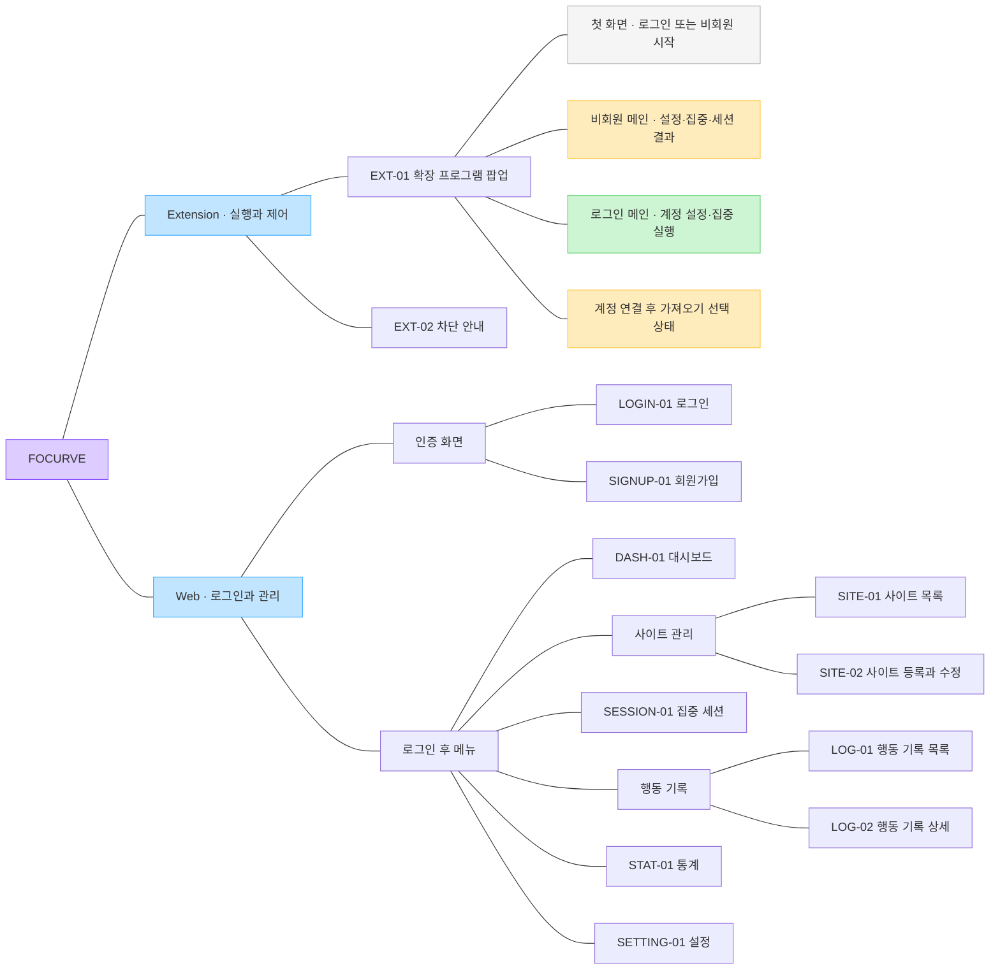

# FOCURVE IA v1.2

비회원 보관·가져오기 정책: 보관 기간·기산점과 성공 원본 처리 방식은 설계 결정사항 DEC-01·DEC-02에서 확정한다. 본문의 30일·90일 및 원본 처리 규칙은 해당 항목의 정책 후보이며, 회원 서버 기록의 보관 정책과 구분한다.

[FigJam에서 IA 열기](https://www.figma.com/board/8jb3v32UOVptu9mjbHRaBp)

## 문서 역할

메뉴와 화면의 소속을 정리한 IA입니다. User Flow와는 별도의 FigJam 파일이며, 선은 이동 순서가 아닌 포함 관계를 뜻합니다.

## 화면 구성

Web은 인증·회원 관리 화면, Extension은 로그인·비회원 진입과 실행 화면으로 구성한다. SETTING-01은 계정·로그아웃·화면 모드를 포함한다. 기본 화면과 추가 화면은 [기능 범위 및 설계 기준](FOCURVE_기능_범위_및_설계_기준.md)을 따른다.

## 화면 목록

| 영역 | 화면 ID | 화면 |
|---|---|---|
| Web | LOGIN-01 | 로그인 |
| Web | SIGNUP-01 | 회원가입 |
| Web | DASH-01 | 대시보드 |
| Web | SITE-01 | 사이트 목록 |
| Web | SITE-02 | 사이트 등록·수정 |
| Web | SESSION-01 | 집중 세션 |
| Web | LOG-01 | 행동 기록 목록 |
| Web | LOG-02 | 행동 기록 상세 |
| Web | STAT-01 | 통계 |
| Web | SETTING-01 | 설정: 계정·로그아웃·화면 모드(라이트·다크). [화면 모드 상세 명세](SETTING-01_화면_모드_설정_명세.md) |
| Extension | EXT-01 | 팝업: 첫 화면 / 비회원 메인 / 로그인 메인 / 계정 연결 후 가져오기 선택 |
| Extension | EXT-02 | 차단 안내 |

## 구조도

## 비회원 정책 초안과 화면 상태

비회원은 계정 없이 시작할 수 있다. 보관·조회·이전 규칙 중 미정 항목은 **정책 초안**으로 관리한다. 상세 선택·실패 흐름은 [별도 User Flow](https://www.figma.com/board/OeaNNfyOSnWFShOSFX2RZQ)의 04 영역과 FOCURVE_User_Flow_v1.1.md를 기준으로 합니다.

| 상태 | 포함 기능 |
|---|---|
| 첫 화면 | 웹에서 로그인 / 로그인 없이 시작하기 |
| 비회원 메인 | 로컬 사이트·분류·정책·집중 시간 설정, 세션 시작·종료, 로컬 세션 결과·접근 기록·기본 요약, 계정 연결, 비회원 자료 삭제 |
| 로그인 메인 | 계정 설정 확인·집중 실행, 웹 대시보드 열기, 남은 비회원 자료 가져오기 |
| 가져오기 선택 | 현재 계정 확인, 설정·기록 선택, 충돌 안내, 가져오기·건너뛰기, 진행·성공·부분 실패·재시도·나중에 상태 |

- 비회원 설정·기록은 현재 브라우저 프로필의 확장 프로그램 로컬 저장소에 보관합니다. 설정은 삭제 전까지, 기록은 발생일부터 90일간 보관하는 초안입니다.
- 로그인 시 사용자 선택으로 계정에 이전합니다. 같은 사이트의 기존 계정 정책은 유지하고, 기록은 중복 없이 추가합니다.
- 성공이 확인된 이전 항목만 로컬에서 정리합니다. 실패·미선택·충돌로 미반영된 항목은 보존합니다.
- 가져오기를 건너뛰어도 계정 이용이 가능하고, 비회원 데이터가 자동으로 서버에 전송되지 않습니다.
- 진행 중인 비회원 세션이 끝난 뒤 계정 전환을 처리합니다. 웹 대시보드·통계는 로그인한 계정의 데이터를 보여줍니다.

기획안 FOCURVE_프로젝트_기획안_v1.0_20260918.pdf의 69쪽·71쪽은 계정 기준 보관·인증 정책입니다. 위 비회원 규칙을 기존 기획안에서 이미 확정된 내용으로 간주하지 않습니다.

비회원 진입의 기능 식별자는 AUTH-04다.

| 기능 ID | 대분류 | 기능명 | 기능 설명 | 우선순위 | 구현 영역 | 관련 화면 | 확정 상태 |
|---|---|---|---|---|---|---|---|
| AUTH-04 | 회원 관리 | 로그인 없이 시작하기 | 계정 없이 집중 이용을 시작하고 설정·기록을 로컬에 보관한다 | 필수 | Extension | EXT-01 | 시작 경로 반영·보관 정책 초안 |
