# FOCURVE Task Flow v1.0

비회원 보관·가져오기 정책: 보관 기간·기산점과 성공 원본 처리 방식은 설계 결정사항 DEC-01·DEC-02에서 확정한다. 본문의 30일·90일 및 원본 처리 규칙은 해당 항목의 정책 후보이며, 회원 서버 기록의 보관 정책과 구분한다.

작성 기준: 2026-09-19. 현재 IA에 포함된 Web·Chrome Extension 핵심 기능의 작업별 흐름입니다.

[FigJam에서 Task Flow 열기](https://www.figma.com/board/onqCrA7TUhV7iptZFI2743)

IA, User Flow, Task Flow는 각각 별도 FigJam 파일로 관리합니다. 이 문서에서는 TF-01~TF-14를 구분합니다. TF-14는 화면 모드 선택 흐름입니다. TF 번호는 작성·탐색 순서이며 사용자에게 모든 흐름을 순서대로 수행하도록 요구하지 않습니다.

화면 모드의 동작과 예외는 [SETTING-01 화면 모드 설정 명세](SETTING-01_화면_모드_설정_명세.md)를 따른다.

## 설계 기준

- 기준 문서: FOCURVE_프로젝트_기획안_v1.0_20260918.pdf 41–43쪽, 52–61쪽 및 70쪽 「삭제 처리와 통계 정합성」.
- [IA v1.2](https://www.figma.com/board/8jb3v32UOVptu9mjbHRaBp): 화면 소속과 기존 화면 ID를 유지.
- [User Flow v1.1](https://www.figma.com/board/OeaNNfyOSnWFShOSFX2RZQ): 로그인·비회원 경로와 정책 초안을 계승.
- 비회원 보관·조회·이전 및 일부 확인창·필터 등 세부 UX는 설계 초안이다. 원 기획안에서 이미 확정된 사항과 구분한다.
- 이 문서는 각 작업의 진입, 입력, 선택, 성공, 실패·재시도·취소, 완료 상태까지 정의한다. 필드 길이·시간 입력 범위·정확한 문구와 화면 상태는 다음 화면 명세에서, API·DB·이벤트 필드는 시스템 설계에서 구체화한다.
- 기본 흐름은 TF-01~TF-14, 이번 학기 추가 기능 흐름은 [추가 기능 설계](FOCURVE_추가_기능_설계.md)의 TF-A01~TF-A09를 따른다. PC 확장은 웹 검수·테스트 완료 후 조건부 착수한다.

## 흐름 목록

읽는 방법: 각 흐름은 위에서 아래로 읽는다. 이중 테두리의 “복귀·재시도” 상자는 같은 이름의 단계부터 다시 진행하는 연결점이다. 작업 완료가 아니며, 긴 되돌림 화살표를 대신한다. 초록색은 정상 완료, 주황색은 오류, 노란색은 확인·주의 안내다.

| ID | 작업 | 관련 화면 |
|---|---|---|
| TF-01 | 사이트 등록 | SITE-01 → SITE-02 / EXT-01 비회원 사이트 관리 |
| TF-02 | 사이트 정보 수정 | SITE-01 → SITE-02 / EXT-01 |
| TF-03 | 사이트 삭제 | SITE-01 / EXT-01 |
| TF-04 | 사이트 분류·관리 정책 설정 | SITE-02 / EXT-01 사이트 관리 |
| TF-05 | 로그인 사용자 집중 시작 | SESSION-01 / EXT-01 로그인 메인 |
| TF-06 | 비회원 집중 시작 | EXT-01 첫 화면·비회원 메인 |
| TF-07 | 집중 세션 종료 | SESSION-01 / EXT-01 |
| TF-08 | 사이트·Shorts 접근 제어와 기록 | EXT-02 / 대상 웹페이지 / LOG-01에 결과 반영 |
| TF-09 | 행동 기록·반복 접근 조회 | LOG-01 → LOG-02 / DASH-01 최근 기록 / EXT-01 로컬 기록 |
| TF-10 | 통계 확인·다음 세션 설정 조정 | DASH-01 / STAT-01 → SITE-02 / EXT-01 기본 요약 |
| TF-11 | 비회원 데이터 계정으로 가져오기 | EXT-01 가져오기 상태 / LOGIN-01·SIGNUP-01 연계 |
| TF-12 | 회원가입·로그인·확장 계정 연결 | LOGIN-01 / SIGNUP-01 / EXT-01 / DASH-01 |
| TF-13 | 로그아웃·계정 연결 해제 | SETTING-01 / EXT-01 계정 메뉴 |
| TF-14 | 화면 모드 선택 | SETTING-01 / Web 공통 화면에 적용 |

## 공통 적용 원칙

1. 사이트는 정규화한 호스트와 하위 도메인 범위로 식별한다. 하위 도메인 포함이 기본이며, 동일·포함 범위 중복을 막는다.
2. 분류·관리 방식·내부 기능 제한은 구분한다. 전체 차단은 해당 사이트에 적용하고 내부 기능 제한보다 우선한다.
3. 현재 세션의 정책은 시작 시 고정한다. 수정·삭제한 설정은 다음 세션에 적용한다. 사이트 설정 수정·삭제만으로 과거 접근 기록의 정보나 관련 통계를 변경·삭제하지 않는다. 기록은 정해진 보관 기간 동안 유지하며, 행동 기록 삭제 요청은 사이트 설정 삭제와 별도로 처리한다.
4. 시작·종료는 확장 프로그램의 실제 적용·해제 결과로 표시한다. 통신 지연을 성공으로 표시하지 않는다.
5. 반복 접근은 같은 세션·같은 대상의 두 번째 이후 유효 접근이다. 3회 접근이면 반복 2회이며 반복 횟수를 총 접근에 더하지 않는다.
6. 로딩·빈 결과·조회 실패·동기화 대기·기록 누락을 구분한다. 누락을 0회로 해석하지 않는다.
7. 저장 실패 시 입력을 유지한다. 취소·재시도는 사용자가 선택하며 중복 저장·중복 세션을 만들지 않는다.
8. 회원은 본인 계정 자료를, 비회원은 해당 브라우저의 로컬 자료를 사용한다. 인증 실패를 임의의 비회원 전환으로 처리하지 않는다.
9. 비회원 자료 이전은 현재 계정을 보여주고 명시적으로 선택한다. 성공 확인 전에 로컬 원본을 지우지 않는다.

## TF-01 사이트 등록

- 관련 화면: SITE-01 → SITE-02 / EXT-01 비회원 사이트 관리
- 기능 목록 연결: SITE-02, SITE-05, POLICY-01~03
- 시작 조건: 회원은 로그인한 상태, 비회원은 확장 프로그램의 비회원 메인에 진입한 상태.
- 완료 기준: 사이트·분류·정책이 저장되고 목록에 표시된다.

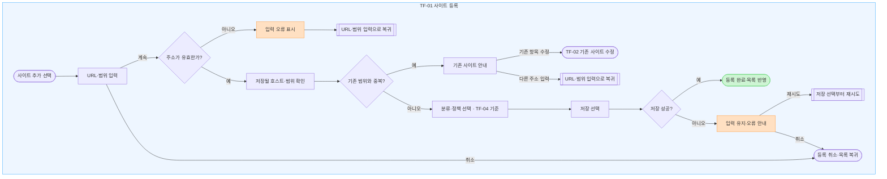

- URL에서 호스트명을 추출하고 프로토콜·포트·경로·쿼리·프래그먼트를 제외한다. 하위 도메인 포함은 기본값이다.
- 동일하거나 서로 포함되는 사이트 범위는 중복 등록하지 않고 기존 사이트 수정을 안내한다.
- TF-04의 분류·정책 선택 규칙을 재사용한다. 신규 등록 저장은 이 흐름에서 한 번 수행한다.
- 회원은 계정에, 비회원은 로컬에 저장한다. 실패 시 입력을 유지하며 성공으로 표시하지 않는다.

## TF-02 사이트 정보 수정

- 관련 화면: SITE-01 → SITE-02 / EXT-01
- 기능 목록 연결: SITE-03
- 시작 조건: 수정할 사이트가 등록되어 있다.
- 완료 기준: 변경된 정보가 목록에 반영되고 다음 세션 적용임을 알 수 있다.

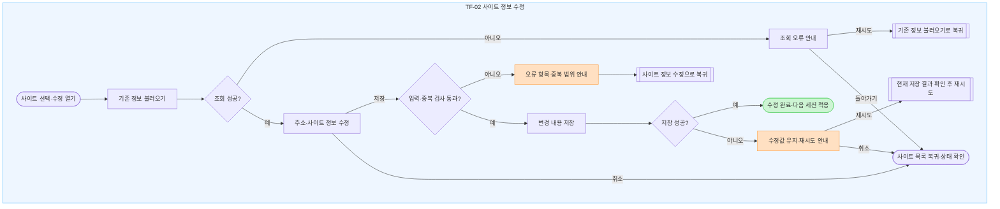

- 주소·하위 도메인 범위를 바꾸면 자신을 제외한 등록 사이트와 중복 여부를 다시 확인한다.
- 분류·정책 변경은 TF-04를 사용한다.
- 현재 세션의 정책과 과거 기록은 유지한다. 새 정보는 다음 세션부터 적용한다.
- 취소할 때 저장하지 않은 변경 사항이 있으면 폐기 여부를 확인한다.

## TF-03 사이트 삭제

- 관련 화면: SITE-01 / EXT-01
- 기능 목록 연결: SITE-04
- 시작 조건: 삭제할 사이트를 선택한 상태.
- 완료 기준: 관리 목록에서 해당 사이트가 제거되고 다음 세션부터 관리 대상에서 제외된다. 기존 접근 기록과 관련 통계는 보관 기간 동안 유지되며, 진행 중인 세션의 정책은 유지된다.

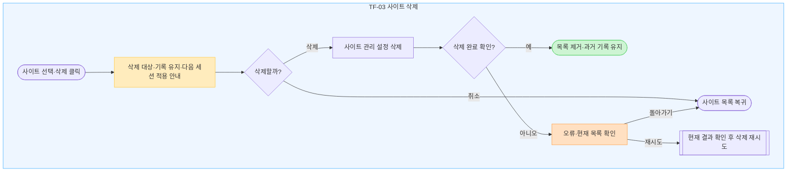

- 사이트 삭제는 관리 설정에서 대상을 제거하는 작업이다. 행동 기록 삭제와 구분하며, 기존 접근 기록과 관련 통계는 정해진 보관 기간 동안 유지한다.
- 진행 중인 세션은 시작 시점의 설정을 유지한다. 사이트 삭제 후에도 해당 세션이 종료될 때까지 기존 정책에 따라 유효 접근을 처리·기록하며, 다음 세션부터 관리 대상에서 제외한다.
- 사이트 설정만 삭제한 경우에는 해당 사이트의 로컬 전송 대기 이벤트를 제거하지 않는다. 회원 이벤트는 기존 전송·재시도·보관 규칙에 따라 처리하고, 비회원 기록은 기존 로컬 보관 규칙을 따른다.
- 확인 화면에는 삭제할 사이트명·주소, 기존 기록·통계가 유지된다는 점, 진행 중인 세션의 설정은 유지되고 다음 세션부터 제외된다는 점을 표시한다.
- 확인 문구 기준: “이 사이트를 관리 목록에서 삭제할까요? 기존 접근 기록과 통계는 보관 기간 동안 유지됩니다. 진행 중인 집중 세션에는 기존 설정이 유지되며, 다음 세션부터 관리 대상에서 제외됩니다.”
- 행동 기록을 별도로 삭제하면 요청 범위의 원본 이벤트를 운영 DB에서 24시간 이내 삭제하고 관련 통계를 다시 계산한다. 같은 삭제 범위의 전송 대기 이벤트만 제거하고 재전송으로 복구되지 않도록 한다. 이 처리는 사이트 삭제 버튼으로 실행하지 않는다.
- 삭제 성공 여부가 불명확하면 목록을 다시 확인한 뒤 재시도한다. 실패를 성공으로 표시하지 않는다.

## TF-04 사이트 분류·관리 정책 설정

- 관련 화면: SITE-02 / EXT-01 사이트 관리
- 기능 목록 연결: SITE-05, POLICY-01~03, SETTING-01
- 시작 조건: 등록 사이트를 선택했거나 신규 사이트의 분류·정책을 입력하고 있다.
- 완료 기준: 사용자가 선택한 분류·관리 방식·내부 기능 제한이 다음 세션용으로 저장된다.

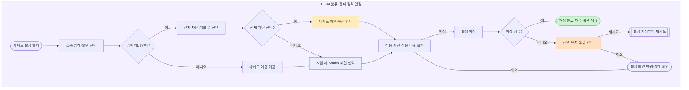

- 집중·방해·일반은 이용 목적 분류이며, 전체 차단·기록은 방해 사이트의 관리 방식이다.
- 전체 차단은 해당 사이트 전체를 뜻한다. 모든 웹사이트를 차단하는 전역 기능으로 해석하지 않는다.
- 집중·일반 사이트도 지원되는 내부 기능 제한을 설정할 수 있다. MVP의 지원 대상은 YouTube Shorts이다.
- 전체 차단이 우선이며 활성 세션 중 수정한 정책은 다음 세션부터 적용한다. 즉시 적용하려면 종료 후 재시작한다.
- 신규 사이트에서는 아래의 선택 규칙을 TF-01에서 사용하고, 등록과 함께 저장한다.

## TF-05 로그인 사용자 집중 시작

- 관련 화면: SESSION-01 / EXT-01 로그인 메인
- 기능 목록 연결: SESSION-01, SESSION-03, EXT-01, EXT-02
- 시작 조건: 회원 계정으로 로그인해 집중 화면에 진입한 상태.
- 완료 기준: 확장 프로그램이 정책 적용을 확인한 뒤 진행 중 상태와 시간을 보여준다.

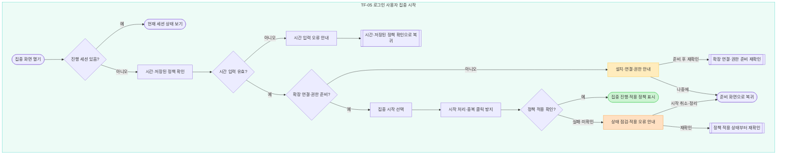

- Web 또는 확장 프로그램에서 시작한다. Web 진입 시 확장 설치·계정 연결·필수 권한 상태를 확인한다.
- 집중 화면은 시간과 저장된 정책 요약을 보여준다. 사이트별 정책 수정은 사이트 관리의 TF-04로 이동한다.
- 세션 시작 시 설정을 고정한다. 이미 열린 사이트·Shorts에도 적용하지만 적용 자체를 새 접근으로 세지 않는다.
- 이미 진행 중이면 해당 세션으로 안내한다. 중복 클릭·재시도로 세션이 여러 개 생성되지 않아야 한다.
- 응답이 늦거나 적용이 미확인된 경우 상태를 다시 조회하고 부분 적용을 정리한다. 확인 전에는 정상 진행으로 표시하지 않는다.
- 인증 만료는 TF-12 로그인으로 안내한다. 회원 요청을 임의로 비회원 세션으로 바꾸지 않는다.

## TF-06 비회원 집중 시작

- 관련 화면: EXT-01 첫 화면·비회원 메인
- 기능 목록 연결: AUTH-04 제안 행, SESSION-01, SESSION-03, EXT-02
- 시작 조건: 확장 프로그램을 열고 계정이 연결되지 않은 상태.
- 완료 기준: 로컬 설정을 적용한 비회원 세션이 시작된다.

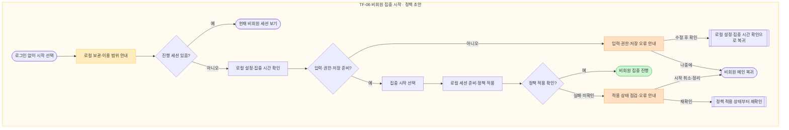

- 비회원 보관·조회 규칙은 기존 User Flow의 정책 초안을 따른다. 설정은 삭제 전까지, 기록은 발생일부터 최근 90일이다.
- 계정 로그인과 서버 저장을 시작의 필수 조건으로 두지 않는다.
- 집중 시간과 사이트·정책을 확인하고, 사이트가 없으면 TF-01로 갈 수 있도록 안내한다.
- 시작 전에 로컬 저장 가능 상태와 필수 권한을 확인한다. 실패 시 실행 오류를 표시하고 다시 점검한다.
- 정책이 일부 적용되었으면 시작 실패·취소 시 잔여 규칙을 정리한다.

## TF-07 집중 세션 종료

- 관련 화면: SESSION-01 / EXT-01
- 기능 목록 연결: SESSION-02, SESSION-03, EXT-02, EXT-03
- 시작 조건: 집중 세션이 진행 중이다.
- 완료 기준: 실제 적용 정책이 해제되고, 확인된 종료 사유·실제 세션 경과 시간·기록 저장 상태가 표시된다. 직접 종료와 시간 만료는 각 사유에 맞는 결과로 연결한다.

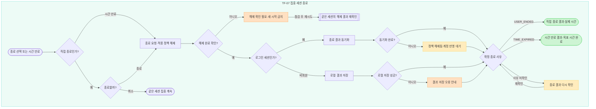

- 직접 종료는 확인창에서 ‘종료하기’를 선택한 뒤 요청한다. ‘계속 집중하기’ 또는 확인창 닫기는 요청을 보내지 않고 같은 세션의 타이머·시작 설정·기록 수집을 유지한다. 시간 만료는 확인창 없이 종료한다.
- 직접 종료는 `USER_ENDED`, 시간 만료는 `TIME_EXPIRED`로 구분한다. 확장 프로그램이 확인한 종료 사유를 결과·세션 기록·통계에 동일하게 표시한다. 직접 종료를 목표 시간 완료 결과로 연결하지 않는다.
- 직접 종료의 종료 시각은 실행 Extension이 종료를 수락한 시각이며, 시간 만료는 종료 예정 시각을 사용한다. 기본 MVP의 세션 경과 시간은 확인된 종료 시각에서 시작 시각을 뺀 값이다. 정책 해제 확인 지연이나 서버 수신 지연을 집중 시간에 더하지 않는다.
- 종료 시 브라우저의 정책 해제는 서버 응답을 기다리며 지연하지 않는다. 해제 미완료·미확인을 정상 종료로 표시하지 않으며, 새 세션 시작을 막고 ‘다시 확인’ 또는 확장 프로그램 점검을 안내한다.
- 종료 요청 접수만으로 결과 화면에 진입하지 않는다. 중복 클릭·재전송·웹과 확장의 동시 요청은 같은 `session_id`의 최종 종료 결과 한 건으로 처리한다. 확정된 종료 사유를 늦은 응답으로 덮어쓰지 않는다.
- 확인창을 연 동안 시간이 만료되면 현재 세션의 해제 상태와 확정 사유를 다시 확인한다. 확인창 취소로 끝난 세션을 진행 중으로 되돌리지 않는다. 직접 종료와 시간 만료의 구체적인 경합 우선순위는 개발 전 확정 사항이며, 웹의 클릭 순서만으로 사유를 선택하지 않는다.
- 회원의 미전송 이벤트는 기존 이벤트 식별값으로 재전송한다. 정책 해제 성공과 ‘계정 반영 대기’를 별개로 표시한다. 서버에 아직 반영되지 않은 결과·집계를 반영 완료 또는 0회로 표시하지 않는다.
- 비회원 로컬 결과 저장 실패도 사용자에게 알리되 해제된 정책을 다시 켜지 않는다.
- 회원 결과는 TF-09·10에서 같은 세션의 기록·통계로 연결한다. 세션 식별값·종료 사유·조회 범위·집계가 결과 화면과 일치해야 한다. 비회원 결과는 EXT-01의 로컬 기록·요약으로 연결한다.
- ‘다음 세션 준비’는 최신 저장 설정을 불러오는 단계다. 선택만으로 새 세션을 시작하지 않으며, 이전 세션의 종료 결과·기록은 유지한다. 진행 중 설정 변경은 기존 기준대로 다음 세션부터 적용한다.

### 종료 결과와 공통 집계 표시

현재 추가 기능 화면의 집계 의미를 기본 MVP·추가 기능의 라이트·다크에서 같은 용어로 표시한다. 누적 시간은 종료가 확인된 세션의 실제 시간을 합산한다. 공통 카드명은 **‘종료한 세션’**, 목록명은 **‘최근 종료 세션’**이다. 종료한 세션 수에는 시간 만료와 직접 종료를 포함하고, 보조 문구에서 **‘목표 완료’와 ‘직접 종료’**를 나눈다. 미확인 종료는 확정된 집계에 포함하지 않는다. 세션 경과 시간을 실제 순공 시간으로 표현하지 않는다.

| 검수 항목 | 직접 종료 예시 | 시간 만료 예시 |
|---|---|---|
| 공통 오전 세션 | 09:00~10:00, 목표 완료 1회 | 09:00~10:00, 목표 완료 1회 |
| 오후 세션 | 목표 30분, 14:00~14:05:42 직접 종료 | 14:00~14:30 시간 만료 |
| 오후 실제 세션 시간 | 05:42 | 30:00 |
| 오늘 누적 시간 | 1시간 5분 42초 | 1시간 30분 |
| 오늘 종료한 세션 | 2회. 목표 완료 1 · 직접 종료 1 | 2회. 목표 완료 2 · 직접 종료 0 |
| 오후 전체 접근 | 1회. 차단 1 · 기록 0 · 기능 제한 0 | 8회. 차단 4 · 기록 3 · 기능 제한 1 |
| 오후 반복 접근 | 0회 | 3회 |
| 오늘 전체 접근 | 5회. 차단 3 · 기록 1 · 기능 제한 1 | 12회. 차단 6 · 기록 4 · 기능 제한 2 |
| 오늘 반복 접근 | 1회 | 4회 |

두 열은 같은 오후 세션이 서로 다르게 끝났을 때의 **대안 시나리오**이며 합산하지 않는다. 공통 오전 접근 4회는 차단 2·기록 1·기능 제한 1, 반복 1이다. 반복 접근은 전체 접근에 이미 포함되므로 다시 더하지 않는다. 세션 시작·종료 이벤트도 접근 횟수에 더하지 않는다.

### 적용 범위와 남은 상세 조건

- 직접 종료·시간 만료·취소·처리 중·해제 확인 필요·계정 반영 대기의 의미와 연결은 기본 MVP·추가 기능의 라이트·다크에 동일하게 적용한다.
- 일시정지·재개는 현행 추가 기능 화면에만 있다. 기본 MVP로 확대하지 않는다. 추가 화면의 ‘일시정지 시간은 진행 시간에서 제외’ 안내를 유지하되, 정지 중 제한 유지·해제, 종료 예정 시각 조정, 복구 등 상세 정책은 확정된 기획 규칙으로 과장하지 않는다. 관련 개발 명세를 확정할 때 시간 계산·이벤트·화면을 함께 맞춘다.
- 종료 경합의 구체적 우선순위 및 `INTERRUPTED`·`LAST_CONFIRMED`의 지표 처리는 별도 확정 사항이다. 미확인 상태를 임의의 정상 완료로 바꾸지 않는다.
- 세부 상태와 예시의 기준은 `SESSION-01 — 웹 집중 세션 화면 명세`의 종료 영역을 따른다. Figma 프로토타입 시연 전이는 실제 Extension·Server 응답 검증을 대신하지 않는다.

## TF-08 사이트·Shorts 접근 제어와 기록

- 관련 화면: EXT-02 / 대상 웹페이지 / LOG-01에 결과 반영
- 기능 목록 연결: POLICY-01~03, EVENT-01~04, EXT-02~03
- 시작 조건: 사용자가 사이트 또는 내부 기능에 접근한다.
- 완료 기준: 정책에 맞게 허용·제한하고 유효 접근만 해당 유형으로 기록한다.

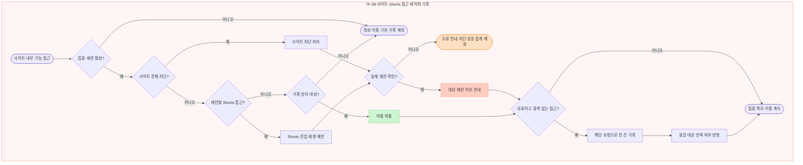

- 전체 사이트 차단을 먼저 판정한다. 동일 접근을 Shorts 제한으로 다시 기록하지 않는다.
- 직접 주소 입력, 외부 링크, 새 탭, 이탈 후 재진입, 기록 방식 사이트의 직접 새로고침은 독립적인 접근이 될 수 있다.
- 차단 안내만 새로고침, 일반 내부 이동, 자동 리디렉션, 리소스 요청은 사이트 접근 횟수에서 제외한다. SPA 이동은 Shorts 진입이면 기능 접근으로 별도 판정한다.
- 이미 열린 페이지에 세션 정책을 적용한 사실만으로 새로운 접근 이벤트를 만들지 않는다.
- 실제 제한이 확인된 경우에만 차단·기능 제한 성공으로 기록한다. 처리 실패와 통신 오류는 사용자 접근 통계와 분리한다.
- 같은 세션·같은 사이트 또는 기능에 대한 두 번째 이후의 유효 접근은 반복 접근이다. 전체 3회라면 반복 2회이며 둘을 더하지 않는다.
- 회원 이벤트는 서버 확인 전까지 로컬 전송 대기 후 동일 식별값으로 재전송한다. 비회원은 로컬 보관한다. 정책 집행은 서버 저장 응답을 기다리지 않는다.

## TF-09 행동 기록·반복 접근 조회

- 관련 화면: LOG-01 → LOG-02 / DASH-01 최근 기록 / EXT-01 로컬 기록
- 기능 목록 연결: DASH-01, LOG-01~02, EVENT-04
- 시작 조건: 회원은 자신의 계정 기록, 비회원은 현재 브라우저의 로컬 기록을 조회한다.
- 완료 기준: 접근 대상·시각·유형·횟수·반복 여부와 당시 적용 정책을 확인한다.

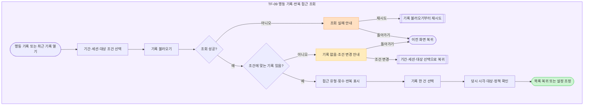

- 기간·세션·사이트·행동 유형 필터는 상세 UX 초안이다. 지원 범위는 화면 명세에 이어 적는다.
- 조회 실패와 기록 없음, 아직 동기화되지 않은 상태를 서로 다른 문구로 표시한다.
- 과거 기록은 당시 세션에 적용된 분류·정책으로 설명한다. 이후 수정한 정책으로 과거 의미를 바꾸지 않는다.
- 관리 목록에서 삭제된 사이트의 과거 기록도 보관 기간 내에는 조회하며, 접근 당시 사이트 정보·분류·정책·처리 결과를 유지한다. 사이트 설정 삭제만으로 기록이나 관련 통계를 제외하지 않는다. 별도의 행동 기록 삭제 또는 보관 기간 만료에 따른 처리는 해당 정책을 따른다.
- 비회원은 계정용 웹 기록 화면으로 강제 이동하지 않는다.

## TF-10 통계 확인·다음 세션 설정 조정

- 관련 화면: DASH-01 / STAT-01 → SITE-02 / EXT-01 기본 요약
- 기능 목록 연결: STAT-01~02, SETTING-01
- 시작 조건: 집중 결과를 확인하고 다음 세션 설정을 정하려고 한다.
- 완료 기준: 기록을 참고해 설정을 유지하거나 사용자 선택으로 변경한다.

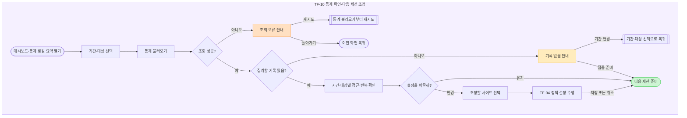

- 세션 시간은 시작·종료 사이의 경과 시간이며 실제 순공 시간으로 표시하지 않는다.
- 전체 접근·차단 접근·기록 방식 접근·내부 기능 제한·반복 접근을 구분한다. 반복 접근은 별도 합산 대상이 아니다.
- 전송 대기·기록 누락 구간은 0회 또는 완전한 성공으로 해석하지 않도록 안내한다.
- 세부 통계에서 대상 사이트의 설정으로 연결한다. 시스템이 정책을 자동으로 바꾸지 않는다.
- 비회원은 로컬 기본 요약을 사용한다. 계정용 웹 통계에는 계정으로 이전한 기록이 반영된다.

## TF-11 비회원 데이터 계정으로 가져오기

- 관련 화면: EXT-01 가져오기 상태 / LOGIN-01·SIGNUP-01 연계
- 기능 목록 연결: 비회원 정책 초안 · 별도 기능 ID는 기능 목록에 연결
- 시작 조건: 진행 중인 비회원 세션을 마친 뒤 로그인했거나 로그인 메인에서 가져오기를 선택했다.
- 완료 기준: 사용자가 고른 자료만 계정에 반영하거나 로컬에 남긴 채 계정을 이용한다.

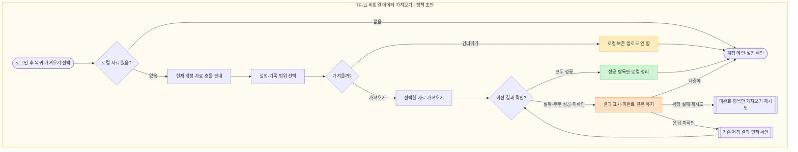

- 비회원 세션 진행 중에는 해당 세션을 종료한 뒤 로그인 전환한다. 웹 로그인 취소 시 비회원으로 계속 이용한다.
- 현재 계정·가져올 설정·기록 범위를 먼저 보여준다. 로그인만으로 자동 업로드하지 않는다.
- 새 사이트는 추가하고 같은 사이트의 분류·정책은 기존 계정 값을 유지한다. 기록은 원래 발생 시각과 식별값으로 중복 없이 추가한다.
- 서버 저장이 확인된 항목만 로컬에서 정리한다. 부분 실패·응답 미확인·미선택·충돌로 반영하지 않은 자료는 보존한다.
- 건너뛰기 또는 나중에를 선택해도 계정 이용은 가능하다. 남은 로컬 자료는 나중에 다시 가져올 수 있다.
- 비회원 로컬 기록 보관 90일 등은 User Flow에서 작성한 정책 초안이며 기존 기획안의 확정 규칙으로 취급하지 않는다. 기획안 69쪽의 서버 세션·행동 기록 90일과 구분한다.

## TF-12 회원가입·로그인·확장 계정 연결

- 관련 화면: LOGIN-01 / SIGNUP-01 / EXT-01 / DASH-01
- 기능 목록 연결: AUTH-01~02, EXT-01
- 시작 조건: 웹에 직접 방문하거나 확장 프로그램의 웹에서 로그인을 선택했다.
- 완료 기준: 인증된 계정으로 웹을 이용하거나 확장 프로그램에 계정을 연결한다.

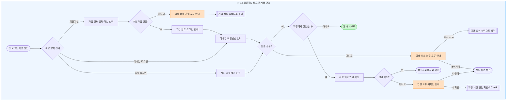

- 기획안 41쪽에 이메일·비밀번호 인증과 지원 소셜 계정 로그인이 포함되어 있어 두 경로를 표시한다. 제공 사업자의 확정 목록은 인증 화면 명세와 일치시킨다.
- 회원가입 입력 검증·중복 계정 안내, 로그인 실패·소셜 인증 취소·통신 오류를 구분한다. 비밀번호 값 등 인증 비밀을 오류에 노출하지 않는다.
- 이메일 가입 후 로그인 화면으로 안내하는 상세 UX 초안을 사용한다.
- 웹 직접 진입은 대시보드로, 확장 프로그램에서 진입하면 인증 완료 후 확장 프로그램으로 복귀한다.
- 비회원 데이터 존재 여부와 이전 동의는 TF-11에서 처리한다. 계정 연결 성공만으로 자료를 자동 가져오지 않는다.

## TF-13 로그아웃·계정 연결 해제

- 관련 화면: SETTING-01 / EXT-01 계정 메뉴
- 기능 목록 연결: AUTH-03
- 시작 조건: 계정에 로그인한 상태.
- 완료 기준: 현재 계정 연결이 해제되고 계정 자료가 다른 이용 상태에 노출되지 않는다.

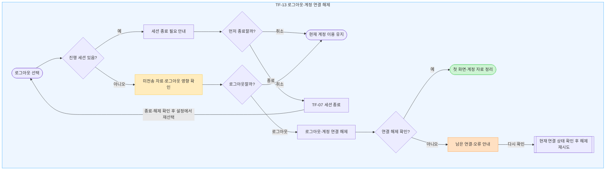

- 진행 중인 세션을 먼저 종료하는 흐름과 영향 확인창은 상세 UX 초안이다. 종료를 취소하면 현재 계정 이용을 유지한다.
- 미전송 기록이 있으면 로그아웃 시 로컬 계정 자료 정리에 따른 영향을 확인창에 알리고 취소할 수 있게 한다.
- 회원 계정 캐시·전송 대기 자료는 계정과 분리되지 않은 채 비회원이나 다른 계정에 재사용하지 않는다.
- 비회원 로컬 자료는 계정 로그아웃과 별개로 관리한다. 새로운 계정으로 자동 이전하지 않는다.
- 웹·확장 중 연결이 남았으면 완전한 계정 연결 해제로 표시하지 않고 해당 위치에서 재확인을 안내한다.

## TF-14 화면 모드 선택

- 관련 화면: SETTING-01. 적용 영역: Web 전체.
- 기능 목록 연결: SETTING-02.
- 시작 조건: 설정 화면의 `화면 모드` 항목에 진입했다.
- 완료 기준: 선택 표시와 웹 테마가 일치하고 저장 성공 여부를 정확하게 표시한다.
- 상세 기준: [SETTING-01 화면 모드 설정 명세](SETTING-01_화면_모드_설정_명세.md).

| 단계·분기 | 화면과 처리 | 다음 상태 |
|---|---|---|
| 웹 첫 진입·재접속 | 브라우저 저장값이 `light` 또는 `dark`이면 해당 모드를 복원한다. 저장값이 없거나 잘못됐거나 읽을 수 없으면 라이트로 시작한다. | 현재 모드 표시 |
| 설정에서 라이트·다크 선택 | 선택 즉시 웹 전체의 테마와 선택 표시를 바꾸고 현재 브라우저에 저장한다. 별도 저장 버튼이나 서버 응답을 기다리지 않는다. | 저장 결과 확인 |
| 현재 선택 재클릭 | 기존 선택을 유지한다. 페이지·세션 재시작이나 중복 알림을 만들지 않는다. | 현재 상태 유지 |
| 저장 성공 | 선택한 모드를 브라우저에 보관한다. 실패 안내가 있었다면 안내와 `다시 저장` 버튼을 제거한다. | 선택 상태 유지·다음 방문에 복원 |
| 저장 실패 | 현재 웹 이용 중 선택한 테마는 유지한다. `화면 모드는 적용했지만 저장하지 못했습니다. 다시 방문하면 이전 모드로 표시될 수 있습니다.`와 `다시 저장`을 표시한다. | 사용 계속 또는 재시도 |
| 다시 저장 | 현재 모드의 로컬 저장만 재시도한다. 성공하면 실패 안내를 해제하고, 실패하면 안내를 유지한다. | 저장 성공 또는 저장 실패 |
| 저장 실패 후 새로고침 | 실제 남아 있는 유효 저장값을 적용한다. 값이 없거나 읽을 수 없으면 라이트를 적용한다. | 실제 저장값에 따른 모드 표시 |

- 테마는 같은 브라우저의 로그아웃·재로그인·계정 변경에도 유지한다. 브라우저 사이트 데이터를 삭제하거나 새 브라우저를 이용하면 저장값이 없으므로 라이트로 시작한다.
- 테마 전환은 진행 세션·입력값·조회 조건·선택 행·스크롤·차단 정책·기록·통계를 유지한다. 다른 설정 입력을 저장하거나 지우지 않는다.
- 기본 MVP와 기본+추가 High-Fi는 각각 같은 범위 안에서 라이트·다크 전환 예시를 제공한다. 기본 MVP Low-Fi는 두 선택 상태 모두 회색을 유지한다.
- Figma의 연결은 시각적 전환 예시이다. 실제 앱의 브라우저 저장·복원·오류 처리는 T-055~T-060으로 구현 후 검증한다.
- OS 자동 테마, 계정·기기 간 동기화, 확장 프로그램 테마 전환은 해당 기능 범위에 포함하지 않는다. 서버 API·DB 컬럼·행동 이벤트를 추가하지 않는다.

## 공통 화면 상태

기본·추가 기능의 라이트·다크에서 같은 의미와 상태 전이를 사용한다. 세부 검수 기준은 화면 검수 기준 문서를 따른다.

### TF-08~TF-10 기록 상세 연결

- 삭제 후·사이트 0개·이전 기록·직접 종료·시간 만료 목록은 선택한 행의 상세로 이동한다.
- 상세에서 뒤로 이동하면 진입한 목록 상태를 유지한다. 삭제 상태에서 사이트를 확인할 때 현재 7개/0개 관리 목록을 유지한다.
- 직접 종료 상세는 14:03 한 건과 14:00–14:05:42 세션을 표시한다. 14:16·14:28 접근을 표시하지 않는다.

### TF-11 가져오기 상태

- 미선택 / 설정만 / 기록만 / 둘 다 네 상태를 제공한다. 미선택은 실행할 수 없다.
- 선택 범위에 따라 처리 중 상태를 표시하고 중복 실행을 막는다.
- 저장 확인 / 일부 실패 / 전체 실패 / 응답 미확인 / 자료 없음 / 계정 변경을 구분한다.
- 확정 실패는 이전 선택 범위의 미완료 자료만 재시도한다. 응답 미확인은 재업로드 전에 이전 저장 결과를 조회한다.
- 충돌·미선택·실패·미확인 원본은 유지한다. 계정 저장이 확인된 자료만 로컬에서 정리한다.
- 비회원 진행 화면의 로컬 기록은 현재 진행 상태를 표시한다. 계정 연결은 세션 종료 필요 안내와 기존 종료 확인을 거친다.
- 이 세부 UX 보완은 앞서 표시한 비회원 정책 초안을 확정 정책으로 승격하지 않는다.

### TF-13 로그아웃 상태

- 로그아웃 시 해당 계정의 로컬 자료를 삭제하고 서버 기록은 유지한다. 미전송 자료는 로컬 정리에 따라 복구하지 못할 수 있음을 별도로 알린다.
- 비회원 로컬 자료는 별도 관리하며 다른 계정으로 자동 이전하지 않는다.
- 진행 세션이 있으면 종료·정책 해제 확인을 먼저 한다. 현재 Figma 경로에서는 종료 후 설정에서 로그아웃을 다시 선택한다.
- 요청 처리 중 / 일부 연결 잔존 / 해제 실패·미확인을 분리한다. 완전한 해제가 확인되기 전 첫 화면으로 이동해 완료로 표시하지 않는다.
- 처리 중 화면의 성공·실패 분기는 실제 서버·Extension 결과를 사용한다. 검수 보드의 대표 결과 화면은 실제 저장·삭제 검증을 대신하지 않는다.

### 기능 범위

시간대별 차트는 학기 내 추가 기능 OPTION-08이다. 추가 기능 전체는 TF-A01~TF-A09를 따르며, 성인 사이트·블러 전용 화면과 미정 정책은 개발 시작 전 확정한다. PC 확장은 웹 기능·검수·테스트 완료 후 조건부 착수한다.
