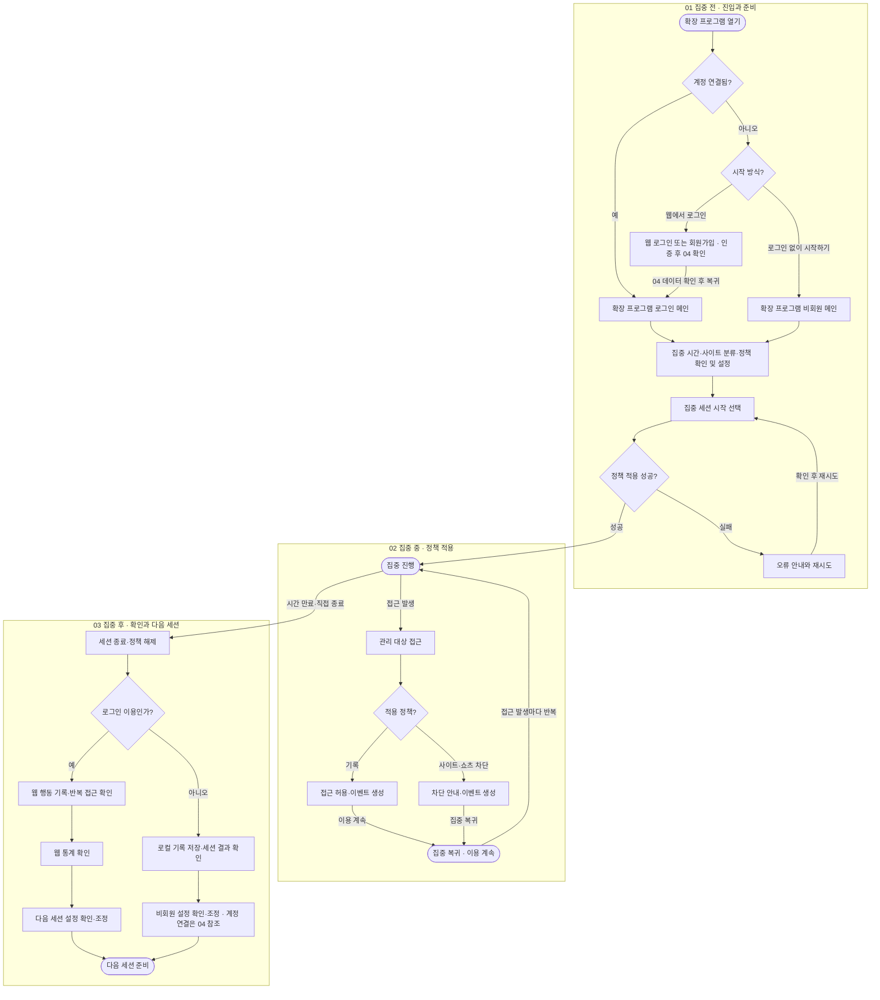
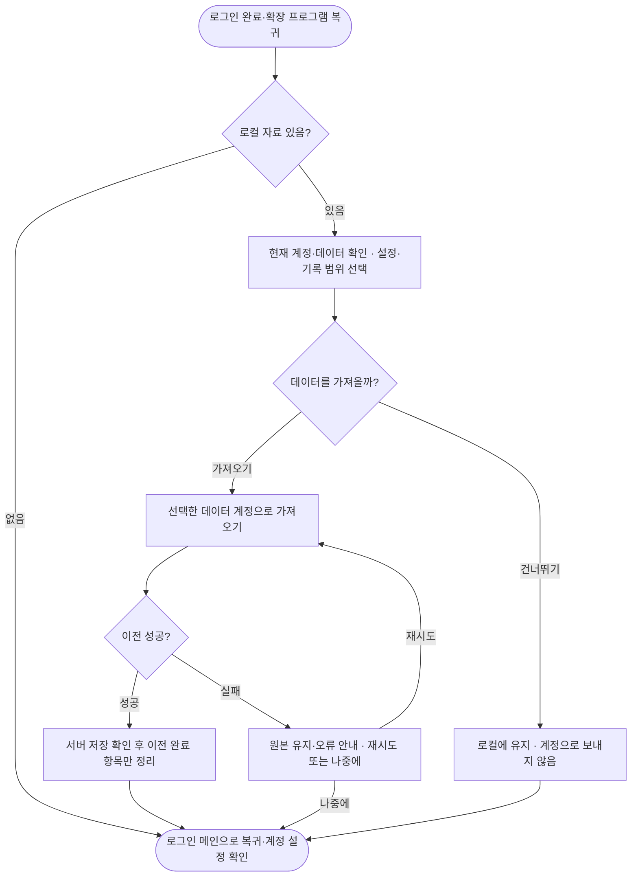

# FOCURVE User Flow v1.1

비회원 보관·가져오기 정책: 보관 기간·기산점과 성공 원본 처리 방식은 설계 결정사항 DEC-01·DEC-02에서 확정한다. 본문의 30일·90일 및 원본 처리 규칙은 해당 항목의 정책 후보이며, 회원 서버 기록의 보관 정책과 구분한다.

[FigJam에서 User Flow 열기](https://www.figma.com/board/OeaNNfyOSnWFShOSFX2RZQ)

## 문서 역할

확장 프로그램에서 시작하는 핵심 이용 흐름입니다. IA와는 별도의 FigJam 파일입니다. 집중 전·중·후의 세 섹션과, 오른쪽에 떨어뜨려 배치한 ‘04 계정 연결·데이터 이전’ 영역으로 구성한다.

비회원 보관 기간·조회 범위·계정 이전의 미확정 규칙은 **설계 정책 초안**입니다. 기존 기획안에서 이미 확정한 내용으로 취급하지 않습니다.

## 핵심 경로

- 계정 연결 상태: 확장 프로그램 열기 → 로그인 메인 → 설정 확인 → 집중 시작.
- 신규 로그인: 확장 프로그램 열기 → 웹에서 로그인 → 웹 인증 → 04의 비회원 데이터 확인·가져오기 선택 → 로그인 메인으로 복귀 → 집중 시작.
- 비회원: 확장 프로그램 열기 → 로그인 없이 시작하기 → 비회원 메인 → 설정 확인 → 집중 시작.
- 비회원 경로는 웹 로그인이나 계정용 웹 대시보드를 필수로 거치지 않습니다.
- 비회원 종료 후: 로컬 기록·세션 결과 확인 → 설정 조정 → 다음 집중 시작. 계정 연결은 사용자가 원할 때 선택합니다.

## 구조도

## 04 계정 연결·데이터 이전 — 별도 영역

01의 웹 인증 성공 직후와, 세션을 마친 비회원이 계정 연결을 선택한 경우에 적용합니다. 로그인 취소 시 비회원으로 계속 이용합니다. 진행 중인 세션은 비회원 상태로 마친 다음 전환합니다. 건너뛴 자료는 확장 프로그램의 로그인 메인에서 ‘비회원 데이터 가져오기’를 선택해 다시 처리할 수 있습니다.

## 읽는 법

01은 시작 방식 선택과 집중 시간·사이트 분류·정책 확인, 02는 세션 중 접근 발생마다 반복되는 차단·기록 처리, 03은 종료와 다음 세션 준비입니다. ‘정책 적용 성공’ 이후에만 정상 집중 진행으로 들어갑니다. 04는 계정 연결 시 필요한 추가 분기이며 매 세션 필수 단계가 아닙니다.

## 비회원 정책

| 항목 | 설계 기준 |
|---|---|
| 로그인 없이 집중 시작 | 계정 없이 확장 프로그램에서 바로 이용 |
| 설정할 수 있는 항목 | 집중 시간, 사이트 등록·수정·삭제, 집중·방해·일반 분류, 차단·기록·쇼츠 제한 정책. 저장된 설정은 다음 세션에 다시 사용 |
| 저장 위치 | 현재 브라우저 프로필의 확장 프로그램 로컬 저장소. 비회원 설정·기록은 서버로 자동 전송하지 않음 |
| 설정 보관 | 사용자가 삭제·초기화하거나 확장 프로그램의 로컬 데이터가 삭제될 때까지 |
| 세션·접근 기록 보관 | 발생 시각 기준 최근 90일. 확장 프로그램 실행·조회·기록 시 만료 항목을 정리하고 조회에서 제외 |
| 비회원 조회 | 확장 프로그램에서 로컬 세션 결과·접근 기록과 기본 요약(세션 시간·차단 횟수·반복 접근 횟수)을 확인 |
| 웹 대시보드·통계 | 로그인한 계정의 데이터를 조회. 비회원 기록을 계정으로 가져온 뒤 해당 기록도 반영 |
| 전환 시점 | 진행 중인 비회원 집중 세션을 종료하고 정책을 해제한 뒤 계정 연결·데이터 이전 처리 |
| 이전 동의 | 현재 계정과 이전할 데이터 범위를 보여주고 ‘가져오기 / 건너뛰기’를 선택. 로그인만으로 자동 이전하지 않음 |
| 가져오기 대상 | 사용자가 선택한 로컬 설정과 유효한 최근 90일 기록. 원래 발생 시각을 유지하며 가져온 날부터 보관 기간을 새로 세지 않음 |
| 설정 충돌 | 새 사이트만 추가. 같은 사이트의 분류·정책은 기존 계정 설정을 유지. 집중 시간 등 계정 설정값이 있으면 그 값을 우선하고, 없으면 선택한 비회원 값을 사용 |
| 중복 기록 | 원본 기록 식별자로 동일 계정 내 중복 저장을 방지. 부분 성공 후 재시도해도 같은 기록은 한 번만 반영 |
| 성공 | 서버 저장이 확인된 항목만 이전 완료 처리하고 해당 로컬 원본을 정리. 충돌로 반영하지 않은 설정·선택하지 않은 항목은 보존하고 안내 |
| 실패 | 실패·응답 미확인 항목의 로컬 원본 유지. 재시도하거나 ‘나중에’를 선택해 계정 이용을 계속할 수 있음 |
| 건너뛰기 | 로컬 자료를 유지하고 계정 데이터와 분리. 확장 프로그램 로그인 메인에서 나중에 가져오기 가능 |
| 로그아웃·계정 변경 | 계정 캐시·전송 대기 자료는 계정별로 분리·정리. 비회원 자료를 새 계정으로 자동 이전하지 않으며, 가져오기 시 현재 계정을 다시 명시 |
| 로컬 자료 삭제 | ‘비회원 데이터 삭제’에서 명시적 확인 후 삭제. 확장 삭제·브라우저 데이터 삭제로 로컬 저장소가 지워지면 서버에서 복구할 수 없음 |

‘이벤트 생성’ 시 비회원 기록은 즉시 로컬에 저장하고, 세션 종료 시 결과를 집계합니다. 계정 이용자는 기존 서버 저장·동기화 규칙을 따릅니다. 세션 시간은 실제 순수 공부 시간으로 표현하지 않으며, 기록 누락을 접근 0회로 해석하지 않습니다.

보관 기간·로컬 표시 범위·충돌 규칙은 누락된 설계를 구체화하기 위한 제안입니다. 실행 검증은 구현 테스트에서 수행한다.

## 화면 명세에 넘길 항목

- EXT-01 비회원 메인: 사이트·정책·시간 설정, 집중 실행, 로컬 결과·기록, 계정 연결, 비회원 데이터 삭제.
- EXT-01 가져오기 상태: 현재 계정 표시, 설정·기록 선택, 충돌 안내, 가져오기·건너뛰기, 진행·성공·부분 실패·재시도·나중에.
- EXT-01 로그인 메인: 계정 설정 확인, 남아 있는 비회원 자료 가져오기. 새 화면 ID를 추가하지 않고 팝업의 상태로 관리.
- 비회원 진입 AUTH-04와 가져오기 IMPORT-01·02를 EXT-01 상태·보관 규칙에 연결한다.

