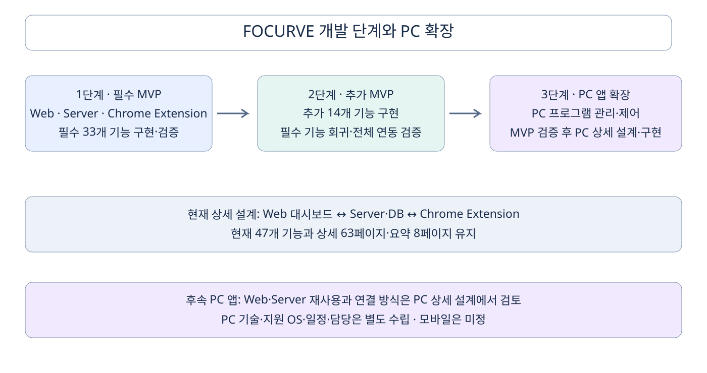

# 현행 도면 페이지 목록

| 구분 | 페이지 | 이름 | 미리보기 |
|---|---|---|---|
| 상세 | 1 | 01 통합 IA | [SVG](미리보기/상세_01.svg) |
| 상세 | 2 | 02 추가 기능 상세 구조 | [SVG](미리보기/상세_02.svg) |
| 상세 | 3 | 03 User Flow 전체 · 기존 상세 유지 | [SVG](미리보기/상세_03.svg) |
| 상세 | 4 | 03-1 01 집중 전 · 진입과 준비 | [SVG](미리보기/상세_04.svg) |
| 상세 | 5 | 03-2 02 집중 중 · 정책 적용 | [SVG](미리보기/상세_05.svg) |
| 상세 | 6 | 03-3 03 집중 후 · 확인과 다음 세션 | [SVG](미리보기/상세_06.svg) |
| 상세 | 7 | 03-4 04 계정 연결·데이터 이전 | [SVG](미리보기/상세_07.svg) |
| 상세 | 8 | UF-A 집중 전 추가 흐름 | [SVG](미리보기/상세_08.svg) |
| 상세 | 9 | UF-B 집중 중 추가 흐름 | [SVG](미리보기/상세_09.svg) |
| 상세 | 10 | UF-C 집중 후 추가 흐름 | [SVG](미리보기/상세_10.svg) |
| 상세 | 11 | UF-D 계정 전환 흐름 | [SVG](미리보기/상세_11.svg) |
| 상세 | 12 | TF-A01 내부 기능 제한 | [SVG](미리보기/상세_12.svg) |
| 상세 | 13 | TF-A02 집중 예약 | [SVG](미리보기/상세_13.svg) |
| 상세 | 14 | TF-A03 이용 시간·확장 분석 | [SVG](미리보기/상세_14.svg) |
| 상세 | 15 | TF-A04 키워드 제한 | [SVG](미리보기/상세_15.svg) |
| 상세 | 16 | TF-A05 성인 사이트 제한 | [SVG](미리보기/상세_16.svg) |
| 상세 | 17 | TF-A06 민감 이미지 블러 | [SVG](미리보기/상세_17.svg) |
| 상세 | 18 | TF-A07 AI 피드백 | [SVG](미리보기/상세_18.svg) |
| 상세 | 19 | TF-A08 일시정지·재개 | [SVG](미리보기/상세_19.svg) |
| 상세 | 20 | TF-A09 세션 메모 | [SVG](미리보기/상세_20.svg) |
| 상세 | 21 | TF-14 화면 모드 | [SVG](미리보기/상세_21.svg) |
| 상세 | 22 | 13 세션 상태 | [SVG](미리보기/상세_22.svg) |
| 상세 | 23 | 13-R 세션 실패·복구 | [SVG](미리보기/상세_23.svg) |
| 상세 | 24 | 16 예약 상태 | [SVG](미리보기/상세_24.svg) |
| 상세 | 25 | TF-S 설정 저장·결과 확인 | [SVG](미리보기/상세_25.svg) |
| 상세 | 26 | 14 시스템 연동 | [SVG](미리보기/상세_26.svg) |
| 상세 | 27 | 15 실행 순서 | [SVG](미리보기/상세_27.svg) |
| 상세 | 28 | 화면 SAFETY-01 | [SVG](미리보기/상세_28.svg) |
| 상세 | 29 | 화면 BLUR-01 | [SVG](미리보기/상세_29.svg) |
| 상세 | 30 | 화면 SCHEDULE-01 | [SVG](미리보기/상세_30.svg) |
| 상세 | 31 | 화면 ANALYSIS-01 | [SVG](미리보기/상세_31.svg) |
| 상세 | 32 | ERD-01 users | [SVG](미리보기/상세_32.svg) |
| 상세 | 33 | ERD-02 auth_identities | [SVG](미리보기/상세_33.svg) |
| 상세 | 34 | ERD-03 extension_installations | [SVG](미리보기/상세_34.svg) |
| 상세 | 35 | ERD-04 sites | [SVG](미리보기/상세_35.svg) |
| 상세 | 36 | ERD-05 site_feature_policies | [SVG](미리보기/상세_36.svg) |
| 상세 | 37 | ERD-06 content_policies | [SVG](미리보기/상세_37.svg) |
| 상세 | 38 | ERD-07 policy_snapshots | [SVG](미리보기/상세_38.svg) |
| 상세 | 39 | ERD-08 focus_sessions | [SVG](미리보기/상세_39.svg) |
| 상세 | 40 | ERD-09 session_intervals | [SVG](미리보기/상세_40.svg) |
| 상세 | 41 | ERD-10 session_notes | [SVG](미리보기/상세_41.svg) |
| 상세 | 42 | ERD-11 active_execution_locks | [SVG](미리보기/상세_42.svg) |
| 상세 | 43 | ERD-12 event_receipts | [SVG](미리보기/상세_43.svg) |
| 상세 | 44 | ERD-13 access_events | [SVG](미리보기/상세_44.svg) |
| 상세 | 45 | ERD-14 session_lifecycle_events | [SVG](미리보기/상세_45.svg) |
| 상세 | 46 | ERD-15 usage_segments | [SVG](미리보기/상세_46.svg) |
| 상세 | 47 | ERD-16 schedules | [SVG](미리보기/상세_47.svg) |
| 상세 | 48 | ERD-17 schedule_occurrences | [SVG](미리보기/상세_48.svg) |
| 상세 | 49 | ERD-18 analysis_jobs | [SVG](미리보기/상세_49.svg) |
| 상세 | 50 | ERD-19 analysis_results | [SVG](미리보기/상세_50.svg) |
| 상세 | 51 | ERD-20 analysis_consents | [SVG](미리보기/상세_51.svg) |
| 상세 | 52 | ERD-21 guest_import_batches | [SVG](미리보기/상세_52.svg) |
| 상세 | 53 | ERD-22 guest_import_items | [SVG](미리보기/상세_53.svg) |
| 상세 | 54 | ERD-23 execution_commands | [SVG](미리보기/상세_54.svg) |
| 상세 | 55 | ERD-24 execution_reports | [SVG](미리보기/상세_55.svg) |
| 상세 | 56 | ERD-25 operations | [SVG](미리보기/상세_56.svg) |
| 상세 | 57 | ERD-26 web_sessions | [SVG](미리보기/상세_57.svg) |
| 상세 | 58 | ERD-27 auth_challenges | [SVG](미리보기/상세_58.svg) |
| 상세 | 59 | ERD-28 link_requests | [SVG](미리보기/상세_59.svg) |
| 상세 | 60 | ERD-29 extension_tokens | [SVG](미리보기/상세_60.svg) |
| 상세 | 61 | ERD-30 catalog_versions | [SVG](미리보기/상세_61.svg) |
| 상세 | 62 | ERD-31 model_profiles | [SVG](미리보기/상세_62.svg) |
| 상세 | 63 | ERD-32 idempotency_keys | [SVG](미리보기/상세_63.svg) |
| 요약 | 1 | 01 IA 요약 | [SVG](미리보기/요약_01.svg) |
| 요약 | 2 | 02 User Flow 요약 | [SVG](미리보기/요약_02.svg) |
| 요약 | 3 | 03 Task Flow 요약 · 기본 동작 | [SVG](미리보기/요약_03.svg) |
| 요약 | 4 | 04 Task Flow 요약 · 콘텐츠 제어 | [SVG](미리보기/요약_04.svg) |
| 요약 | 5 | 05 Task Flow 요약 · 예약·분석 | [SVG](미리보기/요약_05.svg) |
| 요약 | 6 | 06 세션 상태 요약 | [SVG](미리보기/요약_06.svg) |
| 요약 | 7 | 07 ERD 요약 | [SVG](미리보기/요약_07.svg) |
| 요약 | 8 | 08 시스템 연동 요약 | [SVG](미리보기/요약_08.svg) |

## 후속 확장 개요 · 별도 1페이지

현재 상세 63페이지·요약 8페이지의 번호와 내용은 유지한다. 아래 개요는 단계와 PC 후속 확장 방향을 설명한다.

[개요 미리보기](FOCURVE_개발단계_PC확장.svg) · [draw.io 원본](FOCURVE_개발단계_PC확장.drawio) · [PC 후속 확장 계획](../02_시스템_테크설계/09_PC_후속확장계획.md)

